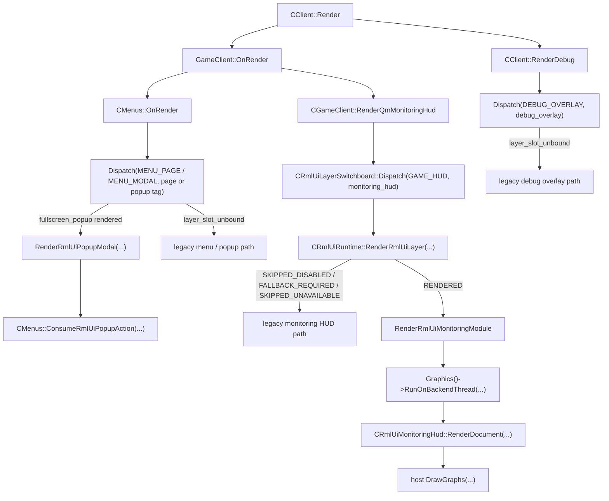

# RmlUI 当前架构

这份文档只记录当前已经落地的 RmlUI 架构，不把 roadmap / design 里的目标模块伪装成“当前已经实现”。

## 1. 当前范围

当前真正有 RmlUI 界面内容的已经不止 Monitoring HUD。现在已完成验收的真实迁移样板有两条：

- Monitoring HUD
- `fullscreen_popup` 下的低风险提示型弹窗子集

已验收的宿主调度所有权也不再只限于单一宿主；switchboard 继续占住 debug / menu / popup 的宿主接缝，但当前真正有具体内容的仍然只到上述两条 surface。

当前宿主 / 接缝：

- `CGameClient::RenderQmMonitoringHud`
- `CMenus::RenderPopupFullscreen`
- `CClient::RenderDebug`
- `CMenus::OnRender`

当前 RmlUI 代码范围：

- `src/game/client/RmlUi/`
- `src/game/client/RmlUi/RmlUiInputBridge.h/.cpp`
- `src/game/client/RmlUi/RmlUiLayerSwitchboard.h/.cpp`
- `src/game/client/RmlUi/RmlUiPopupModal.h/.cpp`
- `src/engine/client/rmlui_backend.h/.cpp`
- `src/engine/client/rmlui_render_bridge.h/.cpp`
- `data/qmclient/rmlui/monitoring_hud.rml`
- `data/qmclient/rmlui/monitoring_hud.rcss`
- `data/qmclient/rmlui/popup_modal.rml`
- `data/qmclient/rmlui/popup_modal.rcss`

## 2. 当前组件

### CRmlUiBackend

当前职责：

- 持有当前的 RmlUI 后端接口初始化入口。
- 初始化 GL3 原型后端。
- 持有当前 `CRmlUiRenderBridge` wrapper，以及其背后的 desktop GL3 delegate。
- 记录后端初始化失败状态。

当前约束：

- 依赖当前存在可用 OpenGL context。
- 内部仍然使用 RmlUI GL3 渲染接口语义。
- 还不是后端无关的渲染桥。

### CRmlUiRenderBridge

当前职责：

- 持有当前 bridge-local texture handle registry。
- 持有 RmlUI `Rectanglei` 到 client clip semantics 的 scissor translation state。
- 在几何或着色器提交前，把 bridge texture handle 重写回当前 delegate handle。
- 当前 compiled geometry、layer、filter、shader 和 save-layer 仍走 desktop GL delegate 路径。

当前约束：

- 原型范围仍然只覆盖 Monitoring HUD 渲染路径。
- 当前只有 texture / scissor ownership 进入 bridge owner；完整的后端无关 draw submission 还未完成。
- 当前 save-layer、filter、shader 和 layer API 仍依赖 desktop GL delegate 的实现边界。

### CRmlUiCore

当前职责：

- 持有试点路径上的 core / context 生命周期。
- 初始化 RmlUI core / backend。
- 更新 viewport 和 context 状态。
- 暴露可用性 / 失败状态。

当前约束：

- 不拥有 module registry。
- 不拥有 layer scheduling。
- 不拥有 fallback policy。

### CRmlUiRuntime

当前职责：

- 持有 switchboard 契约背后的 runtime-shell registry 与单 layer frame result 路径。
- 把 `monitoring_hud` 注册成当前 `GAME_HUD` 试点 module。
- 把 `popup_modal` 注册成当前 `MENU_MODAL` 下 `fullscreen_popup` surface 的交互式 module。
- 向宿主返回 `RENDERED`、`SKIPPED_DISABLED`、`SKIPPED_UNAVAILABLE` 或 `FALLBACK_REQUIRED`。
- 持有当前 diagnostics 与 export dedupe / gate 状态。
- 持有已注册模块的 safe-mode 连续失败计数、降级和 reset 策略。

当前约束：

- 当前真正的模块范围只到 Monitoring HUD 与 `popup_modal`；debug overlay、menu page、`popup_menu` 仍没有 concrete RmlUI module。
- 不拥有 host dispatch order、frame token reset 和 duplicate slot detection；这些现在属于 `CRmlUiLayerSwitchboard`。
- 不拥有 backend-thread callback 本体；Monitoring HUD 宿主仍负责发起最小 bridge slice。
- 不拥有完整的后端无关 render-command bridge。
- 不自己绘制 legacy fallback。

### CRmlUiInputBridge

当前职责：

- 持有按 context 安装的文本输入 handler，以及 console / legacy text owner 的保护边界。
- 把鼠标、按键、滚轮、文本输入、cancel 和 release-state 映射为宿主可执行的输入路由结果。
- 在关闭、失焦、回退和 shutdown 时执行统一的 release-state。
- 当旧 console / `CLineInput` owner 后续激活时，主动让出平台文本输入所有权，避免 IME 生命周期重叠。

当前约束：

- 不拥有旧 GUI 生命周期 owner。
- 不直接关闭菜单 / popup / 轮盘 / editor。
- 不解释 DOM 事件参数，只返回路由与回收协议。
- `FLAG_RELEASE` 仍遵守旧 `m_vpInput` 广播纪律；输入桥不能把 release-only 事件短路掉。

### CRmlUiLayerSwitchboard

当前职责：

- 持有 `GAME_HUD`、`DEBUG_OVERLAY`、`MENU_PAGE`、`MENU_MODAL` 四个当前宿主层的 dispatch order。
- 一次跟踪一个 frame token，并在 frame 变化时重置 dispatch-order 状态。
- 通过 surface tag 区分同层的多个 modal 界面，例如 `connecting_popup`、`loading_popup`、`fullscreen_popup` 和 `popup_menu`。
- 只对标记为 runtime-capable 的 slot 调用 `CRmlUiRuntime::RenderRmlUiLayer(...)`。
- 返回宿主视角的 dispatch 结果，同时把旧路径 fallback 的所有权留在原宿主。

当前约束：

- 它是宿主调度 owner，不是通用 UI 场景图或 compositor。
- 当前 `GAME_HUD` 与 `MENU_MODAL/fullscreen_popup` 会真的尝试 runtime render；debug、menu page、`popup_menu` 和其他 modal slot 仍是宿主壳，占位后立即回到旧路径。
- 它不自己渲染 legacy UI。
- 它不拥有 input routing。

### CRmlUiMonitoringHud

当前职责：

- 加载 Monitoring HUD 的 RML / RCSS 资源。
- 更新 document value，并把可见文案统一收口到运行时填充。
- 在 graphics-thread callback 路径中执行 document / core render。
- 维护 Monitoring HUD 的 surface contract，区分文档、主图矩形、FPS 图矩形和失败阶段 / 原因。
- 在 rect resolution 回到宿主之后，通过旧 `IGraphics` 路径绘制图表 overlay。

当前约束：

- 当前是唯一已验收的 concrete RmlUI surface，但迁移形态仍然是“RmlUI 壳层 + 宿主图表 overlay”的混合渲染。
- legacy fallback owner 仍在 `CGameClient::RenderQmMonitoringHud`，不是由 runtime 或 HUD 模块直接越权绘制旧 HUD。
- 它已经可以作为后续 debug/menu/popup migration 复用的首条样板，但还不是“所有 surface 都能直接套用”的完整 UI framework。

### CRmlUiPopupModal

当前职责：

- 加载 popup modal 的 RML / RCSS 资源。
- 维护 `SRmlUiPopupViewModel` 到 document 的文案、按钮、detail line 与 severity tone 映射。
- 自己解释按钮点击、Enter、Escape，对外只产出 `ERmlUiPopupAction` pending token。
- 维护 popup surface 的 document 可用性与失败原因。

当前约束：

- 当前只覆盖 `POPUP_MESSAGE`、`POPUP_CONFIRM`、`POPUP_WARNING`、`POPUP_DISCONNECTED`、`POPUP_QUIT`、`POPUP_RESTART`。
- 不负责 `popup_menu`、文本输入型 fullscreen popup、首启向导或多阶段 onboarding 弹窗。
- 不直接执行业务 callback；最终动作仍回到 `CMenus::ConsumeRmlUiPopupAction(...)` 和现有 popup callback / `NextPopup` 语义。
- 它依赖 input bridge 的 active predicate 与 release-state 协议，但自身不越权接管 legacy owner 生命周期。

### RmlUiRenderHelpers

当前职责：

- 给 Monitoring HUD 试点渲染 / 布局行为提供局部 helper。

当前约束：

- 不是 render command bridge。
- 不是共享的 RmlUI UI framework。

## 3. 当前流程

## 4. 当前失败语义

已知 backend 失败类型：

- storage unavailable
- no active OpenGL context
- GL3 init failed
- render interface failed

已知 switchboard / host 失败类型：

- layer_rule_missing
- dispatch_order_violation
- duplicate_dispatch
- layer_slot_unbound

已知 surface / resource 失败类型：

- document not loaded
- graph rectangle invalid
- missing font/resource
- RCSS parse/compatibility warning
- popup document invalid
- popup action / view model fallback

当前 Monitoring HUD 宿主说明：

- 这条宿主路径已经不再使用 `AcquireBackendFrameContext()` / `ReleaseBackendFrameContext()`。
- 当前已验收的 bridge 切片已经覆盖 graphics-thread callback dispatch 和 bridge-owned texture / scissor contract，但这还不意味着 backend 已经完全后端无关。
- 当前 Monitoring HUD surface contract 已显式区分 document、main-graph、fps-graph 和 graph draw 失败语义；图表矩形失效时会由宿主稳定回退旧 HUD。
- popup modal 当前说明：
  - `fullscreen_popup` 命中可迁移集合时，会先进入 `popup_modal` runtime path，再由 `CMenus::ConsumeRmlUiPopupAction(...)` 把语义动作回接到旧 popup 状态机。
  - 文档缺失、结构非法、safe-mode 或输入桥 fallback 时，会同帧回到 legacy popup。
  - `popup_menu` 与非迁移 fullscreen popup 仍直接走 legacy。

## 5. 当前边界

当前 RmlUI 还不拥有：

- main menu
- settings page
- `popup_menu`
- 文本输入型 fullscreen popup
- wheel / click GUI
- HUD editor
- 完整的后端无关 render command bridge
- Vulkan / Android backend implementation

当前需要特别区分的一点：

- switchboard 的确已经拥有 debug / menu / popup 的宿主 dispatch seam，但这和“已经拥有这些界面的具体 UI 内容”不是一回事。
- 当前 popup 内容虽然已有一条 concrete migration，但它只限于 `fullscreen_popup` 下的低风险提示型弹窗，不代表整个 popup 子系统已经迁移完成。
- `CRmlUiInputBridge` 已经成为当前交互式 RmlUI surface 的输入协议层，但它只定义路由与 release-state，不接管现有 GUI 生命周期 owner。
- `CRmlUiRuntime::ActiveInputModule()` 当前必须同时满足 toggle 开启、模块声明 `m_RequiresInput=true`、宿主 active predicate 为真，才会把模块视为当前输入 owner。

## 6. 回写规则

只有在代码真的改变了 current architecture 时，才更新这份文档。

在它们被验收之前，不要把下面这些东西写成“当前状态”：

- `RmlUiLayerManager`
- `RmlUiInputBridge`
- `RmlUiResourcePipeline`
- 已迁移完成的 menu / debug / popup RmlUI surface

这些名字可以出现在 roadmap / design 里作为目标模块，但在实现验收前，不能把它们写成当前架构。
