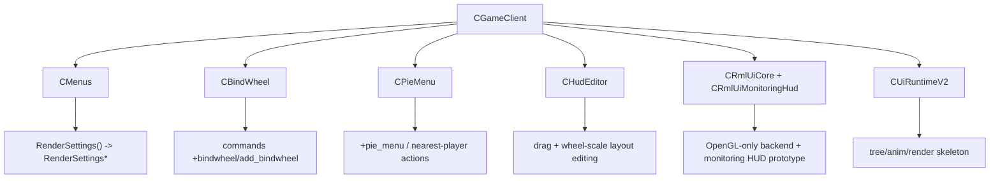

# RmlUI UI Surfaces Explore

## 速答

当前仓库里，RmlUI 只有 Monitoring HUD 试点接入，而且是通过 `CGameClient::RenderQmMonitoringHud` 里的独立分支硬接进去的；这条路径未必稳定可用，不能默认作为后续 surface 的成熟实现模板。主菜单、设置页、轮盘、HUD 编辑器都还在旧 UI 路径上。对后续迁移最有价值的接缝有四个：

1. `CMenus::RenderSettings` 已经是设置页总入口，内部再分发到多个 `RenderSettings*` 子页面，适合先做“RmlUI 设置壳 + 旧逻辑保留”。
2. `CBindWheel` 和 `CPieMenu` 已经是两套独立轮盘系统，输入、打开/关闭、渲染和命令执行各自封装，适合往统一 `radial action system` 收敛。
3. `CHudEditor` 已经有拖拽与滚轮缩放基础，但还没有吸附线、尺寸调整和组件编辑，说明“HUD 编辑器增强”应基于现有 editor 演进，而不是从零起一套。
4. `QmUi::CUiRuntimeV2` 现在更像 runtime / tree / animation / render bridge 骨架，本身还没有真实业务页面，适合作为“后端无关调度骨架”的参考，但还不够直接承载完整 RmlUI 替代。

最关键的风险也很明确：`CRmlUiBackend` 目前直接构造 `RenderInterface_GL3`，并且在没有活动 OpenGL context 时直接失败；Monitoring HUD 现有代码也已经暴露过图表、布局、资源和主画面叠加问题。这说明当前实现根本还不是一个能承接菜单和设置页的通用 UI 运行时。

## 关键证据

1. Monitoring HUD 的 RmlUI 接入是 `RenderQmMonitoringHud` 里的条件分支，成功时直接 `return`，失败时走旧 HUD fallback，说明当前只迁了一个特例，而不是通用 UI 调度。
   - 证据：[gameclient.cpp](C:/Users/11054/.codex/worktrees/140c/QmClient/src/game/client/gameclient.cpp:1567)
   - 支撑结论：RmlUI 目前不是全局 UI runtime，只是 Monitoring HUD 的试点挂点。

2. RmlUI backend 初始化强依赖活动 OpenGL context，且内部直接使用 `RenderInterface_GL3`。
   - 证据：[rmlui_backend.cpp](C:/Users/11054/.codex/worktrees/140c/QmClient/src/engine/client/rmlui_backend.cpp:160)
   - 支撑结论：当前实现天然不适合作为跨后端、通用菜单/HUD UI 管线。

3. 最新 architecture 和 roadmap 已明确把 Monitoring HUD 标为试点宿主，不把“能进入 RmlUI 路径”视作稳定可复用。
   - 证据：[ARCHITECTURE.md](C:/Users/11054/.codex/worktrees/140c/QmClient/.codestable/architecture/ARCHITECTURE.md:74), [rmlui-full-replacement-roadmap.md](C:/Users/11054/.codex/worktrees/140c/QmClient/.codestable/roadmap/rmlui-full-replacement/rmlui-full-replacement-roadmap.md:51)
   - 支撑结论：后续 design 必须把 Monitoring HUD 当作 prototype host，而不是成熟 base。

4. 离线菜单和在线菜单最终都通过 `CMenus` 分发，设置页统一落在 `RenderSettings(MainView)`。
   - 证据：[menus.cpp](C:/Users/11054/.codex/worktrees/140c/QmClient/src/game/client/components/menus.cpp:1857), [menus.cpp](C:/Users/11054/.codex/worktrees/140c/QmClient/src/game/client/components/menus.cpp:1945)
   - 支撑结论：设置页迁移存在明显单入口，适合先做壳层替换而不是散点改页面。

5. 设置页内部已经是 tab + page dispatcher 结构，多个具体页面仍由 `RenderSettingsGeneral`、`RenderSettingsGraphics`、`RenderSettingsQmClient` 等函数分别绘制。
   - 证据：[menus_settings.cpp](C:/Users/11054/.codex/worktrees/140c/QmClient/src/game/client/components/menus_settings.cpp:3310)
   - 支撑结论：`settings reorg` 与 `settings search` 可以建立在现有页面分发模型上，不必第一步重写所有设置逻辑。

6. `CBindWheel` 通过 console 命令注册、维护 bind 列表、响应 `OnInput` / `OnCursorMove` / `OnRender`，并在关闭时执行选中的命令。
   - 证据：[bindwheel.cpp](C:/Users/11054/.codex/worktrees/140c/QmClient/src/game/client/components/tclient/bindwheel.cpp:109), [bindwheel.cpp](C:/Users/11054/.codex/worktrees/140c/QmClient/src/game/client/components/tclient/bindwheel.cpp:146), [bindwheel.cpp](C:/Users/11054/.codex/worktrees/140c/QmClient/src/game/client/components/tclient/bindwheel.cpp:156)
   - 支撑结论：Bind 轮盘已经具备可抽象的数据和交互边界，适合纳入统一轮盘系统。

7. `CPieMenu` 是另一套独立的轮盘实现，自己处理打开条件、目标选择、输入、扇区绘制和动作执行。
   - 证据：[pie_menu.cpp](C:/Users/11054/.codex/worktrees/140c/QmClient/src/game/client/components/pie_menu.cpp:147), [pie_menu.cpp](C:/Users/11054/.codex/worktrees/140c/QmClient/src/game/client/components/pie_menu.cpp:209), [pie_menu.cpp](C:/Users/11054/.codex/worktrees/140c/QmClient/src/game/client/components/pie_menu.cpp:294)
   - 支撑结论：当前轮盘类能力确实存在重复实现，`radial action system` 有明确收敛价值。

8. `CHudEditor` 已支持拖拽 HUD 元素、滚轮缩放、布局序列化和 overlay 提示，但没有吸附线与 resize handles。
   - 证据：[hud_editor.cpp](C:/Users/11054/.codex/worktrees/140c/QmClient/src/game/client/components/hud_editor.cpp:442), [hud_editor.cpp](C:/Users/11054/.codex/worktrees/140c/QmClient/src/game/client/components/hud_editor.cpp:448), [hud_editor.cpp](C:/Users/11054/.codex/worktrees/140c/QmClient/src/game/client/components/hud_editor.cpp:526)
   - 支撑结论：HUD 编辑器应该走“增强现有 editor”的路线，而不是 roadmap 里误写成完全从零做。

9. `CUiRuntimeV2` 当前只推进 tree/anim/render bridge 骨架，并没有真实页面 mount/render 的业务层。
   - 证据：[QmRt.cpp](C:/Users/11054/.codex/worktrees/140c/QmClient/src/game/client/QmUi/QmRt.cpp:41), [QmRt.cpp](C:/Users/11054/.codex/worktrees/140c/QmClient/src/game/client/QmUi/QmRt.cpp:61)
   - 支撑结论：它是一个值得参考的 runtime skeleton，但还不是现成可复用的“新 UI 系统”。

## 结论展开

### 1. Monitoring HUD 只能作为试点宿主参考

当前 Monitoring HUD 的价值是暴露接入点、fallback 和失败诊断问题，而不是提供成熟实现模板。后续 `rmlui-runtime-shell` 可以用它验证模块注册和回退，但不能继承它的 direct GL、局部诊断和图表布局假设。

### 2. 设置页最适合先做“壳层替换”

因为 `RenderSettings()` 已经是单总入口，内部也已经按 page index 分发，所以更合理的做法不是上来重写每个设置项，而是：

- 先确定 RmlUI 设置页导航、搜索和分组模型。
- 第一阶段把旧设置内容包装成“旧逻辑承载 + 新导航壳”。
- 真正逐页迁移放在后续 feature。

### 3. 轮盘系统存在天然统一机会

`BindWheel` 和 `PieMenu` 都有：

- 打开/关闭状态
- 鼠标选择
- 扇区高亮
- 命令或动作执行

但它们的数据源和渲染代码各自独立。roadmap 里把它们收敛成一个 `radial action system` 是有代码依据的，不是空想。

### 4. HUD 编辑器不该抢主线

现有 `CHudEditor` 已经说明项目有编辑 HUD 的需求，但它仍然是旧 HUD 周边工具，不是 RmlUI 主线。更合理的路线是：

- 先让 RmlUI HUD 替代闭环稳定。
- 再决定是增强旧 editor 支持新 HUD，还是做 RmlUI 版 editor。

### 5. QmUi skeleton 值得复用思路，不值得直接神化

`CUiRuntimeV2` 证明仓库已经有人在思考 runtime/tree/animation/render bridge 分层，但它目前没有真实页面业务挂载。更像“可以借鉴接口层思路”，而不是“现成拿来就能承载 RmlUI 菜单替代”。

## 后续建议

下一步最适合做的是继续推进 `rmlui-runtime-shell` 的 `cs-feat-design` / checklist，把这份 explore 里的宿主和风险前提写进第一条工程闭环：

- `Monitoring HUD` 只作为 prototype host。
- `settings reorg` 后续仍应依附 `CMenus::RenderSettings` 总入口推进。
- `radial action system` 后续仍应以 `BindWheel + PieMenu` 统一为目标。
- `render-command-bridge` 明确不能继续围绕 `RenderInterface_GL3` 扩展。
