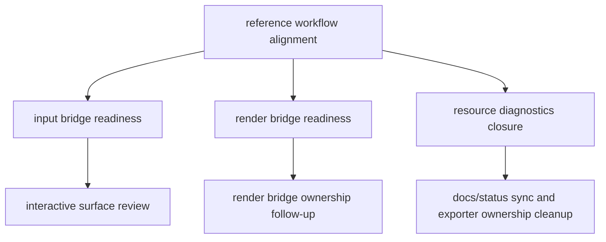

# RmlUI Explore Follow-up Index

## 速答

2026-05-07 这轮 RmlUI explore 已经从“泛化现状盘点”切到了“按 feature 路径建立 review 基线”。如果后续要继续沿这条线推进，优先阅读顺序应固定为：

1. [rmlui-reference-workflow-alignment](2026-05-07-explore-rmlui-reference-workflow-alignment.md)
2. [rmlui-input-bridge-readiness](2026-05-07-explore-rmlui-input-bridge-readiness.md)
3. [rmlui-render-bridge-readiness](2026-05-07-explore-rmlui-render-bridge-readiness.md)
4. [rmlui-resource-diagnostics-closure](2026-05-07-explore-rmlui-resource-diagnostics-closure.md)

旧的 [rmlui-reference-layer-review](2026-05-07-explore-rmlui-reference-layer-review.md) 已过期，不应继续作为主基线。

## 关键证据

### 1. reference 层与 CodeStable 工作流对齐已经有新的主基线

- **证据**：`2026-05-07-explore-rmlui-reference-workflow-alignment.md` 已取代旧 `reference-layer-review`，因为 reference 缺口判断已过期。
- 支撑结论：后续 explore 不应再从旧“reference 还缺 events/data-binding/debugger”口径起步。

### 2. input/render/resource 三条线现在分别处于不同成熟度

- **证据**：`2026-05-07-explore-rmlui-input-bridge-readiness.md` 结论是“文档已够 review，但还不该实现”。
- **证据**：`2026-05-07-explore-rmlui-render-bridge-readiness.md` 结论是“最小桥切片已实现并可 review，但完整 RenderInterface bridge 仍未完成”。
- **证据**：`2026-05-07-explore-rmlui-resource-diagnostics-closure.md` 结论是“feature 已闭环，剩余是 ownership 与状态同步”。
- 支撑结论：三条线不能再被打包成一个“RmlUI 还没好”的笼统结论。

### 3. 后续优先级应围绕 review 基线和文档状态同步，不再回到泛化盘点

- **证据**：`rmlui-developer-guide.md`、`rmlui-test-strategy.md`、`rmlui-full-replacement-readiness-matrix.md` 已存在需要同步的过时状态说明，并已在本轮开始收口。
- 支撑结论：下一轮若继续推进，优先做 status/ownership/document sync，而不是再写一份新的 completeness 报告。

## 后续建议

继续推进时，优先级建议如下：

1. 先基于这份索引读取对应 explore，而不是重新扫一遍所有 RmlUI 文档。
2. 若进入实现，先确认对应 explore 的结论是否还是 current。
3. 若进入文档同步或 acceptance/backfill，先核对 `developer-guide`、`test-strategy`、`readiness-matrix` 是否又落后于真实代码状态。
