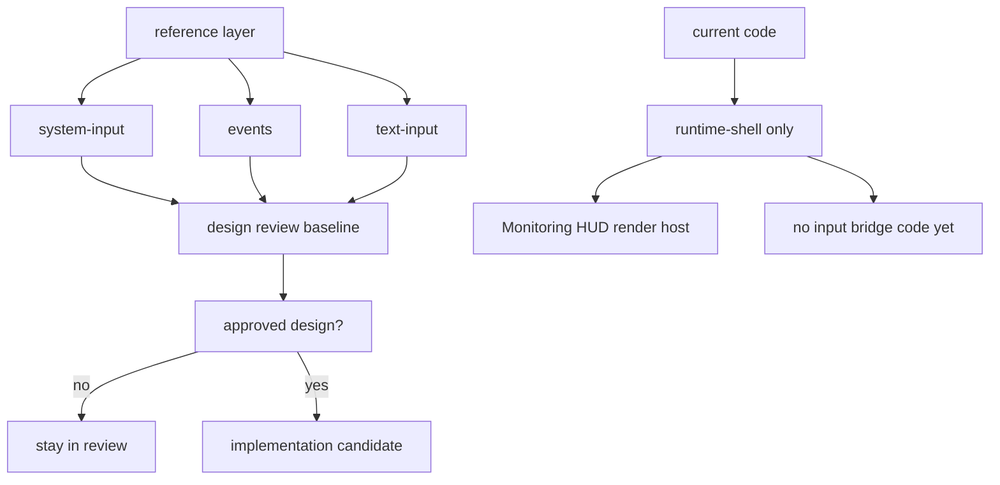

# RmlUI Input Bridge Review Readiness

## 速答

当前仓库已经具备 **review `rmlui-input-bridge` design/checklist** 的最小参考基线，但还 **不具备直接开工实现** 的条件。

核心原因不是 reference 层缺文档，而是三层边界已经基本补齐、但实现前置仍未满足：

1. **reference 层现在已经够 review**：`system-input`、`events`、`text-input` 三份文档加上 vendored RmlUI 头文件，已经能把 raw submission、event propagation、text input scope / lifetime 三个最关键边界讲清楚。
2. **当前 design/checklist 的问题不在“信息不够”，而在“还没拍板几个宿主策略”**：比如 host route result 如何映射 upstream `Process*` 返回值、`TextInputHandler` 选 global 还是 per-context、cancel/release-state 挂在哪个 host owner 上，这些已经被 design 正确识别，但还没被批准。
3. **当前代码里没有任何真正的 input bridge 实现**：runtime-shell 仍然只服务 `RenderQmMonitoringHud` 的渲染路径，没有输入路由、消费策略、release-state 或 text-input ownership 代码。
4. **所以这条 feature 现在处于“设计可 review、实现应继续 blocked”状态。** 下一步应该是继续收紧 design，而不是提前写 bridge 代码。

## 关键证据

### 1. input-bridge design 已经把真正的问题陈述对了

- **证据**：`.codestable/features/2026-05-07-rmlui-input-bridge/rmlui-input-bridge-design.md:18-24` 先定义了 `input bridge`、`raw input submission`、`event propagation`、`consumption`、`release-state`、`text input scope` 六个核心术语。
- **证据**：`.codestable/features/2026-05-07-rmlui-input-bridge/rmlui-input-bridge-design.md:53-61` 明确把三条上游边界写进 current state：raw input submission 发生在 `Context::Update()` 前；event propagation/default-action interruption 发生在 RmlUi 内部；text input handler scope 与 `TextInputContext` lifetime 不等同于 raw key submission。
- **证据**：`.codestable/features/2026-05-07-rmlui-input-bridge/rmlui-input-bridge-design.md:82-97` 明确规定 bridge 不能把 upstream 原始返回值直接等同于 host 最终策略，并要求在 approval 前拍板 text input handler 选 global 还是 per-context。
- 支撑结论：这份 design 不是拍脑袋写的，已经围绕真正高风险的边界组织了问题。

### 2. checklist 也已经把 review 关注点切成了可验证检查项

- **证据**：`.codestable/features/2026-05-07-rmlui-input-bridge/rmlui-input-bridge-checklist.yaml:4-18` 把执行步骤切成 event model、state reset、interactive policy、console protection、runtime integration 五块。
- **证据**：`.codestable/features/2026-05-07-rmlui-input-bridge/rmlui-input-bridge-checklist.yaml:22-39` 把 review 关心的问题压成了 9 条 checks，包括 route result 不得裸透传 `Process*` 返回值、HUD 默认不抢 gameplay 输入、console active 时不抢文本输入、`TextInputHandler` 安装范围和 `OnDestroy` 生命周期约束要被明确记录。
- 支撑结论：review 的切面已经足够明确，不需要再先补一轮“泛化 brainstorming”。

### 3. 参考层已经足够支撑 review raw submission、event propagation、text input lifetime 三个关键边界

- **证据**：`.codestable/reference/rmlui-system-input-reference.md:20-47` 列出了 `ProcessMouseMove`、`ProcessMouseButtonDown/Up`、`ProcessMouseWheel`、`ProcessKeyDown/Up` 等 raw submission API。
- **证据**：`.codestable/reference/rmlui-system-input-reference.md:79-86` 说明了 ordering：input should be submitted before `Context::Update()`，而 consumption decision 不属于 raw system interface 本身。
- **证据**：`.codestable/reference/rmlui-events-reference.md:41-69` 与 `88-118` 已经把 propagation phase、`StopPropagation()` / `StopImmediatePropagation()`、default-action interruption 与 host policy 的分层说明白。
- **证据**：`.codestable/reference/rmlui-text-input-reference.md:34-44`、`71-89` 已经把 `TextInputHandler` 的安装范围、global-vs-context、`OnDestroy()` 后的生命周期终止和 raw key vs IME composition 的区别写清楚。
- 支撑结论：input-bridge review 需要的参考层现在已经在本地文档里，不再依赖“脑内记忆官方 API”。

### 4. vendored RmlUI 头文件/源码进一步证明 design 里最敏感的两个点确实存在

- **证据**：`src/engine/external/rmlui/Include/RmlUi/Core/Context.h:151-202` 显示 `ProcessKeyDown/Up`、`ProcessTextInput(...)`、`ProcessMouseMove`、`ProcessMouseButtonDown/Up`、`ProcessMouseWheel(...)` 的返回语义并不统一；有的描述“event was not consumed”，有的描述“mouse is not interacting with any elements”。
- **证据**：`src/engine/external/rmlui/Include/RmlUi/Core/TextInputHandler.h:8-16` 明确说 `TextInputHandler` 可以传给 context constructor，也可以走 `SetTextInputHandler()` 全局安装；并且 `OnDestroy()` 结束 text input context 的生命周期。
- **证据**：`src/engine/external/rmlui/Include/RmlUi/Core/Core.h:65-83` 和 `src/engine/external/rmlui/Source/Core/Core.cpp:245-256` 进一步证明 upstream 同时支持全局 handler 和 context-specific handler。
- 支撑结论：design 要求“不要把 `Process*` 返回值直接映射成 host policy”和“必须先拍板 text input scope”，这不是过度谨慎，而是 upstream API 真实复杂度导致的必要约束。

### 5. 当前 QmClient 代码里还没有任何 input bridge 实现，runtime-shell 也明确没接这块

- **证据**：`git grep -n "RmlUiInputBridge|input bridge" -- src` 没有命中任何本地 `src/game/client/RmlUi/` 或 `src/game/client/` 下的真实实现类型，只有 roadmap/design/reference/architecture 文档命中。
- **证据**：`src/game/client/gameclient.cpp:1635-1760` 当前唯一的 runtime-shell 宿主接线只围绕 `RenderQmMonitoringHud`、`RenderQmMonitoringHudRmlUi`、`RenderRmlUiLayer(GAME_HUD)` 和 `monitoring_hud` module。
- **证据**：`.codestable/architecture/ui-rmlui-current.md:64-74` 明确写明 `CRmlUiRuntime` 当前不拥有 input bridge；`.codestable/features/2026-05-07-rmlui-runtime-shell/rmlui-runtime-shell-acceptance.md:31` 也明确把 “没有新增 input bridge” 作为已验收的不做项。
- 支撑结论：这条 feature 现在只能做 design review readiness，不能假装已有半套代码在仓库里可直接扩展。

### 6. roadmap/readiness 也把这条线定义成其他交互 feature 的前置门禁

- **证据**：`.codestable/roadmap/rmlui-full-replacement/rmlui-full-replacement-readiness-matrix.md:24` 定义了 `blocked-by-input-safety` 状态，要求等待 input bridge 和 safe mode evidence。
- **证据**：`.codestable/roadmap/rmlui-full-replacement/rmlui-full-replacement-readiness-matrix.md:57-62` 把 popup migration、click-gui suite、radial-action-system 都标成受 input safety 阻塞。
- **证据**：`.codestable/roadmap/rmlui-full-replacement/drafts/rmlui-full-replacement-landing-notes.md:243` 明确写了 `GAME_HUD` 不消费输入；交互型 surface 交给 `RmlUiInputBridge`。
- 支撑结论：这不是孤立小 feature，而是大部分交互式 RmlUI surface 的前置门禁；因此现在继续做 readiness explore 是对的。

## 结论展开

### 现在已经够 review 的部分

已经够 review：

- raw submission API 表面
- propagation/default-action 与 host policy 的分层
- text input handler 的安装范围和生命周期约束
- HUD passive vs interactive surface active 的策略骨架
- console text input ownership 保护

这些内容已经能让人对 `rmlui-input-bridge` design 提出具体质疑，而不是泛泛说“还不够清楚”。

### 现在还不该进入实现的原因

还不该实现：

- `status` 仍是 draft
- text input scope 还没拍板
- route result 与 upstream `Process*` 返回值的精确映射还没拍板
- cancel/release-state 的 host owner 还没收死
- safe-mode 与 input safety 的协同证据还没建立

### 这份 explore 最重要的判断

最重要的判断不是“还缺多少文档”，而是：

- **文档层已经够 design review**
- **流程层还没到批准实现**

这两件事必须分开说。

## 后续建议

下一步最合适的是继续 `cs-explore` 或转 `cs-feat-design` review，而不是直接写代码：

1. 先基于这份 explore 收紧 `rmlui-input-bridge-design.md`，把 `TextInputHandler` 作用域、route result 映射、cancel/release-state owner 三个点拍板。
2. 然后再做一份 `rmlui-render-command-bridge` readiness explore。
3. 两条 readiness explore 都完成后，再回到现有 RmlUI explore 线，补 `resource-diagnostics` 与 acceptance/architecture backfill 的对照证据。
