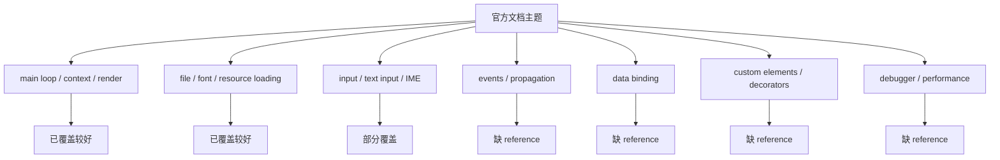

# RmlUI 参考层官方对照 Review

## 速答

当前 `.codestable/reference/` 的 RmlUI 参考层已经足够支撑 **runtime-shell / render-bridge / resource diagnostics** 这三条线的初步设计和实现 review，但还 **不足以作为整个 RmlUI 体系的统一 review 基线**。主要问题不是“完全没写”，而是 **覆盖偏科**：现有文档重心放在 runtime、render、file、font、prototype host；而官方文档里对后续实现同样关键的 **events、debugger、data binding、custom elements/decorators、IME/text input 生命周期** 还没有被完整沉淀成 reference 文档。

核心结论：

1. **已有覆盖较强的区域**：runtime 主循环时序、render interface、file interface、font loading、prototype backend/core/host 边界，这些已经有结构化 reference，可支撑当前 `rmlui-runtime-shell` 和 `rmlui-render-command-bridge` 讨论。
2. **明显缺失的官方主题**：`events`、`debugger`、`data bindings`、`custom elements`、`decorators`、更完整的 `text input / IME` 约束。这些主题在官方文档中有明确 API 和行为要求，但现有 reference 层要么只在 runtime 总结里一笔带过，要么完全缺席。
3. **现有文档的主要问题是边界不够分层**：`rmlui-runtime-api-reference.md` 同时承载 upstream API、QmClient prototype、runtime-shell contract，适合当前阶段快速收拢信息，但不利于后续做“上游事实 vs 本地设计 vs 本地实现”的精确 review。
4. **参考层当前更像 70%-75% 覆盖，而不是 85%+**：如果评估标准是“能否支持 RmlUI 全面替代 roadmap 下大多数 feature 的设计和代码 review”，现在还没到位；如果标准只是“支撑 runtime-shell 原型”，则已经够用。

## 关键证据

### 1. 现有参考层确实已经覆盖了 runtime / render / file / font / prototype host 主体

- **证据**：`.codestable/reference/rmlui-reference-index.md:14-28` 已经把 reference 分成 Upstream API 和 QmClient Surface 两组，说明参考层不是空白，而是有明确结构。
- **证据**：`.codestable/reference/rmlui-runtime-api-reference.md:29-105` 已经整理了官方主循环初始化顺序、`Context` 基本 API、`LoadFontFace` 时序要求和 `RenderInterface` 的 handle/scissor/texture 语义。
- **证据**：`.codestable/reference/rmlui-render-interface-reference.md:18-69` 已经单独沉淀 compiled geometry、scissor、texture lifecycle，能直接约束 render-command-bridge 设计。
- **证据**：`.codestable/reference/rmlui-file-interface-reference.md:18-49` 与 `.codestable/reference/rmlui-font-engine-reference.md:19-53` 已分别覆盖文件打开/读取和字体加载/测量/字符串生成职责。
- **证据**：`.codestable/reference/rmlui-backend-reference.md:16-113`、`.codestable/reference/rmlui-core-reference.md:16-97` 已经把 `CRmlUiBackend` 和 `CRmlUiCore` 的当前代码边界单独拆出。
- 支撑结论：现有 reference 层已经能支持“runtime-shell 当前实现为什么这样做”和“render bridge 未来应该避开什么 prototype 假设”这类 review。

### 2. 官方文档里已有但本地 reference 缺失的主题至少有四大块

- **证据**：Context7 官方文档 `events` 页面给出了 `Rml::Event`、`EventPhase`、`GetTargetElement()`、`StopPropagation()`、`GetParameter()` 等传播和参数 API；本地 `.codestable/reference/` 下没有独立的事件 reference 文档。
- **证据**：Context7 官方文档 `debugger` 页面明确说明 RmlUi 有 visual debugger plugin；本地 reference 层没有 debugger/reference，也没有说明 debugger 与 host diagnostics 的边界关系。
- **证据**：Context7 官方文档 `data_bindings/examples` 提供了 `CreateDataModel(...)`、`RegisterArray(...)`、`RegisterStruct(...)`、`Bind(...)`、`BindEventCallback(...)`；本地 reference 层没有 data-binding reference。
- **证据**：Context7 官方文档 `custom_elements` 和 `decorators` 页面分别提供 `ElementInstancer::InstanceElement / ReleaseElement` 与 `Decorator::GenerateElementData / ReleaseElementData / RenderElement`；本地 reference 层没有 custom-element 或 decorator reference。
- 支撑结论：参考层当前没有形成“RmlUi 全功能表面”的文档覆盖，而是集中在第一阶段原型路径所需主题。

### 3. 输入文档只有“原始提交 API”，还缺事件和文本输入生命周期的拆分约束

- **证据**：`.codestable/reference/rmlui-system-input-reference.md:20-87` 主要覆盖 `SystemInterface` 基本职责、`ProcessMouse*` / `ProcessKey*`、`TextInputHandler` 与 `TextInputContext` 的主要回调。
- **证据**：Context7 官方 `text_input_handler` 文档说明 `Rml::SetTextInputHandler()` 是全局安装点，且“覆盖全局 handler 不影响已存在的 contexts”；本地 input reference 尚未把这个 context-scope 生命周期约束写清楚。
- **证据**：Context7 官方 `events` 文档说明 keydown/keyup 会进入 event propagation，并且 propagation 被打断时默认动作不会执行；本地 input reference 尚未把“原始输入提交”和“事件传播后果”分成两层描述。
- 支撑结论：现有 input reference 足够支撑 input-bridge 的“提交 API 叫什么”，但还不足以支撑“事件消费、焦点、文本输入 handler 生命周期”这类更深入的 review。

### 4. `rmlui-runtime-api-reference` 信息量大，但混了三种语义层

- **证据**：`.codestable/reference/rmlui-runtime-api-reference.md:21-27` 明确写了它同时分离 three layers：上游 API、本地 prototype、runtime-shell contract。
- **证据**：同一文档中，`29-105` 讲 upstream API，`107-180` 讲当前代码表面，`192-315` 讲 implementation-ready contract。
- 支撑结论：这份文档对“快速吸收全貌”有帮助，但在正式 review 时容易把“官方事实”、“当前实现”和“设计约束”读混。后续继续完善参考层时，应该补齐缺主题，并尽量减少把不同语义层继续塞进同一篇。

### 5. test strategy 也反映出参考层仍偏 runtime / diagnostics，而非完整 RmlUi 表面

- **证据**：`.codestable/reference/rmlui-test-strategy.md:43-76` 的测试矩阵集中在 runtime-shell、resource diagnostics、render bridge。
- **证据**：其中没有 data binding、events propagation、text input handler、custom elements/decorators 相关测试矩阵。
- 支撑结论：参考层当前服务的是“第一阶段接入工程”，还不是“完整 RmlUI 体系”的 review baseline。

### 6. 现有 completeness explore 对参考层的 85% 评价偏乐观

- **证据**：`.codestable/compound/2026-05-07-explore-rmlui-doc-completeness.md:24-29` 给参考层 85%，主要依据是文档数量从 3 份扩到 13 份。
- **证据**：这份旧报告列出的 reference 文档确实覆盖 runtime/render/file/font/backend/core/host/test strategy/developer guide，但没有把官方 `events`、`data bindings`、`custom elements/decorators`、`debugger` 缺失计入扣分项。
- 支撑结论：如果评价标准升级为“作为后续 design/code review 的统一参考基线”，旧覆盖率结论需要下修。

## 结论展开

### 参考层现在适合做什么

适合：

- review `rmlui-runtime-shell`
- review `rmlui-render-command-bridge`
- review `rmlui-resource-diagnostics`
- review 当前 `CRmlUiBackend / CRmlUiCore / GameClient host` 的边界和失败语义

原因是这些主题刚好和现有 reference 文档重叠度高。

### 参考层现在不适合直接作为哪些工作的最终基线

不适合直接作为以下工作的“唯一基线”：

- `rmlui-input-bridge` 的完整行为 review
- 菜单/设置页这类交互式 surface 的事件流 review
- HUD 编辑器 / 组件编辑器这类偏复杂 UI 的输入与状态同步 review
- 后续可能引入的数据绑定式 UI 设计 review
- custom elements / decorators 扩展方案 review

原因不是这些主题不能做，而是 reference 层还没把官方事实沉淀到本地文档里。

### 最应该优先补的参考层主题

优先级建议：

1. `rmlui-events-reference.md`
   覆盖事件传播、target/current element、interruptible default action、参数读取。
2. `rmlui-data-binding-reference.md`
   覆盖 data model、type registration、bind、event callback、authoring restrictions。
3. `rmlui-text-input-reference.md`
   从现有 system-input 里拆出更聚焦的 IME / `TextInputHandler` / `TextInputContext` 生命周期文档，明确 global-vs-context 安装边界。
4. `rmlui-custom-elements-reference.md`
   覆盖 custom element instancer 与 decorator/shader 扩展点，给后续复杂 UI 能力留参考位。
5. `rmlui-debugger-reference.md`
   覆盖官方 debugger plugin、和 QmClient diagnostics/logging 的边界。

### 对现有文档的修订方向

- `rmlui-reference-index.md` 需要把缺失主题纳入索引层级。
- `rmlui-runtime-api-reference.md` 不一定要拆，但至少要在开头更强地声明“上游事实 / 当前实现 / 设计契约”三层不可混用。
- `rmlui-system-input-reference.md` 需要补齐 text input handler 的安装范围、context 生命周期约束，并与 future input-bridge 的职责边界做更清楚区分。
- `rmlui-developer-guide.md` 需要把“先读哪几份官方 reference”写成更完整的阅读顺序，而不是只围绕 runtime-shell。

## 后续建议

最合适的下一步不是直接去 review 设计或代码，而是先做一轮 **reference 层补强**：

1. 补 `events / data binding / text input / custom elements / debugger` 五类 reference 文档。
2. 更新 `rmlui-reference-index.md` 和 `rmlui-developer-guide.md`。
3. 完成后，再按这套参考层去 review：
   - `rmlui-input-bridge` design
   - `rmlui-render-command-bridge` design
   - 再到对应代码实现

这一步完成后，参考层才更接近“可作为后续 review 基线”的状态。
