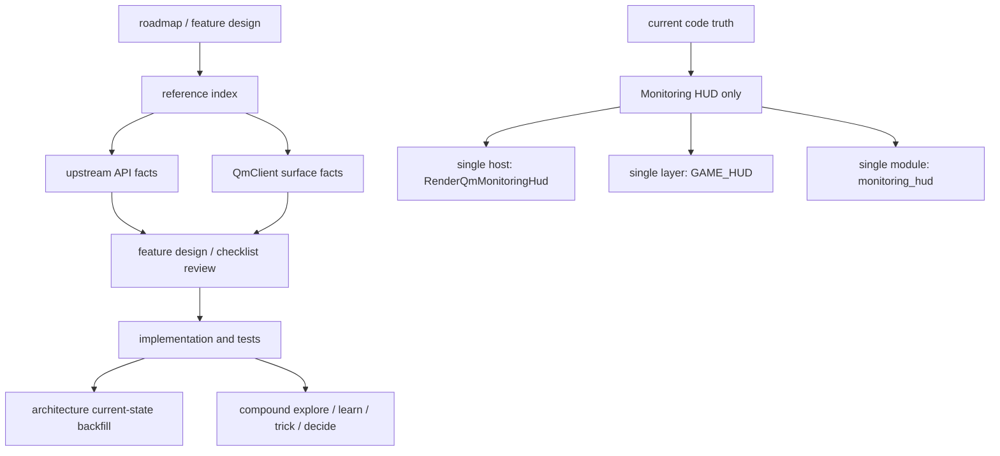

# RmlUI 参考层与 CodeStable 工作流对齐现状

## 速答

当前 RmlUI 参考层已经不再只是“给 runtime-shell 原型查 API 的资料堆”，而是开始形成一条能服务 CodeStable 工作流的完整证据链：**roadmap/feature design 决定做什么，reference 层提供上游事实和本地 surface 基线，architecture 只记录当前已实现事实，compound explore/learn/trick/decide 负责把本轮调研与约束沉淀下来。**

但这条链目前仍然只在 **Monitoring HUD prototype + runtime-shell baseline** 上闭环，离“支撑 RmlUI 全面替代路线的大部分 feature”还有明显距离。当前实现真相也必须说死：**代码上真正落地的仍然只有 `CGameClient::RenderQmMonitoringHud` 这一个宿主、`GAME_HUD` 这一个 layer、`monitoring_hud` 这一个 prototype module。**

核心结论：

1. **参考层已经形成分层结构，且开始直接服务 CodeStable 流程。** `rmlui-reference-index.md` 已把 upstream API 与 QmClient surface 分开；`rmlui-developer-guide.md` 已把 roadmap → architecture → reference → feature checklist → test strategy 的阅读顺序写明。
2. **旧 review 里“events / data binding / custom elements / debugger / text input 缺 reference”这个结论已经过期。** 这些缺口现在都已有独立 reference 文档，旧结论不再适合继续作为 review 基线。
3. **当前实现范围仍然很窄，参考层不能被误读成“实现层已经完整”。** architecture 文档和 `gameclient.cpp` 都明确表明：当前只落地 Monitoring HUD prototype host；safe-mode 已进入 runtime current-state；render bridge 只完成最小 graphics-thread slice；input bridge / Vulkan/Android backend 仍未成为当前实现。
4. **现在最该继续推进的是“续写 explore 线”，而不是再泛泛扩文档。** 参考层第一轮骨架已经够用，下一步 explore 应该围绕具体主题继续收紧：input/event path、render bridge 设计前置、resource diagnostics 与 acceptance/architecture backfill 的真实对照。

## 关键证据

### 1. reference 层已经显式分成 upstream API 与 QmClient surface 两层

- **证据**：`.codestable/reference/rmlui-reference-index.md:14-33` 把 reference 文档拆成两组：`Upstream API References` 与 `QmClient Surface References`。
- **证据**：`.codestable/reference/rmlui-reference-index.md:37-42` 进一步规定了使用顺序：做设计/review 先读 upstream API；只有在需要理解 prototype 代码形状时才回到 surface references。
- 支撑结论：参考层现在不是“把所有信息塞在一篇 runtime api 里”，而是已经有了明确的事实分层，能直接服务 CodeStable 的 design/review 阶段。

### 2. developer guide 已把 reference 层接进 CodeStable 工作流，而不是孤立文档堆

- **证据**：`.codestable/reference/rmlui-developer-guide.md:16-25` 规定实现者阅读顺序为 roadmap → readiness matrix → `ARCHITECTURE.md` → `ui-rmlui-current.md` → reference index → runtime api → active feature design/checklist → test strategy。
- **证据**：`.codestable/reference/rmlui-developer-guide.md:27-34` 把 reference 层按主题映射到工作类型：runtime/backend、interactive/input、state-driven/menu、rich widget/editor、dev tooling and inspection。
- **证据**：`.codestable/reference/rmlui-developer-guide.md:65-107`、`109-136` 把 runtime-shell、resource-diagnostics、render-bridge、input/event、data/widget 这些 feature 级工作，分别绑定到具体 reference 文档。
- 支撑结论：reference 层已经开始承担“feature design / checklist review 前置输入”的角色，这正是它与 CodeStable 工作流对齐的核心表现。

### 3. 旧 explore 中列出的 reference 缺口现在已经被补上，旧结论过期

- **证据**：`.codestable/reference/rmlui-reference-index.md:20-25` 现在已经收录 `rmlui-events-reference.md`、`rmlui-text-input-reference.md`、`rmlui-data-binding-reference.md`、`rmlui-custom-elements-reference.md`、`rmlui-debugger-reference.md`。
- **证据**：`.codestable/reference/rmlui-events-reference.md:12-63` 已沉淀事件对象、传播阶段、`StopPropagation()` / `StopImmediatePropagation()` 与 default-action 后果。
- **证据**：`.codestable/reference/rmlui-text-input-reference.md:12-49` 已沉淀 `TextInputHandler`、global-vs-context 安装范围、`TextInputContext` 生命周期和 `OnDestroy()` 后禁止继续访问的约束。
- **证据**：`.codestable/reference/rmlui-data-binding-reference.md:12-58` 已沉淀 `CreateDataModel(...)`、`RegisterArray` / `RegisterStruct`、`Bind(...)`、`BindEventCallback(...)` 与 `data-*` authoring 规则。
- **证据**：`.codestable/reference/rmlui-custom-elements-reference.md:12-52` 与 `.codestable/reference/rmlui-debugger-reference.md:12-40` 已分别沉淀 custom elements/decorators/shader hooks 和 debugger/plugin 边界。
- 支撑结论：旧文档“参考层只覆盖 runtime/render/file/font，交互和扩展主题明显缺失”的判断已经不成立，因此应 supersede，而不是继续在原文上修修补补。

### 4. architecture 仍然只记当前事实，并明确把实现范围压在 Monitoring HUD prototype

- **证据**：`.codestable/architecture/ui-rmlui-current.md:14-27` 明确 `Current RmlUI code is limited to the Monitoring HUD prototype path`，当前 host 只有 `CGameClient::RenderQmMonitoringHud`。
- **证据**：`.codestable/architecture/ui-rmlui-current.md:60-74` 把 `CRmlUiRuntime` 的当前职责写成 “Monitoring HUD prototype host 的 runtime-shell registry 和 frame result path”，并明确它拥有当前 safe-mode streak / demotion / reset policy，但不拥有完整 render-command bridge 和 input bridge。
- **证据**：`.codestable/architecture/ui-rmlui-current.md:129-141` 进一步列出 RmlUI 当前“不拥有”的区域：main menu、settings、popup、wheel/click GUI、HUD editor、render command bridge、input bridge、safe mode、Vulkan/Android backend。
- 支撑结论：参考层再完整，也不能把 architecture 当前态抬高成“已实现的全面 RmlUI 栈”；CodeStable 的 architecture 层在这里仍然守住了“只记现状”的边界。

### 5. 代码层当前确实只有一个宿主、一个 layer、一个 module，和 architecture 文档一致

- **证据**：`src/game/client/gameclient.cpp:1635-1662` 显示 `CGameClient::RenderQmMonitoringHud(...)` 是当前唯一消费 RmlUI Monitoring HUD 的宿主入口；渲染失败仍回到旧 HUD 和 fallback notice。
- **证据**：`src/game/client/gameclient.cpp:1701-1723` 显示 runtime 注册的 module 只有一个：`monitoring_hud`，config key 为 `qm_rmlui_monitoring_hud`，layer 为 `ERmlUiLayer::GAME_HUD`，fallback owner 为 `CGameClient::RenderQmMonitoringHud`。
- **证据**：`src/game/client/gameclient.cpp:1725-1760` 显示 `RenderQmMonitoringHudRmlUi(...)` 只构造一类 `SRmlUiFrameRequest`，并调用 `m_RmlUiRuntime.RenderRmlUiLayer(Request, Storage())`；当前 surface 成功条件也只围绕这一个 HUD 原型。
- 支撑结论：当前实现覆盖面和 architecture / developer-guide 中的叙述是一致的，没有隐藏的第二宿主或更通用的 surface 管理器。

### 6. 参考层现在更适合做“feature-specific review baseline”，而不是再做抽象 completeness 估分

- **证据**：`.codestable/reference/rmlui-developer-guide.md:41-43` 已把 `2026-05-07-rmlui-resource-diagnostics` 标成当前 next candidate。
- **证据**：`.codestable/reference/rmlui-developer-guide.md:95-123` 与 `125-136` 已把 render bridge、input/event、data/widget path 的 review 前置阅读要求写成具体清单。
- **证据**：`.codestable/architecture/ui-rmlui-current.md:143-154` 明确规定哪些目标模块在 acceptance 前不能回写进 current architecture。
- 支撑结论：下一轮 explore 更应该围绕具体 feature 的“review 基线是否足够”继续推进，而不是继续做一份泛化的“文档总评分”。

## 结论展开

### 参考层现在已经对齐了哪些 CodeStable 层

已经对齐的层：

- **roadmap / feature-design 层**
  `rmlui-developer-guide.md` 已把 reference 文档按 feature 主题映射，design/checklist review 已有稳定入口。
- **architecture 层**
  `ui-rmlui-current.md` 与 surface references 保持一致，都坚持“只写当前代码事实”。
- **compound 沉淀层**
  explore/learn/trick/decide 已经开始围绕 runtime-shell、fallback、GL context prototype 踩坑形成闭环。

### 参考层现在还没有替代什么

没有替代：

- feature design 本身
- checklist 执行回写
- acceptance 证据
- architecture 的 accepted backfill
- 代码实现范围判断

原因是 reference 层提供的是“上游事实 + 当前 surface 基线”，不是“这个 feature 已经做完”的证明。

### 当前实现梳理后的真实边界

当前已实现：

- `CRmlUiBackend`
- `CRmlUiCore`
- `CRmlUiRuntime`
- `CRmlUiMonitoringHud`
- `CGameClient::RenderQmMonitoringHud` 宿主接线
- `GAME_HUD` layer 下的 `monitoring_hud` prototype module
- runtime 内 safe-mode policy
- render-command-bridge 的 graphics-thread minimal slice

当前未实现为 current-state 的部分：

- full render command bridge
- input bridge
- settings/menu/popup/wheel/HUD editor 等多 surface 管理
- Vulkan/Android backend 的等价实现路径

### 下一步 explore 应该怎么续，不该怎么续

应该续：

1. `rmlui-input-bridge` 的 reference-to-design readiness explore
2. `rmlui-render-command-bridge` 的官方 render interface 与本地 graphics primitive 对照 explore
3. `resource-diagnostics` 的 current diagnostics 字段、导出路径和 acceptance/backfill 证据对照 explore

不该续：

- 再做一份泛化“文档有多少篇”的 completeness 评分
- 把 roadmap 目标模块提前写进 architecture current-state
- 把参考层完整度误说成实现完整度

## 后续建议

最合适的下一步是继续 `cs-explore`，但要从“全面盘点”切到“按 feature 路径推进”：

1. 先做 `rmlui-input-bridge` 的 explore，专门检查 reference 层是否已足够支撑 design review。
2. 再做 `rmlui-render-command-bridge` 的 explore，把官方 `RenderInterface` 契约和本地 graphics 提交原语对照清楚。
3. 然后再回到现有 RmlUI explore 线，补 `resource-diagnostics` 与 acceptance/architecture backfill 的真实闭环证据。
