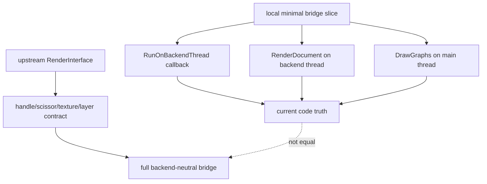

# RmlUI Render Command Bridge Review Readiness

## 速答

`rmlui-render-command-bridge` 这条线现在已经不是“只有 design 草稿”的状态了，而是处在一个更微妙的位置：**最小桥切片已经部分落地并且 checklist 大部分已回写，但它完成的是“把 Monitoring HUD 的 core/document render 从主线程 context 争用里挪开”，不是完整的 backend-neutral `RenderInterface` bridge。**

因此这条线的当前判断应当分成两半：

1. **作为 design/code review 基线，已经够用了。** 官方 `RenderInterface` 真实签名、本地 graphics-thread callback 落地点、Monitoring HUD document/graph overlay 分层，都已经有本地代码和 reference 文档支撑。
2. **作为“render bridge 已经完成”的说法，仍然不成立。** 当前 backend 仍然绑定 `RenderInterface_GL3`，完整的 geometry/scissor/texture/layer/filter/shader 生命周期桥接并没有实现。
3. **所以最准确的状态不是 `blocked`，也不是 `done`，而是“minimal slice implemented, full bridge still pending”。**

## 关键证据

### 1. vendored RmlUI 的 `RenderInterface` 真实契约比当前最小桥大得多

- **证据**：`src/engine/external/rmlui/Include/RmlUi/Core/RenderInterface.h:34-70` 定义了必需基础接口：`CompileGeometry`、`RenderGeometry`、`ReleaseGeometry`、`LoadTexture`、`GenerateTexture`、`ReleaseTexture`、`EnableScissorRegion`、`SetScissorRegion`。
- **证据**：`src/engine/external/rmlui/Include/RmlUi/Core/RenderInterface.h:76-140` 还定义了可选高级接口：clip mask、transform、layer push/pop/composite、save layer、filter、shader。
- **证据**：`.codestable/reference/rmlui-render-interface-reference.md:16-34` 只总结了 geometry/scissor/texture 这几块；对于 layer/filter/shader 这类高级接口，本地 reference 还没形成更具体的“本项目是否会实现”的落地约束。
- 支撑结论：如果把“render bridge”理解成完整 `RenderInterface` 落地，现在远没有结束；当前切片只覆盖了更前面的执行线程/宿主争用问题。

### 2. design 本身已经正确把目标收窄成“最小桥切片”，没有假装做完整 bridge

- **证据**：`.codestable/features/2026-05-07-rmlui-render-command-bridge/rmlui-render-command-bridge-design.md:28-46` 明确写了本 feature 只做 render bridge 的第一条硬约束：停止 surface 直接抢 GL context；并明确不做 backend-neutral geometry/scissor/texture lifecycle bridge。
- **证据**：`.codestable/features/2026-05-07-rmlui-render-command-bridge/rmlui-render-command-bridge-design.md:52-57` 把关键决策写成：先新增 graphics-thread callback 命令；`CRmlUiMonitoringHud` 拆成 document render step 和 graph overlay step；runtime/result/fallback 不变。
- **证据**：`.codestable/features/2026-05-07-rmlui-render-command-bridge/rmlui-render-command-bridge-design.md:173-178` 在结构健康度里再次强调：`CRmlUiBackend` 仍绑定 `RenderInterface_GL3`，完整 render interface bridge 尚未实现。
- 支撑结论：设计口径本身是自洽的，问题不在 design 说错，而在后续很容易被误读成“bridge feature 已全部完成”。

### 3. checklist 显示最小桥切片已大部分落地，但验证步骤还没完全收口

- **证据**：`.codestable/features/2026-05-07-rmlui-render-command-bridge/rmlui-render-command-bridge-checklist.yaml:4-15` 的前 3 个步骤已标 `done`：backend-thread callback 最小桥、Monitoring HUD 切分、宿主接入。
- **证据**：同一 checklist 的第 4 步 `验证：重建 game-client，并用实际启动日志检查 context 争用路径是否收敛` 仍是 `pending`。
- **证据**：`.codestable/features/2026-05-07-rmlui-render-command-bridge/rmlui-render-command-bridge-checklist.yaml:18-27` 的 checks 已确认：新 callback 只承接最小逻辑、surface 路径不再调用 `AcquireBackendFrameContext`、runtime/result/fallback 语义不变、geometry/scissor/texture 仍标明未完成、旧 HUD fallback 保留。
- 支撑结论：这条线已经不是 draft-only，但也还没形成完整 acceptance 证据闭环。

### 4. graphics-thread callback 最小桥已经真实落进引擎，而不是纸面接口

- **证据**：`src/engine/graphics.h:617-623` 已新增 `using FBackendThreadCallback = void (*)(void *pUser);` 和 `virtual void RunOnBackendThread(...) = 0;`。
- **证据**：`src/engine/client/graphics_threaded.cpp:3398-3420` 显示 `CGraphics_Threaded::RunOnBackendThread(...)` 会在主线程下构造 `SCommand_BackendCallback`、`KickCommandBuffer()` 并 `WaitForIdle()`，形成同步 graphics-thread callback。
- **证据**：`src/engine/client/backend_sdl.cpp:212-223` 显示 `CMD_BACKEND_CALLBACK` 已被 command processor 执行，回调不是空壳。
- 支撑结论：最小桥的 engine 侧接缝已经真实存在，因此这条 feature 已有可 review 的代码事实。

### 5. Monitoring HUD 渲染路径已经切成 backend-thread document render + main-thread graph overlay

- **证据**：`src/game/client/RmlUi/RmlUiMonitoringHud.cpp:111-152` 显示 `RenderDocument(...)` 负责 `UpdateDocument(...)`、`m_pCore->Update()`、`m_pCore->Render()` 和 graph rect 解析。
- **证据**：`src/game/client/RmlUi/RmlUiMonitoringHud.cpp:155-186` 显示 `DrawGraphs(...)` 继续使用 `IGraphics` 绘制网格和折线图。
- **证据**：`src/game/client/RmlUi/RmlUiMonitoringHud.cpp:189-193` 的组合 `Render(...)` 只是包装层，说明职责已拆开。
- **证据**：`src/game/client/gameclient.cpp:1769-1789` 与 `1822-1833` 显示 host 现在通过 `Graphics()->RunOnBackendThread(...)` 调度 backend frame；成功后才在主线程调用 `m_RmlUiMonitoringHud.DrawGraphs(...)`。
- 支撑结论：design 里说的“两段式切分”已经真实落地，并且和代码结构一致。

### 6. Monitoring HUD surface 路径确实已经脱离 `AcquireBackendFrameContext()`，但 backend 本体仍是 GL3 原型

- **证据**：`git grep -n "AcquireBackendFrameContext|ReleaseBackendFrameContext" -- src/game/client` 只剩引擎/graphics 实现，不再出现在 `RenderRmlUiMonitoringModule` 这条 Monitoring HUD surface 路径上；而 `src/game/client/gameclient.cpp:1776` 现在走的是 `RunOnBackendThread(...)`。
- **证据**：`src/engine/client/rmlui_backend.cpp:176-205` 仍然在 `Init()` 中直接检查 `SDL_GL_GetCurrentContext()`，并构造 `RenderInterface_GL3`。
- **证据**：`.codestable/reference/rmlui-backend-reference.md:24-36`、`56-59` 也明确写了 `CRmlUiBackend` 仍是 GL3 prototype backend，不是长期多后端 bridge。
- 支撑结论：surface 争用问题的最小桥方向是成立的，但这仍然不是 backend-neutral render bridge。

### 7. readiness matrix 的旧状态已经落后于当前事实

- **证据**：`.codestable/roadmap/rmlui-full-replacement/rmlui-full-replacement-readiness-matrix.md:50` 仍把 `rmlui-render-command-bridge` 描述为 `ready-for-design`，理由是“draft exists, render contract questions are still open”。
- **证据**：而当前实际文件状态是 `.codestable/features/2026-05-07-rmlui-render-command-bridge/rmlui-render-command-bridge-design.md` 的 `status: approved`，且 checklist 前 3 步已完成。
- 支撑结论：这条 roadmap/readiness 元数据已经滞后，后续若继续推进 explore 线，应把它列为需要回写同步的流程差异。

## 结论展开

### 现在已经够 review 的部分

已经够 review：

- graphics-thread callback 最小桥是否自洽
- Monitoring HUD document/core render 与 graph overlay 的分层
- host 接入是否保持 runtime/result/fallback 语义
- 当前切片有没有继续抢 backend frame context

这些问题都已经有 design、checklist 和代码证据可核。

### 现在还不能宣称完成的部分

还不能宣称完成：

- 完整 `Rml::RenderInterface` bridge
- geometry handle 生命周期接管
- scissor/clip/layer/filter/shader 契约落地
- backend-neutral OpenGL/Vulkan/Android 统一桥
- “render bridge 已完成，可直接迁移交互 surface”

### 这份 explore 的关键判断

最关键的判断是：

- **最小桥切片：已进入实现 + 可 review**
- **完整 render bridge：仍未完成**

如果后续文档或验收把这两者混成一句“render bridge 完成”，那就是错误表述。

## 后续建议

下一步最合适的是两条并行的 explore/回写工作，而不是继续空谈“大桥”：

1. 继续 `resource-diagnostics` 的 explore，补运行证据、acceptance/backfill 对照。
2. 单独记一条流程差异：`readiness-matrix` 和 `render-command-bridge` 当前设计/实现状态已经不一致，后续 acceptance 或 arch/backfill 时需要同步。
3. 如果之后再扩 `render-command-bridge`，应新开更具体的后续 explore，专门回答：
   - geometry handle ownership
   - scissor/layer/filter/shader 是否需要在 QmClient 第一阶段支持
   - Vulkan/Android 需要的最小共享协议是什么
