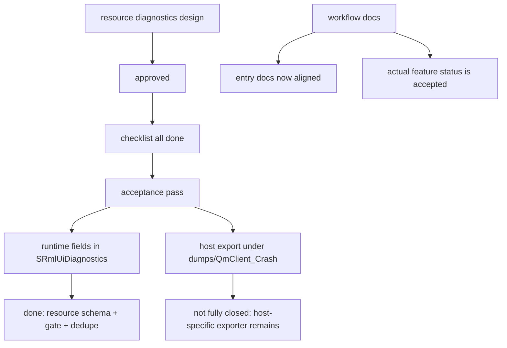

# RmlUI Resource Diagnostics Closure And Status Alignment

## 速答

`rmlui-resource-diagnostics` 这条线已经不该再被视为“只有 design/checklist 的待实现项”了。当前事实是：**design 已 approved，checklist 已全部 done，acceptance 已 pass，运行时资源诊断字段和导出门禁也已经真实落进代码。**

但这条线还有两个明显没收口的地方：

1. **ownership 还没完全从 `CGameClient` surface 特例收回到 runtime/resource diagnostics 层。**
   资源字段虽然已经存在于 `SRmlUiDiagnostics` 和 `CRmlUiRuntime::SetResourceDiagnostics(...)`，但实际导出函数仍然叫 `ExportRmlUiMonitoringDiagnostics(...)`，并且还夹带 `hud_*` 特例字段。
2. **CodeStable 元数据曾有滞后。**
   入口文档现在已经同步到 accepted baseline，但 exporter ownership 与 host residue 仍需继续收拢。

所以这条线现在最准确的判断是：**功能最小闭环已完成，剩余工作主要是 ownership 收拢和流程文档状态同步，而不是继续把它当作未实现 feature。**

## 关键证据

### 1. feature 文档链已经完整收口到 acceptance，不再是 draft-only 状态

- **证据**：`.codestable/features/2026-05-07-rmlui-resource-diagnostics/rmlui-resource-diagnostics-design.md:1-9` 显示 design 的 `status: approved`。
- **证据**：`.codestable/features/2026-05-07-rmlui-resource-diagnostics/rmlui-resource-diagnostics-checklist.yaml:4-19` 六个 steps 全部是 `done`。
- **证据**：`.codestable/features/2026-05-07-rmlui-resource-diagnostics/rmlui-resource-diagnostics-acceptance.md:1-8` 显示 acceptance `status: pass`。
- **证据**：`.codestable/features/2026-05-07-rmlui-resource-diagnostics/rmlui-resource-diagnostics-acceptance.md:33-36` 已记录 `rmlui_runtime_test.cpp` 的资源诊断测试和 `718` 个 C++ 测试通过。
- 支撑结论：这条 feature 的 CodeStable 主链路已经完成，不适合继续被描述成“仍待实现的 draft feature”。

### 2. runtime 侧资源诊断字段和写入入口已经真实存在

- **证据**：`src/game/client/RmlUi/RmlUiRuntime.h:54-76` 的 `SRmlUiDiagnostics` 已包含 `resource_type`、`resource_path`、`resource_operation`、`resource_status`、`resource_error_code`、`resource_error_text`、`timestamp_local`。
- **证据**：`src/game/client/RmlUi/RmlUiRuntime.h:93-101` 已暴露 `SetResourceDiagnostics(...)` 和 `ShouldExportDiagnostics(...)`。
- **证据**：`src/game/client/RmlUi/RmlUiRuntime.cpp:72-89` 显示 `SetResourceDiagnostics(...)` 会把资源字段写进 `m_Diagnostics`。
- **证据**：`src/game/client/RmlUi/RmlUiRuntime.cpp:192-218` 显示 `ShouldExportDiagnostics(...)` 已实现开发诊断门禁和 failure signature 去重。
- 支撑结论：资源诊断已经进入 runtime 层的稳定数据结构，不再只是 surface 层散落日志。

### 3. 当前导出 ownership 仍然保留明显的 Monitoring HUD host 特例

- **证据**：`src/game/client/gameclient.cpp:1888-1971` 的导出函数仍然命名为 `ExportRmlUiMonitoringDiagnostics(...)`，导出文件名也是 `rmlui_monitoring_hud_%s.txt`。
- **证据**：同一函数 `1947-1953` 额外写入 `hud_initialized`、`hud_available`、`hud_document`、`hud_failure` 四个 Monitoring HUD 特例字段。
- **证据**：同一函数 `1955-1968` 会基于 `CRmlUiMonitoringHud::LastFailure()` 再次手工拼一套 `resource_*` 字段，和 `SRmlUiDiagnostics` 中的资源字段并存。
- **证据**：design 在 `.codestable/features/2026-05-07-rmlui-resource-diagnostics/rmlui-resource-diagnostics-design.md:124-127` 明确说 capture ownership 应该走 `CRmlUiRuntime` merged snapshot，而 `CGameClient` 只是当前 prototype host entry。
- 支撑结论：最小闭环虽然完成了，但 exporter ownership 还没有完全从 Monitoring HUD host 特例迁移到更通用的 runtime/resource diagnostics 层。

### 4. runtime/resource 诊断分层已经成立，但 exporter 仍处于“过渡态”

- **证据**：`.codestable/features/2026-05-07-rmlui-resource-diagnostics/rmlui-resource-diagnostics-acceptance.md:26-29` 明确验收了“资源 diagnostics 与 runtime/backend diagnostics 保持分离，不覆盖原有失败字段”和“重复失败去重、不开启开发诊断时不落盘”。
- **证据**：`src/game/client/RmlUi/RmlUiRuntime.cpp:233-250` 的 `SetDiagnostics(...)` 在每次 frame response 后会重置资源字段为空，再由具体 capture 点注入资源失败信息，说明 runtime/result 与 resource event 两层是分开的。
- **证据**：`.codestable/features/2026-05-07-rmlui-runtime-shell/rmlui-runtime-shell-acceptance.md:69` 已把 “diagnostics 导出仍带 Monitoring HUD surface 特例字段” 列为 runtime-shell 的遗留项，等后续 `rmlui-resource-diagnostics` 推广为更通用合同。
- 支撑结论：分层目标已经成立，但导出器的最后一层 ownership 还处于过渡态，这个遗留在文档里也已被明确承认。

### 5. developer-guide 与 test-strategy 的入口状态现已回到一致

- **证据**：`.codestable/reference/rmlui-developer-guide.md` 现在已把 resource-diagnostics 标为 accepted baseline，并把遗留聚焦到 exporter ownership residue。
- **证据**：`.codestable/reference/rmlui-test-strategy.md` 现在已记录 resource diagnostics 与 diagnostics export gate/dedupe 的现有覆盖，不再把它写成空白区域。
- 支撑结论：当前残留问题已不再是“入口文档状态错误”，而是 exporter ownership 仍停留在 Monitoring HUD host 过渡态。

## 结论展开

### 已经完成的部分

已经完成：

- resource diagnostics schema 进入 `SRmlUiDiagnostics`
- resource diagnostics capture 进入 runtime 层
- export gate 和 dedupe 落地
- acceptance 和测试证据存在
- dumps 导出路径定为 `dumps/QmClient_Crash`

### 还没完全收口的部分

还没完全收口：

- 导出器仍叫 `ExportRmlUiMonitoringDiagnostics`
- 导出内容仍带 `hud_*` 特例字段
- 部分 `resource_*` 字段既从 runtime snapshot 写，又在 host 层手工覆写/补写
- developer-guide / test-strategy 已同步，但 exporter ownership 仍待继续收拢

### 这条 explore 最重要的判断

最重要的判断是：

- **resource-diagnostics feature 本身已闭环**
- **剩余问题是 workflow/status alignment 和 ownership 收拢**

这意味着接下来不该再把它当成“下一个待实现 feature”，而应把它当成“需要同步文档和结构边界的已完成 feature”。

## 后续建议

最合适的下一步不是再开一轮新的 diagnostics design，而是做两类收口动作：

1. 在后续小步收口中继续把 exporter ownership 从 `CGameClient::ExportRmlUiMonitoringDiagnostics(...)` 往 runtime/resource diagnostics 层收拢，减少 `hud_*` 特例字段和 host 层二次拼装资源字段。
2. 在后续 acceptance/backfill 中明确把这项收口标成“ownership cleanup”，不要再把它重新包装成新的 diagnostics feature 设计轮次。
