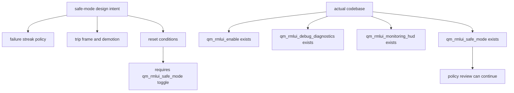

# RmlUI Safe Mode Review Readiness

## 速答

`rmlui-safe-mode` 这条线最初关注的是“配置前提是否成立、是否可以进入 design-review”。当前这份 explore 的结论已经部分过时：`qm_rmlui_safe_mode`、safe-mode state、trip/demotion/reset 以及测试都已落进代码，因此这份文档现在更适合作为“当时为何进入 safe-mode design-review”的历史证据，而不是当前状态入口。

当前最准确的状态是：

1. **配置前提已补齐。** `qm_rmlui_safe_mode` 已经是现有配置键，关于 toggle-cycle reset 和全局护栏语义的讨论不再建立在不存在的代码前提上。
2. **但 safe-mode 仍然是纯设计态。** `CRmlUiRuntime` 还没有 streak、demotion、reset state 或 safe-mode diagnostics 字段。
3. **所以这条线现在是“可继续 review，但仍不该直接实现”。**

所以当前判断应当是：

- **policy model 本身值得继续 review**
- **当前差异已从“配置不存在”收敛为“策略状态机还未落代码”**

## 关键证据

### 1. safe-mode design 明确把 `qm_rmlui_safe_mode` 当成已存在配置键

- **证据**：`.codestable/features/2026-05-07-rmlui-safe-mode/rmlui-safe-mode-design.md:53-55` 写明：`qm_rmlui_safe_mode` already exists as a QmClient config key。
- **证据**：同一设计文档 `83-85` 把“toggle `qm_rmlui_safe_mode` from `0` back to `1` clears all module safe-mode state”列为 reset condition。
- **证据**：`.codestable/features/2026-05-07-rmlui-safe-mode/rmlui-safe-mode-checklist.yaml:20-21` 也把 `qm_rmlui_safe_mode toggle cycle` 写进 recovery step 的退出条件。
- 支撑结论：这不是旁支细节，而是 safe-mode 设计里明确依赖的一个真实控制面。

### 2. `qm_rmlui_safe_mode` 现在已经真实落进代码

- **证据**：`src/engine/shared/config_variables_qmclient_extra.h` 现在已定义 `MACRO_CONFIG_INT(QmRmluiSafeMode, qm_rmlui_safe_mode, 1, 0, 1, ...)`，与现有 RmlUI 配置组同列。
- **证据**：新增配置后，`qmclient_scripts\cmake-windows.cmd --build build-ninja --target game-client -j 10` 构建通过，说明这不是悬空配置声明。
- 支撑结论：safe-mode 的配置存在性 blocker 已经解除。

### 3. reference/roadmap/runtime 文档层对这个配置的描述已经和代码脱节

- **证据**：`.codestable/reference/rmlui-runtime-api-reference.md:320-324`、`rmlui-full-replacement-roadmap.md:236-240`、`rmlui-full-replacement-prd.md:142-146` 对 `qm_rmlui_safe_mode` 的描述现在已经与代码现状一致。
- 支撑结论：原先“规划链假设和代码脱节”的那条事实差异已被补平。

### 4. runtime-shell 现状确实还没有 safe-mode state、streak 或 demotion 结构

- **证据**：`.codestable/features/2026-05-07-rmlui-safe-mode/rmlui-safe-mode-design.md:54` 自己就承认 `CRmlUiRuntime` 还不存 failure streak 或 session demotion state。
- **证据**：`src/game/client/RmlUi/RmlUiRuntime.h` 目前只有 module descriptor、frame request/response、diagnostics、resource diagnostics 和 diagnostics export signature；没有任何 safe-mode streak/demotion/reset 字段。
- **证据**：runtime-shell acceptance 也明确把 safe-mode automation 列为未实现项，见 `.codestable/features/2026-05-07-rmlui-runtime-shell/rmlui-runtime-shell-acceptance.md:31`、`55`。
- 支撑结论：safe-mode 当前依然是纯设计态，没有一半已经落地的 runtime 状态机可供直接扩展。

### 5. readiness matrix 现在不再卡在配置 blocker，但仍然低估了设计收紧工作量

- **证据**：`.codestable/roadmap/rmlui-full-replacement/rmlui-full-replacement-readiness-matrix.md:56` 把 `rmlui-safe-mode` 标成 `ready-for-design`，理由是 recovery/demotion contract still needs review。
- **证据**：当前 runtime 里仍没有 safe-mode streak/demotion/reset 字段，因此这条 item 仍不能往 `ready-for-impl` 推。
- 支撑结论：safe-mode 现在可以继续 review，但距离实现仍有一段明确的状态机和诊断契约收紧工作。

## 结论展开

### 哪些部分已经足够继续 review

已经足够 review：

- streak 只统计连续 `FALLBACK_REQUIRED`
- trip frame 仍返回 `FALLBACK_REQUIRED`
- 后续帧返回 `SKIPPED_UNAVAILABLE`
- reset 条件应包含 success render、module toggle cycle、global policy toggle cycle
- ownership 应留在 `CRmlUiRuntime`

这些 policy 方向本身没有明显问题。

### 先前 blocker 已经解除，现在真正缺的是什么

现在不再是配置 blocker，而是实现前的设计收紧缺口：

- streak 计数和模块 demotion 状态还没落到 `CRmlUiRuntime`
- safe-mode diagnostics 字段还没定义进当前 runtime snapshot
- module toggle cycle / safe-mode toggle cycle 的 reset 契约还没变成可测试实现

### 这条 explore 最重要的判断

最重要的判断是：

- **safe-mode 方向是对的**
- **配置存在性差异已经修复**
- **下一步应直接回到 recovery/demotion/diagnostics contract 的设计收紧**

## 后续建议

下一步最合适的不是直接实现 safe-mode，而是马上回到 design 收紧：

1. 明确 `CRmlUiRuntime` 里要新增的 streak/demotion/reset 状态结构。
2. 明确 `safe_mode_trip` 与 `safe_mode_session_disabled` 两类 reason 如何映射到 host fallback 和 diagnostics。
3. 明确 module toggle cycle 与 `qm_rmlui_safe_mode` toggle cycle 的 reset 入口。
4. 在这些点没写死前，不建议把 `rmlui-safe-mode` 往 `ready-for-impl` 推。
