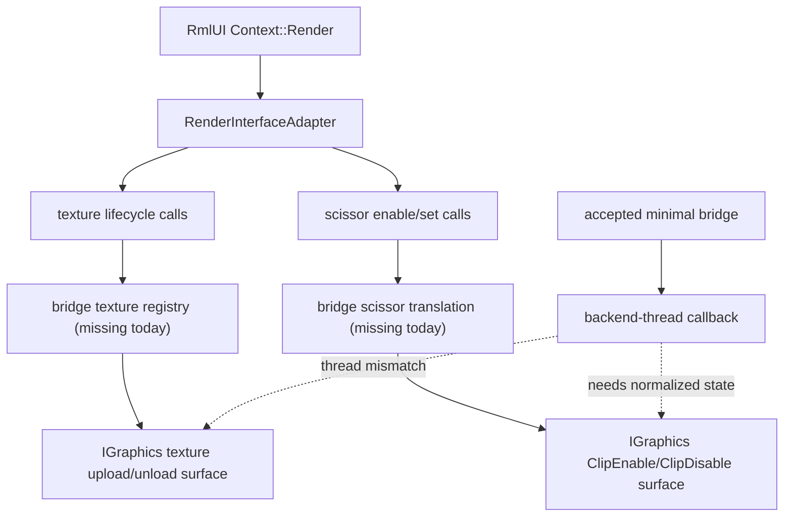

# RmlUI Scissor / Texture Bridge Readiness

## 速答

`rmlui-scissor-texture-bridge` 的下一份 design 现在已经有一个比较明确的落点了，但这个落点不是“直接把 layer switchboard 或 Monitoring HUD migration 往前推”，而是先把 **RmlUI texture handle ownership** 和 **scissor rectangle translation** 这两件事从 GL3 prototype 里剥出来。

当前最关键的判断有四条：

1. **上游已经给了一个渐进式接缝。** vendored RmlUI 的 `RenderInterfaceCompatibility` / `RenderInterfaceAdapter` 可以把现代 `RenderInterface` 的 texture/scissor 调用转成旧式 compatibility surface，不需要下一步就把 full geometry bridge 一次做完。
2. **QmClient 现有引擎已经有 texture upload / unload 和 clip state 原语，但它们挂在 `IGraphics` 主线程表面上。** 这说明“原语不存在”不是问题，真正缺的是“RmlUI bridge 自己拥有的 registry / state / thread boundary”。
3. **texture lifecycle 比 scissor 更卡线程边界。** `LoadTextureRaw(...)` / `LoadTextureRawMove(...)` 明确断言只能在 main thread 调用，而当前 accepted minimal bridge 的执行点是 backend-thread callback。这意味着下一份 design 不能简单写成“在 backend callback 里直接复用现有 texture API”。
4. **因此下一份 design 最应该回答的不是 UI 表现层，而是桥接所有权问题。** 具体是：`Rml::TextureHandle` 怎样映射到 `IGraphics::CTextureHandle`，generated texture 走哪条上传路径，RmlUI 的 top-left scissor rect 怎样翻译到 DDNet 当前 `ClipEnable(...)` 的坐标语义。

## 关键证据

### 1. 上游 compatibility adapter 已经把 scissor / texture 作为可独立桥接的 API 面暴露出来

- **证据**：`src/engine/external/rmlui/Source/Core/RenderInterfaceCompatibility.cpp:111-118` 的 `RenderInterfaceAdapter` 会直接把 `EnableScissorRegion(bool)` 和 `SetScissorRegion(Rectanglei)` 转到 legacy compatibility surface。
- **证据**：`src/engine/external/rmlui/Source/Core/RenderInterfaceCompatibility.cpp:152-181` 同一 adapter 也会把 `LoadTexture(...)`、`GenerateTexture(...)` 和 `ReleaseTexture(...)` 转到 legacy compatibility surface，并且在 generated texture 路径上做 premultiplied alpha → unpremultiplied alpha 的兼容转换。
- 支撑结论：下一份 bridge design 不需要凭空发明“如何从 modern render interface 渐进过渡”的入口；上游已经给了一个以 texture/scissor 为独立责任面的兼容层。

### 2. QmClient 当前确实已经有 clip 与 texture 原语，但它们属于 `IGraphics` 主线程表面

- **证据**：`src/engine/graphics.h:268-269` 暴露了 `ClipEnable(int x, int y, int w, int h)` / `ClipDisable()`。
- **证据**：`src/engine/graphics.h:301-304` 暴露了 `UnloadTexture(...)`、`LoadTextureRaw(...)`、`LoadTextureRawMove(...)` 和 `LoadTexture(...)`。
- **证据**：`src/engine/client/graphics_threaded.cpp:352-399` 已经有 `FindFreeTextureIndex()`、`IsTextureHandleAllocated(...)` 和 `UnloadTexture(...)` 这套 texture handle 生命周期管理。
- 支撑结论：引擎不是完全缺 texture/scissor 能力；它缺的是一层“属于 RmlUI bridge 自己的 ownership / mapping / routing”。

### 3. scissor 语义不是直接透传矩形，而是需要坐标翻译

- **证据**：`src/engine/client/graphics_threaded.cpp:193-209` 的 `ClipEnable(...)` 会把传入的 `y` 翻成 `ScreenHeight() - (y + h)` 后再写入 `m_State.m_ClipY`。
- **证据**：`src/engine/client/graphics_threaded.cpp:164-168` 说明当前 clip state 在 `CGraphics_Threaded` 里以 `m_ClipEnable / X / Y / W / H` 的形式持有。
- 支撑结论：RmlUI 的 scissor rect 不能只当作“已有一个 rectangle 就结束了”；bridge 必须明确谁负责把 RmlUI 当前坐标语义翻成 DDNet/graphics 当前的 clip state 语义。

### 4. texture lifecycle 当前不能直接塞进 accepted minimal bridge 的 backend-thread callback

- **证据**：`src/engine/client/graphics_threaded.cpp:504-507` 的 `LoadTextureRaw(...)` 直接 `dbg_assert(IsMainThread(), "GPU texture upload must be called from main thread")`。
- **证据**：`src/engine/client/graphics_threaded.cpp:529-532` 的 `LoadTextureRawMove(...)` 也有同样的 main-thread 断言。
- **证据**：`src/engine/client/backend_sdl.cpp:207-223` 当前 `CMD_BACKEND_CALLBACK` 只是在 command processor 里同步执行一次 callback，没有附带 texture upload 专用桥。
- 支撑结论：accepted minimal bridge 提供的只是“在 graphics/backend thread 执行 RmlUI document render”的接缝，它并没有自动解决 RmlUI texture lifecycle 要怎么合法触达现有 engine texture API。

### 5. 当前 backend 现状仍然是 GL3 prototype，进一步说明 texture/scissor ownership 还没被 QmClient 接管

- **证据**：`src/engine/client/rmlui_backend.cpp:162-181` 仍然直接初始化 `RmlGL3` 和 `RenderInterface_GL3`。
- **证据**：`src/engine/client/rmlui_backend.cpp:208-221` 的 `SetViewport / BeginFrame / EndFrame` 仍然是对 `RenderInterface_GL3` 的直接 forward。
- **证据**：`.codestable/reference/rmlui-backend-reference.md:24-36` 已把当前 backend 定义为 “prototype behavior” 和 “not the long-term multi-backend bridge”。
- 支撑结论：下一条 feature 的任务不是“文档上承认 full bridge 还没做”，而是真正把 texture/scissor 这一层 ownership 从 GL3 prototype 手里拿回来。

### 6. 当前主线顺序支持先做 scissor / texture，再谈 layer switchboard

- **证据**：`.codestable/roadmap/rmlui-full-replacement/rmlui-full-replacement-roadmap.md:511-530` 把 `rmlui-scissor-texture-bridge` 放在 `rmlui-layer-switchboard` 之前。
- **证据**：`.codestable/roadmap/rmlui-full-replacement/rmlui-full-replacement-readiness-matrix.md:50-52` 当前也明确：layer order 依赖更完整的 render submission strategy，而不是当前 Monitoring HUD minimal slice。
- 支撑结论：现在最合适的 `cs` 下一步不是再碰 layer owner，而是把 scissor / texture 这层 bridge design 先做实。

## 结论展开

### 现在已经清楚的部分

已经清楚：

- 上游 compatibility adapter 可以作为渐进式 bridge 的技术接缝。
- QmClient 现有 graphics 原语足以承接 texture/scissor，只是 ownership 还没抽出来。
- scissor 的核心问题是矩形坐标翻译。
- texture 的核心问题是线程边界和 handle registry。

### 现在还不清楚、必须留给下一份 design 的部分

还不清楚：

- `Rml::TextureHandle` 到 `IGraphics::CTextureHandle` 的 registry 由谁持有。
- generated texture 走“新增 backend-safe upload 入口”还是“主线程预上传 + backend thread 只消费 handle”。
- scissor state 是直接复用 `ClipEnable/ClipDisable()`，还是先抽一层更贴近 backend callback 的 bridge state。
- geometry draw-call ownership 在这一步保留多少临时 path，还是要求同时引入更明确的 geometry submission seam。

## 后续建议

这份 explore 之后，最合适的下一步是直接开 `cs-feat-design`，目标条目就是 roadmap 里的 `rmlui-scissor-texture-bridge`。设计时应该把问题收紧为三件事：

1. texture handle registry 的所有权和生命周期；
2. generated / file texture 的上传路径与线程边界；
3. scissor rect 的语义翻译与 host/bridge/backend 责任划分。

不建议下一步直接去写 `layer-switchboard` 或 `monitoring-hud-migration` design，因为这两条都默认依赖上面三件事先有稳定契约。
