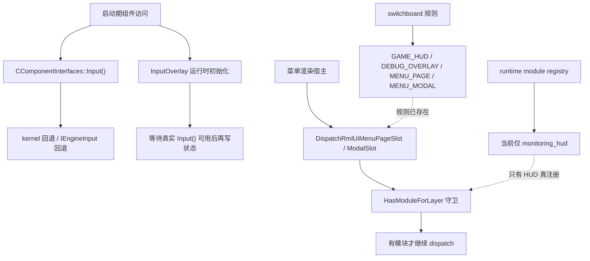

# RmlUI 启动期卡顿链路与菜单层伪接入现状探索

## 速答

这次“RmlUI 开启后像卡死、黑屏、只剩早期日志”的问题，代码证据表明它不是一个单一的 GL context 崩点，而是两层问题叠加：

1. **启动期稳定性问题**：部分组件会在 `CGameClient` 接口缓存尚未齐备时就访问 `Input()` 等接口，导致启动阶段容易出现空指针或派生故障。
2. **菜单层伪接入问题**：switchboard 已经为 `MENU_PAGE` / `MENU_MODAL` / `DEBUG_OVERLAY` 建好了调度规则，但 runtime 实际注册的模块仍只有 `monitoring_hud`。也就是说，菜单层之前“看起来已经接入了 RmlUI”，但那只是 dispatch 壳，不是完整模块。

当前代码现状可以概括为：**Monitoring HUD 是唯一真正落进 runtime module registry 的 RmlUI surface；菜单页、菜单弹窗和调试层现在只保留宿主接缝，不再误发起空模块 dispatch。**

## 关键证据

### 1. 启动期确实存在“组件先访问 Input，缓存还没齐”的风险面

- **证据**：`src/game/client/component.cpp:33-43` 现在给 `CComponentInterfaces::Input()` 加了三层回退：先取 `m_pClient->Input()`，再取 `Kernel()->RequestInterface<IInput>()`，最后退到 `IEngineInput`。
- **证据**：`src/game/client/components/binds.cpp:683-704` 里 `CBinds::GetKeyBindName()` 不再假定 `Input()` 一定非空，而是显式走 `pInput != nullptr` 分支，否则回退到 `&{Key}` 文本。
- 支撑结论：启动期接口缓存未就绪不是假设问题，而是已经需要在组件层和调用点层双重加固的真实风险。

### 2. InputOverlay 原先确实会过早碰输入状态；现在已经改成运行时初始化

- **证据**：`src/game/client/components/qmclient/input_overlay.cpp:48-50` 的 `OnInit()` 现在为空。
- **证据**：`src/game/client/components/qmclient/input_overlay.cpp:63-82` 把配置加载、修改时间初始化和首次鼠标状态采集延后到 `OnRender()`，并且只有拿到真实 `Input()` 后才把 `m_RuntimeStateInitialized` 置位。
- 支撑结论：这次启动期修复不是抽象上的“延后一点再说”，而是明确把 overlay 从初始化链里移出了。

### 3. `CGameClient` 的接口回退已经从 header 内联迁到 `.cpp`，目的是避免新的编译期不稳定

- **证据**：`src/game/client/gameclient.cpp:1542-1589` 现在把 `Engine / Graphics / Client / Sound / Input / Storage / ConfigManager / Console / TextRender / DemoPlayer` 的回退都做成了 `.cpp` 实体函数。
- **证据**：`src/game/client/gameclient.h:393-406` 这些 getter 只保留声明，不再在 header 内联 `Kernel()->RequestInterface<T>()`。
- 支撑结论：这次问题排查已经证明，启动期容错本身也可能引入新的编译单元风险，尤其是在只见前向声明的场景里。

### 4. switchboard 已经给菜单层和调试层挂上了规则，但这不等于 runtime 里已经有对应模块

- **证据**：`src/game/client/gameclient.cpp:1721-1750` 的 `EnsureRmlUiLayerSwitchboardConfigured()` 注册了四条 layer 规则：`GAME_HUD`、`DEBUG_OVERLAY`、`MENU_PAGE`、`MENU_MODAL`。
- **证据**：`src/game/client/RmlUi/RmlUiRuntime.h:102-106` 和 `src/game/client/RmlUi/RmlUiRuntime.cpp:110-118` 新增了 `HasModuleForLayer(...)`，说明当前代码已经明确区分“layer 规则存在”和“模块是否真的注册”。
- 支撑结论：之前的问题不在于 switchboard 没有菜单层入口，而在于“有入口”被误读成“功能已完成”。

### 5. 当前 runtime 真正注册的仍然只有 Monitoring HUD

- **证据**：`src/game/client/gameclient.cpp:1814-1818` 只有 `GAME_HUD` 请求会触发 `EnsureRmlUiMonitoringRuntimeRegistered()`。
- **证据**：`src/game/client/gameclient.cpp:1877-1899` 里构造并注册的唯一 `SRmlUiModuleDescriptor` 是 `monitoring_hud`，其 layer 为 `ERmlUiLayer::GAME_HUD`。
- **证据**：`src/game/client/gameclient.cpp:1821-1875` 的 `DispatchRmlUiDebugOverlaySlot()`、`DispatchRmlUiMenuPageSlot()` 和 `DispatchRmlUiMenuModalSlot()` 现在都先检查 `HasModuleForLayer(...)`，没有模块就直接返回。
- 支撑结论：当前菜单页 / 菜单弹窗 / 调试层并没有真正变成 RmlUI module，只是宿主接缝被保留了下来。

### 6. 菜单加载路径本身也有一个启动期易爆点，已经改成“告警并自修正”

- **证据**：`src/game/client/components/menus.cpp:1219-1230` 的 `RenderLoading()` 不再 `dbg_assert(m_Current <= m_Total)`，而是记录 overflow 并把 `m_Total` 修正到新的 `m_Current`。
- 支撑结论：启动期“像卡死”的外观不只会来自 RmlUI；菜单加载进度自身的断言路径同样会把初始化阶段直接打断。

## 结论展开

### 现在已经可以确认的事

- 这次问题不是“单一 GL context 崩点”那么简单。
- 启动期接口访问时机和菜单层伪接入，都是独立且真实存在的问题。
- 当前真正可运行的 RmlUI surface 仍然只有 Monitoring HUD。
- 菜单层现在的正确描述应该是“保留接缝，未注册模块不 dispatch”，而不是“菜单 RmlUI 已完成”。

### 现在还不能宣称完成的事

- 不能宣称菜单页、菜单弹窗或调试层已经完成 RmlUI 迁移。
- 不能把 switchboard 的 layer 规则回写成“当前已有对应 runtime module”。
- 不能把这次启动稳定性修复误写成“render-command-bridge 或完整 menu surface bridge 已完成”。

## 后续建议

- 如果后面继续做菜单层 RmlUI，先从 `cs-feat-design` 明确 menu surface 的 module registry、document ownership 和 host callback 契约，而不是直接复用现在这层 dispatch 壳。
- 如果再碰线程、启动链、渲染链或 backend context，先补一轮 `cs-explore` 或 `cs-learn`，把原始调用链和线程归属理清，再动代码。
