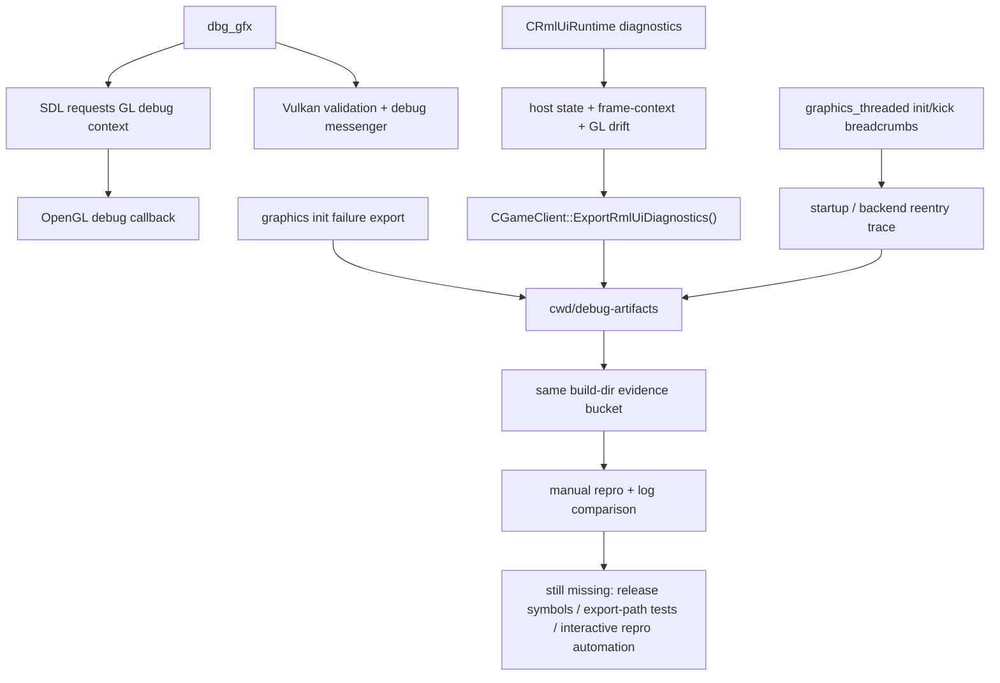

## 问题与范围

问题：当前仓库里，RmlUI / 图形后端的调试链路到底已经补到什么程度，哪些旧判断已经过时，这次改完之后还差什么才算真正闭环。

范围：只记录当前代码和本次验证已经证明的事实，不讨论设置页灰层 / Esc 崩溃最终业务修复方案。

## 速答

这条链路现在已经不是“散点抓手”，而是有了一条**可持续复用的开发期诊断流水线**，但还没到“任何渲染冲突都能自动符号化定位”的程度。

这次确认并补齐后的当前状态是：

1. **图形后端层**已经同时具备 `dbg_gfx`、OpenGL debug-context 请求、OpenGL debug callback、Vulkan validation / debug messenger。
2. **runtime / 宿主层**的 `SRmlUiDiagnostics` 已经不只是 module/core/backend 状态，现在线上代码已经包含 `client_state`、`menu_page`、`settings_page`、`popup`、`active_input_module`、`gfx_backend`、`backend_frame_context_*` 和 GL drift 字段。
3. **导出层**不再只绑定 Monitoring HUD，也不该再写进全局 config 目录；当前已经改成统一落到运行构建目录的 `debug-artifacts/`，和 `graphics_init_reentry` / 启动链路日志在同一处汇合。

这意味着旧文档里三条核心结论已经过时：

- “OpenGL 没有明确请求 debug context” 已过时。
- “RmlUI diagnostics 缺少宿主状态” 已过时。
- “只有 monitoring_hud 专用 dump” 已过时。

但链路仍然没有完全闭环，主要还差三件事：

- **Release 符号化仍不完整**：`build-ninja` 没有同目录 `DDNet.pdb`，当前重入栈仍主要靠偏移和 map/旁证。
- **导出链路缺少自动化文件级验证**：现有测试能证明 `ShouldExportDiagnostics(...)` 的 gate / dedupe，但没有直接断言“文件写到了 build-dir/debug-artifacts”。
- **交互态复现仍需要人工输入**：设置页灰层 / Esc 崩溃属于真实 UI 路径，当前日志能更快收窄，但最终触发仍要人工验收。

## 关键证据

1. OpenGL 路径现在已经明确请求 debug context，不该再沿用“只有 callback、没有 debug-context 请求”的旧判断。
   - 证据：[backend_sdl.cpp:1299](C:/Users/11054/.codex/worktrees/140c/QmClient/src/engine/client/backend_sdl.cpp:1299)
   - 支撑结论：`dbg_gfx` 下 SDL context 创建阶段已经会带 `SDL_GL_CONTEXT_DEBUG_FLAG`。

2. RmlUI diagnostics 结构现在已经包含宿主状态、backend frame-context 状态和 GL drift 字段，不再只是 runtime/core/backend/resource。
   - 证据：[RmlUiRuntime.h:69](C:/Users/11054/.codex/worktrees/140c/QmClient/src/game/client/RmlUi/RmlUiRuntime.h:69)
   - 支撑结论：旧结论“缺 menu/settings/popup/input/backend state”已经过时。

3. 这些宿主字段不是只定义未使用，`PopulateRmlUiRuntimeDiagnostics(...)` 已经把 client/menu/settings/popup/input/backend/frame-context/GL state 真正回填到 diagnostics。
   - 证据：[gameclient.cpp:2865](C:/Users/11054/.codex/worktrees/140c/QmClient/src/game/client/gameclient.cpp:2865)
   - 支撑结论：现在导出的 diagnostics 已经能表达“当时处于哪个宿主页面和后端状态”。

4. RmlUI diagnostics 导出器已经是通用的 `ExportRmlUiDiagnostics(...)`，不再只绑定 Monitoring HUD。
   - 证据：[gameclient.cpp:2464](C:/Users/11054/.codex/worktrees/140c/QmClient/src/game/client/gameclient.cpp:2464), [gameclient.cpp:2981](C:/Users/11054/.codex/worktrees/140c/QmClient/src/game/client/gameclient.cpp:2981)
   - 支撑结论：旧结论“只有 monitoring_hud 专用 dump”已经过时。

5. 本次把 RmlUI diagnostics export 的落盘目录改到了 `cwd/debug-artifacts/`，并把 `working_directory` 一起写进文件内容。
   - 证据：[gameclient.cpp:344](C:/Users/11054/.codex/worktrees/140c/QmClient/src/game/client/gameclient.cpp:344), [gameclient.cpp:2985](C:/Users/11054/.codex/worktrees/140c/QmClient/src/game/client/gameclient.cpp:2985), [gameclient.cpp:3009](C:/Users/11054/.codex/worktrees/140c/QmClient/src/game/client/gameclient.cpp:3009)
   - 支撑结论：开发期专项诊断已经与构建目录绑定，而不是继续散落到全局 config 路径。

6. graphics init failure export 现在也和 RmlUI diagnostics 一样进入 `debug-artifacts/`，不再默认丢进 `TYPE_SAVE/dumps`。
   - 证据：[client.cpp:110](C:/Users/11054/.codex/worktrees/140c/QmClient/src/engine/client/client.cpp:110), [client.cpp:3489](C:/Users/11054/.codex/worktrees/140c/QmClient/src/engine/client/client.cpp:3489)
   - 支撑结论：图形初始化失败和 RmlUI surface 失败已经进入同一证据桶，便于同目录对比。

7. `graphics_threaded` 侧已经有启动链路 breadcrumbs，能把 `Init()` 重入和 command-buffer 边界单独拆开。
   - 证据：[graphics_threaded.cpp:3128](C:/Users/11054/.codex/worktrees/140c/QmClient/src/engine/client/graphics_threaded.cpp:3128), [graphics_threaded.cpp:988](C:/Users/11054/.codex/worktrees/140c/QmClient/src/engine/client/graphics_threaded.cpp:988)
   - 支撑结论：当前不再只能靠“黑屏/灰屏体感”猜启动链路，已经能区分 init/kick/frame-context 这些阶段。

8. backend frame-context 错误串这次也补成了结构化信息，至少带 `op/backend/window/context/sdl_error`，不再只有裸 `SDL_GetError()`。
   - 证据：[backend_sdl.cpp:1042](C:/Users/11054/.codex/worktrees/140c/QmClient/src/engine/client/backend_sdl.cpp:1042)
   - 支撑结论：`wglMakeCurrent` 类问题的日志可读性已经比之前高一档。

9. runtime 侧的 diagnostics export gate / dedupe 仍然有测试托底，没有因为这轮补链路而回退。
   - 证据：[rmlui_runtime_test.cpp:320](C:/Users/11054/.codex/worktrees/140c/QmClient/src/test/rmlui_runtime_test.cpp:320), [rmlui_runtime_test.cpp:361](C:/Users/11054/.codex/worktrees/140c/QmClient/src/test/rmlui_runtime_test.cpp:361)
   - 支撑结论：这次改的是导出路径和证据密度，不是把 dedupe 机制拆掉重来。

10. 从当前 build 目录直接运行客户端，stdout/stderr 与构建目录 `debug-artifacts/` 的共址关系已经再次验证。
   - 证据：[qmclient-postdiag-2026-05-09_19-46-33.stdout.log](C:/Users/11054/.codex/worktrees/140c/QmClient/build-ninja/debug-artifacts/qmclient-postdiag-2026-05-09_19-46-33.stdout.log)
   - 支撑结论：开发期日志和专项诊断确实在同一个 build-dir 证据空间里，不是停留在代码意图层。

## 细节展开

### 1. 当前链路已经形成“同目录证据桶”

这次最有价值的不是单个日志点，而是路径统一：

- `graphics_init_reentry_*.txt`
- `qmclient-*.stdout.log`
- 未来的 `rmlui_*.txt`
- graphics init failure report

都应该落到运行目录下的 `debug-artifacts/`。这样排查时不再需要一半去 `AppData`，一半去 build 目录找线索。

### 2. 旧 explore 的三条主结论已经失效

这份文档前一个版本有三个关键判断，现在都不能继续当基线：

- OpenGL 并非“没请求 debug context”
- diagnostics 并非“没有宿主态字段”
- exporter 并非“只有 monitoring_hud 专用导出”

所以以后再从这条线继续，不应该从“先补 host state / exporter 泛化 / debug-context 请求”重新起步，而应该直接从更后面的缺口起步。

### 3. 当前剩余缺口已经收窄成“符号化、自动化、交互复现”

现在最现实的三个短板是：

- **符号化**：`build-debug` 有 `DDNet.pdb`，但用户平时复现主要在 `build-ninja` / Release；当前 Release 栈仍偏向 `offset + map + 旁证`。
- **自动化**：现有 `rmlui_runtime_test.cpp` 主要验证 gate/dedupe 和 runtime contract，没有直接验证 build-dir 文件产物。
- **交互复现**：设置页灰层 / Esc 崩溃需要真实菜单路径和用户输入，测试很难完全替代人工验收。

### 4. “完整链路”现在更适合继续补在哪

如果后面继续补，不应该再先补更多散日志，而应该优先补：

1. `debug-artifacts` exporter 的文件级测试或最小 smoke 验证。
2. Release 可用的符号化方案，至少让 `graphics_init_reentry` 栈不只剩偏移。
3. 与 `Esc` / popup / menu page 相关的人工复现模板，让日志字段和人工操作步骤一一对齐。

## 未决问题

1. 当前 `build-ninja` / Release 下没有同目录 `DDNet.pdb`，这会继续限制重入栈的自动符号化深度。
2. 这次虽然统一了导出路径，但还没有一条自动测试直接断言“文件写到了 build-dir/debug-artifacts”。
3. 设置页灰层 / Esc 崩溃的最终业务根因还需要基于当前 build 的人工交互复现继续收窄。

## 后续建议

如果下一步继续走这条线，最值得开的不是新的广义调试探索，而是针对 `debug-artifacts` exporter 的一条 feature / issue：把“路径正确、字段齐全、触发去重”变成可重复验证的契约。

## 相关文档

- [2026-05-08-explore-rmlui-startup-render-stall-chain.md](C:/Users/11054/.codex/worktrees/140c/QmClient/.codestable/compound/2026-05-08-explore-rmlui-startup-render-stall-chain.md)
- [2026-05-07-learn-rmlui-gl-context-prototype.md](C:/Users/11054/.codex/worktrees/140c/QmClient/.codestable/compound/2026-05-07-learn-rmlui-gl-context-prototype.md)
- [rmlui-settings-gray-overlay-esc-crash-analysis.md](C:/Users/11054/.codex/worktrees/140c/QmClient/.codestable/issues/2026-05-09-rmlui-settings-gray-overlay-esc-crash/rmlui-settings-gray-overlay-esc-crash-analysis.md)
