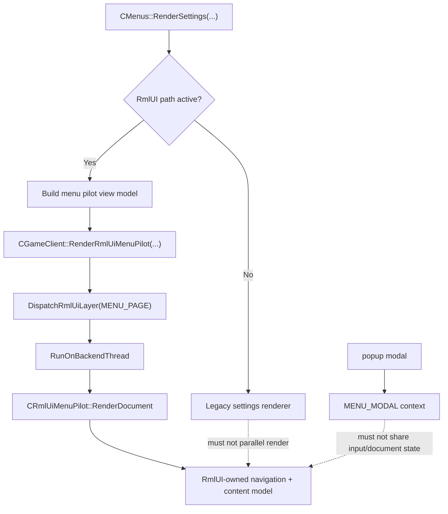

# RmlUI Settings Host Current-State Explore

## 速答

当前这个 `rmlUI` 分支里，设置页已经不该再被理解成“旧设置页和 RmlUI 设置页长期并排共存”的状态。**真实的 current state 是：`CMenus::RenderSettings(...)` 仍然是宿主入口，但 active RmlUI settings path 被定义成单宿主路径，同一帧不再允许 legacy settings renderer 与 RmlUI settings host 并排渲染。**

这意味着你现在遇到的“vibe coding 一做就崩 / 错位 / 半旧半新”问题，核心已经不是某个 `.rml` 文件写歪了，而是下面三条边界必须同时成立：

1. `CMenus::RenderSettings(...)` 只能在 `legacy path` 和 `RmlUI path` 之间二选一，不能双跑。
2. `menu_pilot` / settings host 的真正 owner 是 `MENU_PAGE` context 和 backend-thread render path，不是旧的 settings content island。
3. 当前 RmlUI settings path 虽然已经不再并排复用旧 `RenderSettingsContent(...)`，但也还没有进入“原生设置控件全量接管”的成熟阶段；它现在承载的是一个 **RmlUI-owned navigation + content model**，而不是完整的 legacy semantics replacement。

如果继续按“先把壳叠上去，旧内容顺手再留着跑”这类 vibe coding 方式推进，最容易制造的就是三类故障：

- 同帧双 owner：旧 settings 壳和新 host 都在改同一页状态或抢输入。
- context 语义串线：page / modal / popup 共用或误用同一 `Rml::Context`。
- 视觉/布局错位：RmlUI 页面的 slot、viewport、UI 坐标换算和旧 `CUIRect` 语义混在一起。

## 关键证据

1. `RenderSettings(...)` 在当前实现里已经把“RmlUI 成功渲染则直接 return”写成主逻辑，不再继续跑 legacy settings 壳。
   - 证据：`src/game/client/components/menus_settings.cpp:3333-3346`
   - 支撑结论：active RmlUI settings path 与 legacy settings renderer 不是长期并排关系，而是二选一宿主关系。

2. 当前 fallback banner 明确把“RmlUI fallback active: this page is still using the legacy settings renderer.” 作为 fallback 文案输出，说明 legacy renderer 被定义成 fallback path，而不是 active sibling renderer。
   - 证据：`src/game/client/components/menus_settings.cpp:3423-3470`
   - 支撑结论：代码作者已经把 legacy settings path 的语义从“并排内容岛”收紧成“RmlUI 失败时回退的整页 renderer”。

3. 仓库里的长期 contract 文档已经把设置页规则写死为：`RenderSettings(...)` 是 host seam，不是 active content owner；active RmlUI settings path 不允许 parallel render legacy settings UI。
   - 证据：`.codestable/reference/rmlui-settings-host-contract.md:13-20`
   - 支撑结论：这不是某个临时实现细节，而是已经上升为长期 host 约束。

4. `HasActiveRmlUiMenuPilot()` 只在全局开关、模块开关、页面状态、popup 状态和 dismissed 状态全部满足时才认为 settings host 激活。
   - 证据：`src/game/client/components/menus.cpp:1824-1838`, `src/game/client/RmlUi/RmlUiMenuPilot.cpp:55-67`
   - 支撑结论：settings host 是否激活不是“进入设置页就自动叠一层 RmlUI”，而是一个受宿主条件严格约束的独立 page surface。

5. `RenderRmlUiMenuPilot(...)` 现在通过 runtime layer dispatch 和 `Graphics()->RunOnBackendThread(...)` 走 `MENU_PAGE` backend-thread render path，而不是在 `RenderSettings(...)` 里直接主线程画文档。
   - 证据：`src/game/client/gameclient.cpp:2973-3013`, `src/game/client/gameclient.cpp:3025-3060`, `src/game/client/gameclient.cpp:3276-3303`
   - 支撑结论：当前设置页主难点已经落在 render ownership / context ownership，而不是普通 UI 组件拼装。

6. `CRmlUiSettingsPageAdapter` 当前构建的是 route/domain/section/action 这种内容模型，并显式写入 “Parallel legacy render: Disabled on the active RmlUI path”。
   - 证据：`src/game/client/RmlUi/RmlUiSettingsPageAdapter.cpp:114-159`
   - 支撑结论：RmlUI settings path 现在不是“旧设置控件照画，只换个外框”，而是开始用 RmlUI 自己的数据模型承载 active 内容。

7. 现有测试也已经把这个方向固定下来：settings page 与 modal 使用独立 context slot，settings adapter 将历史 settings route 提升为 RmlUI content model，而不是回落到 legacy shell 嵌入。
   - 证据：`src/test/rmlui_menu_pilot_test.cpp:173-177`, `src/test/rmlui_settings_page_adapter_test.cpp:5-37`
   - 支撑结论：page/modal 分 context、host owns content model，这两条已经不是口头设计，而是进入测试基线。

## 结论展开

### 1. 当前真正的问题是 host ownership，不是单页换皮

如果把这个分支理解成“旧设置页保留，新设置页只是多一层 RmlUI 外壳”，很容易误判问题来源。现在的真实问题是：

- 谁拥有 settings page 的 active render path？
- 谁拥有 page 级 input / hover / focus 状态？
- popup/modal 是否还在和 page 共用 context 或混用生命周期？

这些边界一旦没守住，最终表现出来才会是“崩溃、灰屏、Esc 异常、UI 错位、切页残影”。

### 2. 当前不是旧 island 并排，也不是原生设置页已完成

当前状态介于两者之间：

- **不是旧 island 并排**：active RmlUI path 已明令禁止同帧继续画 legacy settings 内容。
- **也不是完整 native settings page**：`CRmlUiSettingsPageAdapter` 还主要在承载 IA、route、summary、section/action 这种内容模型，没有把所有真实设置项控件都迁成 RmlUI 原生交互。

所以现在最准确的表述应当是：

**settings host 的 owner 边界正在收口，但 settings semantics 的 native migration 还没完成。**

### 3. “共存”这个词现在要分层说

如果还说“当前是共存”，需要明确分层：

- **系统层共存**：`legacy settings path` 仍然存在，并且仍是 fallback。
- **帧内渲染层不共存**：active RmlUI settings frame 不允许再把 legacy settings renderer 并排画出来。
- **语义迁移层半完成**：RmlUI page 已经开始持有导航和内容模型，但还没完全接管所有设置项交互语义。

这三个层面混在一起，就是 vibe coding 最容易犯错的地方。

## 后续建议

下一步最该做的不是继续“补几个样式 / 补几个按钮”，而是基于这份 current-state 继续两条线：

1. 先做一份更窄的 issue/analyze 或 explore，专门回答：当前 settings page 的 page context、modal context、popup migration、input bridge 有没有还在共享状态。
2. 真要继续实现 settings reorg，就必须坚持 host contract：任何 active RmlUI path 改动，都先问清楚它会不会把 legacy renderer、modal context 或 page input state 又拉回同帧混跑。

