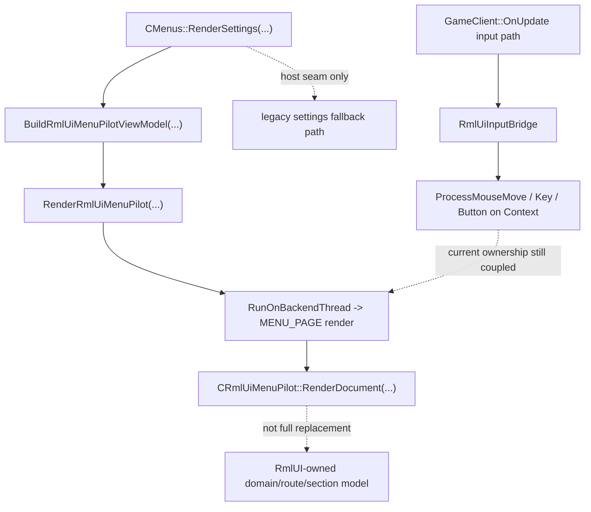

## 问题与范围

本次 explore 只回答四个 current-state 问题，不直接给修复方案：

1. 当前的 RmlUI 设置页实现是否完整，至少能否稳定显示基本框架。
2. 当前 settings page 的 RmlUI 路径是否已经与旧 UI 框架解耦。
3. 当前代码是否符合官方文档强调的集成/上下文/输入更新顺序。
4. 当前仓库内沉淀的 RmlUI reference 是否与真实代码状态存在偏移。

范围聚焦于：

- settings host seam
- `menu_pilot` / settings adapter / runtime / input bridge
- 本地 RmlUI reference
- 官方文档已沉淀到本地 reference 的契约口径

## 速答

结论先说：

1. **不完整。** 当前代码里已经有 settings page 的 RmlUI 骨架，但还不能算“稳定可用的基础框架”。更准确的说法是：**代码骨架已存在，运行闭环未完成**。
2. **没有完全解耦。** 当前只做到了“active RmlUI settings path 不再与 legacy settings 同帧并排渲染”，但它仍然深度依赖旧 `CMenus` 宿主、旧 page state 和旧菜单生命周期。
3. **不符合官方文档意义上的最佳实践。** 当前实现已经吸收了“独立 context”和“host seam 二选一”的方向，但在输入与 `Context::Update()/Render()` 的线程/时序所有权上，仍然与官方 main-loop 契约和仓库自己的生命周期约束不够对齐。
4. **本地 reference 存在偏移。** 官方文档本身没有问题；偏移发生在仓库内的 current-state/reference 沉淀，尤其是 runtime reference 对当前 `menu_pilot` / `popup_modal` / settings host 落地状态的描述已经不够准确。

可以把当前真实状态概括成一句话：

**settings RmlUI 现在是“旧 `CMenus` 宿主内的单宿主 page-surface 试点”，不是“已经完成分离的新设置系统”。**

## 关键证据

### 1. 当前 settings page 的 active RmlUI path 已经是单宿主路径，不再设计成和 legacy settings 并排渲染

- `src/game/client/components/menus_settings.cpp:3340` 已把 settings host 的成功条件写成 `GameClient()->RenderRmlUiMenuPilot(...)` 成功即直接走 `return`。
- `src/game/client/components/menus_settings.cpp:3476` 只有在 `ActiveRmlUiSettingsHostRendered` 为假时才继续走 legacy settings content。
- `src/game/client/RmlUi/RmlUiSettingsPageAdapter.cpp:155` 明确把当前内容模型写成 `Parallel legacy render = Disabled on the active RmlUI path`。
- ` .codestable/reference/rmlui-settings-host-contract.md:27` 也把这条规则写成长期契约：`Active RmlUI settings path must not parallel render the legacy settings UI.`

支撑结论：当前实现已经不是“旧 settings 和 RmlUI settings 长期并排共存”的设计。

### 2. 但它仍然不是完整替代，只是挂在旧 `CMenus` 宿主里的 page-surface 试点

- `src/game/client/components/menus.cpp:1824` 的 `HasActiveRmlUiMenuPilot()` 仍由旧菜单状态、page 状态、popup 状态和 dismissed 状态共同决定。
- `src/game/client/components/menus.cpp:1833` 的 `BuildRmlUiMenuPilotViewModel(...)` 仍然由 `CMenus` 负责构建并回写到旧菜单宿主。
- `src/game/client/components/menus.cpp:1874` 仍然把当前页面内容建立在 `g_Config.m_UiSettingsPage`、`m_QmClientSettingsTab`、`m_TClientSettingsTab` 这些 legacy route/state 上。
- `src/game/client/components/menus.cpp:1876` 的 subtitle 也直接声明：`This page is now owned by the RmlUI settings host. Legacy settings content no longer renders in parallel here.` 这里强调的是 host ownership，不是语义完全替代。

支撑结论：当前 page-surface 已单宿主，但 settings 语义仍然依附旧宿主边界和旧页面状态。

### 3. 当前代码已经把 settings page 和 modal 的 context 边界收口成独立契约

- `.codestable/reference/rmlui-settings-host-contract.md:29-30` 明确规定 settings modal 使用独立 modal context，且 page/modal 不共享 hover/focus/document state。
- `src/game/client/gameclient.cpp:3305` 说明 `menu_pilot` 渲染时使用的是 `ERmlUiContextSlot::MENU_PAGE`。
- `src/game/client/gameclient.cpp:3370` 说明 popup modal 渲染时使用的是 `ERmlUiContextSlot::MENU_MODAL`。
- `src/game/client/RmlUi/RmlUiCore.cpp:40-48` 当前已经真实创建了 `HUD`、`MENU_PAGE`、`MENU_MODAL` 三个 context。

支撑结论：page/modal 分 context 这件事已经不是口头 design，而是 current code + contract 的共同事实。

### 4. 官方契约和本地沉淀 reference 都强调：输入应在 `Context::Update()` 前提交，且独立 surface 应拥有清晰 context/lifecycle 边界

- `.codestable/reference/rmlui-runtime-api-reference.md:44-55` 明确写了官方 main-loop 顺序，并把 `Submit input before Context::Update()`、menu/page/modal 需要独立 input/focus/lifecycle 时应使用 separate contexts 写成 QmClient implication。
- `.codestable/reference/rmlui-runtime-api-reference.md:71-72` 进一步写明：一个 `Rml::Context` 渲染的是该 context 下所有可见 document，full-screen replacement surface 应拥有 dedicated context。
- `.codestable/reference/rmlui-system-input-reference.md:80-81` 明确写明：输入应在 `Context::Update()` 之前提交，`Context::Update()` 后不应继续改 element state。

支撑结论：无论是官方文档还是本地 reference，都已经把 input/update/render 的顺序和 context 独立性讲清楚了。

### 5. 当前代码的 input ownership 与 render ownership 仍然分裂在主线程和 backend 线程两侧

- `src/game/client/gameclient.cpp:1384` 每帧都会把 active context 设置到 `m_RmlUiInputBridge`。
- `src/game/client/gameclient.cpp:1412` 鼠标移动会在主线程通过 `m_RmlUiInputBridge.DispatchCursorMove(...)` 直接投递到当前 context。
- `src/game/client/gameclient.cpp:1492` 鼠标按钮事件也在主线程投递。
- `src/game/client/gameclient.cpp:1501` 键盘事件也在主线程投递。
- `src/game/client/gameclient.cpp:497` 最终实际调用的是 `pContext->ProcessMouseMove(...)`。
- 与此同时，`src/game/client/gameclient.cpp:3049` 把 `menu_pilot` 的 document render 放进 `Graphics()->RunOnBackendThread(...)`。
- `src/game/client/gameclient.cpp:3305-3307` 又在 backend 线程里执行 `SetViewport(MENU_PAGE)` 和 `m_RmlUiMenuPilot.RenderDocument(...)`，而 `RenderDocument(...)` 内部会进一步 `Update()` 和 `Render()`。

支撑结论：当前 settings host 的输入提交和 `Context::Update()/Render()` 并不在同一 owner 路径里，这就是“当前代码不够符合官方最佳实践”的最硬证据。

### 6. 本地 reference 已经开始和真实 current-state 出现偏移

- `.codestable/reference/rmlui-runtime-api-reference.md:21-27` 虽然正确声明了“分 upstream facts / current code / future contract”，但它自己也提醒“不要把 contract 当成已实现事实”。
- `.codestable/reference/rmlui-runtime-api-reference.md:110-130` 的 current code surface 仍然主要围绕 `CRmlUiBackend` / `CRmlUiCore` / `CRmlUiMonitoringHud` 展开。
- `.codestable/reference/rmlui-runtime-api-reference.md:217` 仍写着 `The first implementation only needs GAME_HUD for Monitoring HUD.`，这已经落后于当前代码里真实存在的 `MENU_PAGE` `menu_pilot` 和 `MENU_MODAL` `popup_modal`。
- 相比之下，`.codestable/compound/2026-05-12-explore-rmlui-settings-host-current-state.md:61-65` 与 `.codestable/reference/rmlui-settings-host-contract.md:27-30` 更接近今天这条 settings host 的真实状态。

支撑结论：偏移不是官方文档错了，而是仓库内 reference 的 current-state 章节有历史残留。

## 细节展开

### 1. “完整吗”应该怎么表述才不自欺欺人

如果只问“代码里有没有基本框架”，答案是有：

- 有 page host seam
- 有 `menu_pilot.rml` / `menu_pilot.rcss`
- 有 domain/route/section/action 内容模型
- 有 `MENU_PAGE` context

但如果问“当前能不能把这个当成一个稳定可用的 settings 基础框架”，答案不能给绿灯。用户当前回报是黑屏、鼠标卡顿、点击无响应，这已经说明运行闭环没有完成。  
因此最准确的 current-state 口径是：

**代码骨架已存在，但 runtime 可用性还没有完成到能通过 settings 试点验收的程度。**

### 2. “解耦”要分三层说

当前最容易混淆的是“解耦”到底在说什么：

- **渲染层**：已经基本解耦。active path 不再允许 legacy settings 同帧并排渲染。
- **宿主层**：没有解耦。`CMenus::RenderSettings(...)` 仍是唯一 host seam，page state 仍旧来自旧菜单体系。
- **语义层**：没有解耦。当前 RmlUI 还没接管真实 settings 控件语义，只是先接管了导航壳和内容模型。

所以如果问“settings page 的 RmlUI 是否已经和旧 UI 框架解耦”，标准回答应该是：

**没有完全解耦，只是先把 active render ownership 从 legacy 并排渲染收口成单宿主 page-surface。**

### 3. 为什么说它不够符合官方最佳实践

这次不能再把“最佳实践”狭义理解成“有没有独立 context”。  
当前实现已经知道 page/modal 要拆 context，这一点方向是对的。真正的问题在于：

- 输入事件在主线程直接打到 `Rml::Context`
- `Context::Update()/Render()` 却放在 backend 线程的 render callback 里

这会让 current-state 难以满足“单 owner 的 context lifecycle”要求，也不符合仓库自己在 render-lifecycle 决策文档里强调的 context/thread ownership 收口原则。  
所以现在不是“完全错路”，而是：

**架构方向对了一半，但 ownership 还没收干净。**

### 4. reference 偏移具体偏在哪里

不是所有 reference 都偏。当前更接近 repo truth 的是：

- `rmlui-settings-host-contract.md`
- `2026-05-12-explore-rmlui-settings-host-current-state.md`

偏移更明显的是：

- `rmlui-runtime-api-reference.md` 的 current-state / contract 混排阅读体验
- 其中仍把 runtime 叙述得太接近早期 Monitoring HUD-only 阶段

所以后续如果要“按这个走”，reference 线不该继续泛泛补文档，而该做两件事：

1. 先把 settings/menu runtime 的 current-state 写准。
2. 再把 contract 和 current code 的边界分得更硬。

## 未决问题

1. 当前黑屏路径还缺一份**带新诊断字段**的 fresh `rmlui_menu_pilot_*.txt` artifact，因此“黑屏到底是裁剪/几何/内容模型为空/线程状态污染”还没有最终证据闭环。
2. 当前是否存在“主线程输入提交 + backend 线程 update/render”直接导致的状态污染，还需要在 issue analyze 阶段继续顺调用链核实。
3. `rmlui-runtime-api-reference.md` 的偏移应当通过“更新已有文档”修正，还是再补一份 current-state explore 后再回写，需要看下一步是先修主问题还是先清文档口径。

## 后续建议

最合适的下一步是先把这份 explore 作为输入，继续走 `rmlui-settings-black-screen-input-stall` 的 issue analyze，把 settings host 的 input/context/render ownership 收敛清楚，再回头修 reference 口径。

## 相关文档

- [RmlUI Settings Host Current-State Explore](/C:/Users/11054/.codex/worktrees/140c/QmClient/.codestable/compound/2026-05-12-explore-rmlui-settings-host-current-state.md)
- [RmlUI Settings Host Contract](/C:/Users/11054/.codex/worktrees/140c/QmClient/.codestable/reference/rmlui-settings-host-contract.md)
- [RmlUI Runtime API Reference](/C:/Users/11054/.codex/worktrees/140c/QmClient/.codestable/reference/rmlui-runtime-api-reference.md)
- [RmlUI System and Input Reference](/C:/Users/11054/.codex/worktrees/140c/QmClient/.codestable/reference/rmlui-system-input-reference.md)
- [RmlUI Settings Black Screen Input Stall Report](/C:/Users/11054/.codex/worktrees/140c/QmClient/.codestable/issues/2026-05-12-rmlui-settings-black-screen-input-stall/rmlui-settings-black-screen-input-stall-report.md)
- [RmlUI Reference Current State Drift Report](/C:/Users/11054/.codex/worktrees/140c/QmClient/.codestable/issues/2026-05-12-rmlui-reference-current-state-drift/rmlui-reference-current-state-drift-report.md)
