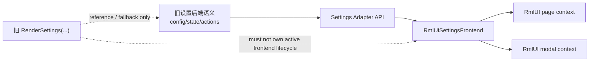

# RmlUI 独立 1:1 设置前端可行性 Explore

## 速答

**可行，而且比继续在当前 `RenderSettings(...)` 混合宿主里修补更稳。**

但“独立”要收紧成一个仓库内的工程定义：

- **应该回退的**：把当前直接侵入旧设置页宿主、试图让 active RmlUI path 接管 `RenderSettings(...)` 的那部分 settings 混合实现回退。
- **应该保留的**：RmlUI runtime / context / layer / input bridge / 文档加载这类通用基础设施，以及已经证明合理的 page/modal context 分离约束。
- **应该新做的**：一个 `RmlUiSettingsFrontend`，它自己持有页面树、输入、导航和布局；旧 `menus_settings*.cpp` 只保留为配置与业务语义来源，不再参与新前端的逐帧内容生命周期。

核心判断不是“RmlUI 能不能做设置页”，而是“当前仓库应不应该继续把设置页迁移建立在旧 `CMenus` 内容宿主之上”。基于当前代码，答案是：**不应该。**

原因有三条：

1. 现有 active 路径已经把 `RenderSettings(...)` 推成了新旧二选一宿主，这条路一旦继续深入，就会把 settings 特有语义、旧状态机、RmlUI context/lifecycle 三者绑死在一起。
2. 当前 `CRmlUiSettingsPageAdapter` 只是在做“路由和内容模型提升”，还没有进入真实 1:1 设置控件替换；继续沿这条线扩展，会先扩大宿主耦合，再得到控件。
3. 官方 RmlUi 本来就更适合长生命周期、文档式、表单式 UI。设置页更像“独立前端”，而不是“旧页里嵌一个新壳”。

## 关键证据

1. 当前 `RenderSettings(...)` 在 active RmlUI path 成功时会直接 `return`，说明现有实现已经不是“旧设置页里插一个 RmlUI 小岛”，而是把 settings 宿主本身拉成了新旧二选一。
   - 证据：`src/game/client/components/menus_settings.cpp:3387-3405`
   - 支撑结论：继续沿当前路径推进，耦合点会集中在旧 settings host，而不是自然走向独立前端。

2. 仓库内长期 contract 已经明确：`CMenus::RenderSettings(...)` 是 host seam，不是 active settings content owner；active RmlUI settings path 不允许并排渲染 legacy settings UI。
   - 证据：`.codestable/reference/rmlui-settings-host-contract.md:24-32`
   - 支撑结论：现有方向本身就在逼近“单宿主前端”，不是长期双宿主共存。

3. 现有 `BuildRmlUiMenuPilotViewModel(...)` 仍然挂在 `CMenus` 上，并且通过静态 `CRmlUiSettingsPageAdapter` 把旧 settings route 提升成 content model。
   - 证据：`src/game/client/components/menus.cpp:1863-1872`
   - 支撑结论：当前页面模型仍然依赖旧菜单状态机生成，尚未切断对 legacy host 的结构依赖。

4. `CRmlUiSettingsPageAdapter` 输出的还是“Current route / Content groups / Host contract”这类宿主说明数据，不是真实 1:1 设置控件模型。
   - 证据：`src/game/client/RmlUi/RmlUiSettingsPageAdapter.cpp:124-158`
   - 支撑结论：当前实现更接近 IA / route migration spike，不是可继续线性扩展成完整设置前端的控件层。

5. 当前 RmlUI 核心已经具备多 context 基础，并且明确存在 `MENU_PAGE` / `MENU_MODAL` 两个上下文槽。
   - 证据：`src/game/client/RmlUi/RmlUiCore.cpp:46-65`
   - 支撑结论：如果改为独立 settings frontend，底层 runtime/context 基础并不需要推翻，已有部分可以复用。

6. 仓库内 runtime 参考已经记录了官方集成顺序和 context 语义：输入在 `Update()` 前提交，独立输入/焦点/生命周期的 surface 应使用独立 context。
   - 证据：`.codestable/reference/rmlui-runtime-api-reference.md:33-72`
   - 支撑结论：独立 settings 前端符合官方模型，反而比“同宿主内半替换”更顺着 RmlUi 的原生使用方式。

7. 现有 adapter 测试验证的是“旧 settings route 被提升进 content model”，不是“真实控件 1:1 替换已经具备骨架”。
   - 证据：`src/test/rmlui_settings_page_adapter_test.cpp:5-48`
   - 支撑结论：当前测试基线支持的是导航/模型迁移，不足以证明继续在这条线上补控件就是最优路径。

## 结论展开

### 1. “Git 还原原来的 cpp”是合理的，但不能整仓一刀切

如果用户的目标是停止在 settings 混合宿主里继续下陷，那么**回退 settings 相关混合改动是合理的**。但不应理解成：

- 回退全部 RmlUI 代码；
- 回退 runtime/context/input bridge；
- 回退 page/modal context 这类已经沉淀下来的合理边界。

更准确的回退边界应是：

- 回退 `menus_settings.cpp`、`menus.cpp`、`RmlUiMenuPilot`、`RmlUiSettingsPageAdapter` 这类“把 active settings path 嵌回旧菜单宿主”的设置迁移实现。
- 评估保留 `RmlUiCore`、`RmlUiRuntime`、`RmlUiInputBridge`、`RmlUiPopupModal`、layer/runtime contract、文档资源目录等基础设施。

也就是说，**回退的是 settings 集成策略，不是 RmlUI 这套基础设施本身。**

### 2. 更稳的方向是“旧后端保留，新前端重建”

如果目标是 1:1 还原旧设置体验，最稳的拆法不是把旧 `RenderSettings...` 一页页挪进 `menu_pilot`，而是拆成两层：

- **后端语义层**
  - 读取当前配置值
  - 枚举候选项
  - 执行按钮/切换/滑块动作
  - 复用已有资源页、声音页、图像页的业务逻辑

- **前端文档层**
  - RML/RCSS 页面结构
  - 导航、焦点、布局
  - 表单控件、列表、弹窗
  - 输入与页面状态

这条线的本质是：**把 settings 当成“配置前端”重建，而不是当成“legacy page renderer 改皮”。**

### 3. 当前最不该继续复用的是旧 settings 的逐帧内容生命周期

当前实现把 `BuildRmlUiMenuPilotViewModel(...)`、`HasActiveRmlUiMenuPilot()`、`RenderSettings(...)` 绑在一起，本质上仍然让旧菜单状态机拥有新前端的页面激活条件。

如果继续沿这个方向做，会持续放大这些耦合：

- 页面激活条件耦合在 `CMenus`
- 输入焦点耦合在菜单状态
- modal/page 路由耦合在旧页面切换
- 设置页内容模型耦合在旧 tab/page 枚举

对 1:1 独立前端来说，最该切断的就是这一层。

### 4. 哪些东西值得复用

从当前仓库看，下面这些更像“可复用基础设施”，不必跟着 settings 混合实现一起丢掉：

- `CRmlUiCore` 的 context 初始化与 document 加载能力
- `MENU_PAGE` / `MENU_MODAL` 的上下文分离
- `RmlUiInputBridge`
- runtime layer/result 约定
- `data/qmclient/rmlui/` 资源目录与热重载工作流
- popup/modal 分 context 的原则

这也意味着新方案不是从零开始，而是**保留 RmlUI runtime shell，重写 settings frontend integration。**

## 可行性判断

### 技术可行性

**高。**

原因：

- 官方 RmlUi 就是文档式 UI，支持表单、事件、样式、数据绑定、调试器。
- 当前仓库已有 context/runtime/document 基础。
- 设置页属于长生命周期菜单 UI，比 HUD/监控 overlay 更适合 retained-mode 文档模型。

### 迁移成本

**中到高。**

主要成本不在 RML/RCSS，而在：

- 从旧 `menus_settings*.cpp` 中抽出“可供前端调用的语义接口”
- 梳理哪些页面是纯表单，哪些页面夹带重型 legacy 组件
- 处理资源页、编辑器页、复杂列表等特殊页面

### 风险

**比继续修当前混合宿主更低，但不是零。**

主要风险：

- 如果后端语义接口抽不干净，新前端还是会被旧状态机拖住
- 如果一开始追求“全量一次替换”，范围会过大
- 复杂页面可能需要 staged migration，而不是首轮就 1:1 全部原生控件化

## 更好的做法

### 方案 A：继续当前混合宿主上迭代

可做，但不推荐。

原因：

- 继续把 settings 前端生命周期绑在 `CMenus::RenderSettings(...)`
- 新旧状态机耦合会继续增长
- 当前崩溃/卡死/输入异常说明这条路径的调试成本已经过高

### 方案 B：同仓库内重建独立 settings frontend

推荐。

方式：

- 保留 RmlUI runtime 基础设施
- 回退当前 settings 混合集成
- 新增 `RmlUiSettingsFrontend`
- 定义 settings adapter/service 边界
- 让旧 settings 只提供数据与动作，不再拥有 active 页面宿主

### 方案 C：仓库外单独做 demo 再回灌

不推荐作为主线。

原因：

- demo 很容易脱离真实配置、真实页面语义、真实输入链
- 最终还是要重新接回当前仓库的 runtime、config、action、resource pipeline
- 它能验证样式，不能真正验证集成

## 建议的阶段拆法

1. `rollback-boundary`
   - 明确哪些 settings 混合集成代码回退到 Git
   - 明确保留哪些 RmlUI 基础设施

2. `settings-backend-surface`
   - 梳理旧设置页的只读数据、枚举接口、写入动作、重启需求、弹窗需求
   - 产出“前端可调用语义面”

3. `settings-frontend-shell`
   - 建立独立 `RmlUiSettingsFrontend`
   - 只做 page/modal/document/context/navigation 骨架

4. `first-domain-1to1`
   - 先选一组最规整的页面做真实 1:1
   - 优先语言、通用、图像、声音这类表单页

5. `heavy-page-strategy`
   - 单独处理资源页、编辑器页、复杂列表页
   - 决定哪些首轮仍通过 adapter 桥接，哪些必须原生重做

## 后续建议

如果要按这个方向推进，下一步不该直接开写，而应该先起一份 roadmap/design，回答三件事：

1. 哪些现有 settings 混合集成代码准备回退。
2. 新 `RmlUiSettingsFrontend` 和旧 settings 语义层的接口边界是什么。
3. 1:1 首批页面按什么顺序落地，哪些复杂页延后。

