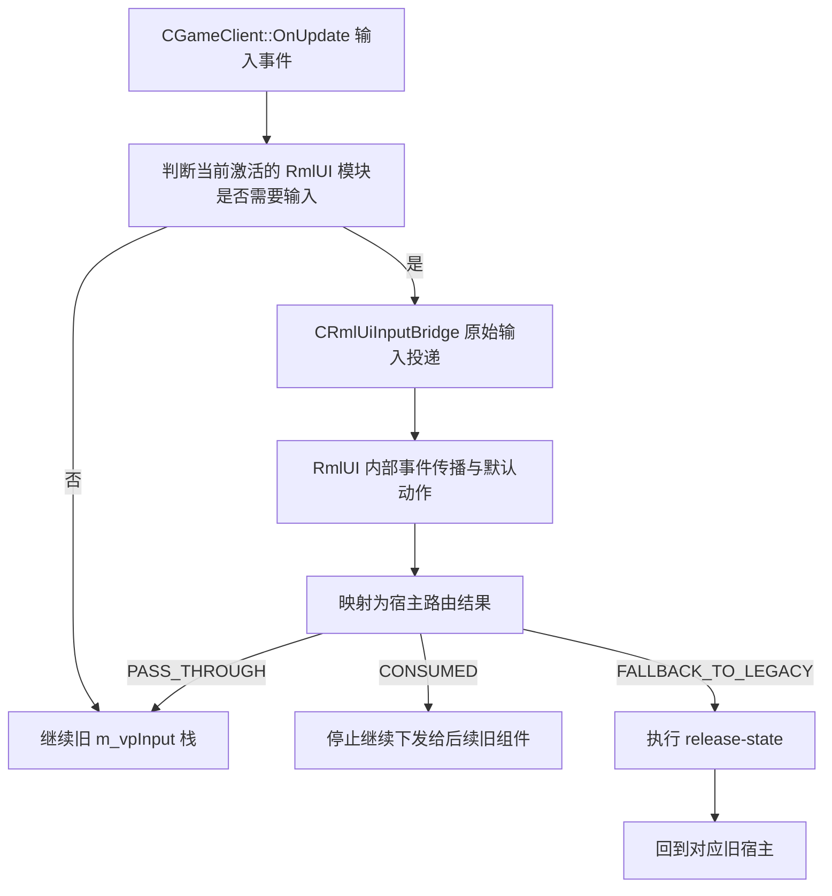

# RmlUI 输入桥设计

## 0. 术语

| 术语 | 含义 |
|---|---|
| 输入桥 | 把鼠标、键盘、文本、取消、焦点等事件送进 RmlUI，再把宿主可执行的路由结果回传给旧输入栈的协议层。 |
| 原始输入投递 | 宿主调用 `ProcessMouseMove`、`ProcessMouseButtonDown/Up`、`ProcessMouseWheel`、`ProcessKeyDown/Up`、`ProcessTextInput` 等 API，把事件送到当前激活的 RmlUI context。 |
| 事件传播 | RmlUI 在收到原始输入之后，内部发生的 capture / target / bubble 和默认动作流程。 |
| 输入消费结果 | 输入桥结合原始投递结果、事件传播结果和界面策略后，返回给宿主的最终路由结果；不是某个上游返回值的原样透传。 |
| cancel action | 统一的关闭 / 返回 / Escape / back-button 动作。 |
| release-state | 界面关闭、失败、失焦或回退时，对按下、悬停、捕获、文本输入 context 等残留状态做统一释放。 |
| 文本输入作用域 | `Rml::TextInputHandler` 采用全局安装还是按 context 安装，以及 IME / 组合态生命周期由哪一侧负责。 |

## 1. 决策与约束

### 1.1 目标

为交互式 RmlUI 界面提供一套统一输入协议，让菜单页、模态弹窗、轮盘浮层和编辑态复用同一套路由、取消和状态释放规则，而不是继续在 `CMenus`、`CPieMenu`、`CBindWheel`、`CHudEditor` 里各写一套输入语义。

### 1.2 当前放置位置

这次 feature 在项目结构里的落点不是新的 UI 宿主，而是：

- **输入宿主入口**仍在 `CGameClient::OnUpdate()` 的 `m_vpInput` 栈。
- **RmlUI 参与条件**仍由 `CRmlUiRuntime` 的模块描述符决定，只有 `m_RequiresInput=true` 的模块才进入输入桥。
- **旧路径回退执行方** 仍保留在各自旧宿主，不把回退越权塞进 runtime。

也就是说，这条 feature 的职责是补一层“宿主输入栈 ↔ RmlUI context”的桥，不是重写输入主循环。

### 1.3 关键拍板

#### A. 路由结果保留三态

- `PASS_THROUGH`
- `CONSUMED`
- `FALLBACK_TO_LEGACY`

解释：

- `PASS_THROUGH`：宿主继续走旧输入栈。
- `CONSUMED`：宿主停止把该事件继续下发给后续旧组件。
- `FALLBACK_TO_LEGACY`：RmlUI 路径不继续处理，先执行 `release-state`，再回到旧宿主。

#### B. 文本输入作用域采用按 context 安装的 handler

这次 design 直接拍板：**RmlUI 文本输入采用按 context 安装的 `TextInputHandler`**，由当前 RmlUI runtime 持有的 context 安装，而不是走全局 `Rml::SetTextInputHandler()`。

原因：

- QmClient 现有文本输入生命周期已经由 `CUi` + `CLineInput` 持有；全局 handler 更容易把 console、chat、旧编辑框的文本输入状态混在一起。
- 上游明确允许按 context 安装 handler，而且全局 handler 的替换不会追溯影响已存在 context；对未来多 context 或调试器接入不友好。
- 这条 feature 的目标是把 RmlUI 文本输入限定在“当前激活的 RmlUI context”里，不扩散成整个客户端的全局文本输入策略。

#### C. 取消与状态释放的执行方分层明确

- **输入桥执行方**：负责统一定义何时触发 cancel / release-state。
- **界面执行方**：负责在收到 cancel 时关闭自己，或在回退时释放自己内部状态。
- **旧路径执行方**：负责在 `FALLBACK_TO_LEGACY` 后继续执行旧逻辑。

首版不允许 runtime-shell 解释事件参数，也不允许 runtime 直接接管菜单关闭逻辑。

#### D. 现有 GUI 生命周期不得被改写

这次 feature 的强约束不是“尽量兼容”，而是**不得改写现有 GUI 生命周期**。这里的 GUI 生命周期至少包括：

- `CMenus` 的激活 / 关闭 / 弹窗切换节奏
- `CPieMenu`、`CBindWheel`、`CHudEditor` 的打开 / 激活 / 关闭 / 取消节奏
- `CUi` + `CLineInput` 的文本输入激活 / 释放 / 失焦 / 销毁节奏

输入桥只能在现有宿主生命周期边界上接入和回退，不能：

- 重排这些宿主原本的激活顺序
- 改写谁负责关闭、谁负责释放状态
- 把原本属于旧宿主的生命周期执行方偷偷挪到 runtime-shell

#### E. 用户可见切换按钮必须挂到栖梦设置页

这次 feature 涉及的用户可见切换按钮，如果需要新增或调整图形化开关入口，必须挂到 **栖梦设置页**，也就是 `CMenus::RenderSettingsQmClient(...)` 这条设置路径，而不是：

- DDNet 通用设置页
- TClient 设置页
- 仅控制台命令
- 隐藏 debug 入口

命令行 / console 开关可以继续保留，但**不能作为唯一用户入口**。

#### F. 当前阶段图形化入口只保留全局 RmlUI 开关

这次 design 进一步拍板：**当前阶段的栖梦设置页只保留一个全局 RmlUI 图形化开关**，也就是 `qm_rmlui_enable`。当前 Monitoring 专属图形开关因为没有形成独立、可验收、可解释的用户语义，视为无效入口，应该从栖梦设置页删除，不再继续作为单独的 UI 开关保留。

补充约束：

- Monitoring HUD 是否走 RmlUI，可以继续保留模块级实现语义和内部开关能力，但**当前阶段不再作为独立图形化入口暴露给用户**。
- 后续如果 popup、menu-pilot、debug HUD 等模块需要独立图形化开关，必须等对应 feature-design / acceptance 证明该开关具有独立可验收意义后，才能重新进入栖梦设置页。
- 输入桥实现阶段不能一边宣称“全局开关收口”，一边继续在栖梦页保留无实际生效的 Monitoring 专属 UI 开关。

### 1.4 默认复杂度档位

本 feature 走默认档位，不引入对外 SDK、高并发或跨进程通信复杂度。风险主要集中在：

- 启动期 / 渲染期线程边界不能被输入桥误伤。
- 文本输入 / IME 生命周期不能破坏现有 `CLineInput` 语义。
- 路由结果不能和当前 `m_vpInput` 栈的短路规则冲突。
- 输入桥不能改写现有 GUI 生命周期执行方。

### 1.5 明确不做

- 不实现具体菜单页迁移。
- 不实现 popup migration。
- 不实现 click GUI / 轮盘重做。
- 不把 Monitoring HUD 改成交互式界面。
- 不改 `m_vpInput` 栈的整体宿主顺序。
- 不在 runtime-shell 里解析 RmlUI 事件参数。
- 不实现 render bridge，也不补新的 GL context 获取逻辑。
- 不触碰 gameplay、物理、预测或网络协议。
- 不把用户可见切换按钮放到非栖梦设置页。

## 2. 方案

## 2.1 名词层

### 现状

当前仓库里并不存在真正的 `RmlUiInputBridge` 实现，输入仍主要由旧组件栈持有：

- `CGameClient::OnUpdate()` 通过 `m_vpInput` 顺序分发鼠标移动、触摸和离散输入事件；`FLAG_RELEASE` 事件即使前面组件返回已处理，也会继续下发给后续组件。[src/game/client/gameclient.cpp]
- 当前输入栈顺序是：`m_KeyBinder -> m_Binds.m_SpecialBinds -> m_GameConsole -> m_Chat -> m_Scoreboard -> m_Motd -> m_Spectator -> m_BindWheel -> m_Emoticon -> m_ImportantAlert -> m_Menus -> m_PieMenu -> m_HudEditor -> m_TClient -> m_Controls -> m_TouchControls -> m_Binds`。[src/game/client/gameclient.cpp]
- `CMenus::OnInput()` 现在要么处理 `Escape`，要么在菜单激活态下吃掉整条事件；`CMenus::OnCursorMove()` 直接把鼠标增量喂给 `Ui()->OnCursorMove(...)`。[src/game/client/components/menus.cpp]
- `CBindWheel::OnCursorMove()`、`CPieMenu::OnCursorMove()` 都在激活态下直接消费鼠标移动；`OnInput()` 里又各自处理 `Escape` 和局部快捷键。[src/game/client/components/tclient/bindwheel.cpp] [src/game/client/components/pie_menu.cpp]
- 现有文本输入生命周期由 `CUi::DoEditBox()`、`CLineInput::OnActivate()`、`CLineInput::OnDeactivate()` 驱动，底层实际调用 `Input()->StartTextInput()` / `StopTextInput()`；旧文本输入执行方不是 runtime-shell。[src/game/client/ui.cpp] [src/game/client/lineinput.cpp]
- `CRmlUiRuntime` 当前只有 `monitoring_hud` 模块，而且 `ui-rmlui-current.md` 已明确记载 runtime 目前不拥有输入桥。[.codestable/architecture/ui-rmlui-current.md]

### 变化

本 feature 新增一组稳定名词，但不把它们提前写成 current architecture：

- `ERmlUiInputRoute`
  - `PASS_THROUGH`
  - `CONSUMED`
  - `FALLBACK_TO_LEGACY`
- `SRmlUiPointerState`
  - `m_X`
  - `m_Y`
  - `m_InsideViewport`
- `SRmlUiInputResult`
  - `m_MouseRoute`
  - `m_KeyboardRoute`
  - `m_TextRoute`
  - `m_RequestClose`
  - `m_RequestReleaseState`
- `CRmlUiTextInputHandler`
  - 按 context 安装
  - 持有 `OnActivate` / `OnDeactivate` / `OnDestroy` 生命周期
  - 只服务当前 runtime context
- `CRmlUiInputBridge`
  - 只负责原始输入投递、路由结果映射、取消协议和状态释放协议
  - 不解释界面内部事件参数
  - 不拥有旧路径回退绘制或菜单状态机
- `SRmlUiActiveInputModule`
  - runtime 暴露给宿主的“当前激活输入模块”快照
  - 只包含模块名、layer、是否存在 legacy fallback、fallback owner
  - 只在宿主 active predicate 明确为真时成立，不能把“toggle 已开”误当成“界面当前 active”
  - 用来替代宿主直接拿一个裸布尔再猜后续策略
- `SRmlUiHostInputDecision`
  - runtime 基于 `SRmlUiInputResult` 和当前激活模块算出的宿主执行决策
  - 只表达 `consume` / `release-state` / `legacy fallback` 三件事
  - 宿主执行这个决策，但不自己解释 RmlUI 事件参数

这组名词的关键约束是：

- 路由结果是**宿主层协议**，不是上游 `Process*` API 返回值别名。
- `TextInputHandler` 是**context 层所有权**，不是全局输入开关。
- `release-state` 是**跨界面的统一收尾动作**，不是每个菜单自己发明一套“顺手清理”。

接口示例：

```cpp
enum class ERmlUiInputRoute
{
	PASS_THROUGH,
	CONSUMED,
	FALLBACK_TO_LEGACY,
};

struct SRmlUiInputResult
{
	ERmlUiInputRoute m_MouseRoute;
	ERmlUiInputRoute m_KeyboardRoute;
	ERmlUiInputRoute m_TextRoute;
	bool m_RequestClose;
	bool m_RequestReleaseState;
};

struct SRmlUiActiveInputModule
{
	bool m_Active;
	const char *m_pModuleName;
	ERmlUiLayer m_Layer;
	bool m_HasLegacyFallback;
	const char *m_pFallbackOwner;
};

struct SRmlUiHostInputDecision
{
	bool m_ConsumeEvent;
	bool m_RequestReleaseState;
	bool m_RequestLegacyFallback;
	const char *m_pLegacyFallbackOwner;
};
```

## 2.2 编排层

### 现状

当前输入编排是单层旧组件栈短路模型：

1. `CGameClient::OnUpdate()` 从 `Input()` 读取鼠标位移。
2. `m_vpInput` 顺序调用各组件的 `OnCursorMove(...)`。
3. `Input()->ConsumeEvents(...)` 遍历离散输入事件。
4. `m_vpInput` 顺序调用各组件的 `OnInput(...)`。
5. 如果某个组件返回 `true`，且事件不是纯 `FLAG_RELEASE`，输入分发就停止。

这套编排的优点是简单，问题是：

- 它没有“RmlUI 先试投、失败再回旧路径”的中间层。
- 它把 `Escape`、文本输入、鼠标移动、轮盘快捷键等策略散在多个组件内部。
- 它没有统一的 `release-state` 执行方。

### 变化

输入桥加入后的主流程不是替换现有输入栈，而是在旧输入栈之前插入一层条件分发：



编排规则分五条：

1. **进入条件**
   - 只有 `m_RequiresInput=true` 的激活模块才进入输入桥。
   - 这里的“激活模块”必须由宿主显式声明当前 surface 真的处于 active / visible / input-capturing 状态，不能只靠 toggle 和 layer 猜。
   - 当前 `monitoring_hud` 不满足这个条件，因此首版实现接入后它仍然保持被动态。
   - 当同一帧存在多个可输入模块时，宿主 owner 优先级按 `MENU_MODAL > RADIAL_OVERLAY > EDITOR_OVERLAY > MENU_PAGE` 选择；不能退回“按注册顺序猜 owner”。

2. **原始输入投递边界**
   - 鼠标、按键、滚轮、文本输入在 `Context::Update()` 之前送入 RmlUI。
   - 输入桥只做原始提交，不在这里解析 DOM 事件参数。

3. **路由映射边界**
   - `Process*` 返回值只作为桥内信号之一。
   - 最终路由结果还要结合当前层级、是否模态、是否请求关闭、是否触发 safe-mode 回退决定。

4. **取消与状态释放边界**
   - `Escape` / back-button 统一走 `DispatchRmlUiCancelAction()`。
   - 模块关闭、失焦、回退、context 销毁都必须走 `DispatchRmlUiReleaseState()`。
   - 即使 RmlUI 已消费事件，纯 `FLAG_RELEASE` 事件仍要继续遵守旧 `m_vpInput` 广播纪律，不能因为桥接短路而吞掉 release fan-out。

5. **旧路径回退边界**
   - 输入桥可以要求回退，但不能自己替旧宿主执行旧逻辑。
   - 宿主收到 `legacy fallback owner` 后，要从对应旧宿主起点恢复分发，不能无差别退回整条旧输入链。
   - 菜单、弹窗、轮盘、editor 各自的旧路径执行方仍保留在原宿主。

### 宿主执行方 / 回退执行方 / 诊断输出方

这次 feature 直接锁死三类执行方：

| 字段 | 执行方 | 说明 |
|---|---|---|
| 宿主执行方 | `CGameClient::OnUpdate()` | 仍由输入主循环决定何时先走输入桥、何时继续旧输入栈。 |
| 回退执行方 | 各旧界面原宿主 | `CMenus` 负责菜单/弹窗，`CPieMenu` 负责 pie menu，`CBindWheel` 负责 bind wheel，`CHudEditor` 负责 editor。 |
| 诊断输出方 | `CRmlUiInputBridge` + runtime diagnostics | 输入桥产出路由 / 关闭 / `release-state` 诊断字段，runtime 负责把它们收敛成 `SRmlUiHostInputDecision` 并汇总诊断，不变成事件解释器。 |

### 文本输入作用域

首版文本输入策略如下：

- `CRmlUiTextInputHandler` 由当前 runtime context 安装。
- 当 console 激活、chat 激活或旧 `CLineInput::GetActiveInput() != nullptr` 时，RmlUI 文本输入路由必须退化为 `PASS_THROUGH`。
- `OnActivate()` 时，输入桥可以请求底层 `StartTextInput()`。
- 当 RmlUI 已持有平台文本输入，而 console / chat / 旧 `CLineInput` 随后激活时，输入桥必须主动 `StopTextInput()` 并让出 ownership。
- `OnDeactivate()` / `OnDestroy()` 时，输入桥必须停止继续触碰该 `TextInputContext`，并归还文本输入控制权。

这条规则的目的不是让 RmlUI 抢走全部文本输入，而是防止它和现有 `CLineInput` 共管同一个 IME 生命周期。

### GUI 生命周期守护

输入桥接入后，现有 GUI 生命周期要保持下面这条守护线不变：

- 旧宿主仍决定自己何时进入 active、何时关闭、何时触发 cancel、何时释放状态
- 输入桥只决定“先尝试投递到 RmlUI，还是直接继续旧输入栈”
- 一旦需要 fallback，仍回到原宿主完成关闭与收尾

也就是说，本 feature 的变化只能发生在**输入路由层**，不能蔓延成“顺手重做菜单 / 轮盘 / editor 生命周期”。

### 设置页入口约束

如果实现阶段需要为 RmlUI 补图形化切换按钮，入口必须挂在：

- `CMenus::RenderSettingsQmClient(...)`

不挂在：

- `RenderSettingsGeneral(...)`
- `RenderSettingsDDNet(...)`
- `RenderSettingsTClient(...)`

这条约束的目的，是把 RmlUI 这条实验/迁移能力继续收口在栖梦自己的设置域里，不把半完成 UI 能力扩散进全局设置入口。

当前阶段进一步收口为：

- 栖梦设置页图形化入口只保留 `qm_rmlui_enable`
- 当前不再保留 Monitoring 专属图形开关
- 其他模块级开关即使仍存在实现语义，也不作为当前阶段的用户可见设置入口

## 2.3 挂载点

这次 feature 的关键挂载点控制在 6 个以内：

1. `CGameClient::OnUpdate()`
   - 输入宿主入口；删掉这里的桥接判断，整个 feature 对宿主就不可见。
2. `CRmlUiRuntime` 的模块描述符 / 激活模块查询路径
   - 输入桥只有在 `m_RequiresInput=true` 的激活模块上才成立。
3. `CMenus::OnInput()` / `CMenus::OnCursorMove()`
   - 菜单页与菜单模态层的旧路径回退执行方。
4. `CPieMenu` / `CBindWheel` / `CHudEditor`
   - 轮盘浮层与 editor 浮层的旧输入执行方样本。
5. `CUi::DoEditBox()` + `CLineInput`
   - 现有文本输入 / IME 生命周期执行方；删掉这层对照，本 feature 的文本输入边界就无法核实。
6. `CMenus::RenderSettingsQmClient()`
   - 用户可见切换按钮的唯一图形化设置入口；删掉这条约束，后续实现就可能把开关散到别的设置页。

拔除沙盘：

- 删掉 `CGameClient::OnUpdate()` 的桥接入口，这个 feature 就完全失效。
- 删掉 `CRmlUiRuntime` 的 `m_RequiresInput` 约束，桥会对非交互界面误启用。
- 删掉 `CMenus` / `CPieMenu` / `CBindWheel` / `CHudEditor` 的旧路径对照，就无法证明回退回到哪里。
- 删掉 `CLineInput` / `CUi` 的文本输入对照，就会把 RmlUI 文本输入设计成脱离现状的空中楼阁。
- 删掉 `CMenus::RenderSettingsQmClient()` 这条入口约束，后续实现就可能把切换按钮挂到错误的设置域。

## 2.4 推进策略

1. **事件模型切片**
   - 先定义 `ERmlUiInputRoute`、`SRmlUiPointerState`、`SRmlUiInputResult` 和输入桥对外入口。
   - 退出信号：测试可以表达鼠标、键盘、文本、取消、焦点和 `release-state` 这几类输入，不再用裸 `bool` 代替路由语义。

2. **文本输入切片**
   - 再补 `CRmlUiTextInputHandler` 与按 context 安装策略。
   - 退出信号：能够明确区分 RmlUI 文本输入执行方与旧 `CLineInput` 执行方；`OnDestroy()` 生命周期约束有测试覆盖。

3. **宿主集成切片**
   - 把桥接判断插入 `CGameClient::OnUpdate()` 的输入宿主边界，但首版只对 `m_RequiresInput=true` 的模块生效。
   - 退出信号：当前 `monitoring_hud` 仍不误入输入桥，旧输入栈顺序和现有 GUI 生命周期执行方都不被整体重排。

4. **取消与状态释放切片**
   - 统一实现 cancel / `release-state`，并在回退、关闭、失焦、销毁路径复用。
   - 退出信号：不会残留按下、悬停、组合态上下文等状态。

5. **输入消费策略切片**
   - 最后才接 menu / popup / radial / editor 的激活态界面消费规则。
   - 退出信号：HUD 仍默认被动态，交互式界面激活时可以明确消费输入，console 激活时文本输入不被抢走，相关切换按钮入口收口在栖梦设置页，且当前只保留全局 RmlUI 图形开关。

## 2.5 结构健康度与微重构

### 文件级评估

当前高风险文件有两个：

- `src/game/client/gameclient.cpp`
- `src/game/client/components/menus.cpp`

它们都已经偏胖，但这次 feature 不适合先做结构性拆分，因为：

- 输入桥的首要目标是把执行方和路由协议锁死，不是顺手重排宿主输入主循环。
- 一旦在 design 阶段把 `gameclient.cpp` / `menus.cpp` 做大规模行为级重构，会和本 feature 的协议落地纠缠在一起，难以证明“只搬不改行为”。

结论：**本次不做文件级微重构**。

### 目录级评估

目标落点目录是 `src/game/client/RmlUi/`。当前这个目录已经承载 runtime、core、monitoring 界面、switchboard 和 render helper，但仍然是 RmlUI 专属边界，新增输入桥和文本输入 handler 仍然属于同一职责带内。

结论：**本次不做目录级重组**，新逻辑继续落在 `src/game/client/RmlUi/`。

### 超出范围的观察

- `gameclient.cpp` 的输入宿主逻辑后续如果继续接更多交互界面，未来可能值得单独走 `cs-refactor` 做输入宿主拆分。
- `CMenus`、`CPieMenu`、`CBindWheel`、`CHudEditor` 之间的取消 / 激活态语义长期看也值得抽出共享协议，但这超出“只搬不改行为”的安全范围，本 feature 不把它作为前置。
- 栖梦设置页里后续若要承载更多 RmlUI 模块开关，可以再起独立 feature 统一布局，但本 feature 先锁死“入口归属”，不顺手重做整个设置页结构。

## 3. 验收契约

### 3.1 正常场景

- 当激活的 RmlUI 模块 `m_RequiresInput=false` 时：
  - 触发：普通 HUD 帧输入。
  - 期望：输入桥不介入，旧输入栈行为保持不变。

- 当激活的 RmlUI 模块 `m_RequiresInput=true` 且路由结果=`CONSUMED` 时：
  - 触发：交互式界面激活并明确消费输入。
  - 期望：宿主停止把该事件继续下发给后续旧组件。

- 当激活的 RmlUI 模块 `m_RequiresInput=true` 且路由结果=`PASS_THROUGH` 时：
  - 触发：界面未消费该事件。
  - 期望：宿主继续走原有旧输入栈。

### 3.2 边界场景

- 当 console 激活或旧 `CLineInput` 激活时：
  - 触发：文本输入、IME 组合态、回车确认。
  - 期望：RmlUI 文本输入路由不能抢走文本输入所有权。

- 当激活界面收到 cancel action 时：
  - 触发：`Escape` / back-button。
  - 期望：统一进入 cancel 协议，而不是每个界面各写一套关闭分支。

- 当激活界面关闭或失焦时：
  - 触发：关闭、焦点丢失、模块失活。
  - 期望：执行 `release-state`，不残留按下、悬停、组合态状态。

- 当输入桥接入后：
  - 触发：菜单、轮盘、editor 正常打开与关闭。
  - 期望：现有 GUI 生命周期执行方不发生变化，不出现由 runtime-shell 接管关闭或释放的情况。

### 3.3 错误场景

- 当 RmlUI 输入路径失败或 safe-mode 要求回退时：
  - 触发：输入桥内部错误、context 不可用、界面请求回退。
  - 期望：先执行 `release-state`，再回到旧宿主；runtime 不越权执行旧 UI。

- 当 `TextInputContext` 已触发 `OnDestroy()` 后：
  - 触发：后续焦点变化、状态释放或关闭。
  - 期望：输入桥不再继续触碰该 context。

- 当实现阶段补用户可见切换按钮时：
  - 触发：进入图形化设置页面查看 RmlUI 相关开关。
  - 期望：入口位于栖梦设置页，而不是 DDNet / TClient / 其他通用设置页；当前阶段只保留全局 RmlUI 开关，不再保留 Monitoring 专属图形开关。

### 3.4 明确不做反向核对

- 不要求本 feature 同时完成 menu migration。
- 不要求本 feature 同时完成 popup migration。
- 不要求本 feature 把 Monitoring HUD 改成交互式界面。
- 不要求本 feature 重写 `m_vpInput` 栈顺序。
- 不要求本 feature 解决 render bridge、Vulkan 或 Android backend 实现。
- 不允许以“顺手优化”为由改写现有 GUI 生命周期。
- 不允许把用户可见切换按钮挂到非栖梦设置页。
- 不允许在当前阶段继续保留无实际生效的 Monitoring 专属图形开关。

## 4. 方案外约束

- 实现阶段默认走 TDD。
- 在 design 获得批准前，不把 roadmap item 状态改成 `in-progress`。
- architecture 不提前回写 `RmlUiInputBridge` 为 current state。
- 若后续要扩到菜单 / popup / radial / editor，仍需分别在各自 feature-design 中声明具体界面执行方、回退执行方和证据责任方。
