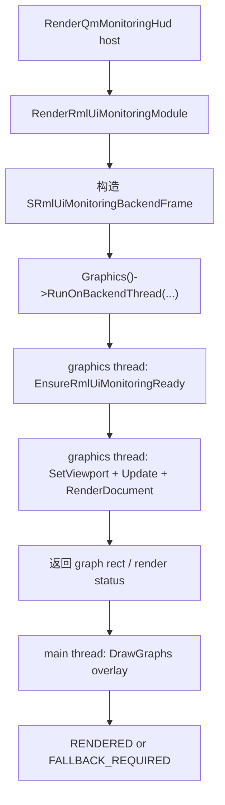

# rmlui-render-command-bridge design

## 0. 术语约定

| 术语 | 定义 | 防冲突结论 |
|---|---|---|
| backend-thread callback | 由 `graphics_threaded` 命令系统同步投递到 graphics thread 执行的一次性回调 | 当前仓库只有 `CMD_SIGNAL` 这类同步命令，没有可复用的自定义 graphics-thread 执行入口 |
| render bridge minimal slice | 本 feature 先落地的最小桥接切片：把 RmlUI core init/update/render 从主线程/ surface 抢 context 改为 graphics thread 受控执行 | 不是完整的 geometry/scissor/texture backend-neutral bridge |
| document render step | `CRmlUiMonitoringHud` 中 RML document 更新、`CRmlUiCore::Render()` 和 graph anchor rect 解析这部分 | 这部分必须和 RmlUI context 同线程执行 |
| graph overlay step | Monitoring HUD 折线图、网格等仍复用现有 `IGraphics` 绘制的叠加步骤 | 当前不在本 feature 中改写成 RmlUI geometry bridge |

术语检索结果：当前代码已有 `CRmlUiCore`、`CRmlUiBackend`、`CRmlUiMonitoringHud`、`CRmlUiRuntime` 和 `RenderQmMonitoringHud`。没有现成的 graphics-thread callback 命令，也没有真正的 backend-neutral RmlUI render bridge。

## 1. 决策与约束

### 需求摘要

本 feature 先完成 render bridge 的第一条硬约束：RmlUI runtime/host/surface 不再通过 `AcquireBackendFrameContext()` 或额外 `SDL_GL_MakeCurrent` 抢占 OpenGL context。第一阶段不追求把 Monitoring HUD 全量改写成 backend-neutral geometry bridge，而是先把 `CRmlUiCore::Init()`、`Update()`、`Render()` 和 document rect 解析迁到 graphics thread 的受控回调里，停止当前主线程/ surface 争用 context 的路径。

成功标准：

- Monitoring HUD 的 RmlUI 路径不再调用 `Graphics()->AcquireBackendFrameContext()` / `ReleaseBackendFrameContext()`。
- `CRmlUiCore::Init()` 和 `CRmlUiCore::Render()` 通过 graphics-thread callback 执行，不再依赖主线程当前恰好持有 GL context。
- `wglMakeCurrent(): 请求的资源在使用中` 不再由 Monitoring HUD surface 自己触发。
- 旧 HUD fallback 继续保留，runtime/result 语义不变。
- 当前切片的代码和文档明确声明“geometry/scissor/texture 全量 bridge 仍未完成”，不伪造验收。

明确不做：

- 不在本 feature 中完成 `Rml::RenderInterface` 的 backend-neutral geometry/scissor/texture 生命周期桥接。
- 不迁移菜单、弹窗、轮盘、设置页或其他 surface。
- 不删除现有 `CRmlUiBackend` GL3 prototype。
- 不把 Monitoring HUD 折线图 overlay 改写成 RmlUI geometry。
- 不宣称 Vulkan/Android 已被此切片覆盖。

### 复杂度档位

走客户端渲染线程边界调整默认档位。风险主要在 graphics thread / main thread 边界，而不是协议、物理或存档兼容性。

### 关键决策

1. 先在 `graphics_threaded` 命令系统新增一个同步 backend-thread callback 命令，而不是继续让 surface 主线程临时 `MakeCurrent`。
2. `CRmlUiMonitoringHud` 拆成两段：graphics thread 负责 document render step，主线程继续负责 graph overlay step。
3. runtime shell 结果语义保持不变；bridge 切片只改变执行位置，不改 fallback contract。
4. 当前切片只证明“停止 context 争用”的桥接方向成立；完整 render interface bridge 留给后续 `rmlui-scissor-texture-bridge` 和更深的 geometry 工作。
5. 文档和 checklist 必须把“未完成的 bridge 部分”写明，避免把最小桥误写成全面完成。

### 前置依赖

- `rmlui-runtime-shell` 已完成并提供 runtime/result/fallback 结构。

## 2. 名词与编排

### 2.1 名词层

#### 现状

- `src/engine/graphics.h` / `IGraphics` 只有 `AcquireBackendFrameContext()` / `ReleaseBackendFrameContext()` 这类主线程抢后端 context 的入口。
- `src/engine/client/graphics_threaded.*` 命令系统支持同步命令，但没有“在 graphics thread 执行自定义回调”的最小桥。
- `src/game/client/gameclient.cpp` / `RenderRmlUiMonitoringModule` 当前直接 `AcquireBackendFrameContext()`，随后在主线程执行 `EnsureRmlUiMonitoringReady()`、`m_RmlUiCore.Update()`、`m_RmlUiMonitoringHud.Render(...)`。
- `CRmlUiMonitoringHud::Render(...)` 把 document 更新、`CRmlUiCore::Render()`、graph rect 解析和 graph overlay 绘制混在一个函数里。

#### 变化

- 在 `IGraphics` / `graphics_threaded` 中新增同步 `RunOnBackendThread(callback, user)` 最小桥接入口。
- 在 backend command processor 中新增一个 `CMD_BACKEND_CALLBACK`，允许 graphics thread 同步执行一段受控回调。
- `CRmlUiMonitoringHud` 拆分为：
  - `RenderDocument(...)`：更新 document、调用 `CRmlUiCore::Render()`、解析 graph rect。
  - `DrawGraphs(...)`：继续用现有 `IGraphics` 画网格和折线图。
- `RenderRmlUiMonitoringModule(...)` 不再抢 backend frame context，而是构造一次 `SRmlUiMonitoringBackendFrame`，通过 `RunOnBackendThread(...)` 完成 RmlUI core/document render。

#### 接口示例

```cpp
using FBackendThreadCallback = void (*)(void *pUser);

virtual void RunOnBackendThread(FBackendThreadCallback pfnCallback, void *pUser) = 0;

struct SRmlUiMonitoringBackendFrame
{
	CGameClient *m_pGameClient;
	const char *m_pStage;
	int m_ViewportWidth;
	int m_ViewportHeight;
	CUIRect m_View;
	SQmMonitoringViewModel m_ViewModel;
	CUIRect m_MainGraphRect;
	CUIRect m_FpsGraphRect;
	bool m_Ready;
	bool m_Rendered;
};
```

正常示例：Monitoring HUD host 构造 backend frame -> graphics thread 执行 `EnsureRmlUiMonitoringReady` + `CRmlUiCore::Update/Render` + rect resolve -> 主线程收到 rect 后调用 `DrawGraphs(...)` -> 返回 `RENDERED`。

错误示例：graphics thread 中 `EnsureRmlUiMonitoringReady` 失败 -> `m_Ready=false` -> host 返回 `FALLBACK_REQUIRED`，旧 HUD 生效。

### 2.2 编排层



#### 现状

当前编排是主线程直接 `AcquireBackendFrameContext()`，然后在同一函数里做 runtime/core/hud render。结果是：

- `CRmlUiCore::Init()` 仍可能看到 `no active OpenGL context`
- `AcquireFrameContext()` 内部 `SDL_GL_MakeCurrent(...)` 可能和 graphics thread 原有持有者争用，触发 `wglMakeCurrent(): 请求的资源在使用中`

#### 变化

- host 仍然负责发起 Monitoring HUD 渲染请求和旧 HUD fallback。
- graphics thread callback 只承接 RmlUI core/document render 这段必须同 context 同线程执行的工作。
- 主线程继续保留 graph overlay 的现有即时绘制，避免本 feature 过度扩大到 geometry bridge 全量实现。

#### 流程级约束

- 新增 callback 命令必须同步等待完成，不能引入后台悬挂的 RmlUI 状态写入。
- callback 只允许承接“必须在 graphics thread 执行”的最小逻辑，不扩展成通用业务执行器。
- Monitoring HUD 的 graph overlay 仍在主线程；因此本 feature 不得宣称 geometry bridge 已完整实现。
- runtime/result/fallback 语义不得变化。

### 2.3 挂载点清单

- `src/engine/graphics.h`：新增 `RunOnBackendThread(...)` 接口。
- `src/engine/client/graphics_threaded.*`：新增 backend-thread callback 命令与同步执行入口。
- `src/engine/client/backend_sdl.*`：让 command processor 执行 callback 命令。
- `src/game/client/RmlUi/RmlUiMonitoringHud.*`：拆分 document render 与 graph overlay。
- `src/game/client/gameclient.*`：Monitoring HUD host 改为通过 backend-thread frame 执行 RmlUI render。

### 2.4 推进策略

1. graphics-thread callback 最小桥：在 `graphics_threaded` 命令系统中增加同步 callback 命令。
   退出信号：主线程可以同步请求 graphics thread 执行一段 callback，且 `game-client` 构建通过。
2. Monitoring HUD 路径切分：把 `CRmlUiMonitoringHud` 拆成 document render step 和 graph overlay step。
   退出信号：`CRmlUiMonitoringHud::Render(...)` 仍可组合调用，两段职责分离清晰。
3. host 接入：`RenderRmlUiMonitoringModule(...)` 改用 backend-thread frame，不再调用 `AcquireBackendFrameContext()`.
   退出信号：代码中 Monitoring HUD surface 路径不再出现 `AcquireBackendFrameContext()` / `ReleaseBackendFrameContext()`。
4. 构建与运行验证：重新构建 `game-client`，并用实际启动日志检查 `no_gl_context` / `wglMakeCurrent` 是否从 Monitoring HUD surface 路径消失或收敛。
   退出信号：构建通过，运行日志不再由 Monitoring HUD surface 直接触发 context acquire 失败。

### 2.5 结构健康度与微重构

#### 评估

- 文件级 — `src/game/client/gameclient.cpp`：RmlUI host 分支仍然集中在这里，但本次变动直接对应宿主职责，不额外拆文件。
- 文件级 — `src/engine/client/graphics_threaded.*`：新增一个命令类型和同步入口，属于现有命令系统自然扩展。
- 文件级 — `src/game/client/RmlUi/RmlUiMonitoringHud.*`：原先职责混合，本次拆分正好是最小必要的局部解耦。
- 目录级 — `src/game/client/RmlUi/`：不新增新目录，结构仍可接受。

#### 结论：不做独立微重构

本 feature 的职责拆分本身就是为桥接切片服务的最小结构调整，不再额外起“只搬不改行为”的独立步骤。

#### 超出范围的观察

- `CRmlUiBackend` 仍然绑定 `RenderInterface_GL3`，完整的 render interface bridge 尚未实现。
- Monitoring HUD 折线图 overlay 仍然使用现有 `IGraphics` 路径，尚未纳入 backend-neutral geometry bridge。

## 3. 验收契约

### 关键场景清单

- 触发：Monitoring HUD RmlUI path 进入渲染 -> 期望：surface 路径不再调用 `AcquireBackendFrameContext()` / `ReleaseBackendFrameContext()`。
- 触发：graphics thread callback 执行 RmlUI init/render -> 期望：`CRmlUiCore::Init()` / `Render()` 不再依赖主线程当前持有 context。
- 触发：RmlUI backend/core 初始化失败 -> 期望：仍返回 `FALLBACK_REQUIRED`，旧 HUD 生效。
- 触发：RmlUI document render 成功 -> 期望：RML 文档先在 graphics thread 完成，graph overlay 仍能用解析出的 rect 正常绘制。
- 触发：构建与实际启动 -> 期望：不再出现由 Monitoring HUD surface 自己触发的 `wglMakeCurrent(): 请求的资源在使用中` 路径。

### 明确不做的反向核对项

- 本 feature 不应宣称 geometry/scissor/texture lifecycle bridge 已完成。
- 本 feature 不应删除 `CRmlUiBackend` 的 GL3 prototype。
- 本 feature 不应迁移菜单、弹窗、轮盘、设置页或 HUD 编辑器。
- 本 feature 不应删除旧 HUD fallback。

## 4. 与项目级架构文档的关系

acceptance 阶段需要把以下现状回写到 architecture：

- RmlUI Monitoring HUD 的 core/document render 已迁到 graphics thread callback 执行。
- surface 路径不再直接抢 backend frame context。
- graph overlay 仍是过渡实现，完整 geometry bridge 仍待后续 feature。
