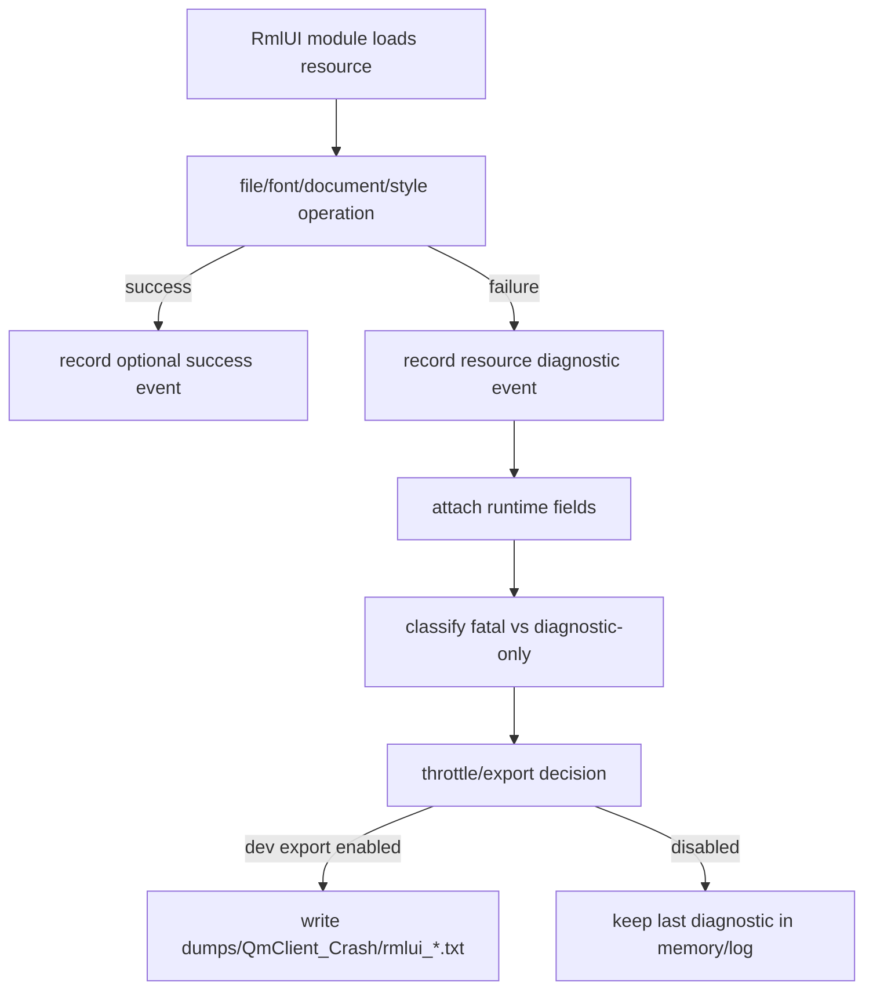

# rmlui-resource-diagnostics design

This design is approved for implementation after `rmlui-runtime-shell` acceptance established the runtime diagnostic baseline. It should not be implemented before the resource taxonomy and export contract below are respected.

## 0. Source Basis

Local references:

- `reference/rmlui-runtime-api-reference.md`
- `reference/rmlui-file-interface-reference.md`
- `reference/rmlui-font-engine-reference.md`
- `reference/rmlui-render-interface-reference.md`
- `features/2026-05-07-rmlui-runtime-shell/rmlui-runtime-shell-acceptance.md`

Upstream API facts used here:

- file interface resolves RML, RCSS, font, and asset reads through `Open` / `Read` / `Seek` / `Tell`
- `Open(...)` returns `0` on failure
- fonts should load before documents
- render interface is handle-based and separates compiled geometry, scissor, and texture lifecycle

## 0. Terms

| term | meaning |
|---|---|
| resource diagnostics | Structured record of RML, RCSS, font, texture, and file-interface failures. |
| diagnostic event | One captured failure/success transition that can be logged or exported. |
| diagnostic bundle | A throttled file containing one or more diagnostic events for a module/run. |
| development export | File output enabled for local development, including Release/RelWithDebInfo debug runs. |

## 1. Decisions And Constraints

### Goal

Create a consistent diagnostics layer for RmlUI resources so missing fonts, missing documents, unsupported RCSS, failed texture loads, and prototype HUD failures do not remain scattered console messages.

### Success Criteria

- RML document missing and RCSS parse failures produce structured diagnostic fields.
- Font load success/failure is captured with file path and fallback role.
- Diagnostic files target `dumps/QmClient_Crash/`.
- File names include module, timestamp, and result.
- Exports are gated by development diagnostics intent and are event-based, not per-frame spam.

### Explicit Non-Goals

- Do not redesign the RmlUI visual style.
- Do not fix Monitoring HUD layout or graph rendering.
- Do not implement render-command bridge texture uploading.
- Do not make Android asset path support complete in this feature.
- Do not replace runtime-shell diagnostics; extend them.

## 2. Current State To Target State

### Current State

- Monitoring HUD logs backend/core/HUD state from `gameclient.cpp`.
- `CGameClient::ExportRmlUiMonitoringDiagnostics` already resolves the save-path target `dumps/QmClient_Crash/`.
- Font failures and RCSS warnings can appear as console logs without structured module ownership.
- `CRmlUiRuntime` diagnostics contain runtime/core/backend state but do not yet define a resource diagnostics taxonomy.
- `CRmlUiBackend` owns file/system/render interface setup but does not classify resource events by severity or fatality.
- Current upstream RmlUi resource hooks are still split across file loading, font loading, and render-interface texture lifecycle rather than a single diagnostics callback.

### Target State

- Runtime-shell provides base fields: module, stage, layer, result, fallback owner.
- Resource diagnostics adds resource-specific fields: resource type, path, operation, status, source subsystem, and error text.
- One diagnostic exporter writes a stable text format under `dumps/QmClient_Crash/`.
- Resource failures are attributed to the module that triggered them.
- Export only occurs when the frame request or host path explicitly enables development diagnostics.
- Required-resource failures can drive `FALLBACK_REQUIRED`; optional-resource failures remain diagnostic-only unless a module marks them fatal.
- Texture lifecycle diagnostics remain compatible with the future handle-based render bridge rather than baking in GL3-only assumptions.

## 3. Diagnostic Schema

Minimum event fields:

```text
schema=rmlui-diagnostics-v1
category=resource
module=monitoring_hud
stage=load_document
layer=GAME_HUD
result=fallback_required
resource_type=rml|rcss|font|image|texture|file
resource_path=data/qmclient/rmlui/monitoring_hud.rml
operation=load|parse|generate_texture|release_texture
status=success|failed|unsupported
error_code=document_missing|font_missing|rcss_parse_error|texture_load_failed|file_open_failed
error_text=...
fallback_owner=CGameClient::RenderQmMonitoringHud
timestamp_local=2026-05-07_18-15-12
```

Rules:

- `error_text` may be truncated.
- `resource_path` stores a storage-relative path such as `data/qmclient/rmlui/monitoring_hud.rml` or `fonts/Icons.ttf`, not an absolute OS path.
- Missing optional resources do not automatically force fallback unless the module marks them required.
- Required document or font failures must be visible in frame result diagnostics.
- A missing optional icon font such as `fonts/Icons.ttf` may emit a `resource_type=font` failure without forcing module fallback if the module can still render its required text.
- Runtime/backend/core failures remain runtime diagnostics fields and are not recoded as resource errors.
- `resource_type=texture` and `operation=generate_texture` are reserved for later bridge-side texture lifecycle capture, not for direct GL helper assumptions.

### Export gating and throttling

- The v1 exporter is only allowed to write files when the host or frame request explicitly enables development diagnostics, for example `SRmlUiFrameRequest::m_DebugDiagnostics=1`.
- Repeated identical failures for the tuple `module + stage + resource_type + resource_path + error_code` do not create new files every frame.
- A new file is written only on the first occurrence of a failure tuple, when the failure tuple changes, or when a recovery event is explicitly exported.

### Capture ownership

- `CRmlUiRuntime` owns the merged runtime-plus-resource diagnostic snapshot.
- `CRmlUiCore`, `CRmlUiBackend`, and current surface code contribute capture points, not file-writing policy.
- `CGameClient` remains the current prototype host entry, while exporter policy moves into runtime/resource diagnostics instead of remaining surface-specific.
- The exporter contract must stay compatible with the official file-interface and font-loading order; it may observe failures from those layers but should not redefine them.

## 4. Flow



## 5. Implementation Slices

1. TDD baseline: add failing tests for missing document, missing required font, missing optional icon font, and repeated identical failures.
   Exit signal: tests fail before implementation for the intended classification and export rules.
2. Schema and taxonomy: define resource diagnostic event fields, stable `error_code`, and fatal-vs-optional classification.
   Exit signal: tests can construct events for document, font, style, and file failures with explicit fatality.
3. Capture points: wire document/font/file/style failure events from current prototype path and runtime shell ownership.
   Exit signal: forced missing document, missing required font, and missing optional icon font produce distinct structured events.
4. Exporter: write event bundle to `dumps/QmClient_Crash/` with module/timestamp/result file name and storage-relative paths.
   Exit signal: test or manual run verifies file path, file name shape, and redaction of absolute paths.
5. Throttling: deduplicate repeated identical failures within a session unless the failure tuple changes or a recovery event is exported.
   Exit signal: repeated failure does not generate per-frame files.
6. Runtime integration: attach resource diagnostics to runtime-shell frame result/fallback diagnostics without collapsing runtime/backend failures into resource codes.
   Exit signal: runtime failure and resource failure remain distinguishable in the same diagnostic bundle.

## 6. Acceptance Contract

- Missing Monitoring HUD RML produces `resource_type=rml` and `error_code=document_missing`.
- Missing required text font produces `resource_type=font` and `error_code=font_missing`, and can participate in `FALLBACK_REQUIRED`.
- Missing optional icon font such as `fonts/Icons.ttf` produces `resource_type=font` and `error_code=font_missing`, but does not automatically force fallback.
- RCSS parse warning or unsupported property can be captured with `resource_type=rcss` and does not overwrite runtime/backend failure fields.
- Diagnostic file lands under `dumps/QmClient_Crash/`.
- Exported `resource_path` stays storage-relative rather than absolute.
- Runtime/backend failure and resource failure remain separate fields.
- Ordinary player path does not write per-frame diagnostic files; file export requires explicit development diagnostics intent.

## 7. Architecture Backfill

After implementation acceptance, backfill:

- Resource diagnostics taxonomy.
- Export target convention.
- Development-diagnostics export gate.
- Fatal vs optional resource classification.

Do not backfill:

- Render bridge texture lifecycle as current state.
- Android asset path support as complete.

## 8. Review Status

Approved for implementation once checklist steps are kept in order. The diagnostic contract is intentionally limited to resource capture and export; it does not redefine upstream file, font, or render interfaces.
