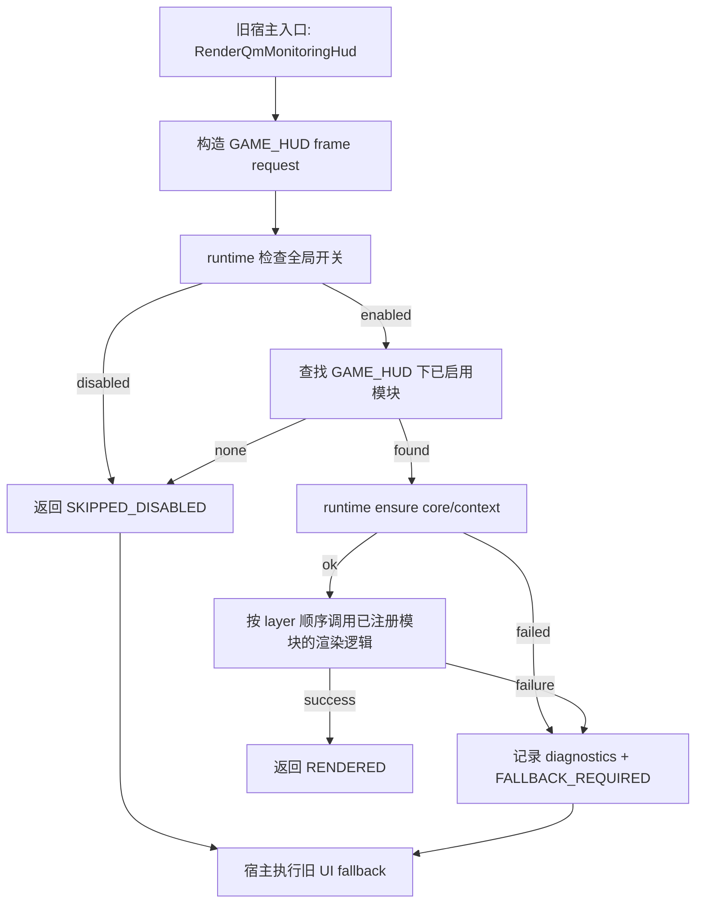

# rmlui-runtime-shell design

## 0. 术语约定

| 术语 | 定义 | 防冲突结论 |
|---|---|---|
| RmlUI runtime | 管理 RmlUI core/context、模块注册、frame request、失败状态和诊断导出的统一入口 | 当前代码已有 `CRmlUiCore`，但它只管理 core/backend，不承担模块注册和 layer 调度 |
| module descriptor | 每个 RmlUI surface 声明模块名、开关、layer、document、输入需求和 fallback 能力的数据 | roadmap 第 4.2 节已定义 `SRmlUiModuleDescriptor`，本 feature 只落最小骨架 |
| frame request | 每帧由旧 UI 宿主发给 runtime 的 layer 渲染请求 | roadmap 第 4.1 节已定义 `SRmlUiFrameRequest`，本 feature 直接以 Monitoring HUD 模块验证 fallback/result 语义 |
| diagnostics | 成功、失败、fallback 的结构化状态快照 | 现有 `ExportRmlUiMonitoringDiagnostics` 是 Monitoring HUD 特例，本 feature 收束成 runtime 级字段 |
| fallback owner | RmlUI 失败后负责继续调用旧 UI 的宿主 | 不是 runtime 替旧 UI 画 fallback，而是 runtime 返回结果，宿主执行旧路径 |

术语检索结果：当前仓库已有 `CRmlUiCore`、`CRmlUiBackend`、`CRmlUiMonitoringHud`、`QmMonitoringUseRmlUi` 和 `ExportRmlUiMonitoringDiagnostics`。没有发现已存在的通用 RmlUI module registry 或 runtime shell。

## 1. 决策与约束

### 需求摘要

本 feature 做第一条工程闭环：建立一个全局 RmlUI runtime shell，让 Monitoring HUD 模块先接入统一 module registry、`qm_` 前缀开关、layer 调度与结构化诊断，并在失败时返回明确 fallback 结果。目标用户是后续所有 RmlUI feature 的实现者，以及需要排查 RmlUI 初始化/资源/回退问题的开发者。

成功标准：

- Monitoring HUD 模块可以注册到 runtime，并成为 `GAME_HUD` layer 的第一个试点接入模块。
- 全局开关关闭、某 layer 下无可用模块、runtime 不可用三种路径都返回可区分结果。
- Monitoring HUD 的实验分支可以作为首个宿主接入 runtime 结果，但旧 HUD fallback 仍由原宿主执行；这条现有实现不被视为稳定可复用模板。
- 诊断字段包含 module、stage、layer、core/backend/document 失败原因、fallback owner 和运行时间。
- 实现过程遵循 TDD：先写失败测试，再补最小实现，再整理代码与文档。

明确不做：

- 不实现新的 backend-agnostic render bridge。
- 不在本 feature 修复 Monitoring HUD 图表线、CSS、字体或布局问题。
- 不迁移菜单、弹窗、轮盘、设置页等交互式 surface。
- 不在本 feature 中直接删除 `qm_monitoring_use_rmlui` 旧实验开关；但新设计口径统一以 `qm_rmlui_*` 配置命名，并在实现时明确兼容/迁移策略。
- 不把 direct GL path 标记为长期可接受，只把现状纳入诊断。

### 复杂度档位

走客户端 UI runtime 默认档位，无对外协议、服务端状态或物理/预测偏离。偏离默认的是平台风险：本 feature 不解决 Vulkan/Android 绘制，但诊断和接口命名必须从第一天避免只写 OpenGL 语义。

### 关键决策

1. runtime 只负责判定和报告，不负责直接绘制旧 fallback。
2. module descriptor 是后续 surface 的唯一注册入口，不允许每个 surface 自己新增一套开关/fallback 逻辑。
3. diagnostics 从 runtime 输出统一结构，surface 只补充自己的 document 或业务状态。
4. `qm_rmlui_safe_mode` 在本 feature 中只落配置命名与状态接入点，不实现连续失败自动禁用策略；自动禁用归 `rmlui-safe-mode`。
5. 本 feature 可以继续使用现有 `CRmlUiCore` / `CRmlUiBackend`，但要把 Monitoring HUD 中的诊断和启用判定从 `gameclient.cpp` 里抽离出来。
6. 本 feature 的实现顺序固定为 TDD：先让新测试失败，再实现 runtime/module/diagnostics 最小变更，再把文档与配置说明补齐。
7. Monitoring HUD 只能作为 prototype host 验证 runtime、fallback 和 diagnostics，不继承其 direct GL、图表布局或资源链假设作为长期方案。
8. `Rml::Context` 是 runtime 的一等生命周期边界，不是可以被 surface 悄悄共用的隐式细节。
   - runtime-shell 必须显式维护至少 `HUD` 与 `MENU` 两个 context domain；
   - 后续 feature 若需要新增或合并 context，必须写明理由；
   - 禁止回退到“单一 shared context + 每个 surface 各自 `Context::Update()` / `Context::Render()`”的旧结构。

### 前置依赖

无。roadmap 中这是最小闭环条目。

## 2. 名词与编排

### 2.1 名词层

#### 现状

- `src/game/client/RmlUi/RmlUiCore.h` / `CRmlUiCore`：负责 RmlUI core 初始化、context、font、document load、update/render。
- `src/engine/client/rmlui_backend.h` / `CRmlUiBackend`：负责 RmlUI system/file/render interface，目前绑定 GL3 backend，并要求 active GL context。
- `src/game/client/RmlUi/RmlUiMonitoringHud.h` / `CRmlUiMonitoringHud`：负责 Monitoring HUD document 加载、数据写入和图表辅助绘制。
- `src/game/client/gameclient.cpp` / `RenderQmMonitoringHud`：通过 `g_Config.m_QmMonitoringUseRmlUi` 直接决定是否走 RmlUI，并在函数内处理 context acquire、core init、HUD init、fallback 和 diagnostics。

#### 变化

- 新增 runtime 级 module descriptor、layer-first frame request/result 和 diagnostics 类型，承接 roadmap 第 4 节契约。
- 新增 runtime shell，持有 `CRmlUiCore`，维护 module registry、context domain 边界和最近一次 diagnostics。
- Monitoring HUD 先作为 `GAME_HUD` layer 的第一个试点注册模块，保留旧 fallback owner。
- 诊断导出从 `ExportRmlUiMonitoringDiagnostics` 这种 surface 特例，收敛为 runtime 接口；文件目录目标为保存目录下的 `dumps/QmClient_Crash/`。

#### 接口示例

```cpp
// 来源：roadmap rmlui-full-replacement 第 4.1 / 4.2 / 4.5 节
enum class ERmlUiLayer
{
	GAME_HUD,
	DEBUG_OVERLAY,
	MENU_PAGE,
	MENU_MODAL,
	RADIAL_OVERLAY,
	EDITOR_OVERLAY,
};

enum class ERmlUiFrameResult
{
	RENDERED,
	SKIPPED_DISABLED,
	SKIPPED_UNAVAILABLE,
	FALLBACK_REQUIRED,
};

struct SRmlUiModuleDescriptor
{
	const char *m_pModuleName;
	const char *m_pConfigToggle;
	ERmlUiLayer m_Layer;
	const char *m_pDocumentPath;
	bool m_RequiresInput;
	bool m_HasLegacyFallback;
	const char *m_pFallbackOwner;
};

struct SRmlUiFrameRequest
{
	ERmlUiLayer m_Layer;
	int m_ViewportWidth;
	int m_ViewportHeight;
	float m_FrameTimeSec;
	bool m_DebugDiagnostics;
};

struct SRmlUiFrameResult
{
	ERmlUiFrameResult m_Result;
	const char *m_pFailureReason;
};

SRmlUiFrameResult RenderRmlUiLayer(const SRmlUiFrameRequest &Request);
```

正常示例：`RenderRmlUiLayer(GAME_HUD)` -> runtime 找到已启用的 `monitoring_hud` 试点模块 -> 初始化成功 -> 返回 `RENDERED` 或后续 surface 渲染结果。

错误示例：`RenderRmlUiLayer(GAME_HUD)` -> runtime 找到 `monitoring_hud`，但 core/backend 不可用 -> 记录 `module=monitoring_hud`、`backend_failure=no_gl_context` -> 返回 `FALLBACK_REQUIRED`，宿主继续调用旧 HUD。

### 2.2 编排层



#### 现状

当前 Monitoring HUD 的 RmlUI 路径是局部编排：`RenderQmMonitoringHud` 里直接读 `g_Config.m_QmMonitoringUseRmlUi`，直接 acquire backend frame context，直接调用 `EnsureRmlUiMonitoringReady`，失败时在同一个函数里打日志并回旧 HUD。拓扑是单函数分支，无法复用到菜单、弹窗、轮盘等后续 surface。

#### 变化

- 将“某 layer 是否有启用模块、runtime 是否可用、失败原因、fallback 是否需要执行”从 Monitoring HUD 特例提升为 runtime 编排。
- `RenderQmMonitoringHud` 仍是首个 host owner，但只负责构造 `GAME_HUD` request、消费 result、执行旧 fallback。
- runtime 初始化失败时只记录一次稳定失败原因，并允许开发模式导出结构化诊断。
- 本 feature 中真实渲染仍可委托现有 `CRmlUiMonitoringHud`，但调用前后的状态归 runtime 统一记录；如果该试点模块内部失败，runtime 只能记录并回退，不能把它视作 runtime 失败。
- context domain 由 runtime-shell 统一拥有：
  - `GAME_HUD` / overlay 走 HUD 侧 context；
  - `MENU_PAGE` / `MENU_MODAL` 走菜单侧 context；
  - surface 自己不能偷偷决定“复用哪个 context 并顺手自己更新/渲染它”。

#### 流程级约束

- 幂等性：重复注册同名模块不能产生两个有效模块；可以返回 false 或覆盖策略，但 design 倾向拒绝重复注册并输出 diagnostics。
- 错误语义：runtime 失败不抛异常、不崩溃、不静默吞掉，统一返回 `FALLBACK_REQUIRED` 或 `SKIPPED_UNAVAILABLE`；layer 下无启用模块返回 `SKIPPED_DISABLED`。
- 顺序约束：runtime 初始化必须早于 document load；frame request 必须带 viewport。
- context 约束：对同一 context domain 的 `Update()` / `Render()` 必须由 runtime 或宿主统一编排成单一帧入口；surface 只能更新自己的 document/view-model，不得各自重复驱动整块 context。
- 可观测点：每个模块至少记录最近一次 stage/result/failure/fallback owner；公开 frame result 仍以 layer 请求为单位返回。
- 平台边界：本 feature 不新增 `SDL_GL_MakeCurrent` 或新的 GL context 管理；现有 backend 的 GL 假设只作为 diagnostics 暴露。

### 2.3 挂载点清单

- 配置项：新增或预留 `qm_rmlui_enable`、`qm_rmlui_safe_mode`、`qm_rmlui_monitoring_hud`；兼容当前 `qm_monitoring_use_rmlui` 的迁移关系需要在实现阶段显式处理。
- 模块注册：新增 `monitoring_hud` module descriptor，layer 为 `GAME_HUD`，fallback owner 为 `CGameClient::RenderQmMonitoringHud`，并标记为 prototype host。
- 旧宿主入口：`CGameClient::RenderQmMonitoringHud` 从直接判断实验开关，改为调用 `RenderRmlUiLayer(GAME_HUD)` 并根据 result fallback。
- 诊断导出入口：开发模式将 runtime diagnostics 导出到保存目录下 `dumps/QmClient_Crash/`。

### 2.4 推进策略

1. TDD 基线：先为 `qm_rmlui_enable`、`qm_rmlui_monitoring_hud`、runtime 不可用三条路径补失败测试，证明当前实现还不满足 layer-first runtime 契约。
   退出信号：新增测试在改代码前失败，且失败原因分别对应“全局关闭”“模块关闭”“runtime 不可用”。
2. 编排骨架：建立 runtime shell、module descriptor、layer-first frame request/result 和 diagnostics 类型，并让 Monitoring HUD 成为 `GAME_HUD` 下的首个试点模块。
   退出信号：同一 layer 能在测试与日志里区分 `SKIPPED_DISABLED`、`FALLBACK_REQUIRED`、`RENDERED` 三种结果。
3. 宿主接入：让 `RenderQmMonitoringHud` 消费 runtime frame result，并继续执行旧 HUD fallback。
   退出信号：关闭全局或模块开关时旧 HUD 正常显示，且原失败测试转绿。
4. 诊断导出：把结构化字段写到目标目录，并带运行时间、module、layer、fallback owner。
   退出信号：一次 runtime 失败能生成包含 core/backend/fallback owner 的诊断文件，并有测试或脚本验证文件字段。
5. 收尾整理：在测试保持全绿的前提下清理旧特例日志路径、补齐配置命名说明与验收文档输入。
   退出信号：相关测试继续通过，design 中声明的 `qm_` 配置命名与诊断字段全部对齐。

### 2.5 结构健康度与微重构

##### 评估

- 文件级 — `src/game/client/gameclient.cpp`：文件很长，当前 RmlUI Monitoring HUD 编排、诊断导出和旧 HUD fallback 混在一起；本 feature 如果继续追加逻辑，会扩大 `gameclient.cpp` 职责。
- 文件级 — `src/game/client/RmlUi/RmlUiCore.cpp`：职责相对集中在 core/context 生命周期，适合继续保留；不适合塞 module registry。
- 文件级 — `src/engine/client/rmlui_backend.cpp`：职责是 backend interface，当前绑定 GL3；本 feature 不应在这里扩展 module/fallback 逻辑。
- 目录级 — `src/game/client/RmlUi/`：当前 6 个文件，已有 RmlUI 专属目录，新增 runtime shell 文件不会造成目录摊平。

##### 结论：不做微重构

本 feature 应新增 runtime shell 文件承载新职责，而不是先搬现有代码。`gameclient.cpp` 的 RmlUI 特例后续会自然变薄，但不做“只搬不改行为”的独立微重构，因为本 feature 本身就要改变编排入口。

##### 超出范围的观察

- `CRmlUiBackend` 当前直接绑定 `RenderInterface_GL3`，这是 Phase B `rmlui-render-command-bridge` 的结构问题，不在 runtime shell 中处理。
- `ExportRmlUiMonitoringDiagnostics` 是临时特例，实现阶段可被 runtime diagnostics 替代；若替代后变成孤立代码，应随本 feature 清理。

## 3. 验收契约

### 关键场景清单

- 触发：`qm_rmlui_enable=0` 且 Monitoring HUD 开启旧调试入口 -> 期望：不初始化 RmlUI core，旧 HUD 正常显示；对应测试先失败后通过。
- 触发：`qm_rmlui_enable=1` 但 `qm_rmlui_monitoring_hud=0`，且 `GAME_HUD` 下没有其他启用模块 -> 期望：runtime 返回 `SKIPPED_DISABLED`，旧 HUD 正常显示；对应测试先失败后通过。
- 触发：模块开启但 backend/core 初始化失败 -> 期望：runtime 返回 `FALLBACK_REQUIRED`，旧 HUD 正常显示，并可导出结构化诊断。
- 触发：模块开启且 runtime 可用 -> 期望：Monitoring HUD RmlUI 试点路径仍可尝试渲染，试点内部失败时旧 HUD fallback 仍生效，且 failure reason 能区分 runtime/backend 失败与 surface/document 失败。
- 触发：重复注册 `monitoring_hud` -> 期望：不会产生两个有效模块，diagnostics 或日志能说明重复注册。
- 触发：开发诊断导出 -> 期望：文件位于保存目录下 `dumps/QmClient_Crash/`，文件名包含模块名和运行时间。

### 明确不做的反向核对项

- 代码中不应新增新的 `SDL_GL_MakeCurrent` / `SDL_GL_GetCurrentContext` 使用点来支持 runtime shell。
- 本 feature 不应修改 Monitoring HUD 的图表算法或 RCSS 视觉细节。
- 本 feature 不应迁移菜单、弹窗、设置页、轮盘或 HUD 编辑器。
- 本 feature 不应删除旧 HUD fallback。
- 本 feature 不应把 `RenderInterface_GL3` 声明为长期正式方案。

## 4. 与项目级架构文档的关系

acceptance 阶段需要把以下内容提炼回 architecture：

- RmlUI runtime shell 的职责边界：runtime 管生命周期、模块注册、layer-first frame request/result、diagnostics；旧宿主管 fallback。
- RmlUI module descriptor 的稳定字段：module name、toggle、layer、document、input requirement、fallback owner。
- RmlUI 失败语义：runtime 返回结果，调用方执行旧路径；交互式 surface 的 cancel/release-state 由后续 input bridge 承担。

当前 `.codestable/architecture/ARCHITECTURE.md` 已经补入 RmlUI 现状索引。验收时只允许把已经实现并验证过的 runtime shell 职责回写进去；RenderBridge、LayerManager、InputBridge 等目标模块在未实现前不能写成现状。
