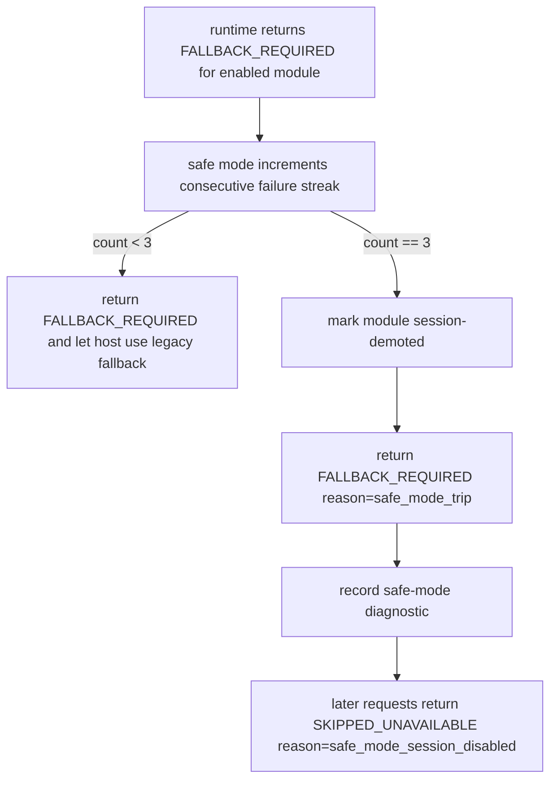

# rmlui-safe-mode design

## 0. Terms

| term | meaning |
|---|---|
| safe mode | A runtime policy that disables or demotes repeatedly failing RmlUI modules and forces legacy fallback. |
| failure streak | Consecutive failures for the same module or surface within a throttling window. |
| demotion | Making a module unavailable for the current session or until a reset condition is met. |
| reset condition | A user action, restart, or explicit recovery point that clears the failure streak. |

## 1. Problem

RmlUI migration will expose more interactive surfaces. If those surfaces fail repeatedly, the player must not be trapped in a broken page. Runtime-shell can report failure, but it does not decide when repeated failure becomes a safety action.

## 2. Decisions And Constraints

### Goal

Add a policy layer that can automatically disable or demote a repeatedly failing RmlUI module and push the host back to legacy UI.

### Success Criteria

- Repeated failures for the same module can be counted.
- Once a threshold is reached, the module is disabled or demoted for the current session.
- Legacy fallback remains available immediately.
- Safe-mode state is exposed in diagnostics.
- Manual recovery/reset path exists.

### Explicit Non-Goals

- Do not implement this before `rmlui-runtime-shell` TDD baseline exists.
- Do not solve render bridge issues here.
- Do not solve resource diagnostics formatting here.
- Do not change Monitoring HUD visual behavior.
- Do not make safe mode a replacement for normal fallback handling.

## 3. Current And Target State

### Current State

- `qm_rmlui_safe_mode` already exists as a QmClient config key in `src/engine/shared/config_variables_qmclient_extra.h`.
- `CRmlUiRuntime` already returns `RENDERED`, `SKIPPED_DISABLED`, `SKIPPED_UNAVAILABLE`, and `FALLBACK_REQUIRED`, but it does not store failure streaks or session demotion state yet.
- `gameclient.cpp` still owns the actual legacy fallback path for Monitoring HUD.
- No implemented repeated-failure policy exists yet.

### Target State

- Runtime-shell records per-module consecutive failure state.
- Safe mode trips only for enabled modules that actually attempted the RmlUI path and failed.
- On the trip frame, host still receives `FALLBACK_REQUIRED` and continues the legacy path.
- After the trip, the module is session-demoted and future requests may return the existing `SKIPPED_UNAVAILABLE` frame result with a safe-mode-specific reason until reset.
- Diagnostics show both the triggering failure and the safe-mode decision.

## 4. Policy Model

This feature chooses one concrete first policy instead of leaving multiple options open.

### Chosen v1 policy

- Safe mode is session-local and module-local.
- Failure streak counts only consecutive `FALLBACK_REQUIRED` results for the same module.
- `SKIPPED_DISABLED` never increments the streak.
- `SKIPPED_UNAVAILABLE` already exists as a general runtime result for unavailable states; in v1 safe mode reuses this result for the session-demoted post-trip state, and that post-trip state is not itself counted as a fresh failure.
- First implementation threshold is fixed at `3` consecutive failures per module.
- A successful `RENDERED` result resets the streak for that module to `0`.
- Crossing the threshold on a frame returns `FALLBACK_REQUIRED` for that frame with reason `safe_mode_trip`.
- All later requests for that module in the same process session return `SKIPPED_UNAVAILABLE` with reason `safe_mode_session_disabled`.

### Reset conditions

- Client restart clears all safe-mode state.
- Toggling the affected module off and back on clears that module's safe-mode state.
- Toggling `qm_rmlui_safe_mode` from `0` back to `1` clears all module safe-mode state.
- No hidden timer-based auto-recovery is introduced in v1.

### Ownership

- `CRmlUiRuntime` owns the streak table, demotion state, and safe-mode diagnostics fields.
- `CGameClient` remains the fallback owner and does not decide streak policy.
- `CRmlUiBackend` and individual surface classes do not own safe-mode state.

### Runtime state shape

v1 should add one explicit per-module state entry inside `CRmlUiRuntime`, rather than scattering streak flags across host code.

Recommended runtime-owned state:

```cpp
struct SRmlUiSafeModeState
{
	const char *m_pModuleName = "";
	int m_ConsecutiveFallbackFailures = 0;
	bool m_SessionDemoted = false;
	const char *m_pLastTripReason = "";
	const char *m_pLastResetReason = "";
};
```

Recommended storage rule:

- One state entry per registered module name.
- State lookup is keyed by `SRmlUiModuleDescriptor::m_pModuleName`.
- State is mutated only inside `CRmlUiRuntime`, immediately after a module frame result is known.
- No safe-mode state is stored in `CGameClient`, `CRmlUiBackend`, or `CRmlUiMonitoringHud`.

### Result and reason mapping

The host-visible mapping must be fixed up front:

- `FALLBACK_REQUIRED` with original surface/runtime failure:
  - streak increments
  - if threshold not reached, return original failure reason
  - host executes legacy fallback as usual
- `FALLBACK_REQUIRED` on the trip frame:
  - streak reaches threshold
  - runtime marks the module session-demoted
  - frame result stays `FALLBACK_REQUIRED`
  - failure reason becomes `safe_mode_trip`
  - diagnostics must retain the triggering failure reason separately from the safe-mode decision
- `SKIPPED_UNAVAILABLE` after demotion:
  - reuses the existing runtime result enum for the later session-demoted state
  - returned only on later requests for the same module while `m_SessionDemoted=true`
  - failure reason becomes `safe_mode_session_disabled`
  - host does not attempt the RmlUI path and immediately continues legacy fallback

Required diagnostic split:

- `m_pFailureReason` records the host-visible runtime result reason (`safe_mode_trip`, `safe_mode_session_disabled`, or the original reason)
- safe-mode-specific diagnostics fields record:
  - triggering failure reason
  - current failure count
  - threshold
  - current demotion state
  - last reset reason

### Required diagnostic fields

- module name
- failure count
- threshold
- triggering failure reason
- safe-mode decision
- reset reason
- demoted/not-demoted session state

Suggested additions to `SRmlUiDiagnostics`:

- `int m_SafeModeFailureCount`
- `int m_SafeModeThreshold`
- `bool m_SafeModeSessionDemoted`
- `const char *m_pSafeModeDecision`
- `const char *m_pSafeModeTriggerReason`
- `const char *m_pSafeModeResetReason`

## 5. Flow



## 5.1 Reset entry points

Reset ownership must also stay in `CRmlUiRuntime`.

Required reset entry points:

1. `RENDERED` reset
   When a module previously accumulating failures returns `RENDERED`, runtime clears its consecutive failure streak and records `render_success` as reset reason.
2. module toggle cycle reset
   When the module's config toggle transitions from disabled back to enabled, runtime clears that module's demotion state and streak before the next render attempt.
3. `qm_rmlui_safe_mode` toggle cycle reset
   When `qm_rmlui_safe_mode` transitions from `0` back to `1`, runtime clears all module safe-mode state.

Non-goals for reset:

- No timer-based auto-recovery.
- No surface-owned hidden reset path.
- No reset side effects should be piggybacked on diagnostics export.

## 6. Implementation Slices

1. TDD baseline: extend `src/test/rmlui_runtime_test.cpp` with failing cases for repeated `FALLBACK_REQUIRED`, non-counted disabled states, and reset on success.
   Exit signal: tests fail before implementation for the intended reasons.
2. Failure streak model: add per-module streak and demotion state to `CRmlUiRuntime`.
   Exit signal: tests can simulate `1 -> 2 -> 3` consecutive failures and observe the stored state.
3. Threshold decision: trip safe mode on the third consecutive failure and session-demote the module.
   Exit signal: the trip frame returns `FALLBACK_REQUIRED reason=safe_mode_trip`, later frames return `SKIPPED_UNAVAILABLE reason=safe_mode_session_disabled`.
4. Host integration: keep legacy fallback ownership in `CGameClient::RenderQmMonitoringHud` while consuming the new result reasons.
   Exit signal: host behavior is unchanged except for clearer safe-mode diagnostics.
5. Diagnostics: add safe-mode fields to runtime diagnostics export without moving ownership into debugger or surface code.
   Exit signal: diagnostic output explains the threshold, failure count, and demotion decision.
6. Recovery: implement the documented reset conditions and prove them with tests.
   Exit signal: success render, module toggle cycle, and safe-mode toggle cycle all clear the demotion state as designed.

### Test-first slice details

- TDD slice 1 should assert that repeated original failure reasons still remain observable when safe mode has not tripped.
- TDD slice 2 should assert that the trip frame rewrites the host-visible reason to `safe_mode_trip` while preserving the original triggering reason in diagnostics.
- TDD slice 3 should assert that the first frame after demotion returns `SKIPPED_UNAVAILABLE reason=safe_mode_session_disabled` without invoking the module renderer.
- TDD slice 4 should assert that module toggle cycle and global safe-mode toggle cycle clear demotion state before the next attempt.

## 7. Acceptance Sketch

- Three consecutive `FALLBACK_REQUIRED` results for `monitoring_hud` trip safe mode.
- `SKIPPED_DISABLED`, `module_missing`, and other non-demotion `SKIPPED_UNAVAILABLE` paths do not trip safe mode.
- The frame that trips safe mode still falls back through the legacy host path.
- Later requests for the same module return `SKIPPED_UNAVAILABLE` until reset.
- Diagnostic output explains threshold, current count, trip reason, and reset reason.
- Recovery path is documented, implemented, and covered by TDD.

## 8. Architecture Backfill

After implementation acceptance, backfill:

- safe-mode policy fields
- failure streak model
- recovery/reset semantics

Do not backfill:

- input bridge implementation details
- render bridge behavior
