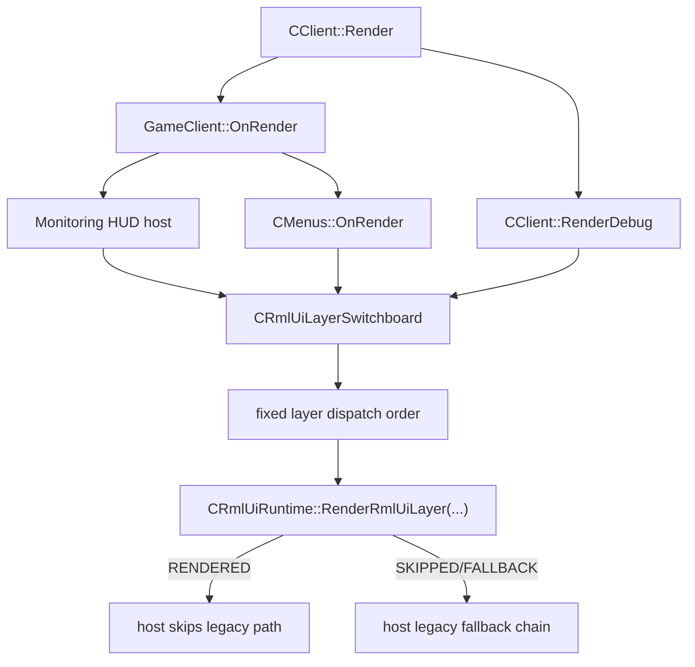

# rmlui-layer-switchboard design

## 0. 术语约定

| 术语 | 定义 | 防冲突结论 |
|---|---|---|
| layer switchboard | RmlUI layer 的统一调度层，负责把固定 layer 顺序、runtime 调用和 legacy fallback 链接到现有宿主入口 | 当前仓库没有 `CRmlUiLayerSwitchboard` 或同等 owner；runtime 只有 `RenderRmlUiLayer(...)`，不拥有宿主顺序 |
| host dispatch point | 现有旧代码里真正触发某个 UI surface 渲染的入口，如 `CGameClient::RenderQmMonitoringHud`、`CClient::RenderDebug`、`CMenus::OnRender` | 当前这些入口分散存在，但没有统一的 RmlUI layer owner |
| layer render slot | 一次 frame 中可被 switchboard 调度的一个固定 layer 位置，对应现有 `ERmlUiLayer` 枚举值 | `ERmlUiLayer` 已在 runtime 落地，可直接复用，不另起新枚举 |
| legacy fallback chain | 当某个 layer 的 RmlUI 路径返回 disabled / unavailable / fallback 时，仍由对应旧宿主执行 legacy UI 的链路 | 当前只在 Monitoring HUD 宿主上部分落地，debug/menu/popup 还没有进入统一语义 |
| dispatch order contract | 当前 feature 负责锁死的 layer 顺序与“谁先 render、谁后 fallback”的约束 | roadmap 已定义顺序，但当前代码没有统一执行 owner |

术语检索结果：当前代码已有 `ERmlUiLayer`、`SRmlUiFrameRequest`、`SRmlUiModuleDescriptor`、`CRmlUiRuntime::RenderRmlUiLayer(...)` 和 `CGameClient::RenderQmMonitoringHud`。没有现成的 layer switchboard，也没有“debug/menu/popup 都先经过同一个 layer owner”的现状实现。

## 1. 决策与约束

### 需求摘要

`rmlui-runtime-shell` 已把 layer 名义上的枚举和 `RenderRmlUiLayer(...)` 表面建起来，`rmlui-render-command-bridge` 与 `rmlui-scissor-texture-bridge` 也把 Monitoring HUD 当前的 render bridge contract 收紧了，但真正的 layer 调度还停留在“某个宿主自己决定什么时候直接调 runtime”。现在需要补一层 switchboard，把固定 layer 顺序、宿主接缝和 legacy fallback 统一起来，避免 Monitoring HUD、debug overlay、menu page 和 popup 以后继续各自抢时机。

成功标准：

- `GAME_HUD`、`DEBUG_OVERLAY`、`MENU_PAGE`、`MENU_MODAL` 这四个当前最相关的 layer 有明确宿主 dispatch point，不再由各自宿主直接裸调 runtime。
- Monitoring HUD 的 RmlUI path 先进入 switchboard，再进入 runtime；旧 HUD fallback 仍由宿主执行，但 fallback 判定不再散在未来各个 surface 里各写一套。
- debug/menu/popup 至少先有“进入 switchboard 再回 legacy path”的固定宿主接缝，即使当前没有对应 RmlUI 模块也要把调度 ownership 先立起来。
- frame 内 layer 顺序固定，后续迁移模块不能自己决定何时插到 game HUD、debug 或 menus 渲染链中间。
- 当前 feature 不把输入、菜单迁移、popup 迁移或多模块 layer 合成提前做掉。

明确不做：

- 不在本 feature 中实现 `rmlui-input-bridge`。
- 不在本 feature 中迁移 menu page、popup、debug HUD 的具体 RmlUI 文档。
- 不在本 feature 中扩展 full backend-neutral render bridge。
- 不在本 feature 中实现 layer 内多个 RmlUI 模块的合成或 z-order 自定义。
- 不在本 feature 中改变现有 legacy menu / popup / debug HUD 的视觉与交互行为。

### 复杂度档位

走 runtime orchestration 收口默认档位。风险主要在宿主顺序、fallback 所有权和“先建调度壳、暂不迁移具体 surface”这条边界，而不在渲染 API、协议或输入语义本身。

### 关键决策

1. 新增一个 switchboard owner，由它持有固定 layer 顺序和宿主 dispatch contract；runtime 继续只负责“某个 layer 的单次 render 判定”，不升级成全局宿主调度器。
2. 当前先收口四个宿主层：`GAME_HUD`、`DEBUG_OVERLAY`、`MENU_PAGE`、`MENU_MODAL`；`RADIAL_OVERLAY` 和 `EDITOR_OVERLAY` 保留在 roadmap 契约层，不在这次实现里硬接空宿主。
3. Monitoring HUD 仍由 `CGameClient::RenderQmMonitoringHud` 作为 fallback owner，但 direct runtime call 要迁进 switchboard。
4. debug/menu/popup 当前即使没有对应 RmlUI 模块，也要先通过 switchboard 固定入口，再明确回 legacy path；这样后续迁移只需接模块，不再重写宿主顺序。
5. diagnostics 仍由现有 runtime / host 导出链路负责，本 feature 只补“switchboard stage/host owner”的调度语义，不新建第二套 diagnostics 系统。

### 前置依赖

- `rmlui-runtime-shell` 已提供 `ERmlUiLayer`、module registry、frame request/result 与 diagnostics baseline。
- `rmlui-render-command-bridge` 已提供 graphics-thread callback minimal slice。
- `rmlui-scissor-texture-bridge` 已把 texture/scissor bridge contract 收紧成 current baseline。

### Feature 级落地字段

- host owner：`CGameClient::RenderQmMonitoringHud`、`CClient::RenderDebug`、`CMenus::OnRender`
- fallback owner：各宿主自己的 legacy render path，switchboard 只统一何时回落，不代替宿主自己画
- diagnostics owner：仍由 runtime diagnostics + 现有 host export 链负责；switchboard 只提供 dispatch stage 名义
- input owner：无；本 feature 不消费输入，也不定义 cancel/release-state
- backend assumption：只消费现有 runtime/render-bridge contract，不新增 OpenGL/Vulkan/Android 专用分支
- evidence owner：runtime/switchboard 单测或 targeted test + host 路径 grep + build 验证

## 2. 名词与编排

### 2.1 名词层

#### 现状

- `src/game/client/RmlUi/RmlUiRuntime.h` 已定义 `ERmlUiLayer`，包含 `GAME_HUD`、`DEBUG_OVERLAY`、`MENU_PAGE`、`MENU_MODAL`、`RADIAL_OVERLAY`、`EDITOR_OVERLAY`。
- `src/game/client/RmlUi/RmlUiRuntime.cpp` 当前 `RenderRmlUiLayer(...)` 只做一件事：按 `Request.m_Layer` 找到第一条匹配 module，然后走 enable/core/render/fallback result 判定。它不拥有 host render order。
- `src/game/client/gameclient.cpp` 当前 Monitoring HUD 宿主直接自己构造 `SRmlUiFrameRequest` 并调用 runtime。
- `src/engine/client/client.cpp` 当前 debug overlay 仍是 `CClient::RenderDebug()` 在 `GameClient()->OnRender()` 之后单独执行。
- `src/game/client/components/menus.cpp` 当前 menu page、fullscreen popup 和 `Ui()->RenderPopupMenus()` 都在 `CMenus::OnRender()` 内各自按状态渲染，没有进入统一 RmlUI layer owner。

#### 变化

- 新增 `CRmlUiLayerSwitchboard`（命名暂定）作为宿主级 layer 调度 owner。
- switchboard 至少要持有：
  - 固定 layer dispatch order；
  - 每个 layer 的 host owner / fallback owner 元数据；
  - 当前 frame 的 dispatch stage 名义；
  - 当前 frame 的 frame token 与 per-surface duplicate guard；
  - “本 layer 当前没有 RmlUI 模块时是否直接回 legacy path”的统一规则。
- runtime 继续只接受单个 `SRmlUiFrameRequest`；switchboard 负责决定什么时候、从哪个宿主、以什么 stage 进入 runtime。

#### 接口示例

```cpp
struct SRmlUiLayerDispatchRule
{
	ERmlUiLayer m_Layer;
	const char *m_pHostOwner;
	const char *m_pFallbackOwner;
	const char *m_pStage;
};

struct SRmlUiLayerDispatchRequest
{
	ERmlUiLayer m_Layer;
	unsigned long long m_FrameToken;
	const char *m_pSurfaceTag;
	int m_ViewportWidth;
	int m_ViewportHeight;
	float m_FrameTimeSec;
	bool m_DebugDiagnostics;
	const void *m_pSurfaceUserData;
};

struct SRmlUiLayerDispatchResult
{
	bool m_RenderedRmlUi;
	bool m_ShouldRenderLegacy;
	ERmlUiFrameResult m_RuntimeResult;
	const char *m_pFailureReason;
	const char *m_pStage;
	const char *m_pHostOwner;
	const char *m_pFallbackOwner;
};
```

正常示例：Monitoring HUD 宿主进入 switchboard -> switchboard 以 `GAME_HUD` 规则构造 runtime request -> runtime 返回 `RENDERED` -> 宿主不再画 legacy HUD。

错误示例：某个 menu 或 debug 宿主直接自己调 `RenderRmlUiLayer(...)`，绕过 switchboard 固定顺序和 fallback owner。这种路径属于本 feature 需要消灭的“宿主直连 runtime”。

补充说明：accepted 实现额外把 `m_FrameToken` 与 `m_pSurfaceTag` 收进 dispatch request，用来区分同一 frame 内多个 `MENU_MODAL` surface（如 `connecting_popup` / `loading_popup` / `fullscreen_popup` / `popup_menu`）并阻止同层重复 dispatch；这属于对既有宿主调度契约的收紧，不是额外扩 scope。

### 2.2 编排层



#### 现状

当前编排是宿主各自决定：

- Monitoring HUD 宿主自己直接调用 runtime；
- debug overlay 没有 RmlUI 调度层，只在 `CClient::RenderDebug()` 里画旧路径；
- menus 里的 page / fullscreen popup / popup menu 也没有统一 RmlUI host；
- runtime 只知道“给我一个 layer request”，不知道 frame 内多个宿主的先后顺序和 fallback 纪律。

#### 变化

- 当前 frame 的 layer 调度统一通过 switchboard 进入。
- Monitoring HUD 先迁到 switchboard，作为第一条真实 RmlUI layer host。
- debug/menu/popup 至少补“先过 switchboard，再决定直接 legacy fallback”的壳层，哪怕当前没有对应 RmlUI module。
- 后续 surface migration 只接到既有 layer slot 上，不再重复定义 host 顺序。

#### 流程级约束

- switchboard 是唯一允许把 host render request 送进 runtime 的宿主级入口；宿主不再直接裸调 runtime。
- `GAME_HUD` 必须先于 `DEBUG_OVERLAY`；menu page / popup 仍由 `CMenus::OnRender()` 这条宿主链控制，但内部 layer 次序要固定。
- fallback 的执行者仍是原宿主，不允许 switchboard 自己跨宿主直接画 legacy UI。
- 没有对应 module、module disabled、runtime unavailable 时，switchboard 必须稳定返回到 legacy path，而不是静默吞掉该宿主的旧 UI。
- 本 feature 不解释输入消费，也不在 switchboard 内放事件参数语义。
- `RADIAL_OVERLAY`、`EDITOR_OVERLAY` 仍保留在契约层，不在这次实现里假装 current host 已落地。

### 2.3 挂载点清单

- `src/game/client/RmlUi/RmlUiLayerSwitchboard.*`：新增宿主级 layer switchboard owner。
- `src/game/client/gameclient.*`：Monitoring HUD 宿主从 direct runtime call 改为经 switchboard 调度。
- `src/engine/client/client.cpp`：debug overlay host 进入 switchboard slot，而不是未来继续旁路接 RmlUI。
- `src/game/client/components/menus.cpp`：menu page / popup 的 RmlUI host 接缝先进入 switchboard。
- `src/game/client/RmlUi/RmlUiRuntime.*`：如需要，仅补最少的 stage / dispatch helper，不把 runtime 重新升级成 host scheduler。

### 2.4 推进策略

1. switchboard 骨架：新增 switchboard owner、固定 layer 规则和 dispatch result contract。
   退出信号：宿主级代码不需要再自己拼接“直接调 runtime 还是回 legacy”这套流程。
2. `GAME_HUD` 迁移：把 Monitoring HUD 宿主改为通过 switchboard 进入 runtime。
   退出信号：`CGameClient::RenderQmMonitoringHudRmlUi(...)` 不再作为宿主直连 runtime 的长期入口。
3. `DEBUG_OVERLAY` / `MENU_PAGE` / `MENU_MODAL` 接缝壳：把 debug/menu/popup 现有宿主接进 switchboard，即使当前只回 legacy path。
   退出信号：这几个宿主后续接 RmlUI surface 时，不需要再另起“何时调用 runtime”的新分支。
4. 构建与证据验证：补 targeted test / grep 证据，证明 host order 和 fallback chain 已固定，且 Monitoring HUD 当前路径未回归。
   退出信号：构建通过，宿主直连 runtime 被收口，legacy fallback 链仍保持可用。

### 2.5 结构健康度与微重构

#### 评估

- 文件级 — `src/game/client/gameclient.cpp`：当前已经承载 Monitoring HUD runtime/surface 逻辑。如果继续在这里堆更多 layer host 判定，会把“单个 surface 宿主”和“全局 layer 调度”混在一起。
- 文件级 — `src/game/client/components/menus.cpp`：已经是很长的菜单宿主文件，不适合把 switchboard 逻辑内联扩写进去。
- 文件级 — `src/engine/client/client.cpp`：`RenderDebug()` 作为 debug overlay 宿主入口较轻，但不应自己成长为第二个 layer manager。
- 目录级 — `src/game/client/RmlUi/`：runtime/core/monitoring 等 RmlUI 宿主逻辑已经集中在这里；新增 switchboard 文件落在这个目录比散落到 `gameclient.cpp` 或 `menus.cpp` 更自然。

#### 结论：不做独立微重构，但新增独立 switchboard 文件

这一步不需要先做“只搬不改行为”的独立微重构；但 layer 调度逻辑必须落在新的 `src/game/client/RmlUi/RmlUiLayerSwitchboard.*`，不能继续把宿主级 orchestration 扩写进 `gameclient.cpp`、`menus.cpp` 或 `client.cpp`。

#### 超出范围的观察

- 如果后续一个 layer 需要承载多个 RmlUI 模块或同 layer 内排序，这会超出本 feature 的“固定宿主 slot”边界，应另开 feature。
- `RADIAL_OVERLAY` 与 `EDITOR_OVERLAY` 的输入/焦点纪律和宿主接缝强绑定，真正实现仍应等待 `rmlui-input-bridge` 与对应 surface 设计。

## 3. 验收契约

### 关键场景清单

- 触发：Monitoring HUD 宿主尝试走 RmlUI -> 期望：先进入 switchboard，再由 switchboard 调 runtime；render 成功时跳过 legacy HUD，失败时回旧 HUD。
- 触发：当前没有对应 RmlUI 模块的 debug overlay / menu page / popup 宿主 -> 期望：宿主先经过 switchboard slot，然后稳定回 legacy path，而不是未来继续旁路接 runtime。
- 触发：frame 内同时存在 `GAME_HUD`、`DEBUG_OVERLAY`、`MENU_PAGE`、`MENU_MODAL` 宿主 -> 期望：调度顺序固定，不由单个宿主临时决定自己的插入时机。
- 触发：runtime 返回 `SKIPPED_DISABLED`、`SKIPPED_UNAVAILABLE` 或 `FALLBACK_REQUIRED` -> 期望：legacy fallback chain 仍由原宿主执行，不丢 UI，也不让 switchboard 越权自己绘制 fallback。
- 触发：本 feature 构建与回归 -> 期望：Monitoring HUD 当前 RmlUI 路径不回退到旧的 direct runtime host 结构，且 build / targeted test 通过。

### 明确不做的反向核对项

- 本 feature 不应宣称 input bridge 已完成。
- 本 feature 不应宣称 menu page、popup 或 debug HUD 的具体 RmlUI surface 已迁移完成。
- 本 feature 不应宣称 `RADIAL_OVERLAY` / `EDITOR_OVERLAY` 当前宿主已实现。
- 本 feature 不应改变现有 legacy menu/popup/debug HUD 的行为语义。
- 本 feature 不应把 runtime 改成新的全局 UI 主循环。

## 4. 与项目级架构文档的关系

acceptance 阶段需要把以下现状回写到 architecture：

- RmlUI 当前不仅有 runtime 和 render bridge，还有一个宿主级 layer switchboard owner。
- Monitoring HUD 不再直接作为唯一宿主自己连 runtime，而是进入固定 layer dispatch contract。
- debug/menu/popup 的现有宿主入口已经被 switchboard 占位收口，但对应 RmlUI surface 仍未迁移完成。
