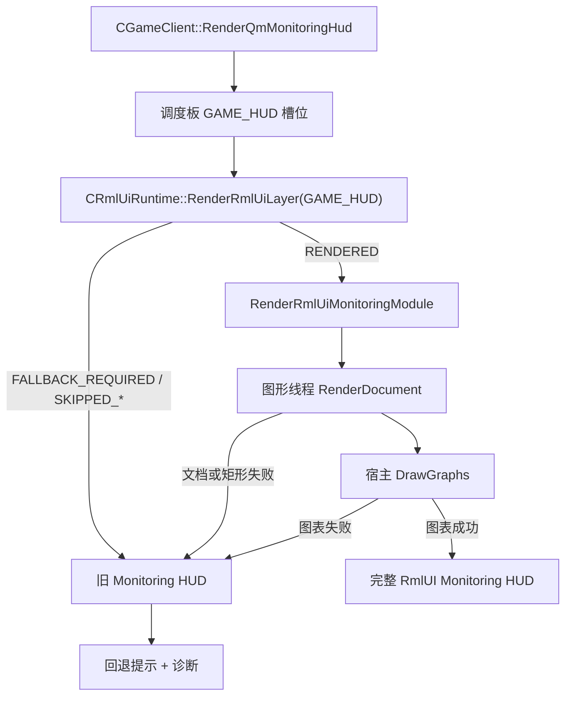

# rmlui-monitoring-hud-migration 设计

## 0. 术语约定

| 术语 | 定义 | 防冲突结论 |
|---|---|---|
| Monitoring HUD 迁移闭环 | 以 Monitoring HUD 作为第一条真实界面迁移，要求 RmlUI 路径在宿主、文档、图表、回退和诊断上都具备可验收的稳定表现 | 不等同于 `rmlui-layer-switchboard`；后者只负责宿主调度，不负责内容完整性 |
| 监控面板壳层 | `monitoring_hud.rml` / `monitoring_hud.rcss` 提供的摘要区、卡片区、图表容器和显式 `RmlUI` 标识 | 当前已经存在，但仍属于试点壳层，不应直接宣称迁移完成 |
| 图表矩形契约 | `main-graph` 与 `fps-graph` 两个 DOM 节点解析出的内容矩形，供旧 `IGraphics` 图表绘制复用 | 当前已经存在，但只要矩形失效就整条路径回退，说明契约还需收紧 |
| 混合渲染迁移 | 文档壳层、文案、卡片和图表容器由 RmlUI 持有；折线、网格等图表折衷地继续由旧 `IGraphics` 在 RmlUI 计算出的矩形内绘制 | 当前代码已经是这种混合路径，因此本功能不把“纯 RmlUI 折线渲染”当成功标准 |
| 迁移证据包 | 证明这条界面已经从试点升级为可验收迁移目标的一组证据，至少包含构建、测试、人工检查记录、手工运行日志和回退证据 | 和验收报告不同；这是设计阶段先定义、后续必须带回的证据责任 |

术语检索结论：当前代码已经有 `CRmlUiMonitoringHud`、`RenderQmMonitoringHudRmlUi(...)`、`monitoring_hud.rml`、`monitoring_hud.rcss`、`main-graph` / `fps-graph` 矩形解析和 `DrawGraphs(...)`。现状里还没有现成的“Monitoring HUD 已完成迁移”归口定义，也没有第二条比它更完整的 RmlUI 界面迁移样板。

## 1. 决策与约束

### 需求摘要

`rmlui-layer-switchboard` 已经把 Monitoring HUD 宿主接进固定的 `GAME_HUD` 层槽位，但这只是宿主调度闭环，不是界面迁移闭环。当前 Monitoring HUD 仍然停在“RmlUI 壳层 + 旧图表补画”的试点态：文档结构和图表矩形一旦失效就整体回退，RML / RCSS 里还有一批硬编码英文文案，图表与卡片虽然能显示，但还没有被定义成“第一条已验收迁移样板”的稳定目标。这一步要做的是把它推进成真正可验收的第一条迁移闭环，而不是继续只证明宿主能调起来。

成功标准：

- Monitoring HUD 继续通过 `GAME_HUD` → 调度板 → 运行时 → 模块渲染 这条已验收路径渲染，不回退到宿主直连运行时。
- Monitoring HUD 的 RmlUI 路径在玩家视角上完整显示：摘要区、显式 `RmlUI` 标识、主图表区、FPS / 游戏时间区、主卡片区、次级卡片区都稳定可见。
- 图表矩形契约稳定可用：`main-graph` 与 `fps-graph` 两个内容矩形在正常路径下不再频繁落成无效区域，旧图表能持续叠加在 RmlUI 壳层内部。
- 失败时仍由原宿主立即回退到旧 HUD，并保留回退提示 / 诊断证据，不出现黑屏、整块空白或“只剩半个 RmlUI 壳层”的状态。
- 当前 UI 上明确表明这是 RmlUI 路径，而不是和旧 Monitoring HUD 长得完全一样。

明确不做：

- 不在本功能中实现输入桥。
- 不在本功能中迁移调试覆盖层、菜单页、弹窗等其它 RmlUI 界面。
- 不在本功能中把图表折线重写成纯 RmlUI 几何 / 着色器渲染。
- 不在本功能中重写 `SQmMonitoringViewModel` 的指标来源、采样策略或网络诊断算法。
- 不在本功能中移除旧 Monitoring HUD；旧 HUD 仍是正式回退。

### 复杂度档位

这是“第一条真实界面迁移”档位，不再是纯宿主壳层或纯桥接契约。风险主要集中在文档结构、矩形契约、混合渲染边界和失败回退体验，而不是新的层编排或新的输入系统。

### 关键决策

1. Monitoring HUD 的已验收迁移形态继续采用“RmlUI 壳层 + 旧图表绘制”的混合路径，不在这一步强行追求纯 RmlUI 图表渲染。
2. 迁移目标是“内容完整性 + 回退稳定性”，不是重做宿主调度；宿主仍复用已验收的调度板契约。
3. 图表矩形契约要被视作界面契约的一部分，而不是 `CRmlUiMonitoringHud` 内部的偶发细节；后续失败语义要围绕这个契约展开。
4. Monitoring HUD 需要继续在可见 UI 上显式标注 `RmlUI`，避免验收时看起来和旧 HUD 完全不可区分。
5. 当前可见静态文案要从“散落在 RML / C++ 双处的英文硬编码试点文本”收口成统一可控的界面文案；这一步可以先做到中文 / 项目内一致，不强行展开成完整多语言输入系统。

### 前置依赖

- `rmlui-runtime-shell` 已提供 `monitoring_hud` 模块注册、开关、回退与诊断基线。
- `rmlui-render-command-bridge` 与 `rmlui-scissor-texture-bridge` 已提供当前图形线程回调 + 纹理 / 裁剪桥接基线。
- `rmlui-layer-switchboard` 已把 `GAME_HUD` 宿主调度收口到固定槽位。

### 功能级落地字段

- 宿主责任方：`CGameClient::RenderQmMonitoringHud`
- 回退责任方：`CGameClient::RenderQmMonitoringHud` 里的旧 Monitoring HUD 路径
- 诊断责任方：`CRmlUiRuntime` 诊断 + `ExportRmlUiMonitoringDiagnostics(...)` + Monitoring HUD 资源失败落盘
- 输入责任方：无；本功能不消费输入
- 后端假设：继续建立在当前已验收最小桥接 + 纹理 / 裁剪契约上，不引入新的 OpenGL / Vulkan / Android 专用宿主假设
- 证据责任方：Monitoring HUD 定向测试 + 构建证据 + 手工运行日志 + 人工检查记录 + 回退证据

## 2. 名词与编排

### 2.1 名词层

#### 现状

- `src/game/client/RmlUi/RmlUiMonitoringHud.cpp` 当前把界面渲染拆成两段：`RenderDocument(...)` 负责文档更新、上下文渲染和图表矩形解析；`DrawGraphs(...)` 负责在旧 `IGraphics` 上绘制网格和折线。
- `data/qmclient/rmlui/monitoring_hud.rml` 已经定义了摘要条、图例、主卡片、次级卡片和两个图表容器，但里面仍有明显的试点期英文静态文案，如 `Monitoring HUD`、`Waiting for data`、`Network Trends`、`Prediction`、`Rollback` 等。
- `gameclient.cpp` 当前 `RenderRmlUiMonitoringModule(...)` 在图形线程回调中执行文档渲染，再回到宿主路径调用 `DrawGraphs(...)`；任一阶段失败都以 `FALLBACK_REQUIRED` 回退到旧 HUD。
- `CRmlUiMonitoringHud::ERenderFailure` 目前只覆盖 `DOCUMENT_LOAD_FAILED`、`DOCUMENT_STRUCTURE_INVALID`、`MAIN_GRAPH_RECT_INVALID`、`FPS_GRAPH_RECT_INVALID`、`NO_GRAPHICS`、`NOT_AVAILABLE` 等失败枚举。

#### 变化

- Monitoring HUD 要从“文档壳层试点”升级为“第一条已验收界面迁移”，因此界面契约需要从“能渲染就行”收紧成“内容区块、矩形契约、回退语义、显式 RmlUI 标识都稳定”。
- 静态界面文案需要统一由 Monitoring HUD 界面归口管理，不再继续散落成试点期英文占位文本。
- 图表矩形契约要成为显式的界面结果，而不是只在 `RenderDocument(...)` 内部临时算完就算了；后续诊断 / 回退要能明确区分“文档壳层失败”和“图表契约失败”。

#### 接口示例

```cpp
struct SRmlUiMonitoringSurfaceContract
{
	bool m_DocumentReady;
	bool m_MainGraphRectReady;
	bool m_FpsGraphRectReady;
	const char *m_pFailureStage;
	const char *m_pFailureReason;
};
```

正常示例：Monitoring HUD 文档完成更新，`main-graph` / `fps-graph` 解析出有效内容矩形，宿主随后在这两个矩形内补画旧折线，最终整块 HUD 显示完整。

错误示例：文档虽然加载成功，但 `main-graph` 或 `fps-graph` 解析出零宽高矩形，导致只显示壳层或只显示半套内容。这种路径不应再被视作“迁移成功”，而应稳定回退到旧 HUD 并留下清晰诊断。

### 2.2 编排层



#### 现状

- 宿主调度已经稳定经过调度板，但 Monitoring HUD 界面本体仍然停留在试点态。
- 文档壳层和图表绘制是分离的，这个边界本身没有问题，但现在缺少“迁移闭环”的显式契约。
- 当前回退条件是任何界面渲染环节失败都直接回旧 HUD；这个策略是对的，但现在还没有被定义成 Monitoring HUD 迁移的正式验收语义。

#### 变化

- 宿主调度保持不变，本功能不再改调度板顺序或运行时壳层。
- 界面渲染链要围绕“文档准备完成 → 图表矩形有效 → 图表绘制成功”三个阶段建立更明确的成功 / 失败边界。
- 回退提示和诊断继续保留，但要服务于“第一条真实迁移闭环”的证据要求，而不是只在试点阶段辅助排查。

#### 流程级约束

- `GAME_HUD` 宿主必须继续通过调度板进入运行时，不允许 Monitoring HUD 重新旁路掉已验收的宿主调度契约。
- Monitoring HUD 失败时仍由原宿主执行旧 HUD；`CRmlUiMonitoringHud` 与运行时都不能越权替宿主画回退路径。
- 当前混合路径允许 RmlUI 壳层和旧图表并存，但这不等于允许“图表失效了也算迁移成功”。
- 本功能不解释输入消费，Monitoring HUD 仍默认不抢 gameplay 输入。
- “显式 RmlUI 标识”属于界面可见契约的一部分，不能在迁移完成后被无意删掉。

### 2.3 挂载点清单

- `src/game/client/RmlUi/RmlUiMonitoringHud.*`：Monitoring HUD 界面归口，本功能的主落点。
- `src/game/client/gameclient.*`：Monitoring HUD 宿主、回退提示、运行时模块渲染路径与诊断接缝。
- `data/qmclient/rmlui/monitoring_hud.rml`：Monitoring HUD 文档结构与可见文案。
- `data/qmclient/rmlui/monitoring_hud.rcss`：Monitoring HUD 样式与图表容器布局。
- `src/test/` 下新增的定向测试：用于证明界面契约、回退语义和宿主路径没有回归。

### 2.4 推进策略

1. 界面契约收紧：把文档成功、图表矩形有效、图表绘制成功三层结果收口成可验证的界面契约。
   退出信号：Monitoring HUD 的成功 / 失败不再只是“最后一个 bool”，而是能区分文档、矩形和图表三层阶段。
2. 文档与文案整理：把 Monitoring HUD 壳层、显式 `RmlUI` 标识和静态界面文案整理到统一口径，避免继续停留在试点期英文硬编码文本。
   退出信号：摘要区、图例、卡片和图表标题都由当前界面归口明确控制，UI 上能直接看出这是 RmlUI 版本。
3. 图表稳定性与回退语义：围绕 `main-graph` / `fps-graph` 契约强化诊断与回退，不再把“壳层有了但图表坏了”视为成功。
   退出信号：图表失效时稳定回退旧 HUD，并能给出清晰失败阶段 / 原因。
4. 证据闭环：补定向测试、构建证据和运行证据，证明它已经从试点升级成已验收迁移样板。
   退出信号：验收阶段能带回“完整显示”和“失败回退”两类证据，而不是只给构建成功。

### 2.5 结构健康度与微重构

#### 评估

- 文件级 — `src/game/client/RmlUi/RmlUiMonitoringHud.cpp`：当前同时承载文档初始化、DOM 更新、矩形解析和图表绘制，职责比较集中，但仍围绕同一条界面，尚未失控。
- 文件级 — `src/game/client/gameclient.cpp`：Monitoring HUD 的宿主、运行时模块渲染、回退提示和诊断接缝都在这里，继续堆太多界面细节会让宿主逻辑变胖。
- 目录级 — `src/game/client/RmlUi/`：当前运行时 / core / monitoring / 调度板都已经集中在这里，Monitoring HUD 继续落在该目录是自然的。
- 资源级 — `data/qmclient/rmlui/`：当前只有 monitoring HUD 资源，后续第一条真实迁移继续在这里演进是合理的。

#### 结论：本次不先做独立微重构

这一步先不单独起“只搬不改行为”的微重构。理由是本功能的核心风险不在目录或文件归属，而在界面契约、图表矩形稳定性和回退语义本身。实现阶段允许在 `CRmlUiMonitoringHud` 内做局部 helper 拆分，但不把它上升成独立前置重构任务。

#### 超出范围的观察

- 如果后续希望把 Monitoring HUD 折线、网格也彻底迁进 RmlUI 几何 / 着色器路径，那会进入完整渲染桥继续演进的范围，应另开功能。
- 如果后续希望让 Monitoring HUD 变成可交互、可编辑界面，那会进入输入桥 / HUD 编辑器的范围，不属于本功能。

## 3. 验收契约

### 关键场景清单

- 触发：开启 `qm_rmlui_enable=1`、`qm_rmlui_monitoring_hud=1` 且运行时 / 文档 / 图表都正常 -> 期望：Monitoring HUD 以 RmlUI 版本完整显示，摘要、卡片、主图表和 FPS / 游戏时间图表都可见，且 UI 上明确标注 `RmlUI`。
- 触发：关闭 Monitoring HUD RmlUI 模块开关或运行时返回非 `RENDERED` -> 期望：立刻回到旧 Monitoring HUD，不留下半套 RmlUI 壳层。
- 触发：文档缺失、结构错误或图表矩形无效 -> 期望：旧 HUD 接管，并留下可读的诊断 / 回退提示。
- 触发：Monitoring HUD 走 RmlUI 版本 -> 期望：不抢 gameplay 输入，不要求输入桥才能使用。
- 触发：本功能验收 -> 期望：至少带回一组“完整显示”证据和一组“失败回退”证据，而不是只给构建成功。

### 明确不做的反向核对项

- 本功能不应宣称输入桥已完成。
- 本功能不应宣称调试 HUD、菜单页或弹窗迁移已完成。
- 本功能不应宣称 Monitoring HUD 图表已经改成纯 RmlUI 几何 / 着色器渲染。
- 本功能不应改变 Monitoring 指标数据源和计算语义。
- 本功能不应移除旧 Monitoring HUD 回退。

## 4. 与项目级架构文档的关系

验收阶段需要把以下现状回写到 architecture：

- Monitoring HUD 从“当前唯一实际模块的试点界面”升级为“当前第一条已验收的真实迁移样板”。
- 当前已验收迁移形态仍然是混合渲染：RmlUI 持有壳层与布局，旧 `IGraphics` 继续在 RmlUI 计算出的矩形内绘制图表。
- 调度板、运行时和回退归口的分工不变；变化的是 Monitoring HUD 界面本体的完成度与可验收性。
