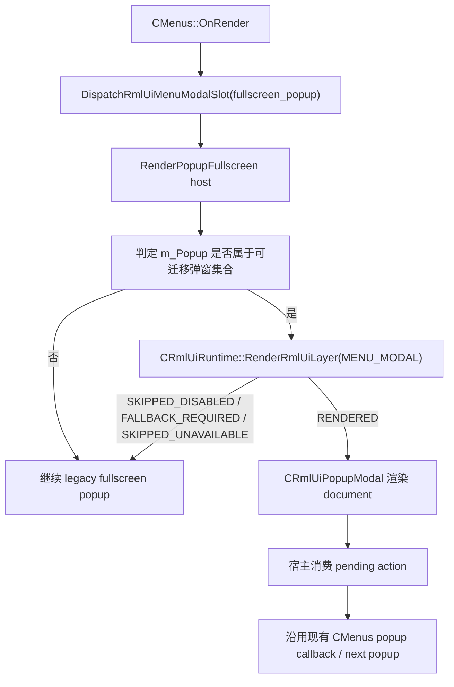

# RmlUI 弹窗迁移设计

## 0. 术语约定

| 术语 | 定义 | 防冲突结论 |
|---|---|---|
| 可迁移弹窗集合 | 本次允许进入 RmlUI 的低风险全屏提示型弹窗子集 | 不是“所有 `m_Popup` 枚举值”，也不等于 `Ui()->RenderPopupMenus()` |
| fullscreen popup host | `CMenus::RenderPopupFullscreen(...)` 这条现有全屏弹窗宿主入口 | 当前 switchboard 已给它预留 `fullscreen_popup` surface tag，可直接复用 |
| popup modal module | 挂在 `MENU_MODAL` layer 的具体 RmlUI 弹窗模块，负责 document、事件 controller 和 view model | 当前仓库没有现成实现，需要新增 |
| popup action token | RmlUI 弹窗内部按钮/热键只上报的语义动作，如 `confirm`、`cancel`、`acknowledge` | runtime-shell 不解析 DOM 事件参数，语义映射必须留在 popup module 自己内部 |
| popup fallback owner | 弹窗 RmlUI 路径失败或请求回退时，继续执行旧输入/旧渲染逻辑的宿主 owner | 输入回退 owner 是 `CMenus::OnInput`，渲染回退 owner 是 `CMenus::RenderPopupFullscreen` |

术语检索结果：

- 当前 `MENU_MODAL` 宿主接缝已经由 switchboard 收口，surface tag 包含 `connecting_popup`、`loading_popup`、`fullscreen_popup`、`popup_menu`。
- 当前 `CRmlUiInputBridge` 已验收，但它只负责输入路由、cancel 和 release-state，不负责按钮语义解析。
- 当前 `CMenus::RenderPopupFullscreen(...)` 同时承载了消息、确认、密码、演示重命名、首启向导等多种弹窗；本次必须缩成低风险子集，不能直接宣称“整个 fullscreen popup 全迁完”。

## 1. 决策与约束

### 需求摘要

`rmlui-input-bridge` 和 `rmlui-safe-mode` 已经闭合交互式 surface 的输入与安全基线，但目前 `MENU_MODAL` 仍只有宿主壳，没有任何已验收的具体交互式 RmlUI surface。`rmlui-popup-migration` 的目标是选一组低风险全屏提示型弹窗先迁到 RmlUI，证明 modal surface 可以：

- 在菜单宿主中稳定渲染；
- 消费鼠标、回车、Escape 这类 UI 输入；
- 把按钮动作安全映射回现有 `CMenus` 逻辑；
- 在文档、controller 或 runtime 失败时即时回退旧弹窗，而不把用户卡死在坏 UI。

成功标准：

- 至少一组真实、交互式、会消耗输入的全屏弹窗由 RmlUI 渲染并可完成确认/取消/关闭流程。
- `CMenus::RenderPopupFullscreen(...)` 的旧路径仍完整保留，RmlUI 只接管“可迁移弹窗集合”。
- 当前 migrated popup 的输入 owner 只在弹窗真的 active 时才接管，不会因为 toggle 开着就抢走整个菜单输入。
- popup module 的按钮语义由模块/controller 自己解释，再调用现有 `CMenus` 回调，不把 DOM 事件参数解释塞给 runtime-shell。
- 失败时同帧稳定回退 legacy popup，且 release-state 不残留 hover/pressed/text-input 状态。

### 范围拍板

本次只迁移 `CMenus::RenderPopupFullscreen(...)` 里的低风险提示型弹窗：

- `POPUP_MESSAGE`
- `POPUP_CONFIRM`
- `POPUP_WARNING`
- `POPUP_DISCONNECTED`
- `POPUP_QUIT`
- `POPUP_RESTART`

明确排除：

- `connecting_popup`、`loading_popup`
- `Ui()->RenderPopupMenus()` 这条级联 popup menu 链
- 带文本输入的 `POPUP_PASSWORD`、`POPUP_RENAME_DEMO`、`POPUP_RENDER_DEMO`、`POPUP_SAVE_SKIN`
- 带多阶段 onboarding/页面语义的 `POPUP_FIRST_LAUNCH`、`POPUP_POINTS`
- 任何 demo/browser/touch-control 专用复杂弹窗的额外视觉重做

### 复杂度档位

走默认交互式 modal migration 档位。主要风险不在渲染 API，而在：

- `CMenus` 当前 popup 状态机和回调函数指针不能被 RmlUI 越权重写；
- 同一个 `fullscreen_popup` surface tag 下，必须只让“可迁移弹窗集合”进入 RmlUI；
- 输入消费要复用已验收 input bridge，但不能把非迁移弹窗也拖进交互桥；
- 首个 popup controller 要自己持有按钮语义映射，不能把 runtime-shell 变成事件解释器。

### 关键决策

1. 本次只迁移 `fullscreen_popup` 宿主里的低风险提示型弹窗，不碰 `popup_menu` 和文本输入型 fullscreen popup。
2. 新增独立的 popup modal 模块，负责：
   - document 加载与结构校验；
   - view model 更新；
   - 按钮/热键事件绑定；
   - 把 `confirm/cancel/acknowledge/abort_reconnect` 这类 action token 暂存给宿主消费。
3. 现有按钮回调函数指针、`m_aPopupButtons[...]` 的 `NextPopup` 迁移后仍由 `CMenus` 执行；RmlUI 只发语义动作，不直接调用业务副作用。
4. 当前阶段只保留全局图形化开关 `qm_rmlui_enable`；模块级 `qm_rmlui_popup` 允许作为 runtime/config gate 存在，但不在栖梦设置页新增第二个图形化开关。
5. popup module 的 active predicate 必须同时满足：
   - 全局 RmlUI 开关开启；
   - popup 模块开关开启；
   - `CMenus` 当前 active；
   - `m_Popup` 属于“可迁移弹窗集合”。
6. popup modal 与 menu page 同属菜单侧 context domain，但宿主必须保留 page + modal 的叠层语义。
   - 不允许回退到“所有 surface 共用一个 `Rml::Context`，再由 popup/page/hud 模块各自独立 `Context::Update()` / `Context::Render()`”的模式。
   - popup 打开时允许覆盖页面壳，但不允许把页面壳当成必须先销毁或先隐藏的互斥 surface。

### 明确不做

- 不迁移 `Ui()->RenderPopupMenus()` 的选择类/级联 popup menu。
- 不迁移需要 `CLineInput` / 文本输入 / 文件名校验的 fullscreen popup。
- 不重写 `CMenus::PopupMessage(...)` / `PopupConfirm(...)` 的业务语义，只复用现有状态与回调。
- 不新增新的菜单页导航，也不借本 feature 偷跑 `menu-pilot`。
- 不在本 feature 中把弹窗视觉系统扩展成通用 design system。

### 前置依赖

- `rmlui-layer-switchboard`：已提供 `MENU_MODAL` 宿主 slot 与 `fullscreen_popup` surface tag。
- `rmlui-input-bridge`：已提供 active predicate、legacy fallback owner、cancel/release-state 基线。
- `rmlui-safe-mode`：已提供 modal surface 失败时的统一安全回退护栏。
- `rmlui-monitoring-hud-migration`：已证明“具体 RmlUI surface + 宿主 fallback owner”的迁移样板成立。

## 2. 名词与编排

### 2.1 名词层

#### 现状

- `src/game/client/components/menus.cpp` 的 `RenderPopupFullscreen(...)` 用单个大分支渲染多种 `m_Popup` 枚举值。
- `POPUP_MESSAGE` / `POPUP_CONFIRM` 依赖 `m_aPopupTitle`、`m_aPopupMessage` 和 `m_aPopupButtons[BUTTON_CONFIRM/CANCEL]`；动作执行方仍是 `CMenus` 的成员函数指针。
- `POPUP_WARNING`、`POPUP_DISCONNECTED`、`POPUP_QUIT`、`POPUP_RESTART` 也都在同一个 fullscreen popup 宿主里，但按钮布局和关闭条件略有差异。
- `CMenus::OnInput(...)` 当前会把菜单 active 态下的事件都先送给 `Ui()->OnInput(...)`，并处理 Escape 激活/关闭行为。
- `src/game/client/RmlUi/` 当前只有 monitoring HUD concrete module，没有 modal controller、按钮事件绑定或 popup 专用 view model。

#### 变化

新增一组 popup migration 专用名词：

- `ERmlUiPopupKind`
  - `MESSAGE`
  - `CONFIRM`
  - `WARNING`
  - `DISCONNECTED`
  - `QUIT`
  - `RESTART`
- `SRmlUiPopupViewModel`
  - `m_Kind`
  - `m_Title`
  - `m_Message`
  - `m_ConfirmLabel`
  - `m_CancelLabel`
  - `m_ShowCancel`
  - `m_AllowEnterConfirm`
  - `m_AllowEscapeCancel`
  - `m_SeverityTone`
  - `m_DetailLine`
- `ERmlUiPopupAction`
  - `NONE`
  - `ACKNOWLEDGE`
  - `CONFIRM`
  - `CANCEL`
  - `ABORT_RECONNECT`
- `CRmlUiPopupModal`
  - 持有 document、结构校验、view model 更新和 pending action
  - 自己绑定按钮/热键事件，不把事件语义上抛给 runtime-shell
  - 对外只暴露“本帧渲染是否成功”和“宿主是否有 pending action 可取走”
- `SRmlUiPopupMigrationScope`
  - 宿主判定当前 `m_Popup` 是否属于可迁移集合的快照
  - 只服务 runtime active predicate 与 host fallback 选择，不对外变成新全局状态机

#### 接口示例

```cpp
enum class ERmlUiPopupAction
{
	NONE,
	ACKNOWLEDGE,
	CONFIRM,
	CANCEL,
	ABORT_RECONNECT,
};

struct SRmlUiPopupViewModel
{
	ERmlUiPopupKind m_Kind;
	const char *m_pTitle;
	const char *m_pMessage;
	const char *m_pConfirmLabel;
	const char *m_pCancelLabel;
	bool m_ShowCancel;
	bool m_AllowEnterConfirm;
	bool m_AllowEscapeCancel;
	const char *m_pDetailLine;
};

class CRmlUiPopupModal
{
public:
	bool Init(CRmlUiCore *pCore);
	bool RenderDocument(const CUIRect &View, const SRmlUiPopupViewModel &ViewModel);
	ERmlUiPopupAction ConsumePendingAction();
	bool IsMigratablePopup(int PopupId) const;
};
```

正常示例：

- `POPUP_CONFIRM` 进入 RmlUI，显示标题、正文、确认/取消按钮；
- 点击确认按钮后 module 只记录 `CONFIRM`；
- 宿主消费 action 后，仍由 `CMenus` 执行原有 `m_aPopupButtons[BUTTON_CONFIRM]` 的 `NextPopup + callback`。

反例：

- 让 runtime-shell 直接知道 `BUTTON_CONFIRM`、`BUTTON_CANCEL` 或 `CMenus::*callback`；
- 把 `POPUP_PASSWORD` 也塞进同一套 document，但内部又偷偷走 `CLineInput`。

### 2.2 编排层



#### 现状

- `CMenus::OnRender()` 已经在 fullscreen popup 进入前调用 `DispatchRmlUiMenuModalSlot("fullscreen_popup")`，但当前只是在 switchboard 层占位，真正内容仍全走 legacy。
- `RenderPopupFullscreen(...)` 内部按 `m_Popup` 分支直接消费 `Ui()->ConsumeHotkey(HOTKEY_ESCAPE/HOTKEY_ENTER)`、按钮点击和 callback 执行。
- runtime 目前没有“当前 popup 是否真的 active”的模块级判断，也没有 popup action controller。

#### 变化

1. `fullscreen_popup` 宿主继续留在 `CMenus::OnRender()` / `RenderPopupFullscreen(...)`。
2. 宿主进入 popup migration 判定：
   - `m_Popup` 不在可迁移集合内：直接 legacy；
   - 在可迁移集合内：允许 popup module 进入 `MENU_MODAL` runtime + input bridge。
3. popup module 渲染成功后：
   - 宿主不再绘制 legacy popup 内容；
   - 宿主仅在本帧尾部消费 module 给出的 `ERmlUiPopupAction`；
   - action 映射回既有 `m_aPopupButtons[...]` 或 popup-specific legacy callback。
4. popup module 渲染失败、document 结构无效、safe mode 触发或输入桥要求 fallback：
   - 先 release-state；
   - 同帧回到 legacy fullscreen popup；
   - 不改变当前 `m_Popup` 业务状态。
5. popup close / fallback / deactivate：
   - 必须立即清掉当前 modal 的可见与 pending-input 状态；
   - 不能依赖“等下一次菜单 render 时再顺带 HideNow”之外的延后清理假设；
   - 不能通过隐藏 menu page 来间接实现 modal 收口。

#### 流程级约束

- popup module 只能解释自己 document 里的按钮动作，不允许 runtime-shell 或 input bridge 解析 DOM 事件参数。
- `FLAG_RELEASE` 广播纪律继续沿用输入桥当前基线，不能为了 modal surface 把旧菜单释放态吞掉。
- migrated popup 的 Escape / Enter 行为必须与当前 legacy 语义一致：
  - `MESSAGE` / `WARNING`：Enter 或 Escape 走 acknowledge；
  - `CONFIRM`：Enter 走 confirm，Escape 走 cancel；
  - `QUIT` / `RESTART`：Escape 走 `No`，确认按钮走 legacy side-effect；
  - `DISCONNECTED`：有 reconnect 倒计时时确认动作语义是 `ABORT_RECONNECT`，无倒计时时是 acknowledge。
- `popup_menu` 与 `fullscreen_popup` 共享 `MENU_MODAL` layer，但本 feature 不让 `popup_menu` 进入 popup module。
- 图形化设置页仍只显示 `qm_rmlui_enable`；`qm_rmlui_popup` 不在本 feature 中新增到栖梦设置页。
- 如果 menu page 同时存在，popup 只抢输入 owner，不抢页面壳的存在资格；菜单侧统一编排必须保证“page 在下、modal 在上”的结果，而不是 page 被 modal 激活逻辑误隐藏。

### 2.3 挂载点清单

- `src/game/client/RmlUi/RmlUiPopupModal.*`：新增 popup modal concrete module 与 event controller。
- `src/game/client/gameclient.*`：注册 `qm_rmlui_popup` 模块描述、active predicate、render callback 与 input fallback owner。
- `src/game/client/components/menus.cpp`：fullscreen popup 宿主接入“是否属于可迁移集合”的判定、view model 供给和 pending action 消费。
- `data/qmclient/rmlui/`：新增 popup modal 的 `.rml` / `.rcss` 资源。
- `src/test/`：新增 popup migration 的 runtime / module / host contract 定向测试。

### 2.4 推进策略

1. popup contract 切片：定义可迁移弹窗集合、popup view model 和 action token。
   退出信号：能够明确表达“哪些 popup 可以迁、哪些不能迁、RmlUI 只回传什么语义动作”。
2. popup module 切片：实现 `CRmlUiPopupModal`、document 结构校验和 pending action controller。
   退出信号：module 能独立渲染消息/确认型弹窗，并能输出稳定 action token。
3. 宿主接线切片：把 `RenderPopupFullscreen(...)` 里的低风险集合接到 popup module，其余 popup 保持 legacy。
   退出信号：fullscreen popup host 可按 popup kind 选择 RmlUI 或 legacy，而不破坏原有 callback / next popup 语义。
4. 输入与回退切片：接 active predicate、`CMenus::OnInput` fallback owner、cancel/release-state 与 safe-mode。
   退出信号：迁移后的 popup 真正消费 UI 输入，失败时同帧回退旧弹窗。
5. 验证切片：补 targeted tests、构建验证和人工验收清单。
   退出信号：有自动证据证明 popup migration 不会把非迁移弹窗、文本输入型弹窗和 popup_menu 一起误带入。

### 2.5 结构健康度与微重构

#### 评估

- 文件级：`src/game/client/components/menus.cpp` 已经非常长，而且 `RenderPopupFullscreen(...)` 本身就是一个多分支宿主函数；继续把 RmlUI document/controller 直接塞进去会让宿主和 surface 实现彻底混杂。
- 文件级：`src/game/client/gameclient.cpp` 已经持有 runtime 注册和 Monitoring HUD 宿主 glue；如果 popup module 的 document/controller 也堆进去，会把“宿主 glue”和“surface 具体实现”混成同一层。
- 目录级：`src/game/client/RmlUi/` 已经承载 concrete surface（Monitoring HUD）和 runtime glue（runtime/switchboard/core/input bridge）；popup module 放这里是当前最自然的归属。
- compound convention 检查：当前 `.codestable/compound/` 里没有额外要求把 popup surface 归到别的目录，也没有“fullscreen popup 必须拆进 menus 子文件”的现成约束。

#### 结论：不做独立前置微重构，但新逻辑默认放新文件

本次不单独起“只搬不改行为”的微重构前置步骤；但 popup concrete module、document/controller 和 view model 更新必须落在新的 `src/game/client/RmlUi/RmlUiPopupModal.*`，不能直接扩写到 `menus.cpp` 里。`menus.cpp` 只保留：

- popup 可迁移范围判定；
- legacy popup state -> RmlUI view model 的最薄适配；
- RmlUI action -> 现有 `CMenus` callback / next popup 的最薄回接。

#### 超出范围的观察

- 如果后续要迁 `popup_menu`，更像是 `CUi` 级 selection/message popup 子系统迁移，不应在这次 fullscreen popup feature 里顺手带上。
- 如果后续要迁 `POPUP_PASSWORD` / `RENAME_DEMO` / `SAVE_SKIN`，需要单独设计文本输入、`CLineInput` ownership 和 IME 生命周期，不应复用这次“低风险提示型弹窗”范围硬冲。

## 3. 验收契约

### 关键场景清单

- `S1` 低风险单按钮弹窗
  - 输入 / 触发：打开 `POPUP_MESSAGE` 或 `POPUP_WARNING`。
  - 期望：RmlUI 弹窗显示标题、正文和单按钮；Enter/Escape 都能关闭；失败时立即回旧弹窗。

- `S2` 低风险双按钮确认弹窗
  - 输入 / 触发：打开 `POPUP_CONFIRM`、`POPUP_QUIT` 或 `POPUP_RESTART`。
  - 期望：RmlUI 弹窗消费鼠标点击、Enter、Escape；确认和取消动作最终仍触发原有 `CMenus` callback / next popup 语义。

- `S3` 动态说明型断线弹窗
  - 输入 / 触发：打开 `POPUP_DISCONNECTED`，分别覆盖“普通确定”和“重连倒计时中止”两种状态。
  - 期望：detail line/按钮文案与 legacy 语义一致；确认动作按当前状态分别走 acknowledge 或 abort reconnect。

- `S4` popup active predicate 守护
  - 输入 / 触发：全局开关开启，但当前没有 migratable popup、或打开的是 `POPUP_PASSWORD` / `POPUP_RENDER_DEMO`。
  - 期望：RmlUI popup 模块不接管输入也不抢渲染，完整走 legacy。

- `S5` fallback / safe-mode
  - 输入 / 触发：文档缺失、结构非法、controller 失败或 runtime 返回 `FALLBACK_REQUIRED`。
  - 期望：release-state 先执行，再同帧回到 legacy popup，不能出现黑屏、卡死或无按钮可点。

### 反向核对项

- 本 feature 完成后：
  - `popup_menu` 仍然不是这次迁移的一部分。
  - 文本输入型 fullscreen popup 仍走 legacy。
  - 栖梦设置页仍然只有全局 `qm_rmlui_enable` 图形化开关。
  - `menu-pilot` 不因本 feature 被提前宣称完成。

## 4. 与项目级架构文档的关系

如果本 feature 实现并验收通过，需要回写：

- `.codestable/architecture/ARCHITECTURE.md`
  - 把“popup modal concrete surface 已落地”写进 RmlUI current-state 组件索引。
- `.codestable/architecture/ui-rmlui-current.md`
  - 把 `CRmlUiPopupModal`、可迁移 popup 集合、`fullscreen_popup` host owner、`CMenus::OnInput` fallback owner、“模块自己解释 action token”的边界，以及“modal 覆盖 page 但不隐藏 page”的菜单侧叠层语义写成 current。
- `.codestable/requirements/rmlui-full-replacement.md`
  - 把“首个交互式 modal surface 已验收”补进 `implemented_by` 与变更日志。
- `.codestable/roadmap/rmlui-full-replacement/*`
  - 当前 design 落地后，items.yaml 进入 `in-progress`，readiness 从 `ready-for-design` 提升为 `ready-for-impl`。

本次 design 不直接把 popup migration 写进 current architecture；只有实现与验收完成后，才能从“宿主 seam 已存在”升级为“具体 popup surface 已迁移”。
