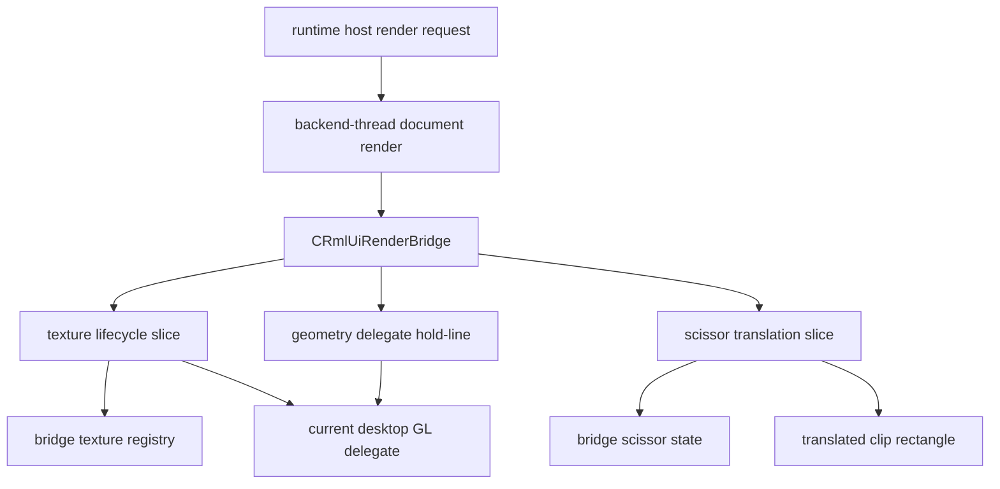

# rmlui-scissor-texture-bridge design

## 0. 术语约定

| 术语 | 定义 | 防冲突结论 |
|---|---|---|
| bridge texture registry | RmlUI bridge 自己持有的纹理句柄登记表，负责把 `Rml::TextureHandle` 映射到当前 delegate backend 资源及尺寸/来源元数据 | 当前仓库已有 `CTextureHandle` 生命周期管理，但没有 RmlUI 专用的 texture registry |
| bridge scissor state | RmlUI bridge 自己持有的一份裁剪状态，负责把 `Rml::Rectanglei` 语义翻译成当前 graphics clip 语义 | 当前 graphics 有 `ClipEnable/ClipDisable`，但没有 RmlUI bridge owns 的 scissor translation 层 |
| bridge delegate | 当前 bridge 内部实际承接桌面 OpenGL 纹理/裁剪行为的 delegate，实现上仍可复用 `RenderInterface_GL3` | 不是长期 multi-backend bridge 本体，只是这一阶段的桌面 delegate |
| generated texture path | `GenerateTexture(...)` 产生的临时纹理路径，当前需要显式保留 premultiplied alpha 兼容规则 | 上游 compatibility adapter 已有这条兼容逻辑，但 QmClient 还没把它提升成自己的 bridge contract |
| geometry hold-line | 本 feature 明确不接手的部分：compiled geometry、layer/filter/shader、full blend submission 仍保持现有 delegate 行为 | 用来防止把 texture/scissor slice 扩成 full render bridge |

术语检索结果：当前代码已有 `CRmlUiBackend`、`CRmlUiCore`、`RenderInterface_GL3`、`IGraphics::CTextureHandle`、`ClipEnable/ClipDisable` 和 accepted minimal bridge callback。没有现成的 `CRmlUiRenderBridge`、没有 RmlUI texture registry，也没有单独的 scissor translation owner。

## 1. 决策与约束

### 需求摘要

`rmlui-render-command-bridge` 已经完成了“document/core render 不再直接争抢 GL context”的最小切片，但它仍然把 texture/scissor 行为隐藏在 `RenderInterface_GL3` prototype 里。下一步需要先把这两层责任显式提到 QmClient bridge 自己的契约里：明确谁拥有 RmlUI texture handle、generated texture 走哪条生命周期、`Rml::Rectanglei` 怎样翻译到当前 graphics clip 语义，以及这些行为如何保持在 current delegate 上可运行而不误报为 full backend-neutral bridge。

成功标准：

- `LoadTexture(...)`、`GenerateTexture(...)`、`ReleaseTexture(...)`、`EnableScissorRegion(...)`、`SetScissorRegion(...)` 不再只是 raw `RenderInterface_GL3` 的隐含行为，而是先经过 QmClient 自己的 bridge contract。
- bridge 有显式的 texture registry，能把 `Rml::TextureHandle` 与当前 delegate handle、尺寸和来源类型关联起来。
- scissor translation 的 owner 唯一且明确，不出现双重 Y 翻转或“谁都在改坐标”的状态。
- 当前切片不在 backend-thread callback 里直接调用 main-thread-only 的 `IGraphics::LoadTextureRaw*` 路径。
- 文档、命名和验收都明确写出：geometry/layer/filter/shader/full blend bridge 仍未完成。

明确不做：

- 不在本 feature 中接手 compiled geometry 生命周期或 full draw submission。
- 不在本 feature 中实现 layer/filter/shader/save-layer/clip-mask 的完整 bridge。
- 不在本 feature 中迁移 Monitoring HUD、菜单、弹窗、轮盘或 settings surface。
- 不在本 feature 中把 desktop GL delegate 换成 Vulkan/Android 实现。
- 不在本 feature 中引入通用输入逻辑或 layer switchboard。

### 复杂度档位

走 render bridge 契约收紧默认档位。风险来自 texture/scissor ownership、thread boundary 和坐标语义，不在协议、物理或持久化兼容性。

### 关键决策

1. 新增一个 bridge-owned render interface wrapper，由它接住 texture/scissor 调用；geometry 仍先委托给当前 desktop GL delegate。
2. texture lifecycle 本 slice 不直接复用 main-thread-only `IGraphics::LoadTextureRaw*` 作为 bridge 执行面；当前 desktop delegate 仍可在 backend-thread render path 内承接实际纹理实现。
3. generated texture 的 premultiplied alpha 兼容规则必须从“vendored adapter 的隐式行为”提升为 QmClient bridge 的显式契约。
4. scissor translation 只允许一个 owner；这一步先把 `Rml::Rectanglei` → 当前 clip 语义的转换写死在 bridge 层，不把坐标翻译分散给 host/runtime/backend 多处。
5. diagnostics 和 acceptance 必须把 “bridge texture/scissor slice done，geometry hold-line 未动” 写明，避免误把此 feature 当作 full render bridge。

### 前置依赖

- `rmlui-runtime-shell` 已完成并提供 runtime/result/fallback 结构。
- `rmlui-render-command-bridge` 已完成 accepted minimal bridge baseline。
- `rmlui-resource-diagnostics` 已提供 resource failure 结构化诊断基线。

### Feature 级落地字段

- host owner：当前仍是 `CGameClient::RenderQmMonitoringHud` 通过 runtime module render path 触发 bridge。
- fallback owner：bridge 失败仍回到 `CGameClient::RenderQmMonitoringHud` 的旧 HUD fallback。
- diagnostics owner：bridge texture/scissor 失败由 bridge surface 自己暴露失败原因，再经 runtime diagnostics / host 导出链路带出。
- input owner：无；本 feature 不增加输入消费能力。
- backend assumption：当前实现允许 desktop GL delegate 继续存在，但 bridge public contract 不得写死 `RenderInterface_GL3` 名称或 OpenGL-only 生命周期。
- evidence owner：targeted C++ tests + 实际运行日志/截图，证明 texture/scissor 行为不再只是 raw GL3 hidden behavior。

## 2. 名词与编排

### 2.1 名词层

#### 现状

- `src/engine/client/rmlui_backend.cpp` 当前直接构造并持有 `RenderInterface_GL3`，`CRmlUiBackend::RenderInterface()` 直接把它暴露给 `CRmlUiCore`。
- vendored RmlUI 的 `RenderInterfaceCompatibility` / `RenderInterfaceAdapter` 已经定义了 compatibility surface，但当前 QmClient 没有自己的 texture registry 或 scissor translation owner。
- `src/engine/graphics.h` / `IGraphics` 已有 `ClipEnable/ClipDisable` 与 texture load/unload API，但 `LoadTextureRaw(...)` / `LoadTextureRawMove(...)` 在 `graphics_threaded.cpp` 明确要求 main thread 调用。
- accepted minimal bridge 让 document render 运行在 backend-thread callback；因此 texture lifecycle 不能简单塞回 main-thread-only graphics upload surface。

#### 变化

- 新增 `CRmlUiRenderBridge`（命名暂定）作为 QmClient 自己拥有的 render interface wrapper。
- `CRmlUiBackend` 不再直接把 raw `RenderInterface_GL3` 暴露为 runtime 可见 surface，而是持有：
  - bridge 自己的 render interface wrapper；
  - 当前 desktop GL delegate；
  - bridge texture registry 与 scissor state。
- texture registry 至少记录：
  - bridge texture handle；
  - delegate texture handle；
  - 纹理来源类型（file / generated）；
  - 当前尺寸；
  - 是否已释放。
- scissor state 至少记录：
  - 当前 enable/disable；
  - 最近一次 RmlUI `Rectanglei`；
  - 翻译后的 current clip rectangle。

#### 接口示例

```cpp
enum class ERmlUiBridgeTextureSource
{
	FILE_TEXTURE,
	GENERATED_TEXTURE,
};

struct SRmlUiBridgeTextureRecord
{
	Rml::TextureHandle m_BridgeHandle;
	Rml::TextureHandle m_DelegateHandle;
	ERmlUiBridgeTextureSource m_Source;
	Rml::Vector2i m_Dimensions;
	bool m_Released;
};

struct SRmlUiBridgeScissorState
{
	bool m_Enabled;
	Rml::Rectanglei m_RmlRegion;
	int m_ClipX;
	int m_ClipY;
	int m_ClipW;
	int m_ClipH;
};

class CRmlUiRenderBridge final : public Rml::RenderInterface
{
public:
	Rml::TextureHandle LoadTexture(Rml::Vector2i &TextureDimensions, const Rml::String &Source) override;
	Rml::TextureHandle GenerateTexture(Rml::Span<const Rml::byte> SourceData, Rml::Vector2i SourceDimensions) override;
	void ReleaseTexture(Rml::TextureHandle TextureHandle) override;
	void EnableScissorRegion(bool Enable) override;
	void SetScissorRegion(Rml::Rectanglei Region) override;
};
```

正常示例：RmlUI render path 首次请求 file texture -> bridge 调用 current delegate 生成 delegate handle -> registry 记录 `bridge handle → delegate handle` -> 后续 geometry render 继续使用 delegate handle。

错误示例：bridge 无法为 generated texture 建立 delegate handle -> 返回无效 handle，并把失败暴露为 bridge texture failure，而不是静默落成“空贴图但仍宣称 bridge 成功”。

### 2.2 编排层



#### 现状

当前编排里，texture/scissor 行为被藏在 raw `RenderInterface_GL3` 里：

- runtime/core/host 看不到 texture handle registry；
- generated texture 的 alpha compatibility 只作为上游 compatibility 行为存在；
- scissor rectangle 的坐标语义没有 QmClient 自己的 owner；
- current backend-thread render path 与 main-thread texture upload API 之间存在明确断层。

#### 变化

- host/runtime 仍只关心 frame result，不解释 texture/scissor 细节。
- backend-thread render path 进入 bridge wrapper 后：
  - texture lifecycle 先经过 bridge registry；
  - scissor enable/set 先经过 bridge translation；
  - geometry 仍委托给 current delegate。
- 当前 desktop GL delegate 只是 bridge 的内部实现细节，而不再是 public contract。

#### 流程级约束

- bridge wrapper 不得在 backend-thread callback 中直接调用 main-thread-only `IGraphics::LoadTextureRaw*`。
- texture release 必须同时清理 bridge registry 和 delegate handle，不允许只删一边。
- scissor translation 只能做一次；host/runtime/backend 任一侧都不得再补一层额外 Y 翻转。
- generated texture 的 alpha normalization 规则必须显式测试，不允许继续只依赖 vendored adapter 的“顺带兼容”。
- geometry/layer/filter/shader 仍是 hold-line，不得借本 feature 顺手接管。
- runtime/result/fallback 语义不得变化。

### 2.3 挂载点清单

- `src/engine/client/rmlui_backend.*`：backend 不再直接暴露 raw `RenderInterface_GL3`，改为拥有 bridge wrapper + current delegate。
- `src/engine/client/rmlui_render_bridge.*`：新增 QmClient 自己的 bridge wrapper、texture registry 和 scissor state owner。
- `src/game/client/RmlUi/RmlUiCore.*`：继续只消费 `Rml::RenderInterface` surface，不感知 current delegate 类型。
- `src/test/rmlui_runtime_test.cpp` 或新增 bridge 专项测试：补 texture/scissor slice 的 targeted test。

### 2.4 推进策略

1. bridge wrapper 骨架：新增 `CRmlUiRenderBridge` 和最小 texture/scissor state surface，backend 改为持有 wrapper + current delegate。
   退出信号：`CRmlUiBackend` 不再把 raw `RenderInterface_GL3` 作为唯一 public surface 暴露。
2. texture lifecycle slice：落地 file/generated/release 三条路径、registry 和 alpha normalization contract。
   退出信号：texture handle 有显式 registry，generated texture 不再只靠 vendored adapter 的隐式兼容。
3. scissor translation slice：落地 enable/set translation 和 single-owner clip semantics。
   退出信号：bridge 有明确的 scissor state，且不存在双重 Y 翻转。
4. 构建与证据验证：构建 game-client / testrunner，跑 targeted test，并用实际运行证据证明 current desktop path 仍可用。
   退出信号：构建通过，targeted test 通过，且运行证据能说明 texture/scissor 已进入 QmClient bridge contract。

### 2.5 结构健康度与微重构

#### 评估

- 文件级 — `src/engine/client/rmlui_backend.cpp`：当前职责是 backend init / lifecycle / file/system interface；如果继续把 texture registry 和 scissor translation 也塞进去，会把“backend setup”和“bridge ownership”混成一个大文件。
- 文件级 — `src/game/client/RmlUi/RmlUiCore.*`：当前只应消费抽象 render interface，不该知道 texture/scissor internal state。
- 目录级 — `src/engine/client/`：render interface 和 backend lifecycle 同属 engine client 侧，新加 bridge file 落这里比塞进 `src/game/client/RmlUi/` 更自然。

#### 结论：不做独立微重构，但新增独立 bridge 文件

这一步不需要一个“先搬后改行为”的独立微重构步骤；但 texture/scissor bridge 逻辑必须放进新的 `src/engine/client/rmlui_render_bridge.*`，不能继续扩写 `rmlui_backend.cpp`。

#### 超出范围的观察

- 如果后续要把 texture lifecycle 真正接到 backend-neutral engine upload surface，可能还需要新的 graphics-side upload seam；这超出本 feature。
- geometry submission、layer/filter/shader、save-layer 和 full blend behavior 仍需要后续 feature 单独收口。

## 3. 验收契约

### 关键场景清单

- 触发：RmlUI file texture 首次加载 -> 期望：bridge 建立显式 registry 记录，并返回稳定的 bridge handle。
- 触发：RmlUI generated texture 生成 -> 期望：bridge 明确执行 alpha compatibility 规则，并能建立/release delegate texture lifecycle。
- 触发：RmlUI texture release 或 backend shutdown -> 期望：bridge registry 与 delegate texture handle 一起清理，不残留悬挂映射。
- 触发：RmlUI 启用/更新 scissor -> 期望：bridge 自己持有 translated clip semantics，裁剪区域不出现双重 Y 翻转。
- 触发：accepted minimal bridge 的 backend-thread document render 继续运行 -> 期望：不会因为 texture/scissor slice 回退到 main-thread-only texture upload assert。
- 触发：构建与实际运行 -> 期望：desktop GL 当前路径仍可用，且日志/测试能说明 texture/scissor 已被 bridge wrapper 接住。

### 明确不做的反向核对项

- 本 feature 不应宣称 compiled geometry/full draw submission bridge 已完成。
- 本 feature 不应宣称 layer/filter/shader/save-layer/clip-mask 已完成 bridge。
- 本 feature 不应删除 current desktop GL delegate。
- 本 feature 不应迁移 Monitoring HUD、菜单、弹窗、轮盘或 editor surface。
- 本 feature 不应宣称 Vulkan/Android 已被当前 slice 覆盖。

## 4. 与项目级架构文档的关系

acceptance 阶段需要把以下现状回写到 architecture：

- backend 当前通过 QmClient 自己的 bridge wrapper 持有 texture/scissor contract，而不是只暴露 raw `RenderInterface_GL3`。
- texture registry 与 scissor translation 已有 single owner。
- geometry 仍由 current delegate 承接，full backend-neutral render bridge 仍未完成。
