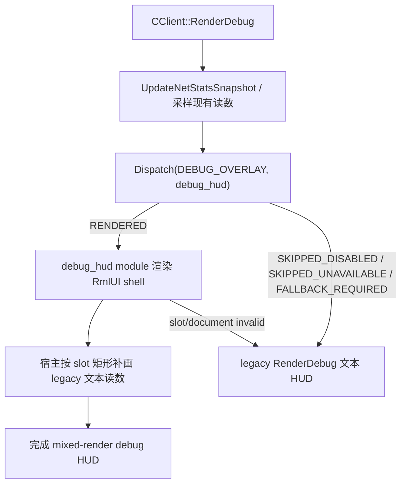

# rmlui-debug-hud-migration 设计

## 0. 术语约定

| 术语 | 定义 | 防冲突结论 |
|---|---|---|
| debug stats HUD | `CClient::RenderDebug()` 当前输出的只读统计叠加层，包含 tick / frametime / memory / network / snapshot 这些文本读数 | 本次唯一 concrete surface；不等于所有 debug overlay |
| debug overlay slot | `DEBUG_OVERLAY` 这一层的宿主调度槽位，由 `CClient::RenderDebug()` 进入 switchboard | 当前 slot 已存在，但还没有 concrete RmlUI module |
| mixed-render debug shell | 复用 Monitoring HUD 的 mixed-render 样板：RmlUI 持有面板布局、标题和 slot，legacy 代码继续生成并绘制读数字符串 | 本次不把全部调试文本一次性改写成纯 RmlUI text tree |
| snapshot table slot | 承载 `RenderDebug()` 里 snapshot rate / update 列表的只读矩形区域 | 是 surface contract 的一部分，不是未来 inspector/editor 的占位 |
| legacy debug fallback owner | 当 RmlUI 路径 disabled / unavailable / failed 时，继续负责完整 debug HUD 绘制的旧宿主 | owner 仍是 `CClient::RenderDebug()`，不能转移给 runtime 或 module |

术语检索结论：

- 当前已验收的 `DEBUG_OVERLAY` 事实只有宿主 slot：`CClient::RenderDebug()` 先调用 `GameClient()->DispatchRmlUiDebugOverlaySlot()`，随后直接继续 legacy debug 文本绘制。
- 当前真正的 RmlUI concrete module 仍只有 Monitoring HUD 与 popup modal；debug overlay 还没有 module、资源文件或模块级开关代码落地。
- `RenderGraphs()` 里的监控图表已经归 Monitoring HUD 路径，本次不能把它并回 debug HUD 迁移。

## 1. 决策与约束

### 需求摘要

`rmlui-layer-switchboard` 已经把 `DEBUG_OVERLAY` 宿主接缝固定到 switchboard，`rmlui-monitoring-hud-migration` 也已经给出第一条可验收的 mixed-render 样板，但 debug overlay 当前仍只是“先探测 slot，再无条件走 legacy 文本 HUD”。这次 design 的目标不是把所有开发覆盖层都迁进 RmlUI，而是挑一个最窄、最真实、最不吃输入的 debug surface，验证它能在游戏画面上稳定叠加，并且继续保留旧路径。

本次拍板的唯一 surface：

- **只迁 `CClient::RenderDebug()` 当前这块只读统计 HUD。**

它包含：

- tick / predicted tick
- prediction time / FPS / frametime
- texture / buffer / streamed / staging memory
- send / recv 网络统计
- snapshot rate / updates 表格

它明确排除：

- `RenderGraphs()` 对应的 Monitoring HUD / graphs 路径
- `RenderDebugClip(...)` 这类 map debug 可视化
- HUD editor、developer inspector、popup、menu、settings
- 任何需要消费 gameplay 输入的 surface

成功标准：

- `DEBUG_OVERLAY` 层首次拥有一个 concrete RmlUI surface，但范围仍只收在 `RenderDebug()` 当前文本统计 HUD。
- surface 继续复用 Monitoring HUD 的 mixed-render 模式：RmlUI 负责 debug shell 和 slot 布局，legacy 路径继续生成并绘制统计读数。
- 失败、关闭模块开关、safe-mode 降级或 runtime unavailable 时，`CClient::RenderDebug()` 同帧完整回到旧文本 HUD。
- surface 默认只读，不消费 gameplay 输入，也不改变 `g_Config.m_Debug` 的现有启用语义。
- 设计对 current state 的描述保持诚实：当前代码还没有 `qm_rmlui_debug_hud` 实现、也没有 debug concrete module。

### 范围拍板

本次只设计一条 `DEBUG_OVERLAY` concrete surface：

- `CClient::RenderDebug()` 当前整块只读统计 HUD

本次不设计：

- 通用 debug overlay 框架
- popup / menu / settings 的任何 surface
- inspector / editor 类高优先级开发工具
- Monitoring HUD 图表或监控采样逻辑
- 输入桥的新协议

### 复杂度档位

这是“首条 `DEBUG_OVERLAY` concrete surface”档位，复杂度低于 menu/popup 这类交互式页面，但高于单纯 switchboard 占位。风险主要集中在：

- 如何把 `RenderDebug()` 现有 monolithic 文本绘制拆成 mixed-render 可复用的 surface contract；
- 如何确保 slot 失败时仍是完整 legacy HUD，而不是半个 RmlUI 壳；
- 如何把 reserved roadmap 开关 `qm_rmlui_debug_hud` 写成 target state，而不伪装成当前已存在事实。

### 关键决策

1. `DEBUG_OVERLAY` 的首个 concrete migration 不做“所有 debug overlay”，只做 `RenderDebug()` 当前只读统计 HUD。
2. 复用 Monitoring HUD mixed-render 样板：RmlUI 管布局和矩形，legacy 代码继续负责读数组织与文本绘制。
3. legacy fallback owner 固定保留在 `CClient::RenderDebug()`；runtime、safe-mode 和 concrete module 只能决定“是否回落”，不能代画旧 HUD。
4. surface 默认只读，不消费 gameplay 输入；`rmlui-input-bridge` 这里只复用“HUD/debug surface 默认不吃输入”的已验收边界，不新增 owner priority 变化。
5. 模块级 gate 沿用 roadmap 预留名 `qm_rmlui_debug_hud` 作为 target state，但 design 必须明确：当前代码还没有这个 config key。
6. 本功能不把 menu/popup/settings 需求塞进 `DEBUG_OVERLAY`；如果后续需要 inspector/editor，另走 `EDITOR_OVERLAY` 或独立 debug surface design。

### 明确不做

- 不迁移 `RenderGraphs()` / Monitoring HUD。
- 不迁移 map clip、collision、render-layer 等 debug 可视化。
- 不迁移 developer inspector、HUD editor、popup 或 menu page。
- 不引入鼠标、键盘、cancel、release-state 的新输入语义。
- 不把纯 RmlUI text / table 重写当作本次成功标准。

### 前置基线

- `rmlui-monitoring-hud-migration`：提供 mixed-render、surface contract 和 fallback owner 样板。
- `rmlui-layer-switchboard`：提供 `DEBUG_OVERLAY` 宿主 slot 与固定 dispatch order。
- `rmlui-safe-mode`：提供 repeated-failure demotion 与 diagnostics 口径。
- `rmlui-input-bridge`：提供“HUD / overlay 默认不抢 gameplay 输入”的 accepted boundary。

### Feature 级落地字段

| 字段 | 本次口径 | 验收边界 |
|---|---|---|
| host owner | 仍是 `CClient::RenderDebug()`；它负责进入 `DEBUG_OVERLAY` slot、维持现有 debug gate，并在 RmlUI 成功时补画 mixed-render 读数或在失败时走完整 legacy HUD。 | 不允许新建平行 debug 主循环，也不允许把 owner 漂到 `CGameClient` 之外的别处。 |
| fallback owner | 仍是 `CClient::RenderDebug()` 当前 legacy 文本 HUD 路径。 | 不允许出现“只剩 RmlUI 壳”或“只剩部分读数”的半失效状态。 |
| diagnostics owner | 继续由 runtime diagnostics、`qm_rmlui_debug_diagnostics` 和 safe-mode 口径承担；debug concrete surface 只补 document / slot / stage 结果。 | 不新造第三套 debug 错误系统；要能区分 surface contract 失败与 runtime/safe-mode 失败。 |
| input owner | 无；surface 默认只读，不消费 gameplay 输入，也不改变 `g_Config.m_Debug` 的现有开关语义。 | 不允许把 `DEBUG_OVERLAY` surface 做成需要抢键鼠的交互面。 |
| backend assumption | 只建立在当前已验收的 desktop render bridge、switchboard 和 Monitoring mixed-render 基线上；不新增 OpenGL / Vulkan / Android 专属承诺。 | 不把单后端现状包装成“所有 backend 都已解决”的 current state。 |
| evidence owner | 自动证据由 targeted tests、构建验证和 diagnostics 结果承担；最终同屏叠加表现由人工验收承担。 | 自动证据至少覆盖 rendered / fallback / safe-mode / no-input 边界；人工验收至少覆盖叠加稳定和 legacy 回落。 |

## 2. 名词与编排

### 2.1 名词层

#### 现状

- `src/engine/client/client.cpp` 的 `CClient::RenderDebug()` 当前在 `g_Config.m_Debug` 为真时：
  - 先调用 `GameClient()->DispatchRmlUiDebugOverlaySlot()`；
  - 再调用 `UpdateNetStatsSnapshot()`；
  - 然后直接用 `Graphics()->QuadsText(...)` 绘制 tick、memory、network 和 snapshot 统计文本。
- `CGameClient::DispatchRmlUiDebugOverlaySlot()` 当前只有 slot 探测能力：没有 `DEBUG_OVERLAY` module 时直接返回；有 module 时也只是发出 `Dispatch(DEBUG_OVERLAY, "debug_overlay")`，宿主仍继续 legacy 路径。
- `CRmlUiRuntime` 当前没有 debug concrete module；当前真实 module 仍只有 `monitoring_hud` 与 `popup_modal`。
- 当前代码只有 `qm_rmlui_debug_diagnostics` 配置；roadmap 里预留的 `qm_rmlui_debug_hud` 还没有代码落地。
- `RenderGraphs()` 走的是 Monitoring HUD 路径，不属于 `RenderDebug()` 的 surface 责任。

#### 变化

新增并锁死一组 debug HUD 名词：

- `debug_hud` module：`DEBUG_OVERLAY` 下的首个 concrete module，但只负责 `RenderDebug()` 统计 HUD。
- `debug shell contract`：RmlUI 文档必须显式提供 header、runtime stats、network stats、snapshot table 这些 slot。
- `legacy text painter`：继续复用当前 `RenderDebug()` 的读数组织和文本绘制逻辑，不把这一层一次性重写成纯 RmlUI DOM text。
- `debug fallback decision`：runtime / safe-mode / surface contract 只决定“能否进入 mixed-render 成功态”，不能改变 fallback owner。

#### 契约示例

```cpp
struct SRmlUiDebugHudSurfaceContract
{
	bool m_DocumentReady;
	bool m_HeaderSlotReady;
	bool m_RuntimeStatsSlotReady;
	bool m_NetworkStatsSlotReady;
	bool m_SnapshotTableSlotReady;
	const char *m_pFailureStage;
	const char *m_pFailureReason;
};
```

正常示例：

- `DEBUG_OVERLAY` slot 成功进入 runtime；
- debug shell 文档可用，四个 slot 矩形都有效；
- 宿主把现有 debug 读数字符串绘制到这些矩形内；
- 最终显示为 RmlUI 布局壳 + legacy 文本读数。

反例：

- 把 `DEBUG_OVERLAY` 下所有未来 surface 都算进同一个 module；
- 文档成功但 snapshot slot 无效时仍宣称 surface 迁移成功；
- 把 `qm_rmlui_debug_hud` 写成 current code 已存在事实；
- 为了 debug HUD 去消费 gameplay 输入。

### 2.2 编排层



#### 现状

- 当前 `DEBUG_OVERLAY` slot 已接入 switchboard，但没有 concrete surface。
- `RenderDebug()` 仍是单体 legacy 路径：采样、字符串格式化、文本绘制都混在一起。
- 当前宿主会无条件继续 legacy 绘制，因此 slot 只是“占位接缝”，不是实际迁移闭环。

#### 变化

1. `DEBUG_OVERLAY` 首次拥有一个 concrete module，但只绑定到 `RenderDebug()` 统计 HUD。
2. 宿主继续负责采样与 fallback，只把“布局壳 + slot 几何”交给 RmlUI。
3. 成功态必须是 mixed-render 闭环，而不是“RmlUI 壳渲完就算完成”。
4. 失败态继续同帧回到 legacy debug HUD，并进入 safe-mode / diagnostics 现有语义。

#### 流程级约束

- `GAME_HUD` 仍先于 `DEBUG_OVERLAY`；本功能不改变 switchboard 顺序。
- `DEBUG_OVERLAY` surface 默认只读，不消费 gameplay 输入。
- `legacy debug fallback owner` 必须始终是 `CClient::RenderDebug()`。
- `RenderGraphs()`、menu、popup、settings、editor / inspector 不得复用本 feature 的 surface contract。
- `qm_rmlui_debug_hud` 在实现前只能被表述为 target config，不得在 architecture current state 中提前写成已存在。

### 2.3 挂载点清单

- `src/engine/client/client.cpp`：`RenderDebug()` 的宿主、legacy fallback 与 mixed-render 读数 owner。
- `src/game/client/gameclient.*`：`DispatchRmlUiDebugOverlaySlot()` 以及 `DEBUG_OVERLAY` dispatch/result 接缝。
- `src/game/client/RmlUi/` 下的 debug concrete module：承载 RmlUI shell、slot 解析和 surface contract。
- `data/qmclient/rmlui/` 下的 debug HUD 资源：只服务本次 `RenderDebug()` surface。
- `src/test/` 下的 targeted tests：证明 slot contract、fallback、safe-mode 和 no-input 边界。

### 2.4 推进策略

1. surface 范围收紧：把 `DEBUG_OVERLAY` 里的 concrete target 明确收口到 `RenderDebug()` 统计 HUD，而不是“所有 debug overlay”。
   退出信号：design 的术语、明确不做和验收契约都能反向排除 graphs、map clip、editor / inspector、menu / popup / settings。

2. mixed-render contract：复用 Monitoring 样板，定义 debug shell slot 与 legacy text painter 的边界。
   退出信号：能清楚区分“RmlUI 壳成功”与“完整 mixed-render 成功”，且不要求纯 RmlUI text 重写。

3. fallback / safe-mode 收口：把 rendered、fallback、safe-mode demotion 和 diagnostics 语义收回既有 owner 体系。
   退出信号：任何文档、slot 或 runtime 失败都落回完整 legacy debug HUD，且原因可归因。

4. 证据闭环：补 targeted tests、构建验证与人工同屏检查口径。
   退出信号：验收阶段能带回 rendered、fallback、safe-mode 与 no-input 四类证据，而不是只证明 slot 被调用。

### 2.5 结构健康度与微重构

#### 评估

- 文件级 — `src/engine/client/client.cpp`：`RenderDebug()` 目前同时做采样、字符串格式化和 legacy 绘制，已经不适合继续直接长在“整屏裸文本”形态上。
- 文件级 — `src/game/client/gameclient.cpp`：当前 debug slot 接缝很薄，适合作为 host/result 协调点，不适合继续承载具体 debug surface 绘制细节。
- 目录级 — `src/game/client/RmlUi/`：已集中 runtime、monitoring、popup、switchboard 等 RmlUI 相关 owner，新建 debug concrete module 落在这里是自然延伸。

#### 结论：做一次受控微重构

本功能建议做一次只服务当前 surface 的受控微重构：

- 把 `RenderDebug()` 里的“读数组织 / 字符串格式化”与“legacy 绘制”分开；
- 让 mixed-render 成功态和 legacy fallback 态可以复用同一份 debug 数据；
- 不借机重做其他 debug 系统，也不扩展成通用 overlay framework。

这一步是为了让 mixed-render contract 可落地，不是为了先做一个抽象平台。

#### 超出范围的观察

- 如果后续需要 document tree、style inspector 或 HUD editor 这类交互调试工具，应单独走 `EDITOR_OVERLAY` 或独立 debug surface design。
- 如果后续想把 map clip / collision / render-layer 可视化统一纳入 RmlUI，那是“debug suite”级需求，不属于本 feature。

## 3. 验收契约

### 关键场景清单

- 触发：`g_Config.m_Debug=1`，全局 RmlUI 开关与 debug HUD 模块开关都开启，runtime / document / slot 全部正常 -> 期望：`RenderDebug()` 统计 HUD 以 mixed-render 形式稳定叠加在游戏画面上，且仍只读。
- 触发：关闭 debug HUD 模块开关、runtime unavailable、document 缺失或 slot 无效 -> 期望：同帧回到完整 legacy debug 文本 HUD。
- 触发：连续 surface 失败达到 safe-mode 门槛 -> 期望：后续请求按 safe-mode 现有语义 demote 到 legacy path，diagnostics 能说明 trip / reset 原因。
- 触发：Monitoring HUD / `RenderGraphs()` 正常启用 -> 期望：其路径仍归 `GAME_HUD`，不被当前 debug HUD 设计吞并或改写。
- 触发：游戏进行中打开 debug HUD -> 期望：surface 不消费 gameplay 输入，不改变角色控制和既有 debug 开关语义。
- 触发：map debug、popup、menu、settings 或 editor / inspector 路径 -> 期望：继续走各自现有宿主，不误入当前 `debug_hud` concrete surface。

### 明确不做的反向核对项

- 本功能不应宣称 `DEBUG_OVERLAY` 全部完成迁移。
- 本功能不应宣称 `qm_rmlui_debug_hud` 已经是 current code 事实。
- 本功能不应宣称 popup、menu、settings、inspector 或 editor 已被纳入同一 surface。
- 本功能不应把 `RenderGraphs()` / Monitoring HUD 重写成 debug HUD 的子功能。
- 本功能不应引入 gameplay 输入消费。

## 4. 与项目级架构文档的关系

如果后续 review 通过并进入实现，验收阶段需要把以下现状回写到 architecture：

- `DEBUG_OVERLAY` 获得首个 concrete RmlUI surface，但范围只到 `RenderDebug()` 的只读统计 HUD。
- 当前 debug HUD 的已验收迁移形态仍是 mixed-render：RmlUI 持有布局壳与 slot，legacy 宿主继续绘制统计读数。
- `CClient::RenderDebug()` 继续是 host owner 与 fallback owner；safe-mode、switchboard 和 diagnostics 只补结果判定与保护语义。
- Monitoring HUD、menu、popup、editor / inspector 仍保持各自现状，不因为 debug HUD 迁移被改写成“已统一到同一 surface”。
