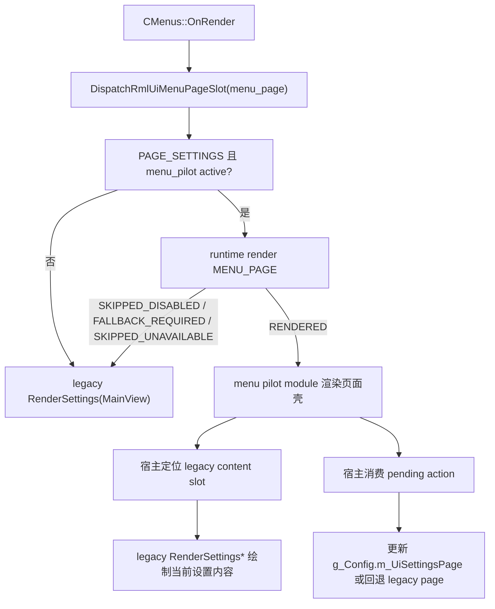

# RmlUI 菜单试点设计

## 0. 术语约定

| 术语 | 定义 | 防冲突结论 |
|---|---|---|
| 菜单试点页 | 本次唯一允许进入 RmlUI 的 `MENU_PAGE` concrete surface | 不等于“整个菜单系统迁移完成” |
| 设置页试点壳 | 挂在 `PAGE_SETTINGS` 上的 RmlUI 页面壳，负责标题、导航、状态提示和 legacy content slot | 不等于 `RenderSettings*` 各子页已经迁进 RmlUI |
| legacy content island | 继续由旧 `RenderSettings*` 系列函数渲染的内容岛，只是被放进 RmlUI 预留矩形内 | 是过渡承载，不是长期双栈常态 |
| menu pilot action token | 由 RmlUI 页面壳回传给宿主的语义动作，如 `select_settings_tab`、`fallback_to_legacy` | runtime-shell 不解析页面内部 DOM 事件参数 |
| page fallback owner | 菜单页 RmlUI 路径失败、关闭或显式回旧页面时，继续负责渲染和输入的 legacy 宿主 | 当前 owner 仍是 `CMenus::OnRender` / `CMenus::RenderSettings` |

术语检索结论：

- `CMenus::OnRender()` 已经在 offline / online 菜单页内容渲染前调用 `DispatchRmlUiMenuPageSlot()`，但目前 `MENU_PAGE` 还没有 concrete module。
- `CMenus::RenderSettings(MainView)` 已经是设置页总入口，内部再分发到 `RenderSettingsGeneral`、`RenderSettingsGraphics`、`RenderSettingsQmClient` 等子页，适合作为首个页面级试点宿主。
- `rmlui-popup-migration` 已证明交互式 modal surface 可以复用 input bridge、safe-mode 和 action token 回接；`menu-pilot` 应沿用这套交互协议，而不是另起一条菜单输入语义。

## 1. 决策与约束

### 需求摘要

当前 roadmap 的基础设施、非交互 HUD 样板和首条交互式 modal surface 都已经验收，但 `MENU_PAGE` 仍只有 dispatch 壳，没有任何真正的页面级 RmlUI 内容。`rmlui-menu-pilot` 的目标不是一次迁完主菜单，而是选一条最稳定、最集中、最适合包壳复用旧逻辑的页面，证明：

- 页面级 RmlUI surface 可以稳定挂在 `MENU_PAGE` 层；
- 页面导航壳、标题区和状态提示可以交给 RmlUI；
- 旧设置页内容可以先作为 content island 保留；
- 页面输入、cancel、popup 抢占和 fallback 能沿用既有 input bridge / popup modal / safe-mode 基线；
- 玩家可以一键回到旧设置页，而不是被锁在试点 UI 里。

本次试点页拍板为：**`PAGE_SETTINGS` 的页面级壳层试点**。

成功标准：

- `PAGE_SETTINGS` 在全局开关和模块开关都开启时，可进入 `MENU_PAGE` 的 RmlUI 页面壳。
- RmlUI 页面壳至少负责：页面标题、顶部说明、设置分类导航、legacy content slot、显式 `RmlUI` 标识、回到旧页面入口。
- 当前设置内容仍由现有 `RenderSettings*` 分发链承载，不在本功能中重写成 RmlUI form controls。
- 点击分类导航后，仍沿用 `g_Config.m_UiSettingsPage` 这套既有设置页语义，不新造第二套页面状态机。
- settings page 的内容切换和页面切换动画仍归 legacy settings content path；menu pilot 只负责不绕过、不吞掉这条路径，不在本功能里另起第二套动画系统。
- 失败、safe-mode、popup 抢占或显式回退时，宿主同帧回到旧设置页，且输入状态清理完整。

### 范围拍板

本次只迁移 `PAGE_SETTINGS` 这一条菜单页宿主，并且只迁移**页面级壳层**：

- 页面标题 / 说明区
- 顶层设置分类导航
- legacy content island 的布局承载
- restart notice 承载位
- 显式 `RmlUI` 标识
- 一键回到旧设置页入口

明确排除：

- `PAGE_NEWS`、`PAGE_STATS`、`PAGE_DEMOS`、`PAGE_SERVER_INFO`、`PAGE_PLAYERS` 等其他菜单页
- 设置页内部每一个控件、滑条、列表、编辑框的 RmlUI 重写
- `settings-reorg`、`settings-search`、`click-gui-suite` 的提前偷跑
- popup menu、文本输入型 popup 或其他 `MENU_MODAL` surface 的再收口
- 页面视觉大改版或完整 design system

### 复杂度档位

这是首个**页面级交互 surface** 试点，复杂度高于 popup modal，但低于“全设置页重写”。主要风险集中在：

- `CMenus::RenderSettings` 目前把 tab bar、content、restart notice 和页面切换动画混在一起，本次 design 必须先把“谁负责壳、谁负责内容、谁负责动画”说清楚；
- `MENU_PAGE` 与 `MENU_MODAL` 同时存在时，popup 必须继续优先于页面输入；
- 页面壳是交互式 surface，但 legacy content island 内仍有大量旧 `CUi` 输入控件，不能把整个设置页一次性抢进 RmlUI 输入域；
- 页面壳自身必须提供显式回退，而不是只能靠控制台关开关。

### 关键决策

1. 首个 menu pilot 直接选 `PAGE_SETTINGS`，不选 server browser、news 或 demo browser。
   - 原因：`RenderSettings(MainView)` 已经是天然总入口，内部页面索引和内容分发稳定，最适合先做“RmlUI 壳 + 旧内容保留”。

2. 页面试点采用“**RmlUI 壳层 + legacy settings content island**”的混合路径。
   - RmlUI 负责页面 chrome、导航、标题、说明和回退入口。
   - 旧 `RenderSettings*` 继续负责具体设置项内容和现有控件语义。

3. 菜单试点只改变**页面承载方式**，不改变 `g_Config.m_UiSettingsPage`、已有设置键、默认值或页面枚举语义。

4. `MENU_PAGE` 的 concrete module 自己解释页面壳按钮动作，但只回传宿主语义 token，不直接修改业务状态以外的其他菜单生命周期。

5. `qm_rmlui_menu_pilot` 当前只作为 runtime/config gate，不在本功能里新增第二个图形化设置页开关。
   - 原因：试点页本身就是设置页；把自己的总开关直接放进自己内部会形成自引用入口。显式回到旧页面由页面壳 action 提供。

6. `rmlui-popup-migration` 视为已验收可复用基线，本 feature 只复用其 modal owner priority、action token 回接和 fallback 语义，不把 popup 基线重新打开成未完成主线。

7. `MENU_PAGE` / `MENU_MODAL` 属于同一菜单侧 context domain，`GAME_HUD` / overlay 属于独立 HUD 侧 context domain。
   - 菜单页试点不得再退回“所有 surface 共用一个 `Rml::Context`，再由各模块分别调用 `Context::Update()` / `Context::Render()`”的旧模式。
   - 如果页面壳与弹窗同帧共存，必须保留“页面壳仍可见，modal 只做覆盖层而不是把页面壳当成互斥对象隐藏掉”的叠层语义。

### 明确不做

- 不迁移全菜单。
- 不重写 `RenderSettingsGeneral`、`RenderSettingsGraphics`、`RenderSettingsQmClient` 等具体设置项内容。
- 不改变 `SETTINGS_*` 枚举、配置存储键、默认值或页签语义。
- 不在本功能中实现设置搜索或设置重组。
- 不在本功能中重新设计 popup modal。
- 不在本功能中接入 debug overlay、wheel、editor 或 click GUI。

### 前置依赖

- `rmlui-input-bridge`：已提供 page/modal owner priority、cancel 和 release-state 基线。
- `rmlui-popup-migration`：已提供首条交互式 modal surface 样板，以及 `MENU_MODAL` 抢占 `MENU_PAGE` 的基线。
- `rmlui-safe-mode`：已提供 menu 类交互 surface 的自动回退护栏。
- `rmlui-layer-switchboard`：已提供 `MENU_PAGE` 宿主 dispatch 壳。

### Feature 级落地字段

| 字段 | 本次口径 | 验收边界 |
|---|---|---|
| host owner | 仍是 `CMenus::OnRender` / `RenderSettings(MainView)` 这条现有 settings page 宿主链；menu pilot 只是插在这条宿主链上的 `MENU_PAGE` concrete surface。 | 不允许新增平行菜单主循环；只有 `PAGE_SETTINGS` 会进入试点壳，其余页面继续走原宿主。 |
| fallback owner | 仍是完整 legacy settings page 宿主链；页面壳失败、safe-mode、popup 抢占或显式“回到旧版”时，由现有宿主同帧接回整页渲染与输入。 | 不允许出现“页面壳失效但只剩半页内容”或“必须关全局开关才能退出”的状态。 |
| diagnostics owner | menu pilot surface 负责暴露页面壳 contract 相关结果，至少覆盖 page shell、navigation、content slot、explicit fallback 这几类阶段；runtime / safe-mode 继续负责模块级结果与失败计数。 | 不新造第三套错误系统；验收需要能区分“页面壳成功”和“回到 legacy”的结果。 |
| input owner | 页面壳交互继续复用 `rmlui-input-bridge`；legacy content island 内的设置控件仍沿用原输入路径；`MENU_MODAL` active 时 modal owner 继续优先于 `MENU_PAGE`。 | 不允许 menu pilot 抢占 popup 输入，也不允许把整页 legacy settings controls 全部硬切进 RmlUI 输入域。 |
| backend assumption | 只建立在当前已验收的 `MENU_PAGE` 宿主 dispatch、render bridge 和 desktop 路径基线上；本 feature 不新增 OpenGL / Vulkan / Android 专属承诺。 | 不宣称 full backend-neutral menu render 已完成，也不把单后端试点写成长期契约。 |
| evidence owner | 自动证据由 targeted tests、构建验证和失败诊断输出承担；最终 UI 表现与设置页切换体验由人工验收承担。 | 自动证据至少覆盖 contract、导航、fallback、modal 抢占；人工验收至少覆盖可见壳层、tab 切换、动画归属和显式回退。 |

## 2. 名词与编排

### 2.1 名词层

#### 现状

- `CMenus::OnRender()` 在 offline / online 两条菜单链里都会先调用 `GameClient()->DispatchRmlUiMenuPageSlot()`，然后继续渲染 legacy menu page。
- `RenderSettings(MainView)` 当前同时负责：
  - 设置页顶层 tab bar；
  - restart notice；
  - 内容区域切换动画；
  - `RenderSettingsGeneral`、`RenderSettingsGraphics`、`RenderSettingsQmClient` 等 legacy 页面内容分发。
- `rmlui-popup-migration` 已经证明 `MENU_MODAL` 下的具体 surface 能通过 action token 回接宿主，但 `MENU_PAGE` 还没有对应的 concrete module。
- input bridge 当前已经定义 `MENU_MODAL > RADIAL_OVERLAY > EDITOR_OVERLAY > MENU_PAGE` 的 owner priority，因此页面壳不能和 popup 抢输入所有权。

#### 变化

新增一组 menu pilot 专用名词：

- `menu pilot page`：当前唯一候选页是 `SETTINGS`。
- `menu pilot action token`：页面壳只回传语义动作，至少包含“切换 settings tab”和“回退 legacy page”两类。
- `menu pilot view model`：页面壳所需的页面标题、说明、当前 settings tab、restart notice 和显式回退入口状态；不承载具体设置控件状态，也不承载页面切换动画状态。
- `menu pilot surface contract`：页面壳必须显式区分 document 是否可用、导航是否可用、legacy content slot 是否可用，以及失败阶段 / 原因。
- `menu pilot module`：负责页面壳 document、动作绑定和 contract，不直接渲染具体设置项控件。

#### 契约示例

正常示例：

- 玩家进入 `PAGE_SETTINGS`；
- RmlUI 页面壳显示标题、分类导航、`RmlUI` 标识和 content slot；
- 点击“Graphics”导航后页面壳只回传“切到 `SETTINGS_GRAPHICS`”这类语义动作；
- 宿主更新 `g_Config.m_UiSettingsPage`，并继续沿用现有 legacy settings content path 在 content slot 内绘制具体内容与切换表现。

反例：

- 让 runtime-shell 直接知道 `SETTINGS_GRAPHICS` 以外的业务控件行为；
- 在 menu pilot 里把具体设置项表单也一起改成 RmlUI；
- 点击“回到旧版”时直接全局关掉 `qm_rmlui_enable`；
- 在 design 里提前锁死页面壳类名、slot 数据结构或动画实现方式。

### 2.2 编排层

#### 现状

- `DispatchRmlUiMenuPageSlot()` 当前只是一层宿主接缝，没有具体页面内容。
- `RenderSettings(MainView)` 目前是“旧壳 + 旧内容”一体化渲染。
- popup migration 已经存在，因此菜单页运行时不能破坏 `MENU_MODAL` 的优先级。

#### 变化

1. `PAGE_SETTINGS` 成为首个 `MENU_PAGE` concrete pilot surface，其他 menu page 继续全量 legacy。
2. menu pilot surface 成功渲染后，宿主不再绘制旧设置页壳，而是只把 legacy settings content 渲染进 RmlUI 预留的 content slot。
3. 页面壳点击分类导航时：
   - 页面壳只产出“切换 settings tab”这类语义动作；
   - 宿主继续通过 `g_Config.m_UiSettingsPage` 驱动 legacy content dispatcher；
   - 当前内容切换和页面动画仍由 legacy content path 决定，而不是由页面壳重定义。
4. 页面壳请求回到旧版时：
   - 先执行 release-state；
   - 当前帧回退到 legacy settings page；
   - 不改变全局 RmlUI 总开关语义。
5. 页面壳与 popup 共存时：
   - `MENU_PAGE` 与 `MENU_MODAL` 可以共享菜单侧 context domain；
   - 但菜单宿主只能对该 domain 做一次统一 `Update()` / `Render()` 编排；
   - page shell 与 modal 的显示/隐藏必须由宿主显式维护，不能靠“谁最后 Render 谁覆盖一切”的偶然顺序维持。

#### 流程级约束

- `PAGE_SETTINGS` 是本次唯一允许接入 menu pilot surface 的页面；`news`、`stats`、`server browser` 等页面不得混入同一模块。
- popup 打开时，`MENU_MODAL` 继续优先于 `MENU_PAGE`；menu pilot 不能在 modal active 时继续争抢输入焦点。
- popup 打开时，允许页面壳继续作为被覆盖底层存在；禁止为了显示 modal 而把页面壳 document 直接当成“要先隐藏的互斥页”。
- legacy content island 的设置项交互语义保持不变；menu pilot 不得偷改控件、配置键或页面切换副作用。
- 页面壳失败时必须同帧回到旧设置页，不允许出现“空白页壳 + 无内容 slot”的半失效状态。
- 显式 `RmlUI` 标识和“回到旧版”入口属于页面可见契约的一部分。
- settings page 切换动画的 owner 仍是 legacy settings content path，不是 menu pilot 页面壳；本 feature 的验收只要求试点壳启用后仍沿用同一内容切换路径，不要求定义新的 RmlUI 动画样式。
- menu pilot 若进入 deactivate / fallback，页面壳必须立即退出当前可见状态；不能依赖“后续某一帧再次 render 时再顺带隐藏”这种延后清理。

### 2.3 挂载点清单

- `MENU_PAGE` 宿主接缝：只让 `PAGE_SETTINGS` 接到 menu pilot surface，其余页面继续 legacy。
- settings page 宿主边界：把页面壳职责与 legacy settings content path 分开，让 content island 可以复用现有设置内容与切换表现。
- menu pilot surface contract：明确标题、导航、restart notice、content slot、显式标识和回退入口这几项页面壳责任。
- 定向证据：覆盖页面壳 contract、导航动作、content slot/fallback、modal 抢占和动画归属不变。

### 2.4 推进策略

1. 页面试点契约：定义 `PAGE_SETTINGS` 试点范围、六个 feature 级落地字段、view model、action token 和 surface contract。
   退出信号：能稳定表达“页面壳成功 / 导航成功 / content slot 成功 / 请求回退”这几层结果，而且没有把 settings reorg/search/click-gui 语义提前塞进当前 design。

2. 页面壳与 content island：实现 RmlUI 设置页壳，并把 legacy settings content 放进明确 slot，而不是继续整页 legacy。
   退出信号：RmlUI 页面壳和 legacy settings content 能同页稳定共存。

3. 导航、动画归属与回退：接 top-level settings navigation、fallback_to_legacy、popup 抢占和 input bridge 既有 owner priority，并明确内容切换 / 动画继续留在 legacy settings content path。
   退出信号：页面壳可切换设置页签、可显式回到旧版，popup 打开时页面输入不越权，settings 内容切换仍沿用 legacy 路径。

4. 证据闭环：补 targeted tests、构建验证和人工验收清单。
   退出信号：自动证据能覆盖页面壳 contract、导航动作、content slot/fallback 和 modal 抢占；人工验收负责最终 UI 表现与 settings 切换体验核对。

### 2.5 结构健康度与微重构

#### 评估

- 文件级 — `src/game/client/components/menus_settings.cpp`：当前 `RenderSettings(MainView)` 既负责外层页面壳，又负责内容分发和 restart notice，职责已经偏重。
- 文件级 — `src/game/client/components/menus.cpp`：当前 `CMenus::OnRender()` 已承担 `MENU_PAGE` / `MENU_MODAL` 多条宿主接缝，继续堆页面具体细节会让宿主链越来越胖。
- 目录级 — `src/game/client/RmlUi/`：已经集中 runtime、input、popup、monitoring 等 concrete/bridge 模块，后续新增 menu pilot concrete module 放在这里符合现有组织方式。

#### 结论：做一次受控微重构（拆页面壳与内容分发）

本次设计建议把设置页拆成：

- legacy settings shell owner
- legacy settings content dispatcher

这次微重构只服务 menu pilot：让 legacy content island 能在新的承载矩形内复用旧设置内容分发，不把整页 legacy 外壳硬塞进 RmlUI slot。它属于“只搬不改行为”的受控拆分，但具体拆法、类名、文件级落点和 checklist 顺序留到 design 通过后的下一阶段再定。

#### 超出范围的观察

- 如果后续要把每个设置页具体控件逐个改成 RmlUI form controls，那是 `rmlui-settings-reorg` 及更后续 feature 的事，不在本功能中提前展开。
- 如果后续想把其他 menu page 也统一成同一页面壳，那需要在 `menu-pilot` 验收后再抽象，不在本功能里提前泛化。

## 3. 验收契约

### 关键场景清单

- 触发：开启 `qm_rmlui_enable=1` 且 `qm_rmlui_menu_pilot=1`，进入 `PAGE_SETTINGS` -> 期望：设置页进入 RmlUI 页面壳，标题、导航、content slot、显式 `RmlUI` 标识和 legacy content island 都可见。
- 触发：点击页面壳内的顶层设置导航 -> 期望：宿主继续通过 `g_Config.m_UiSettingsPage` 切换 legacy settings content，设置语义与旧版一致。
- 触发：在 pilot 下从一个 settings 分类切到另一个分类 -> 期望：内容切换和页面切换动画仍走 legacy settings content path；页面壳不需要定义新的动画样式，但也不能把现有切换表现静默吞掉。
- 触发：页面壳点击“回到旧版”或 menu pilot 请求 fallback -> 期望：同帧回到完整 legacy settings page，输入状态清理完整。
- 触发：页面壳失败、document 缺失、slot 无效或 safe-mode 触发 -> 期望：旧设置页立即接管，不出现空白 settings page。
- 触发：settings page 打开 fullscreen popup -> 期望：`MENU_MODAL` 继续优先，popup 可抢占输入，menu pilot 不残留 pressed/hover/focus 状态。
- 触发：进入非 `PAGE_SETTINGS` 菜单页 -> 期望：继续全量 legacy，不误入 menu pilot。

### 明确不做的反向核对项

- 本功能不应宣称全菜单迁移完成。
- 本功能不应宣称设置项已经重写成 RmlUI 原生控件。
- 本功能不应改变 `SETTINGS_*` 枚举和现有配置键语义。
- 本功能不应把 popup baseline 重新表述成“仍待完成的主线基础设施”。
- 本功能不应把 `settings-search`、`settings-reorg` 或 `click-gui-suite` 的信息架构 / 快捷入口 / 页面组织决策提前混进来。
- 本功能不应让页面壳在 modal active 时继续抢输入。

## 4. 与项目级架构文档的关系

验收阶段需要把以下现状回写到 architecture：

- `PAGE_SETTINGS` 成为当前第一条已验收的 `MENU_PAGE` concrete RmlUI surface。
- 当前已验收迁移形态仍然是“RmlUI 页面壳 + legacy settings content island”的混合页面迁移，而不是全设置页原生 RmlUI。
- `MENU_PAGE` 与 `MENU_MODAL` 的 owner priority、fallback owner 和 popup 抢占边界在当前实现里仍继续成立。
- `MENU_PAGE` / `MENU_MODAL` 在 current state 中属于菜单侧 context domain；`GAME_HUD` / overlay 继续属于独立 HUD 侧 context domain，后续 feature 不得再把两者压回单一 shared context。
- settings page 的内容切换和页面切换动画在 current state 中仍归 legacy settings content path，不回写成“RmlUI 页面壳能力”。
- `rmlui-popup-migration` 继续作为已验收 modal baseline 记录；`menu-pilot` 只补 `MENU_PAGE` concrete surface，不回写成“popup 基线仍未完成”。
