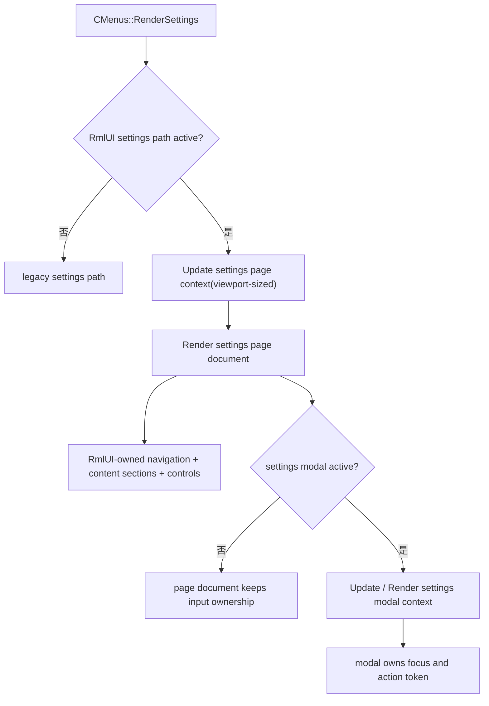

# RmlUI 设置页重整设计

## 0. 术语约定

| 术语 | 定义 | 防冲突结论 |
|---|---|---|
| settings page context | 专门承载设置页整页文档、布局与输入状态的 `Rml::Context` | 不与 HUD/overlay 共享，也不与 modal 共享输入/焦点状态 |
| settings modal context | 专门承载设置页上层弹窗的 `Rml::Context` | 不复用 settings page context 的 hover/focus/document 集合 |
| settings page document | 设置页全屏 RmlUI 文档，持有一级导航、二级导航、内容区、状态条与搜索槽位 | 打开该文档时，旧 settings 外壳不得并列渲染 |
| settings domain | 面向用户的一级设置域，例如 `Tee`、`游戏界面（HUD）`、`图像`、`声音`、`资源`、`配置`、`功能`、`搜索` | 是信息架构层概念，不直接等于 `SETTINGS_*` 枚举值 |
| settings destination | 叶子级内容目标，表示某个具体设置分组或页面子视图 | 是 RmlUI 页面内部路由目标，不等于“去调用旧 renderer” |
| settings state adapter | 把现有配置项、枚举态、子页状态与 RmlUI view model / action 连接起来的适配层 | 只复用语义和数据，不复用旧 `RenderSettings*` 绘制路径 |
| legacy settings reference | 旧 `RenderSettings(...)`、`RenderSettingsContent(...)`、`RenderSettingsQmClient(...)`、`RenderSettingsTClient(...)` 等实现中沉淀的语义、分组与副作用知识 | 作为实现参考和对照，不再作为 active RmlUI settings 的并列运行时 renderer |

官方约束基线见 [settings host contract](../../reference/rmlui-settings-host-contract.md)。

- RmlUi 官方文档已经把 context 定义为独立的 document 集合，并拥有自己的尺寸与输入状态。
- settings 页需要真实 viewport 尺寸驱动自己的 page context。
- settings 整页与其 modal 需要独立 context。

术语检索结论：

- `CMenus::RenderSettings(...)` 当前同时承担页签列表、页面切换动画、restart bar、assets/audio editor 收口以及 `RenderSettingsContent(...)` 分发。
- `RenderSettingsContent(...)` 现在是旧 settings 内容分发中心，但它的职责是“画旧 UI”，不是“提供 settings 运行时抽象”。
- `RenderSettingsQmClient(...)` 和 `RenderSettingsTClient(...)` 分别维护自己的子页状态与内容组织；这些知识仍然有价值，但应迁入 settings state adapter / view model，而不是继续让旧 renderer 直接出现在 active RmlUI page 中。

## 1. 决策与约束

长期 host 约束和上下文边界已经抽成 [settings host contract](../../reference/rmlui-settings-host-contract.md)；本节只保留本 feature 的决策。

### 需求摘要

这次重整不是继续打磨 `menu-pilot` 那种“RmlUI 页面壳 + legacy content island”过渡态，而是要把 settings 主线改成：

- 只要 active path 进入 RmlUI settings，旧 settings 外壳和旧 settings 内容就不再并列渲染；
- settings 页整页由 RmlUI 单独持有，包括布局、导航、内容区组织和交互宿主；
- 旧 settings 代码只作为语义/分组/副作用参考与迁移对照，不再作为 active RmlUI settings 的 runtime fallback 内容层；
- settings 与 popup/modal 继续遵守多-context 最佳实践，不再退回 shared menu context + 每个模块各自 `Context::Update()/Render()` 的模式。

成功标准：

- `PAGE_SETTINGS` 进入 RmlUI path 后，画面中不再出现旧 settings tab bar、旧内容面板或任何被压到下层的 legacy settings 壳层。
- active RmlUI settings page 由 dedicated page context 驱动，modal 则由独立 modal context 驱动，二者输入/焦点状态互不串扰。
- `Tee`、`游戏界面（HUD）`、`图像`、`声音`、`资源`、`配置`、`功能`、`搜索` 八个一级 domain 成为新的唯一用户可见 IA。
- `Configs`、`Contributors`、`TClient`、`QmClient` 这类旧多层入口被吸收到新的 settings destination 结构里，而不是继续以 legacy 顶层页签或“隐藏二级页”存在。
- RmlUI settings page 使用 RmlUI 自己的控件与数据适配层承载 active 内容；即使某些设置项分阶段迁移，也不能通过嵌入旧 `RenderSettings*` 绘制路径来“假装完成”。
- feature 失败时可以降级关闭 RmlUI settings path，但不能在同一次 active render 中 silently 回落到旧 settings 并与新 UI 并列。

### 范围拍板

本次 feature 要做的是**settings 页主线重置**：

- 把 settings 页改成 RmlUI 单独持有的全屏、自适应页面宿主；
- 用 dedicated settings page context + settings modal context 明确上下文边界；
- 定义新的一级 domain / 二级 destination IA；
- 建立 settings state adapter，把现有配置键、枚举态、子页态和副作用接入 RmlUI view model / action；
- 移除 active RmlUI settings path 中对 `RenderSettingsContent(...)` 与旧 settings 外壳的运行时依赖；
- 把“旧 settings 作为参考实现”和“RmlUI settings 作为 active runtime”彻底分开。

明确排除：

- 不在本 feature 里实现 settings 搜索行为。
- 不在本 feature 里重做整套视觉系统。
- 不提前接入 Click GUI、轮盘系统、HUD editor。
- 不修改配置键、默认值、持久化格式或设置项语义。
- 不扩大 popup migration 范围。
- 不因为这次重整而把旧 settings 代码直接删除；它仍可作为参考与独立 legacy path 保留。

### 复杂度档位

这是 settings 主线的一次架构重置，不再是“在 pilot 基线上补导航”的中量功能。核心风险在于：

- `RenderSettings(...)` 当前把宿主、导航、动画、编辑器收口和旧内容分发耦在一起；
- 旧 settings 的真实语义散落在 `RenderSettings*`、`RenderSettingsQmClient(...)`、`RenderSettingsTClient(...)` 等多条路径里；
- `TClient` / `QmClient` 子页态还没有完全被抽成适合 RmlUI 持有的 view model / action 结构；
- 一旦继续允许 mixed render，就会把 context、输入、布局与 fallback 问题继续藏起来。

### 关键决策

1. active RmlUI settings path 不再允许 legacy settings 并列渲染。
   - 原因：并列渲染会直接破坏布局所有权、输入所有权和视觉边界，也会让“是不是已经完成 settings 替代”失去判断标准。

2. settings 页必须采用 dedicated page context；settings 上层弹窗采用 dedicated modal context。
   - 原因：官方文档已经把 context 定义为独立的 document + size + input state owner；settings page 与 modal 需要独立 lifecycle，不应共享。

3. `CMenus::RenderSettings(...)` 继续是 page host 入口，但它必须只在“legacy settings path”与“RmlUI settings path”之间二选一。
   - 原因：不新增第二套菜单主循环，但也不接受同帧双栈共绘。

4. 旧 `RenderSettingsContent(...)` 从 active content owner 降级为 legacy reference。
   - 原因：它的价值在于旧语义与副作用知识，而不是继续作为 RmlUI settings 的运行时内容层。

5. settings reorg 不再把“destination adapter -> 旧 renderer”当作主线，而是改成“destination -> RmlUI view model / action -> state adapter”。
   - 原因：只有这样，settings 页才能真正成为 RmlUI 自己的界面，而不是壳层套接旧控件。

6. `TClient` 与 `QmClient` 的子页态必须提升为宿主级/适配层可表达状态。
   - 原因：否则新的 settings IA 无法稳定驱动这些内容，也无法摆脱旧 renderer 内部静态态。

7. per-frame automatic fallback to legacy settings 在 active RmlUI settings path 中不再是正解。
   - 原因：当前主线目标就是把 settings 宿主权收回到 RmlUI；如果同一条 active path 还自动退回旧 settings，就会继续掩盖真正未完成的迁移面。

8. safe-mode 的职责改成“禁用这条 feature / 下次不进入 RmlUI settings path / 给出诊断”，而不是“当前帧直接把 settings 画回旧 UI”。
   - 原因：需要保留用户逃生通道，但不能再靠 mixed render 收场。

9. settings 页实现整体仍要参考旧 UI 与现有内容分发知识，但这份“参考”不等于 runtime 复用旧绘制路径。
   - 原因：要继承真实语义，而不是把旧框架重新塞回新宿主。

10. `搜索` 必须保留为一级 IA 槽位，但只留布局与路由占位，不提前实现行为。
   - 原因：这是后续 `rmlui-settings-search` 的主线入口，不应再次变成补丁式外挂。

### 明确不做

- 不宣称本 feature 已完成 settings 搜索、视觉重做或 Click GUI 套件。
- 不把 settings 页剩余 parity 缺口伪装成“自动 fallback 到旧页就算完成”。
- 不在本 feature 里重新设计所有底层配置 schema。
- 不把 `RmlUiMonitoringHud` 那种 mixed render 样板直接套用到 settings 页。

### 前置依赖

- `rmlui-menu-pilot`：提供 `MENU_PAGE` 宿主入口的首条 concrete surface 基线，但它的 legacy island 形态不再是本 feature 的目标。
- `rmlui-input-bridge`：继续提供交互式 surface 的输入、cancel 和 release-state 协议。
- `rmlui-popup-migration`：继续提供 `MENU_MODAL` 的 action 回接与 modal 输入优先级基线。
- `rmlui-safe-mode`：继续提供 feature 级 disable / demotion 护栏，但不再把 mixed legacy fallback 当正解。

### Feature 级落地字段

| 字段 | 本次口径 | 验收边界 |
|---|---|---|
| host owner | `CMenus::RenderSettings(...)` 只负责选择 legacy path 或 RmlUI path，并为 RmlUI path 提供 viewport / page active / modal active 等宿主信息。 | 不允许 host 在 active RmlUI path 中继续调用旧 settings 绘制链。 |
| fallback owner | feature 级 disable / demotion / legacy toggle 仍由 settings 宿主控制，但不再允许 active RmlUI path 同帧绘回旧 settings。 | 失败时可以退出这条 feature，不可以混着画。 |
| navigation owner | RmlUI settings page document 自己持有一级 / 二级导航。 | 不允许导航逻辑在 shell、legacy renderer 和 gameclient 三处并存。 |
| content owner | RmlUI settings page document + settings state adapter。 | active path 中不再使用 `RenderSettingsContent(...)` 作为内容 owner。 |
| input owner | settings page context 与 settings modal context 分别拥有自己的输入域；input bridge 只负责宿主路由。 | 不允许 page 与 modal 共享 hover/focus 状态。 |
| evidence owner | 自动证据覆盖 context 边界、host swapover、state adapter、modal 抢占和 no-parallel-render；人工验收覆盖整页可交互性与布局稳定性。 | 不把“没崩”当作 settings 重整完成。 |

## 2. 名词与编排

### 2.1 名词层

#### 现状

- 顶层 settings 页当前由 `g_Config.m_UiSettingsPage` 选择 `SETTINGS_LANGUAGE` 到 `SETTINGS_QMCLIENT` 等 page。
- `RenderSettings(...)` 当前既是 page host，又亲自画 legacy tab bar，并进一步调用 `RenderSettingsContent(...)`。
- `RenderSettingsContent(...)` 继续把内容分发到 `RenderSettingsGeneral`、`RenderSettingsGraphics`、`RenderSettingsQmClient`、`RenderSettingsTClient` 等旧 renderer。
- `QmClient` 与 `TClient` 都有自己的子页态和子内容组织，但这些状态还没有完全抽成新的 settings 宿主可直接消费的模型。

#### 变化

新增一组 settings 重整专用名词：

- `settings page context`
  - 专属 page 级 `Rml::Context`
  - 尺寸直接使用 viewport
  - 拥有 page 的 hover/focus/input state

- `settings modal context`
  - 专属 modal 级 `Rml::Context`
  - 持有设置页上层弹窗
  - 与 page context 独立 update/render

- `settings domain`
  - `TEE`
  - `HUD_AND_LANGUAGE`
  - `GRAPHICS`
  - `SOUND`
  - `RESOURCES`
  - `CONFIGURATION`
  - `FEATURES`
  - `SEARCH`

- `settings destination`
  - 叶子导航目标
  - 包含 destination id、label、所属 domain、数据源/状态映射、可选子视图说明

- `settings state adapter`
  - 输入：destination、用户 action、现有 config/state
  - 输出：RmlUI page 要显示的 section/card/control model，与回写现有 config/state 的动作

- `settings section model`
  - RmlUI 内容区里的单个逻辑分组
  - 持有标题、说明、控件列表、展开/折叠态、依赖状态

#### 契约示例

正常示例：

- 玩家进入 `功能` domain；
- page document 展示 `TClient`、`DDNet`、`栖梦`、`Contributors` 等 destination；
- 玩家点击 `Contributors`；
- settings state adapter 产出对应 section model；
- page document 直接渲染 contributors 内容卡片，而不是去调用 `RenderSettingsQmClient(...)`。

反例：

- 玩家点击 `Contributors`；
- page document 只更新一个“当前页签 id”；
- 宿主随后把 `RenderSettingsContent(...)` 画进某个 slot；
- modal / legacy tab bar / page document 同时出现在屏幕上。

### 2.1.1 用户可见 IA 约定

`settings domain` 固定采用下面这组一级导航：

| 一级 domain | 应承载的内容范围 | 典型 destination 示例 |
|---|---|---|
| `Tee` | 当前玩家与分身身份、皮肤与外观资料 | `player_identity`、`dummy_identity`、`tee_skins`、`dummy_skins`、`skin_queue`、`skin_profiles` |
| `游戏界面（HUD）` | 界面文本语言与 HUD/界面元素设置 | `language`、`hud_layout`、`hud_behavior`、`interface_misc` |
| `图像` | 图形、显卡、显示与画面效果 | `graphics_general`、`renderer_backend`、`visual_effects` |
| `声音` | 音频包与声音设置 | `audio_pack`、`sound_general` |
| `资源` | 贴图、皮肤资源与其他资源项 | `assets_general`、`textures` |
| `配置` | 控制、按键绑定与客户端配置项 | `controls`、`binds`、`configs` |
| `功能` | TClient、DDNet、栖梦三类客户端能力 | `tclient_root`、`ddnet_features`、`qmclient_visuals`、`qmclient_functions`、`contributors` |
| `搜索` | 设置搜索、快速定位与结果跳转宿主 | 当前只保留壳层位置与 future route，不实现搜索行为 |

约束：

- `搜索` 必须保留为一级入口。
- `Contributors` 与 `Configs` 不再作为 legacy 顶层页签出现。
- `语言` 收口到 `游戏界面（HUD）` 域，不再维持历史残留的顶层并列地位。

### 2.2 编排层

#### 现状

- `CMenus::RenderSettings(...)` 当前会直接绘制 legacy settings 页面。
- `menu-pilot` 虽然把 page shell 包成了 RmlUI，但 active 内容仍依赖旧 settings renderer。
- modal、page、legacy content 三套边界还没有彻底从运行时上拆开。

#### 变化

1. `CMenus::RenderSettings(...)` 首先做 path 选择：legacy path 或 RmlUI settings path。
2. 进入 RmlUI settings path 后：
   - 不再绘制旧 settings tab bar；
   - 不再调用 `RenderSettingsContent(...)`；
   - 不再保留 legacy content island。
3. settings page context 负责整页文档的 update/render。
4. settings modal context 只在 modal active 时 update/render，并独占输入/焦点。
5. settings state adapter 负责把旧语义映射成新的 section model / control model。
6. page 内部路由、展开/折叠、说明文案、状态提示都由 RmlUI 自己持有。

#### 流程级约束

- active RmlUI settings path 中禁止并列渲染旧 settings shell 或旧 settings content。
- 同一个 settings page context 在一帧内只执行一次 page 级 `Update()` / `Render()`。
- page context 与 modal context 必须分离。
- `TClient` / `QmClient` 子页态必须可以被 settings state adapter 显式表达。
- `popup active` 时 modal context 抢输入，page context 保留底层展示但不保留 modal 焦点。
- safe-mode 可以禁用 feature，但不能在 active path 中偷偷画回旧 settings 充数。

### 2.3 挂载点清单

- `CMenus::RenderSettings(...)`：path 选择、viewport 传入、settings page host 接缝。
- `src/game/client/RmlUi/` 下的新 settings page host 模块：承载 page context、modal context、view model 与 action/state adapter。
- `QmClient` / `TClient` 相关状态整理点：把可复用的子页态从旧 renderer 内部抽到宿主可见层。
- 旧 settings reference 面：仅用于对照语义、副作用与 parity，不再作为 active runtime 绘制路径。

### 2.4 推进策略

1. context 拓扑切片：明确 settings page context 与 settings modal context 的 owner、尺寸与输入边界。
   退出信号：能清楚说明 page 与 modal 为什么不能共享 context，且宿主 path 已二选一。

2. host swapover 切片：让 `CMenus::RenderSettings(...)` 在 active RmlUI path 中完全停掉 legacy settings 绘制链。
   退出信号：旧 settings 壳层和内容层都不会再在 active path 出现。

3. IA 与 state adapter 切片：落一级 domain / 二级 destination / section model / control model。
   退出信号：新的 IA 能覆盖现有 settings 信息组织，且不再依赖 `RenderSettingsContent(...)`。

4. parity 切片：把高价值 settings 分组接入 RmlUI-owned controls 与现有 config/state。
   退出信号：active settings page 的可见内容已由 RmlUI 自己承载，而不是通过 legacy island 补洞。

5. 证据闭环切片：补 targeted tests、构建验证和人工验收清单。
   退出信号：自动证据覆盖 context 边界、host swapover、state adapter 与 no-parallel-render。

### 2.5 结构健康度与微重构

#### 评估

- 文件级 — `src/game/client/components/menus_settings.cpp`：目前同时承担 page host、legacy 外壳、旧内容分发和大量页面副作用，已经不适合作为 active RmlUI settings 的长期 owner。
- 文件级 — `src/game/client/components/tclient/menus_tclient.cpp`：需要继续把可被 settings state adapter 复用的子页态抽出来。
- 文件级 — `src/game/client/components/qmclient/menus_qmclient.cpp`：已有成员态比 TClient 更接近可复用，但仍混着旧 UI 组织与绘制逻辑。
- 目录级 — `src/game/client/RmlUi/`：适合新增 `RmlUiSettingsPage` 及其 adapter/view model，因为这条功能现在已经不是单纯的 menu pilot 衍生小壳。

#### 结论：做一次受控微重构（host 切换 + state adapter 提升）

本次设计建议先做三类微重构：

- 从 `CMenus::RenderSettings(...)` 中抽出 RmlUI settings path owner；
- 把 settings state adapter 与 view model 放到独立 RmlUI 模块；
- 把 `TClient` / `QmClient` 子页态中可复用的状态提升为宿主可见接口。

这些微重构都服务于“让 active settings 页真正由 RmlUI 持有”，而不是继续给旧 renderer 腾 slot。

#### 超出范围的观察

- 后续 `rmlui-settings-native-controls` 仍会继续扩大原生控件覆盖面，但它不应再建立在 legacy island 上。
- 统一的视觉系统刷新继续放到 `rmlui-settings-visual-refresh`，不在这次 host 重整里混做。

## 3. 验收契约

### 关键场景清单

- 触发：进入 `PAGE_SETTINGS` 且 active RmlUI settings path -> 期望：只出现 RmlUI settings 整页，不出现 legacy settings 壳层、legacy tab bar 或 legacy 内容面板。
- 触发：在不同分辨率或宽高比下打开 settings -> 期望：page context 按 viewport 正确布局，导航、内容区、状态栏和搜索槽位稳定。
- 触发：切换一级 domain / 二级 destination -> 期望：内容区由 RmlUI 自己更新，不调用 `RenderSettingsContent(...)`。
- 触发：进入 `Configs`、`Contributors`、`TClient`、`QmClient` 等历史多层入口 -> 期望：都通过新的 IA 和 state adapter 在同一张 RmlUI settings page 内呈现。
- 触发：modal active -> 期望：settings modal context 独占输入焦点，page context 只保留底层显示。
- 触发：feature 诊断失败或 safe-mode trip -> 期望：禁用/退出这条 feature，并给出明确原因；不得在当前 active frame 里混回旧 settings 与新页并列显示。

### 明确不做的反向核对项

- 本功能不应把 settings search 行为顺手做掉。
- 本功能不应把视觉系统整体重做顺手混进来。
- 本功能不应再把 legacy content island 写成可接受的长期过渡态。
- 本功能不应以“自动 fallback 回旧页”掩盖 active RmlUI settings 仍未完成的迁移面。

## 4. 与项目级架构文档的关系

验收阶段需要把以下现状回写到 architecture：

- settings 页 current state 变为“RmlUI 单独持有的整页 page context + modal context”，而不是“RmlUI 壳 + legacy island”。
- `settings page context`、`settings modal context`、`settings state adapter`、`settings section model` 成为新的 current-state 名词。
- `CMenus::RenderSettings(...)` 的 current-state 职责改为 path selector + host seam，不再是 active RmlUI settings 的具体绘制 owner。
- 旧 `RenderSettingsContent(...)`、`RenderSettingsQmClient(...)`、`RenderSettingsTClient(...)` 在 settings 主线里降级为 legacy reference，而不是 active content owner。
- `settings-reorg` 的 current-state 结果应成为后续 `rmlui-settings-native-controls -> rmlui-settings-search -> rmlui-settings-visual-refresh` 的真正宿主基线。
