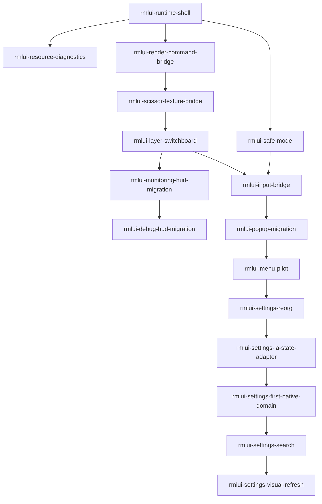

# RmlUI Roadmap 就绪矩阵

这份矩阵说明每个 roadmap item 现在处于什么就绪状态、被什么阻塞，以及下一步该补哪类证据。它不替代 `rmlui-full-replacement-items.yaml`，而是补一层可读的就绪性解释。

## 0. 长期结构护栏

- 长期 settings host 规则已收口到 [settings-host contract](../../reference/rmlui-settings-host-contract.md)；这里仅保留 roadmap readiness 的状态说明。

## 1. 状态说明

| 状态 | 含义 |
|---|---|
| `done` | 实现与验收都已完成，后续功能可以把它当当前基线。 |
| `implemented-pending-acceptance` | 实现与本地证据已到位，但还缺 feature-acceptance 或用户侧最终验收收口。 |
| `approved-waiting-dependency` | design 与 checklist 已齐备，但前置主线还没验收完成，因此暂不进入实现。 |
| `draft-under-review` | 设计草稿已存在，但还没 review/批准，不能进入实现。 |
| `ready-for-impl` | 已有已批准 design + checklist，可以直接进入实现。 |
| `ready-for-design` | 依赖已经足够，可以开始写功能设计。 |
| `blocked-by-runtime` | 必须等 `rmlui-runtime-shell` 实现 / 验收完成。 |
| `blocked-by-render-bridge` | 必须等 render bridge 相关证据闭环。 |
| `blocked-by-input-safety` | 必须等 input bridge 与 safe mode 证据闭环。 |
| `blocked-by-migration` | 必须等更早的 surface migration 完成。 |
| `deferred` | 条目有效，但当前优先级低于主替代路径。 |

补充口径：

- 这里的 `done` 默认表示“历史实现与验收曾经闭环”，不是无条件等于“当前分支仍可信的运行时基线”。
- 如果发生架构基本思想改向，或当前分支已经出现与该条目强相关的黑屏 / 崩溃 / fallback 失真，那么该条目在 roadmap 判断上必须先重验，再决定能否继续当作当前基线使用。

## 2. 当前推进分层

### 2.1 主线优先

- `rmlui-menu-pilot`：已完成 acceptance，当前作为 `MENU_PAGE` 宿主接缝基线保留，但不再代表 settings 主线的目标形态。
- `rmlui-settings-reorg`：主线第二步，但范围收紧为 host stabilization；当前挂载的 in-progress feature 已经超 scope，继续实现前应先回到更窄范围。
- 当前用户已明确指出：现有 `ddnet.exe` 仍会出现与 RmlUI 强相关的黑屏/崩溃。因此 menu/settings 相关的历史 `done` 条目只能先当“旧证据”，不能直接当作当前可信基线。

### 2.2 可并行扩展示例

- `rmlui-debug-hud-migration`：已具备 design 前置条件，可并行验证 Monitoring HUD 样板的复用性，但不承担解锁 menu/settings 主线的职责。

### 2.3 settings 主线中段与原生化后续

- `rmlui-settings-ia-state-adapter`
- `rmlui-settings-first-native-domain`
- `rmlui-settings-search`
- `rmlui-settings-visual-refresh`

### 2.4 后置增值项

- `rmlui-click-gui-suite`
- `rmlui-radial-action-system`
- `rmlui-dev-inspector`
- `rmlui-preset-system`
- `rmlui-hud-layout-editor`
- `rmlui-component-editor`

## 3. 条目矩阵

| 条目 | 当前就绪状态 | 原因 | 下一份文档动作 |
|---|---|---|---|
| `rmlui-runtime-shell` | `done` | 已有已批准 design、checklist、实现、验收和 architecture 回写。 | 后续功能直接把它当 runtime-shell 当前基线。 |
| `rmlui-resource-diagnostics` | `done` | 已有已批准 design、checklist、实现、验收，以及 runtime-shell 诊断基线。 | 后续功能直接把它当资源诊断基线。 |
| `rmlui-render-command-bridge` | `done` | 已有已批准 design、checklist、实现、运行日志和验收，但当前只闭合了 graphics-thread callback 最小切片。 | 后续文档继续明确完整 geometry / scissor / texture bridge 仍未完成。 |
| `rmlui-scissor-texture-bridge` | `done` | 已有已批准 design、checklist、实现、targeted tests、运行启动证据和验收，收紧了 texture / scissor ownership。 | 后续功能继续把它当当前 bridge 契约基线，但完整 geometry / layer / filter / shader bridge 仍后置。 |
| `rmlui-layer-switchboard` | `done` | 已有已批准 design、checklist、实现、targeted tests、构建证据和 architecture / roadmap 回写，当前闭合的是 host dispatch order 与 fallback ownership。 | 后续具体界面迁移直接复用 switchboard 契约，不再重写宿主调度壳。 |
| `rmlui-monitoring-hud-migration` | `done` | 已有已批准 design、checklist、实现、targeted tests、构建证据、手工运行日志与人工验收记录，当前唯一 concrete RmlUI surface 已完成验收闭环。 | 后续 debug HUD migration、menu/popup migration 的界面迁移设计都直接复用这条已验收样板，不再重写 mixed render + host fallback owner 的基线。 |
| `rmlui-input-bridge` | `done` | 已有已批准 design、checklist、实现、targeted tests、构建证据和验收，且交互输入协议已闭合。 | 后续 popup / menu-pilot / click-gui 直接复用该输入协议基线。 |
| `rmlui-debug-hud-migration` | `ready-for-design` | Monitoring HUD 迁移已经完成，非交互 overlay 的宿主接缝和 mixed-render 样板都可直接复用；它现在是并行扩展示例，不是当前主线。 | 资源允许时再新开 `rmlui-debug-hud-migration` feature-design，明确要迁移哪一条 debug surface、复用哪些 contract、保留哪条 legacy fallback。 |
| `rmlui-safe-mode` | `done` | runtime policy、diagnostics 字段、reset 路径、测试和验收都已齐备。 | 后续交互式界面直接复用 safe-mode 基线。 |
| `rmlui-popup-migration` | `done` | 已有已批准 design、checklist、实现、targeted tests、构建证据与验收；当前已闭合低风险 fullscreen popup modal 的输入消费、宿主回接和 fallback。 | 不再继续把 popup 当主线未闭合项；后续 menu-pilot 直接复用这条首个交互式 modal surface 基线。 |
| `rmlui-menu-pilot` | `done` | design、checklist、代码实现、targeted tests 与 acceptance 文档都已落盘，`PAGE_SETTINGS` 已成为当前第一条已验收的 `MENU_PAGE` concrete surface。 | 后续 settings 主线只把它当 `MENU_PAGE` 宿主接缝与菜单侧 context 基线，不再把 legacy content island 当目标形态。 |
| `rmlui-settings-reorg` | `draft-under-review` | 结合最新 current-state 探索和官方文档复核后，settings 主线第二步被进一步收紧为 host stabilization；而当前挂载的 in-progress feature 仍混着 host、IA 和原生控件迁移，spec 已漂移。 | 先把 feature scope 重写到 host stabilization，再继续实现。 |
| `rmlui-settings-ia-state-adapter` | `ready-for-design` | `menu-pilot`、settings-host contract、现有 `TClient/QmClient` 入口与 current-state explore 已经足够支撑 IA/state adapter 拆解，但它还没有从原 `settings-reorg` 大包里独立成 feature。 | 新开 feature-design，专门定义 domain / destination / section model / action-state adapter。 |
| `rmlui-settings-first-native-domain` | `approved-waiting-dependency` | Context7 中的官方文档已确认 `<form>`、标准 form controls 与 data binding 能力足够承载首个 settings 原生 domain；但它依赖 IA/state adapter 先稳定。 | 等 `rmlui-settings-ia-state-adapter` 完成后立刻起 feature-design，挑一组最结构化的 settings domain 做最小原生控件闭环。 |
| `rmlui-settings-search` | `approved-waiting-dependency` | 搜索仍是 settings 原生化主线的下一步，但它必须建立在稳定 IA 和至少一组已原生化 domain 之上，才能避免只在 legacy 参考实现外面包一层假搜索。 | 等 `rmlui-settings-first-native-domain` 起步后再进入 feature-design，先定义索引源、结果跳转和高亮回接。 |
| `rmlui-settings-visual-refresh` | `approved-waiting-dependency` | 视觉系统重做不是 host stabilization 范围，但它已经被收口成 settings 主线尾段；只有在页面壳、首个原生 domain 和搜索入口都稳定后，视觉刷新才不会反复返工。 | 等 `rmlui-settings-search` 设计稳定后再起 feature-design，把视觉统一建立在真实的 settings 原生化结构之上。 |
| `rmlui-click-gui-suite` | `ready-for-design` | input bridge、safe-mode、menu 侧 context 约束与首个页面级交互 surface 都已经有了真实实现参照；它不再被基础设施阻塞，但仍属于主线之后的扩展项。 | 现在可以做 feature-design，先定义 Click GUI / 轮盘入口壳、动作模型与 fallback，不要抢在 settings 主线前实现。 |
| `rmlui-radial-action-system` | `blocked-by-migration` | 需要 click GUI 套件落地后再统一轮盘动作模型。 | 等 click-gui-suite。 |
| `rmlui-dev-inspector` | `ready-for-design` | resource diagnostics 已完成，menu 侧 context / page shell / popup 叠层约束也已经有了真实当前态；检查器要观察的对象已经足够具体。 | 现在可以做 feature-design，先收口 document tree / layout rect / resource state 这类最小检查面；实现优先级仍低于 settings 主线。 |
| `rmlui-preset-system` | `deferred` | 依赖迁移后的 settings / radial / HUD 数据模型。 | 等 settings / radial 系列 feature。 |
| `rmlui-hud-layout-editor` | `deferred` | editor 不应早于稳定的 RmlUI HUD migration。 | 等 monitoring-hud-migration 与 settings-reorg。 |
| `rmlui-component-editor` | `deferred` | 当前是最低优先级的 authoring 能力。 | 等 HUD layout editor。 |

## 4. 设计推进策略

现在该做：

- 把 `rmlui-runtime-shell`、`rmlui-resource-diagnostics`、`rmlui-render-command-bridge`、`rmlui-layer-switchboard`、`rmlui-input-bridge`、`rmlui-safe-mode` 和 `rmlui-popup-migration` 都当当前已验收基线。
- 把当前进度收口为“基础设施 done，首条交互式 modal surface done，首个页面级交互 surface 已实现、待 acceptance 收口”。
- `rmlui-menu-pilot` 已完成 acceptance，当前页面级 `MENU_PAGE` surface 基线正式成立。
- 先把 `rmlui-settings-reorg` 缩回 host stabilization 范围，再把 IA/state adapter、首个原生 domain、搜索和视觉刷新拆成串行主线。
- `rmlui-settings-first-native-domain` 的技术前提已经被官方文档确认存在，后续重点不再是“RmlUi 能不能做表单”，而是“先选哪一组 domain 做最小闭环”。
- `rmlui-debug-hud-migration` 只在资源允许时并行展开，用来验证 Monitoring HUD 样板的复用面，不取代 menu/settings 主线。

现在不要做：

- 不要把 `menu-pilot` 已验收这件事误写成“settings 已完全原生 RmlUI 化”。
- 不要再把 `legacy content island` 写成 settings 主线的可接受长期形态；它只属于 `menu-pilot` 的过渡基线。
- 不要继续把 popup 描述成“还差一点才能往前走”的主线阻塞项；当前 popup baseline 已经闭合。
- 不要因为某条 item 以前写过 `done`，就在当前黑屏/崩溃分支上自动继承它的可信度。
- 不要一口气把剩下十几个功能全部起草出来。
- 不要在没有实现证据前先写 acceptance。
- 不要把未来模块回填进 `ARCHITECTURE.md` 的当前状态。
- 不要把后续 debug/menu/popup surface 的“宿主已接入 switchboard”误写成“具体迁移已经完成”。
- 不要继续把 host stabilization、IA/state adapter 和原生控件 parity 塞进同一个 `settings-reorg` 实现包里。
- 不要因为当前 in-progress feature 已经写了一部分代码，就回避 roadmap 级别的拆窄与 rescope。

## 5. 覆盖面说明

这份矩阵提升的是 roadmap 到功能设计的就绪性判断能力，因为它把每个条目的当前状态和解锁条件讲清楚了；它本身不会直接提升实现覆盖率或验收覆盖率。
