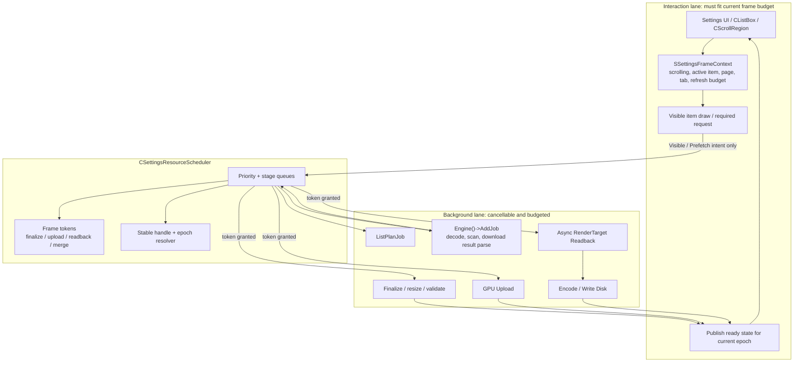
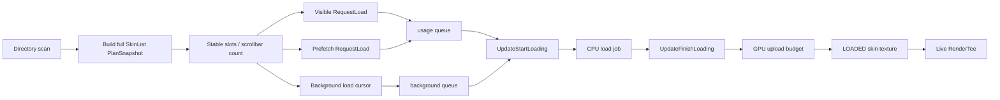
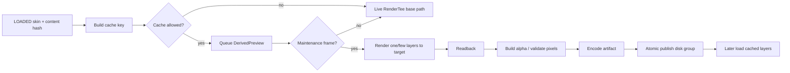

# DDNet 设置页资源与 Tee 皮肤加载优化架构报告

日期：2026-05-31  
范围：`设置 -> Tee` 皮肤列表、设置页资源 / Workshop 缩略图、设置页 warmup / runtime cache / GPU upload 预算  
状态：架构报告，不是最终补丁说明

## 结论摘要

当前问题不是“某个 if 没写对”这么简单，而是设置页资源工作已经长成了多条异步 pipeline，但调度层还没有成为一个真正的生产级游戏资源调度器。结果是：皮肤 cache 生成依赖滚动空闲窗口，皮肤全量 warmup 推进不稳定；资源页虽然 decode/upload 很快，但 upload/finalize 仍可能和滚动输入同帧抢主线程；preview cache 的 render target/readback/WebP 失败链路没有足够诊断，导致“缓存为空”只能看到现象，看不到断点。

正确方向不是把皮肤和资源强行合成同一种任务，也不是让所有东西都走 WebP。应该统一的是：

- priority 语义：`Visible`、`Prefetch`、`Background`、`Maintenance`。
- stage 语义：`Plan`、`Request`、`CpuLoad/Decode`、`Finalize`、`GpuUpload`、`GpuReadback`、`Encode/WriteDisk`、`Publish`、`Evict`。
- frame context：是否正在滚动、是否有 active item、当前页是否可见、帧预算剩余、GPU upload token、readback token。
- telemetry：每个 stage 的耗时、队列长度、跳过原因、失败原因、预算耗尽原因。

皮肤和资源必须保留不同 pipeline：

- 皮肤原始加载：PNG/skin decode -> GPU skin texture -> live `RenderTee`。
- Tee preview cache：已加载 skin -> offscreen render -> readback -> alpha/layer build -> disk artifact -> later cached layer draw。
- 资源 / Workshop 缩略图：decode/download/cache -> ready image queue -> main-thread GPU upload -> preview texture。

列表型资源还有一条硬约束：列表长度和滚动条范围必须来自稳定的 `PlanSnapshot`，不能随着 item 资源加载逐步变化。也就是说，打开 Tee 页前或首次进入列表前，应先完成 skin directory scan + list plan，确定有多少项、排序是什么、滚动条多长；之后后台加载只改变 item 的状态和预览内容，不改变列表数量。

## 当前实现收敛状态（2026-06-01）

这一轮代码已经把报告里最容易直接伤到用户体验的三块落地了：

- **TClient page cache 录制边界补齐**：现在先预热 TClient section static cache，再录整页 page FBO；整页录制使用 render-only 的真实页面路径，而不是只做 prewarm 的空录制路径。page publish 也新增了 dependent subcache ready gate。
- **preview cache 运行时内存淘汰**：不再只有“离开 Tee 页全部清空”这一种粗暴路径；内存缓存新增近似显存字节统计和 LRU 淘汰，长期刷很多皮肤时不会无限驻留。
- **stage 级诊断与行为测试增强**：新增 `dependency_not_ready` miss reason、`perf/settings-resource-stage` 阶段日志，以及针对 page publish gate / preview memory eviction 的真实行为测试，而不只是继续堆源码字符串断言。

这意味着当前代码已经覆盖了报告里“必须先解决，否则后面所有优化都建立在错误产物之上”的那部分：错误的 page cache 首帧发布、运行时 preview 内存无限增长、以及关键阶段不可诊断。

## 优化第一性原则

这个架构的核心不是“缓存更多东西”，也不是“尽量模仿某个实现”，而是实时交互软件的基本约束：用户正在操作时，主线程必须优先服务输入、布局和当前帧绘制；任何不直接决定当前交互结果的工作，都不能无预算地占用主线程、等待 GPU、等待磁盘或触发大范围重建。

### 1. 主线程交互预算优先

主线程每帧可用时间由当前显示器刷新率决定：

- 60Hz 约 16.67ms。
- 144Hz 约 6.94ms。
- 240Hz 约 4.17ms。

设置页不能假设“机器性能够”或“GPU 没满”就安全。只要滚动、切 tab、切页面、拖动滚动条、输入搜索框时出现超过当前刷新周期的帧，就已经违反优化目标。Scheduler 必须基于当前 frame context 判断是否允许 background/finalize/upload/readback/encode 工作进入主线程。

架构后果：

- 交互帧只允许当前可见项所需的最小工作。
- 不可见项不能在交互帧触发同步 I/O、同步 GPU readback、同步 texture upload、同步 encode 或全列表重建。
- 后台任务不能通过“顺手在 UI loop 里做一点”绕过预算。
- 所有主线程 stage 必须能被计时、限额、延后。

### 2. 关键交互路径与后台工作隔离

设置页需要明确两条 lane：

- **Interaction lane**：输入处理、scroll/layout、visible item 绘制、当前页面必要状态发布。
- **Background lane**：目录扫描、decode、prefetch、background warmup、preview cache 生成、磁盘写入、非可见 upload。

Background lane 只能通过 scheduler 以 token 形式进入 Interaction lane，不能直接在页面渲染函数里 drain 队列。一个任务如果不是当前 visible item 的必要工作，就必须可延后、可取消、可丢弃旧 epoch 结果。

### 3. 稳定结构先于资源填充

列表是交互结构，不是资源加载副作用。滚动条长度、选中项、键盘导航和 scroll anchor 必须来自稳定 `PlanSnapshot`。资源加载只能改变 slot 内容，不能改变 slot 数量。

架构后果：

- `ListPlanJob` 决定结构，`ItemResourceJob` 填充内容。
- `PlanSnapshot` 未完成时，不发布会逐步增长的可滚动列表。
- item 失败显示 error/basic placeholder，不删除 slot。
- 结构变化必须有 epoch；旧 epoch 结果不得发布。

### 4. Cache 是可验证状态，不是失败兜底

缓存的正常生命周期是：key 可计算、输入内容已加载、后端能力满足、维护窗口允许、生成成功、整组 artifact 原子发布。cache miss 只能来自可解释状态：冷启动尚未生成、key 失效、内容 hash 变化、配置变化、文件损坏清理、后端能力不支持、兼容性降级。

功能自身无法生成 cache、长期生成失败、生成黑图/透明图、写出半组文件，都不是“正常 miss”，而是错误状态。错误必须有 stage、reason、key、layer、耗时和可重试策略。

### 5. 可证明，而不是主观猜测

优化完成必须能从日志/测试证明：

- 哪些任务在交互帧被暂停。
- 哪些任务消耗了 GPU upload/readback/finalize token。
- 哪个 epoch 的结果被丢弃。
- 为什么 cache 没有生成或没有命中。
- 当前帧是否超过显示器刷新周期预算。

### TClient page cache 的额外边界

TClient 设置页和普通静态设置页不同。它内部已经有 section 级 static cache / interactive layer 分拆，所以整页 page FBO 不能在 section cache 尚未就绪时抢先发布，也不能在“只做 prewarm、不真正绘制页面”的路径里录制。

正确边界是：

- 先让 TClient 左右列的 section static cache 进入 ready。
- 然后用 render-only 的真实页面绘制路径录整页 page FBO。
- 只有 dependent subcache ready 且 page FBO 录制成功，整页 cache 才允许发布。

否则用户看到的不是“慢一点”，而是首帧直接出现未稳定纹理、空录制或花屏，这属于 correctness 问题，不是性能问题。

## 当前真实边界

### 官方 DDNet 的优化基线

官方 DDNet 的 Tee 皮肤列表并不是“没有优化”。它已经有一套适合 DDNet 自有 UI 的低成本虚拟化：

- `CMenus::RenderSettingsTee` 是官方 Tee 设置入口。
- 官方先取 `GameClient()->m_Skins.SkinList()`，再用 `s_ListBox.DoStart(50.0f, vSkinList.size(), 4, 2, ...)` 建立完整滚动范围。
- 列表逐项调用 `DoNextItem()`，但在 `if(!Item.m_Visible) continue;` 后才执行 `SkinListEntry.RequestLoad()` 和 `RenderTee()`。
- `CListBox::DoNextRow()` 通过 `m_ScrollRegion.RectClipped(Item.m_Rect)` 设置 `Item.m_Visible`。

这套模式的优秀点是：布局可以遍历全量稳定列表，滚动条长度基于完整 `vSkinList.size()`；但真正昂贵的皮肤加载和 Tee 渲染只发生在可见项。它不是 Web 意义上的虚拟 DOM，而是 DDNet immediate UI 里已经存在的“可见项重活门控”。

官方证据：

- 官方 `CMenus::RenderSettingsTee`：<https://github.com/ddnet/ddnet/blob/95f3293c2b4f005276deff77ff53be4681edd8e6/src/game/client/components/menus_settings.cpp#L367>
- 官方 `SkinList()` 与 `DoStart(... vSkinList.size() ...)`：<https://github.com/ddnet/ddnet/blob/95f3293c2b4f005276deff77ff53be4681edd8e6/src/game/client/components/menus_settings.cpp#L526>
- 官方 visible gate 后才 `RequestLoad()` / `RenderTee()`：<https://github.com/ddnet/ddnet/blob/95f3293c2b4f005276deff77ff53be4681edd8e6/src/game/client/components/menus_settings.cpp#L722-L739>
- 官方 `CListBox::DoNextRow()` visible 计算：<https://github.com/ddnet/ddnet/blob/95f3293c2b4f005276deff77ff53be4681edd8e6/src/game/client/ui_listbox.cpp#L113-L130>

QmClient 要吸收的是这套实现背后的工程原则，而不是把任何既有实现当成不可质疑的权威：完整列表提供稳定交互结构，可见项门控保护交互帧，重活不能被塞回列表遍历路径。

### DDNet/QmClient UI 不是虚拟 DOM，也不是 ImGui

DDNet 自己的 UI 是 immediate-style 菜单代码加 `CScrollRegion` / `CListBox`。列表每帧仍会遍历逻辑项，但 `CListBox::DoNextRow()` 给出 `Item.m_Visible = !m_ScrollRegion.RectClipped(Item.m_Rect)`，调用方可选择只对 visible 项做重活。

关键证据：

- `src/game/client/ui_listbox.cpp:116-135`：每个 row 算出 visible 状态。
- `src/game/client/components/menus_settings.cpp:2060-2070`：Tee 皮肤列表对不可见项 `continue`，可见项才 `RequestLoad(VISIBLE)`。

这意味着优化不能照搬 Web UI 的虚拟列表组件，但可以采用同一个原则：UI 提交和后台资源推进必须分离。可见列表只负责当前帧交互和渲染，后台 loader 由独立 scheduler 推进。

对 QmClient 来说，官方实现只是一个有用的 regression reference。真正的验收标准是交互帧不被后台任务阻塞：如果新增 warmup/cache 后，滚动、切 tab、切页面时更容易触发不可见项加载、同步 readback、同步磁盘 cache 读取或全列表重建，就说明架构违反了主线程预算原则。

### 列表长度必须先稳定，再加载内容

Tee 皮肤列表、资源页列表、Workshop 列表都属于“列表型资源”。这类页面最重要的用户体验基础不是图片马上加载完，而是列表结构稳定：滚动条长度、选中项位置、拖拽手感、键盘导航和筛选结果不能因为某张图片加载完成而变来变去。

因此 list plan 和 item resource load 必须拆开：

- `Plan` 阶段产出完整 `PlanSnapshot`：总数量、排序、过滤结果、每个 slot 的 stable id。
- `PublishPlan` 只在目录刷新、筛选条件变化、排序规则变化、远端分页结果变化时发生。
- `Load/Preview` 阶段只更新 slot 的资源状态：unloaded、pending、loading、ready、failed、cached。
- 滚动条长度始终基于当前 `PlanSnapshot.m_ItemCount`。
- item 资源失败不删除 slot，只显示明确的 error 状态或基础占位。

对 Tee 皮肤页来说，打开列表前应先完成 skin directory scan 和 list plan；如果 plan 尚未完成，宁可显示“列表准备中”的稳定占位，也不要边加载边增长列表长度。后台 warmup 只能填充已知 slot，不能把新皮肤逐步插进当前列表。

现有渐进发布路径必须被明确替换：`Refresh()` 后不能先发布 default / 部分 merge 列表再逐帧增长；`SettingsSkinListShouldPublishMergedList()` 这类“cursor > 0 即可发布”的策略不能用于可滚动最终列表。新 plan 未完成时，UI 只能继续使用旧完整 plan 或显示固定占位；只有目录扫描、过滤、排序和计划合并全部完成后，才能发布新的 `PlanSnapshot` 并更新 `CListBox::DoStart(... NumItems ...)`。

### 当前 warmup 已有预算，但不是完整资源 scheduler

当前已有 `SSettingsWarmupFrameBudget`：

- `m_MaxTextContainers`
- `m_MaxRenderTargetRecords`
- `m_MaxGpuUploads`
- `m_MaxJobResultMerges`

以及 `SettingsWarmupConsumeBudget()`。这说明已有“帧预算”的雏形，但它目前更像散落在各页面的 helper，而不是一个能统一仲裁皮肤、资源、Workshop、runtime FBO、preview cache 的调度器。

关键证据：

- `src/game/client/components/settings_runtime_cache.h:61-68`
- `src/game/client/components/settings_runtime_cache.cpp:251-285`
- `src/game/client/components/settings_warmup.cpp:25-58`

### 皮肤加载已经有 priority queue，但背景推进被 UI idle 绑定

`CSkinContainer::RequestLoad(ESettingsResourcePriority::BACKGROUND)` 只把 `UNLOADED` 温和推进到 `PENDING`，不刷新 MRU 保活；visible/prefetch 会进入 usage queue 并刷新优先级。这是正确的边界。

问题在 Tee 页面调用侧：background warmup 目前挂在 `IdleWarmupAllowed = PreviewCacheMaintenanceAllowed` 下面。也就是说，一旦滚动条动画、滚轮输入、visible range 不稳定、render target 不支持，后台皮肤 warmup 也会被挡住。这会导致用户看到的体验接近“只有拉到窗口前才加载”。

关键证据：

- `src/game/client/components/skins.cpp:325-362`
- `src/game/client/components/skins.cpp:383-443`
- `src/game/client/components/menus_settings.cpp:2178-2183`
- `src/game/client/components/menus_settings.cpp:2203-2215`

### preview cache 是派生产物，不是皮肤加载的必经项

Tee preview cache 当前做的是：对每个 layer 用黑 / 白背景各 render 一次，readback 后构造 straight alpha，再写 WebP。12 个 layer 意味着最多 24 次 offscreen render + readback，再加 12 次编码 / 写盘。这个流程明显不是皮肤 PNG decode 的简单后处理，而是 GPU 派生预览。

关键证据：

- `src/game/client/components/menus_settings.cpp:1846-1950`
- `src/game/client/components/menus_settings.cpp:1882-1890`
- `src/game/client/components/menus_settings.cpp:1903-1917`
- `src/game/client/components/menus_settings.cpp:1937-1950`

所以缓存生成不应该作为 visible 首帧的同步必经项。正确策略是：首帧 live render；后台独立生成 preview cache；生成完成后只影响后续帧和下次会话。

### 资源页快但会卡滚动，是调度层没有交互态让路

资源页已经有 ready queue、decode finalize 限制、upload count/byte budget、`GpuUploadLimiter`。问题是这些工作仍可能在滚动帧执行。滚动输入同帧里做 finalize / upload，用户不会关心“GPU 没满”，只会感到滚动卡。

关键证据：

- `src/game/client/components/menus_settings_assets.cpp:3869-3920`
- `src/game/client/components/menus_settings_assets.cpp:3938-3990`
- `src/game/client/components/menus_settings_assets.cpp:4552-4594`
- `src/game/client/components/menus_settings_assets.cpp:4650-4694`
- `src/engine/client/gpu_upload_limiter.h:21-61`

## 生产级游戏资源调度原则

这些原则来自成熟游戏引擎和图形 API 文档，但要按 DDNet 的引擎约束落地。

### 1. 异步加载不是“不在当前函数里做”就够了

Unity Addressables 的模型强调异步 load handle 和显式 release，Unreal texture streaming 强调 runtime loading/unloading 和内存预算。它们的共同点不是具体 API，而是资产生命周期可观察、可取消、可释放。

DDNet/QmClient 落地含义：

- 每个资源 job 必须有 key、stage、priority、epoch、owner page、last requested frame。
- 请求方不能直接“顺手启动一堆后台工作”，要通过 scheduler 申请。
- 资源发布必须可取消：页面切换、筛选变化、tab 变化、skin directory 变化都要让旧 epoch 结果作废。

参考：

- Unity Addressables async load / release：<https://docs.unity3d.com/Packages/com.unity.addressables@2.7/manual/load-addressable-assets.html>
- Unreal Texture Streaming：<https://dev.epicgames.com/documentation/en-us/unreal-engine/texture-streaming-in-unreal-engine>

### 2. GPU upload/readback 是帧预算资源，不是普通 CPU job

Vulkan 官方教程把 texture streaming 拆成 background uploader、staging buffer、device image copy、timeline semaphore。OpenGL 文档也明确 PBO 用于异步 pixel transfer，直接 readback 容易产生同步等待。

DDNet/QmClient 落地含义：

- `GpuUpload`、`GpuReadback` 必须是独立 stage，有自己的 token。
- OpenGL 先保持主线程 upload/readback，但只允许 idle/low-interaction 帧执行维护型 readback。
- Vulkan 必须用等价语义的 staging/readback 管线接入同一 `GpuReadback` stage；在能力不足时只能禁用 DerivedPreview，不能让原始皮肤加载和资源加载退化。
- Android/GLES 可以能力降级，但 scheduler 语义仍一致：不支持 readback 就只禁用 DerivedPreview，不影响原始皮肤 warmup。

参考：

- Vulkan Synchronization and Streaming：<https://docs.vulkan.org/tutorial/latest/Building_a_Simple_Engine/Advanced_Topics/Synchronization_and_Streaming.html>
- Vulkan staging buffer：<https://docs.vulkan.org/tutorial/latest/04_Vertex_buffers/02_Staging_buffer.html>
- Khronos OpenGL Pixel Buffer Object：<https://wikis.khronos.org/opengl/Pixel_Buffer_Object>

### 3. 大列表只让 UI 做 UI，后台推进不能依赖用户滚动

Dear ImGui 的 `ImGuiListClipper` 代表了大列表通用原则：渲染/提交可见项，过滤后的数据结构要能按索引访问，后台重活不能绑在每帧全量 UI loop 里。DDNet 不是 ImGui，但 `CListBox` 已提供 visible 信息，原则可复用。

DDNet/QmClient 落地含义：

- 官方 DDNet 已经证明这条原则在本引擎中成立：`DoStart(vSkinList.size())` 保持完整滚动范围，`Item.m_Visible` 后才执行加载和渲染。
- visible rows 只发 `Visible` 请求。
- prefetch rows 只覆盖可见区附近。
- background cursor 应独立持续推进全量列表，且不依赖 preview cache idle gate。
- preview cache generation 是 maintenance job，只在更严格的 idle 条件下跑。
- 禁止让不可见项在 UI 遍历中触发同步加载、同步 cache 读盘、同步 readback 或同步 encode。

参考：

- Dear ImGui large tables / clipper discussion：<https://github.com/ocornut/imgui/issues/3572>
- Dear ImGui filter + clipper discussion：<https://github.com/ocornut/imgui/issues/5962>

### 4. 磁盘缓存格式服务于 pipeline，不应该反过来绑架 pipeline

WebP 支持 RGBA/lossless/alpha 配置，透明图很小是合理的。但如果某个 layer 40B，并不能单独证明成功；必须结合尺寸、alpha 可见像素、编码前后 metadata 和整组 layer 可见性判断。

DDNet/QmClient 落地含义：

- 对外抽象应叫 preview artifact，不应该在调度层写死 WebP。
- WebP 可以作为当前磁盘 codec，但缓存生成的核心状态应是 layer image group。
- 必须原子写入：先写临时文件 / sidecar，整组成功后 publish，避免半组 cache。
- 必须记录每层：尺寸、可见像素、encoded bytes、encode ms、save result。

参考：

- WebP API：<https://developers.google.com/speed/webp/docs/api>
- cwebp options：<https://developers.google.com/speed/webp/docs/cwebp>

## Brainstorming：列表 / 资源加载模型

这里先发散比较几种模型，再收束到适合 DDNet/QmClient 的方案。

### 方案 A：先完整 Plan，再异步填充 Item

流程：先扫描目录 / 读取索引 / 应用筛选排序，发布完整列表长度；随后按 visible、prefetch、background 加载每个 item 的资源。

优点：

- 滚动条稳定，列表长度不抖。
- 选择、滚动恢复、键盘导航都可靠。
- item 加载失败不会影响列表结构。
- 最适合 Tee 皮肤、本地资源、已知目录资源。

缺点：

- 首次进入前需要等待 plan 完成。
- 如果目录非常大，plan 阶段也需要预算和进度显示。

### 方案 B：边发现边追加列表

流程：目录扫描或远端请求发现一个 item 就追加一个 item，列表逐步变长。

优点：

- 首屏可能更快看到部分结果。
- 对无限远端流或未知总数数据源更自然。

缺点：

- 滚动条长度变化，滚动位置会漂。
- 用户拖到底部时，列表继续增长会破坏预期。
- 对 Tee 皮肤这种本地已知集合不合适。

### 方案 C：估算长度 + 修正

流程：先估算列表总数和滚动范围，再逐步修正。

优点：

- 可用于远端分页、未知总数 Workshop 数据。
- 初始等待较短。

缺点：

- 修正总数仍会影响滚动条。
- 需要复杂的 anchor/scroll correction。
- 对本地皮肤列表没有必要。

### 收束方案

QmClient 设置页应采用方案 A 作为默认模型：所有本地列表，包括 Tee 皮肤、本地资源、已安装资源，都必须先发布完整稳定 `PlanSnapshot`，再异步填充 item 资源。方案 B 只允许用于真正未知总数的远端 feed，并且要在 UI 上明确是“分页结果”而不是完整本地列表。方案 C 暂不推荐，除非未来 Workshop 做大规模远端浏览且 API 无法给总数。

Workshop 需要拆成两个 contract：

- 已安装 / 本地 Workshop 资源：finite plan，必须完整发布，安装/卸载触发新的 plan epoch。
- 远端浏览 / 分页 feed：paged plan，允许 append，但必须维护 scroll anchor、page epoch、selected stable id，并明确“这是分页结果”而不是完整本地列表。分页追加不能影响本地有限列表的稳定 plan 规则。

这也意味着 scheduler 需要明确区分两类工作：

- `ListPlanJob`：决定列表结构，完成前不发布可滚动的最终列表。
- `ItemResourceJob`：填充列表项内容，不能改变当前 `PlanSnapshot` 的长度。

建议的数据模型：

```cpp
struct SSettingsListPlanSnapshot
{
	uint64_t m_Epoch = 0;
	int m_Page = -1;
	int m_Tab = -1;
	int m_ItemCount = 0;
	std::vector<std::string> m_vStableIds;
};

enum class ESettingsListItemState
{
	UNLOADED,
	PENDING,
	LOADING,
	READY,
	FAILED,
};
```

页面渲染只读 `PlanSnapshot` 和每个 slot 的 item state。`PlanSnapshot` 的 epoch 变化是列表结构变化；item state 变化只是内容变化，不应该 reset scroll，也不应该改变 scrollbar size。

后台队列、ready queue、upload queue、readback queue 都不能持久保存列表元素裸指针。队列项只能保存 `SSettingsJobHandle` 或等价 `{kind, stable_id, epoch, generation, owner_page/tab}`；发布结果时必须通过 domain adapter 重新 resolve 当前 item，epoch/generation 不匹配直接丢弃。这条规则用于替换资源页里“vector 重分配前清空裸指针队列”的脆弱做法。

## 目标架构

### 组件划分



交互 lane 是架构的保护对象。Background lane 的任务只有拿到 scheduler token 后才能进入主线程相关 stage；如果 frame context 显示正在滚动、切 tab、切页面或 active item 正在交互，scheduler 必须暂停或降低 background/maintenance 工作。

### 核心类型要求

这些类型是完整 Jobs 架构的契约。实现可以按依赖顺序提交，但不能只落 helper 或 facade 名字；每个 domain adapter 都必须最终接入 priority、stage、frame context、epoch handle 和 publish/resolve 规则。

```cpp
enum class ESettingsJobPriority
{
	VISIBLE,
	PREFETCH,
	BACKGROUND,
	MAINTENANCE,
};

enum class ESettingsJobStage
{
	PLAN,
	PUBLISH_PLAN,
	REQUEST,
	CPU_LOAD,
	FINALIZE,
	GPU_UPLOAD,
	GPU_READBACK,
	ENCODE_WRITE_DISK,
	PUBLISH,
	EVICT,
};

enum class ESettingsJobKind
{
	SKIN_LOAD,
	SKIN_PREVIEW_CACHE,
	ASSET_PREVIEW,
	WORKSHOP_THUMB,
	PAGE_RUNTIME_FBO,
	TEXT_CACHE,
};

struct SSettingsJobHandle
{
	ESettingsJobKind m_Kind = ESettingsJobKind::SKIN_LOAD;
	ESettingsJobStage m_Stage = ESettingsJobStage::REQUEST;
	ESettingsJobPriority m_Priority = ESettingsJobPriority::BACKGROUND;
	uint64_t m_Epoch = 0;
	uint64_t m_Generation = 0;
	int m_Page = -1;
	int m_Tab = -1;
	std::string m_StableId;
};

struct SSettingsFrameContext
{
	bool m_SettingsOpen = false;
	bool m_PageVisible = false;
	bool m_ScrollActive = false;
	bool m_ScrollAnimating = false;
	bool m_ActiveItem = false;
	bool m_RenderOnly = false;
	float m_TargetFrameMs = 16.67f;
	float m_FrameElapsedMs = 0.0f;
	float m_MainThreadBudgetLeftMs = 0.0f;
	int m_Page = -1;
	int m_Tab = -1;
};
```

页面代码不得继续直接 drain ready queue 或绕过 scheduler 消耗 GPU/readback/finalize 预算。过渡期若保留旧路径，必须标记为 legacy path，并在完整交付范围里被删除或收束到 scheduler。

`PLAN` 和 `PUBLISH_PLAN` 要比 item 资源加载更早、更严格。一个列表页只有在 `PUBLISH_PLAN` 后才拥有稳定 item count；如果 plan 还没完成，页面应显示稳定占位状态，而不是发布一个会不断增长的临时列表。

`SSettingsFrameContext` 不是普通参数，而是调度器的硬边界。任何需要主线程参与的 stage 都必须先回答三个问题：

- 这件事是否直接影响当前可见交互结果？
- 当前帧剩余预算是否允许它完成最坏情况成本？
- 如果现在不做，是否可以通过延后、取消或丢弃旧 epoch 保持正确性？

只有第一个问题为“是”的 visible 必要工作可以进入交互帧的最小预算；其它工作都走 background/maintenance lane，由 token 控制进入主线程。这样架构关注点才从“多开几个队列”变成“任何后台工作都不能未经仲裁进入用户正在操作的帧”。

### 帧预算策略

预算必须随交互状态变化，而不是固定每帧一套常量。

| 状态 | Visible | Prefetch | Background | Maintenance |
|---|---:|---:|---:|---:|
| 正在滚动 / 滚轮帧 | 允许最小必要量 | 极低 | 暂停 | 暂停 |
| 滚动动画中 | 允许 | 低 | 暂停或极低 | 暂停 |
| 静止 2-8 帧 | 允许 | 正常 | 低速 | 仍暂停 readback |
| 静止稳定 | 允许 | 正常 | 正常 | 允许 1 个 readback/encode job |
| 页面不可见 | 不适用 | 低速 | 低速 | 只做 CPU/IO，不做 GPU readback |

`Plan` 预算独立于 preview/cache 预算。列表 plan 可以在打开前预热，也可以在首次进入时用短暂 blocking/progress 状态完成；但一旦可滚动列表显示出来，列表长度就不应再因为 item 加载变化而改变。

具体预算建议先保守：

- 滚动帧：background upload = 0，maintenance readback = 0。
- 静止稳定：每帧最多 1 个 skin preview key，但要拆成多 stage，避免 24 次 readback 同帧。
- 资源页 visible upload：允许 1 个小图或受 bytes budget 控制。
- 资源页 background upload：滚动时暂停，静止时恢复。
- 全局 `CGpuUploadLimiter` 仍保留，但它是最后一道保险，不是调度策略本身。

预算实现不能只看“GPU 占用率”。GPU 未满时仍可能因为主线程提交、驱动同步、readback pipeline bubble、磁盘写入完成回调、WebP 编码或列表 publish 造成帧时间超标。Scheduler 的判断顺序应是：

1. 当前 frame context 是否处于交互态。
2. 当前主线程剩余预算是否足够执行该 stage 的保守成本。
3. 该 stage 是否会引入 GPU/driver 同步等待。
4. 该任务 priority 是否高于已经等待的 visible/prefetch 工作。
5. 该结果是否仍匹配当前 epoch/generation。

只要任一条件不满足，任务不是失败，而是带 reason 的 deferred；reason 必须进入聚合日志，避免把“没推进”误判成“没有任务”。

## Tee 皮肤 pipeline

### 原始皮肤加载

目标：进入 Tee 列表前先拥有稳定 skin list plan；打开 Tee 页后，即使用户不滚动，也能持续把全量皮肤推进到可用状态；visible/prefetch 永远优先。



关键改动方向：

- skin list plan 必须先稳定发布，列表长度和滚动条不能随着皮肤加载变化。
- 普通加载状态变化不触发全列表 rebuild；只有目录刷新、过滤、排序、收藏规则等结构性变化才更新 plan epoch。
- 保留官方 visible gate：列表遍历可以覆盖全量 slot，但只有 visible row 能做 live render 和当前帧必要请求。
- `Background load cursor` 从 `PreviewCacheMaintenanceAllowed` 中解耦。
- background cursor 只受“页面打开 / 全局预算 / visible backlog”控制，不受 render target 支持控制。
- visible/prefetch 请求可抢占 background pending/loading slot。
- 背景加载可以慢，但必须持续推进，并通过日志显示进度。

### Tee preview cache

目标：preview cache 是加速后续显示的派生产物，失败不能影响 live preview，成功不能覆盖当前帧导致透明/黑图。



关键设计：

- cache key 包含影响几何/像素的配置，如 `cl_fat_skins`；body/feet color 不进 key。
- `white feet`、sixup/0.7、render-only、不支持 readback 的后端，拒绝 DerivedPreview，但不能拒绝原始 skin load。
- 每层允许为空，但整组不能全空；每层都要记录 visible pixels。
- 写盘必须整组成功后 publish，避免半组 WebP 造成反复 miss 或黑/透明错图。
- 生成失败不能永久 suppress；应有短暂 backoff 和失败原因统计。

## 资源 / Workshop pipeline

目标：保持资源页加载速度，同时保证滚动等交互帧不被后台任务阻塞。


关键设计：

- 本地资源列表先发布完整 plan；缩略图加载只能改变 item state，不能改变列表长度。
- 过滤 / 排序 / 目录刷新产生新的 plan epoch；旧 decode/upload 结果必须按 epoch 丢弃。
- `Finalize` 和 `GpuUpload` 都要看 `SSettingsFrameContext.m_ScrollActive`。
- visible 范围 ready item 可在滚动帧用最小预算 upload；非 visible ready item 滚动时让路。
- Workshop thumb 和本地 asset preview 共享调度语义，但保留各自下载/cache/decode 逻辑。
- ready queue 需要 priority ordering：visible > prefetch > background，且同 priority 保持 FIFO/age。
- 资源页 runtime cache invalidation 不应在大量 upload 时导致下一帧整页重建抖动，需要合并 invalidation。

## 后端策略

### OpenGL

交付要求：

- 继续支持 FBO，但现有同步 `ReadRenderTarget` 不能作为维护型 DerivedPreview 的最终接口。
- 新增异步 readback contract：`BeginRenderTargetReadback()` 返回 handle，后续通过 `PollRenderTargetReadback()` / `ResolveRenderTargetReadback()` 或等价接口取回 `CImageInfo`。
- 所有维护型 readback 都必须通过 scheduler 的 `GpuReadback` token 和异步 handle；同步路径只允许用于 debug、能力探测或显式禁用异步 readback 的兼容模式。
- 记录 readback ms，超过阈值时 scheduler 自动降低 DerivedPreview 频率。
- OpenGL 默认实现使用 PBO readback ring 接入上述异步 readback contract，避免把 readback 固定成单帧同步重活。
- texture upload 仍可走现有主线程接口，但必须按 scheduler token 执行。

### Vulkan

交付要求：

- render target/readback capability 必须按真实能力判断，FSAA=0 且格式/读回路径支持时不应无故禁用。
- 如果缺某个 Vulkan backend piece，必须记录明确 reason：render pass、format、readback buffer、layout transition、copy path、MSAA。
- 用 staging/readback buffer + transfer command 语义接上同一异步 readback contract。
- 与 OpenGL 暴露同一个 `IGraphics` 语义：可以 readback 就能生成 preview cache，不能则只禁 DerivedPreview。

### Android / GLES

交付要求：

- capability 降级不影响原始皮肤和资源加载。
- 如果后端支持 FBO/readback，就接入同一 `GpuReadback` token。
- 如果设备性能不足，则通过配置或能力判定禁用 maintenance preview cache，但仍保留稳定列表 plan、原始加载、资源缩略图加载和 live render 基础路径。

## 缓存格式策略

当前 WebP 可以继续使用，但架构上不要把“缓存”定义成 WebP。

建议抽象：

- `SPreviewArtifactKey`：skin、version、size、emote、fat、content hash。
- `SPreviewArtifactLayer`：layer kind、image size、visible pixels、encoded bytes。
- `IPreviewArtifactCodec`：WebP/PNG/raw 可以替换。
- `SPreviewArtifactManifest`：整组 layer 成功后写入，用于判断半组 cache 和版本兼容。

是否 WebP 的判断：

- 磁盘小、跨会话复用：WebP 合理。
- 调试透明/黑图：PNG 或 raw dump 更直观，可作为 debug option。
- 追求最快生成：raw RGBA + 后台压缩可能更适合，但磁盘占用更高。

迁移要求：

- 引入 manifest 时必须 bump preview cache version，避免误命中旧格式。
- 无 manifest 的旧 WebP 组默认按 legacy 处理：可以尝试一次完整 decode 校验，校验失败立即清理；不能作为生产级命中长期保留。
- 写入顺序必须是 layer 临时文件 -> manifest 临时文件 -> 原子 rename/publish；manifest 是整组可命中的最后标志。
- 中断写入、半组文件、manifest 与 layer 不匹配，都必须清理并允许后续重试。

## 观测与日志

生产级优化必须先能回答“卡在哪里”。

每帧聚合日志建议：

- `settings/jobs frame`: scroll_active、active_item、page、tab、budget_used、budget_left。
- `settings/jobs queue`: kind、priority、stage、queued、started、completed、deferred、failed。
- `settings/list plan`: page、tab、epoch、item_count、publish_reason、duration_ms。
- `settings/skins load`: pending、loading、loaded、background_cursor、visible_backlog。
- `settings/skins preview_cache`: key、stage、layer、readback_ms、encode_ms、bytes、visible_pixels、fail_reason。
- `settings/assets`: finalize_ms、upload_ms、uploaded_bytes、ready_queue、scroll_deferred。

日志必须限流和聚合，避免每个 skin 每帧刷屏。

## 完整交付范围

以下条目不是附加优化，而是同一套 Jobs 架构的完整交付范围。实施时可以按依赖顺序分批落地，但文档验收必须覆盖全套闭环，不能只完成前半段就宣称架构完成。

每个条目都按同一个工程约束验收：

- 它保护哪条 interaction lane。
- 哪些后台 stage 被禁止直接进入交互帧。
- 哪些结构必须通过 stable handle + epoch 发布。
- 哪些日志或测试能证明行为成立。

### 1. 诊断闭环

不改变行为，先补足观测：

- preview cache pipeline stage 级日志。
- list plan publish 日志：epoch、item count、publish reason。
- skin background cursor 进度日志。
- resources finalize/upload 在滚动帧的次数和耗时。
- Vulkan render target unsupported 的具体 reason。
- frame budget 日志：target frame ms、main-thread elapsed、budget left、deferred reason。

验收：

- 缓存为空时能明确看到断在 gate/readback/alpha/save 哪一步。
- 皮肤列表显示时能确认 item count 已来自完整 plan，而不是加载中逐步增长。
- plan 未完成时，`CListBox::DoStart` 使用的 `NumItems` 不会随目录 merge cursor 增长。
- 滚动卡顿时能看到当帧是否发生 finalize/upload/readback。
- 当 background/maintenance 没推进时，日志能区分 scroll active、visible backlog、budget exhausted、backend unsupported、epoch stale、disk write failed。

### 2. 稳定列表 plan

行为变化：

- Tee 皮肤页先发布完整 skin list `PlanSnapshot`。
- 列表 item count 和 scrollbar range 不随 skin load state 改变。
- 普通 `PENDING/LOADING/LOADED` 状态变化不触发结构性列表 rebuild。
- 废弃部分 merge 即发布的可滚动列表路径；新 plan 完成前使用旧完整 plan 或固定占位。
- plan publish 是结构性事件，只能由目录、过滤、排序、收藏规则或远端分页边界触发。

验收：

- 打开 Tee 页后，滚动条长度稳定。
- 皮肤加载状态变化只改变格子内容，不改变列表长度。
- `DirectoryScanPending || !MergeComplete` 时不会发布会改变滚动条长度的临时列表。
- 目录刷新 / 过滤 / 排序才更新 plan epoch。
- 单测覆盖 item state 更新不会改变 `PlanSnapshot.m_ItemCount`，也不会 reset scroll anchor。

### 3. 皮肤加载和 preview cache 解耦

行为变化：

- background skin load cursor 独立于 `PreviewCacheMaintenanceAllowed`。
- preview cache 仍只在严格 idle 下跑。
- visible/prefetch 优先级不变。
- skin load 属于 item resource job；preview cache 属于 derived artifact job，二者使用不同 gate、不同失败状态、不同日志 reason。

验收：

- 打开 Tee 页不滚动，background cursor、attempted/warmed metadata 持续推进。
- `cl_skins_loaded_max` 小于皮肤总数时，background warmup 达到稳定窗口，不产生加载/卸载振荡；如目标是全量 GPU loaded，必须显式提高或重定义内存上限。
- render target unsupported 时，skin load 仍持续推进。
- `preview_cache` 不生成时，日志说明是 preview cache 禁用，而不是 skin load 停止。
- visible/prefetch backlog 存在时，background cursor 暂停或降速，并记录 `visible_backlog`，不能抢占当前可见项。

### 4. 交互态资源预算

行为变化：

- 资源页滚动帧暂停非 visible upload/finalize。
- visible ready item 保留极小预算。
- 本地资源和已安装 Workshop 使用 finite plan；远端 Workshop feed 使用 paged plan，并维护 scroll anchor、page epoch 和 selected stable id。
- Workshop 和本地资源共用 priority ordering，但不混用列表结构发布规则。
- ready queue drain 只能由 scheduler token 驱动，不能在页面渲染函数中按 while 循环直接清空。

验收：

- 快速滚动资源页时，upload/finalize 日志显著减少。
- 停止滚动后 ready queue 继续 drain。
- 远端分页 append、安装/卸载刷新时，滚动锚点和选中 stable id 不抖动。
- 快速滚动、切 tab、切资源分类时，帧日志显示 background finalize/upload/readback 被 deferred，交互帧只执行 visible 最小工作。

### 5. 统一 scheduler facade

结构变化：

- 把散落在 Tee/Assets/Workshop 的 budget 判断收束到 `CSettingsResourceScheduler`。
- 页面只提交 intent：visible/prefetch/background/maintenance request。
- 具体 pipeline 由 domain adapter 执行。
- scheduler 明确区分 `ListPlanJob` 和 `ItemResourceJob`，item job 不允许改变当前 plan 长度。
- 后台/ready/upload/readback queue 只保存 `SSettingsJobHandle` 或等价稳定句柄，不保存会被 vector reallocation 失效的列表元素裸指针。
- 页面代码不得绕过 scheduler 直接 drain ready/upload/readback queue。
- scheduler 是所有主线程 stage 的唯一仲裁入口：finalize、GPU upload、GPU readback、publish merge、runtime cache invalidation 都必须通过 frame context/token。

验收：

- 单测能独立验证 priority ordering、scroll-active budget、background fairness、epoch cancel。
- 单测能验证 item state 变化不改变 scrollbar item count。
- 单测能验证 filter/tab/目录刷新后旧 epoch 的 decode/upload/readback 结果不会发布。
- 页面代码不再直接 while-drain ready queue。
- 代码审查可从调用图证明页面只能 submit intent，不能直接执行维护型主线程 stage。

### 6. 后端 readback 完整化

行为变化：

- OpenGL readback 接入 scheduler token，并支持 PBO ring 或等价分帧机制。
- `IGraphics` 增加异步 readback contract；同步 `ReadRenderTarget` 不能作为维护型 DerivedPreview 的最终路径。
- Vulkan 补齐 render target async readback 或给出精确 capability reason。
- Android/GLES 按能力接入或明确禁用 DerivedPreview。
- capability 判断必须细分到 render target、format、MSAA resolve、copy/readback path、buffer map、layout transition，不能只返回笼统 unsupported。

验收：

- OpenGL/Vulkan 在 FSAA=0 且支持条件满足时都能生成 preview cache。
- maintenance readback 不在同一帧等待 GPU idle；测试或 perf 日志能区分 begin/poll/resolve。
- 不支持时只禁用 preview cache，不影响 skin load 和 live render。
- 后端不支持 DerivedPreview 时，缓存 miss reason 是 capability 降级；生成链路本身失败时，reason 是错误 stage，二者不能混为一类。

### 7. cache artifact 生产化

行为变化：

- 原子写入整组 layer。
- manifest 或等价 metadata 记录版本、layer、尺寸、bytes、visible pixels。
- preview cache version bump；无 manifest 旧组按 legacy decode 校验或清理处理。
- 半组/坏组 cache 自动清理。
- cache read/write 不能在交互帧做同步大 I/O；命中检查可轻量，decode/校验/清理必须走 scheduler stage。

验收：

- 中断写入不会留下可命中的坏 cache。
- 旧无 manifest cache、半组 cache、中断写入 cache 都有确定迁移/清理行为。
- 透明/黑图可以从 metadata 和 debug dump 直接定位。
- cache miss 被归类为冷启动、key/config/content 变化、坏组清理、能力降级或错误 stage；长期错误 stage 会暴露为失败统计，而不是静默 miss。

## 验收指标

功能验收：

- QmClient Tee 列表在滚动等交互帧遵守主线程预算：不可见 item 不触发 live render、同步 cache 读盘、同步 readback 或同步 encode。
- 滚动、切 tab、切页面、输入搜索、拖动滚动条期间，background/maintenance stage 不得未经 scheduler token 进入主线程。
- 进入 Tee 皮肤列表时，列表长度和滚动条范围已经稳定。
- 皮肤 `PENDING/LOADING/LOADED/FAILED` 状态变化不改变列表长度。
- plan 未完成时，`CListBox::DoStart` 的 `NumItems` 不随目录 merge 进度增长。
- 打开 `设置 -> Tee` 不滚动，background cursor、attempted/warmed metadata 持续增长，不能停在首屏附近；GPU loaded 数受 `cl_skins_loaded_max` 约束。
- `cl_skins_loaded_max` 较小时，background warmup 不产生加载/卸载振荡。
- render target unsupported 时，皮肤原始加载仍然推进。
- preview cache 支持时，`preview_cache` 文件数持续增长；不支持时只出现限流后的明确 reason。
- 修改 body/feet color 不生成新 key，但预览颜色变化。
- 切换 `cl_fat_skins` 不复用旧 preview cache。
- 资源页快速滚动时不做 background upload/readback。
- filter/tab/目录刷新后，旧 epoch 的 decode/upload/readback 结果不会发布。
- ready/upload/readback queue 不持久保存会被 vector reallocation 失效的裸指针。
- Workshop 远端分页 append、安装/卸载刷新时滚动锚点和选中项稳定。

性能验收：

- 交互帧以当前刷新率为预算：60Hz 不超过 16.67ms，144Hz 不超过 6.94ms，240Hz 不超过 4.17ms；超预算帧必须能归因到具体 stage。
- 滚动帧中 `GpuUpload`、`Finalize`、`Readback` 的维护型任务为 0；visible 必要 upload 如被允许，必须受数量和 bytes 双预算限制。
- OpenGL/Vulkan maintenance readback 能证明分帧完成，不能只统计 token。
- 停止滚动后 ready queue 在预算内持续 drain。
- 单帧 preview cache 生成不超过约定 readback/encode token。
- 日志能解释每次没有继续推进的原因：visible backlog、scroll active、GPU upload budget、readback unsupported、job pending、disk write failed。
- 一次 `ListPlan` publish 或 cache manifest publish 不得触发同帧全页重建和大量 texture upload；publish merge 也必须有 token 和数量上限。

回归验收：

- live `RenderTee` 是 Tee preview 的基础渲染路径；cache miss/fail 不允许导致透明列表项。
- cache miss 必须可解释：冷启动、key 失效、内容变化、文件损坏清理、能力不支持或兼容性降级；长期生成失败导致的 miss 是错误状态。
- cached layer 不覆盖当前生成帧。
- skin list 状态变化不反复触发全列表 rebuild。
- skin list plan epoch 只因目录、过滤、排序等结构性变化更新。
- 资源页 tab/filter 变化能取消旧 epoch 结果。
- cache manifest 迁移覆盖旧无 manifest cache、半组 cache、中断写入 cache。
- UI 缩放、FSAA、render-only、backend 切换都会触发正确的 cache key / capability 失效路径。
- cached preview 与 live `RenderTee` 有像素级或可接受误差验证。
- cache 生成失败、backend capability 降级、artifact 校验失败是三类不同状态，日志、统计和 UI debug 信息不能混在同一个 miss 计数里。

## 风险清单

- 如果继续让 preview cache 和 skin background load 共用 idle gate，会继续出现“缓存不生成时皮肤也加载不完”的耦合问题。
- 如果列表 plan 和 item load 不拆开，会继续出现滚动条长度变化、选择定位抖动、拖拽响应不稳定。
- 如果只增加每帧加载数量，可能把卡顿从“加载慢”变成“滚动卡”。
- 如果 scheduler 不把当前刷新率和主线程剩余预算作为输入，优化会继续停留在“看起来空闲就多做一点”，无法保证 144Hz/240Hz 交互帧。
- 如果 Vulkan 只做 capability 降级，不补 readback 语义，会导致 OpenGL/Vulkan 行为长期不一致。
- 如果 WebP 写盘没有整组 publish，坏 cache 会造成黑图/透明图/反复 miss。
- 如果日志继续逐 skin 刷屏，问题会更难看清；必须改为 stage 聚合。
- 如果不改同步 `ReadRenderTarget` API，只加 readback token，单帧 GPU idle 卡顿仍会存在。
- 如果不定义 stable handle / epoch publish 契约，旧的裸指针 ready queue 债务会被搬进 scheduler facade。

## 完成定义

这份架构只有在以下条件全部满足时才算完成：

- 列表型资源统一遵守 `PlanSnapshot` 规则：列表长度先稳定，item 加载不改变滚动条范围。
- 渐进 merge 发布可滚动列表的旧路径已经移除或隔离为不可滚动占位。
- 所有跨帧 job result 都通过 stable handle + epoch/generation 发布，不通过列表元素裸指针发布。
- Tee 皮肤原始加载、Tee preview cache、资源缩略图、Workshop 缩略图都接入统一 priority / stage / frame context 语义。
- 皮肤 background load 与 preview cache maintenance 完全解耦。
- 资源页滚动帧会让非可见 finalize/upload/readback 让路。
- OpenGL、Vulkan、Android/GLES 都通过同一 capability 语义表达 DerivedPreview 是否可用；不可用时只禁用 preview cache，不影响原始资源加载。
- 维护型 readback 通过异步 readback contract 分帧完成，同步路径不作为生产默认路径。
- cache artifact 整组原子发布，坏组/半组可检测、可清理、可诊断。
- 日志能解释所有“为什么没有继续推进”的原因，且不会逐 item 刷屏。
- 功能验收、性能验收、回归验收全部通过。
