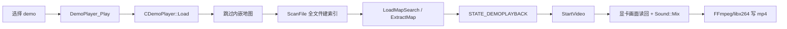

## 速答

14GB demo 打开无响应，主要瓶颈很可能是同步全文件扫描。`DemoPlayer_Play()` 在主线程进入加载态后调用 `CDemoPlayer::Load()`，而 `Load()` 会跳过内嵌地图后立即 `ScanFile()`，从头到尾扫描 demo chunk 来建立 keyframe、首尾 tick 和时长信息。

demo 渲染突然出现画面抖动、声音丢失，不太像 RTX 4060 Ti 的 NVENC 问题，因为当前实现走 FFmpeg 默认 mp4/H264/libx264 CPU 编码，不是显式 NVENC。更值得怀疑的是 demo 播放时间轴、显卡呈现图像读回、音频混音和 FFmpeg 多线程写入之间的稳定性，外加 Windows/NVIDIA 驱动或系统更新改变了渲染/音频时序。

## 关键证据

| # | 结论 | 证据 | 位置 |
|---|------|------|------|
| 1 | 打开 demo 是同步加载路径 | `DemoPlayer_Play()` 在加载态中直接调用 `m_DemoPlayer.Load(...)`。 | `src/engine/client/client.cpp:4294` |
| 2 | 大文件卡顿核心是全文件扫描 | `Load()` 跳过内嵌地图后注释为“Scan the file for interesting points”，随后调用 `ScanFile()`。 | `src/engine/shared/demo.cpp:881` |
| 3 | `ScanFile()` 是线性 chunk 扫描 | `ScanFile()` 循环读取 chunk header，遇到 keyframe 就 `m_vKeyFrames.emplace_back(...)`，其他 chunk 用 `io_skip(...)` 跳过。 | `src/engine/shared/demo.cpp:590` |
| 4 | seek 仍依赖 keyframe 后重放 | `SetPos()` 从 keyframe 定位后 `while(m_Info.m_NextTick < WantedTick) DoTick();`。 | `src/engine/shared/demo.cpp:1041` |
| 5 | 浏览器按需读 header，不是全扫描 | `FetchHeader()` 调用 `DemoPlayer()->GetDemoInfo(...)`，用于详情和排序信息。 | `src/game/client/components/menus_demo.cpp:1717` |
| 6 | 录制推进依赖 demo update 前的音视频帧 | demo playback 更新时，若 `IVideo::Current()` 存在，会先 `NextVideoFrame()` 和 `NextAudioFrameTimeline(...)`。 | `src/engine/client/client.cpp:2987` |
| 7 | 录制画面来自显卡呈现图像读回 | `UpdateVideoBufferFromGraphics()` 调用 `GetReadPresentedImageDataFuncUnsafe()` 读取 RGBA。 | `src/engine/client/video.cpp:633` |
| 8 | 编码配置是 libx264 风格 | H264 分支设置 x264 `preset` 和 `crf`，配置项为 `cl_video_preset`、`cl_video_crf`。 | `src/engine/client/video.cpp:976` |

## 探索范围

- 聚焦目录：`src/engine/shared/`、`src/engine/client/`、`src/game/client/components/`
- 涉及文件：`demo.cpp`、`client.cpp`、`video.cpp`、`config_variables.h`、`menus_demo.cpp`
- 跳过：未运行 14GB demo 实测，未采集 Win11/NVIDIA 驱动版本、Windows KB、录制日志和 FFmpeg 错误输出。

## 置信度说明

**confidence: medium**

代码路径足以确认 14GB demo 打开会触发同步线性扫描，因此“打开卡住”的方向较明确。录制抖动/丢音部分只完成静态链路调研，缺运行时日志、具体驱动版本、渲染后端、音频设备和复现矩阵，所以只能判断风险点，不能确认唯一根因。

## 后续建议

下一步可以做一个最小复现矩阵：同一个 demo、同一分辨率，分别记录 `cl_video_recorder_fps 30/60`、`cl_video_preset 0/3/5`、`cl_video_sound_enable 0/1`、Vulkan/OpenGL、驱动版本和 Windows KB 对输出抖动/丢音的影响。
