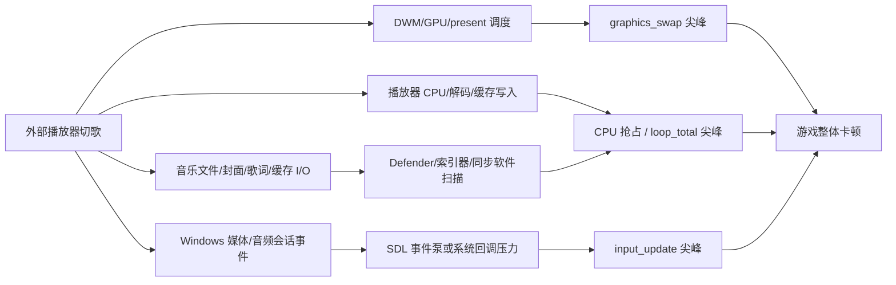

## 速答

用户补充“没有 SMTC 功能时也会卡”，因此 SMTC 不能作为根因，只能作为可能的放大因素。当前问题应按“外部播放器切歌引发系统级资源/调度扰动，游戏主循环被连带影响”来调研：重点不是游戏音频组件，而是切歌瞬间主循环哪一段出现尖峰，以及 Windows 侧是否有 Defender/索引器/同步软件、播放器进程、DWM/GPU、磁盘 I/O 或输入事件队列尖峰。

仓库已经有足够的阶段日志入口：打开 `qm_perf_debug 1` 并调低 `qm_perf_debug_threshold_ms` 后，可以区分卡顿落在 `input_update`、`client_update`、`frame_render`、`graphics_swap` 还是 `loop_total`。如果 `loop_total` 高但各子阶段都不高，更像 OS 调度/CPU 抢占/磁盘阻塞；如果 `graphics_swap` 高，更像 DWM/GPU/present；如果 `input_update` 高，要看 SDL 事件泵是否在切歌时收到大量系统事件；如果 Windows 资源监视器里 `MsMpEng.exe` 或磁盘响应时间同时升高，Defender/I/O 就是强嫌疑。

## 关键证据

| # | 结论 | 证据 | 位置 |
|---|------|------|------|
| 1 | 现象应定位到主循环阶段 | 主循环有 `input_update`、`sound_update`、`client_update`、`frame_render`、`graphics_swap`、`loop_total` 阶段日志。 | `src/engine/client/client.cpp:3531` |
| 2 | 性能日志已有开关和阈值 | `LogPerfStage()` 由 `qm_perf_debug` 控制，低于 `qm_perf_debug_threshold_ms` 不输出。 | `src/engine/client/client.cpp:77` |
| 3 | 配置项已存在 | `qm_perf_debug` 默认 0，`qm_perf_debug_threshold_ms` 默认 20ms。 | `src/engine/shared/config_variables_qmclient.h:11` |
| 4 | 输入事件泵可观测 | `input.cpp` 对 `sdl_poll_events` 记录耗时和事件数量，事件数超过 64 会强制输出。 | `src/engine/client/input.cpp:884` |
| 5 | `client_update` 包含所有 game client component 更新 | `CClient::Update()` 调 `GameClient()->OnUpdate()`；`CGameClient::OnUpdate()` 遍历组件 `pComponent->OnUpdate()`。 | `src/engine/client/client.cpp:3602` |
| 6 | `graphics_swap` 单独可观测 | 主循环把 `m_pGraphics->Swap()` 包成独立阶段日志，能分辨 DWM/GPU/present 等待。 | `src/engine/client/client.cpp:3664` |
| 7 | `loop_total` 可暴露外部抢占 | 每轮循环最后记录 `loop_total`，若它升高而内部阶段不升高，说明时间可能耗在 OS 调度等待或未包住的等待点。 | `src/engine/client/client.cpp:3682` |
| 8 | SMTC 是可选放大因素，不是必要根因 | `qm_smtc_enable` 默认启用，SMTC 会读媒体状态和封面，但用户确认无此功能时也卡，因此不能作为必要根因。 | `src/engine/shared/config_variables_qmclient_extra.h:124` |
| 9 | 外部 Defender/I/O 不能靠代码静态确认 | 切歌会触发播放器读音乐文件、写缓存/歌词/封面/数据库；如果这些路径被 Defender/索引器/同步软件扫描，游戏会表现为整体帧时间尖峰。 | 外部系统行为，需运行时观察 |

## 探索范围

- 聚焦目录：`src/engine/client/`、`src/engine/shared/`、`src/game/client/`
- 涉及文件：`client.cpp`、`input.cpp`、`gameclient.cpp`、`config_variables_qmclient.h`、`config_variables_qmclient_extra.h`、`system_media_controls.cpp`
- 跳过：未运行客户端复现，未采集 Windows 资源监视器、Defender/索引器进程、播放器名称、音乐库路径、磁盘响应时间、DWM/GPU 指标和实际 `perf/main_thread` 日志。

## 置信度说明

**confidence: medium**

代码能确认应该怎样定位游戏侧阶段，也能排除“只查游戏音频”这个方向；用户反馈也排除了 SMTC 作为必要根因。但真正根因在外部系统行为里，静态代码无法确认 Defender、DWM/GPU、播放器缓存写入或 SDL 事件泵哪一个是主因，需要用同一首歌切换场景采集运行时证据。

## 后续建议

先做一次最小观测：设置 `qm_perf_debug 1`、`qm_perf_debug_threshold_ms 5`，切歌 10 次，记录尖峰阶段；同时开任务管理器/资源监视器观察 `MsMpEng.exe`、播放器进程、DWM、磁盘响应时间和 GPU 3D/Copy。若 Defender 或磁盘响应时间同步升高，再给音乐库、播放器缓存、歌词/封面缓存、QmClient 保存目录加 Defender 排除项做 AB。
