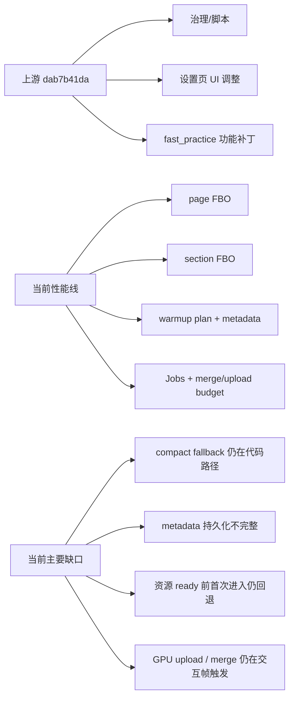

> **文档已过时** — 本文档内容不再反映当前代码状态，仅供参考。

## 速答

当前仓库里的上游提交 `dab7b41da` 不是“设置页性能方案”，主体是治理文件、少量设置 UI 调整和 `fast_practice` 功能补丁；其中只有一小部分适合继续保留在当前性能线里。当前设置页性能优化已经有三条线并行存在：运行时 page/section FBO、启动/菜单空闲预热、资源加载 Jobs，但三者完整度不一致，导致首次进入、切页和滚动时仍可能回退到交互帧做重活。

对照 `docs/dyl/Bestclient` 后，可以确认 BC 的强项主要是资源类页面的异步加载和主线程分帧 finalize，而不是当前仓库这套 settings runtime cache 体系。当前仓库已经比 BC 多做了 page/section FBO 和 warmup metadata，但还没有把“首次进入直接看到完整稳定视觉资源”做完整，尤其是资源 ready、GPU upload 和 section 高度稳定性这三点。

## 关键证据

| # | 结论 | 证据 | 位置 |
|---|------|------|------|
| 1 | `dab7b41da` 主体不是性能方案，而是治理文件 + 少量 UI/功能补丁 | 提交文件列表绝大多数是 `.ai/*`、`AGENTS.md`、`progress.md`、`qmclient_scripts/gate/*`，运行时代码只涉及少数几个文件 | `git show --name-only dab7b41da` |
| 2 | 上游提交里确实包含半套接口漂移，不适合整吃 | `background.h` 当前已回到 `bool DecodeNextVideoFrame();` 无参声明，对应 `background.cpp` 实现也是无参版本 | [src/game/client/components/background.h](E:\Coding\DDNet\QmClient\src\game\client\components\background.h:305) |
| 3 | 上游在 `menus_qmclient.cpp` 加入了未完整接链的 UI 项 | 当前未提交 diff 仅删除 `m_QmHudIslandShowTeam` 相关 4 行，说明这部分是半套混入 | [src/game/client/components/qmclient/menus_qmclient.cpp](E:\Coding\DDNet\QmClient\src\game\client\components\qmclient\menus_qmclient.cpp:6249) |
| 4 | 当前仓库已经有启动 warmup plan 和 page runtime cache，不是“完全没做预热” | `PrepareSettingsRuntimeWarmupPlan`、`PrewarmSettingsRuntimeCaches`、`LoadSettingsRuntimeCacheMetadata`、`SaveSettingsRuntimeCacheMetadata` 已存在 | [src/game/client/components/tclient/menus_tclient.cpp](E:\Coding\DDNet\QmClient\src\game\client\components\tclient\menus_tclient.cpp:3414), [src/game/client/components/tclient/menus_tclient.cpp](E:\Coding\DDNet\QmClient\src\game\client\components\tclient\menus_tclient.cpp:3420), [src/game/client/components/tclient/menus_tclient.cpp](E:\Coding\DDNet\QmClient\src\game\client\components\tclient\menus_tclient.cpp:3506), [src/game/client/components/tclient/menus_tclient.cpp](E:\Coding\DDNet\QmClient\src\game\client\components\tclient\menus_tclient.cpp:3536) |
| 5 | 当前 metadata 持久化内容仍偏少，只保存最后页/子 tab/scroll | `SSessionUiCache` 读写只覆盖 `settings_page`、`tab_tclient`、`tab_qm`、`scroll_y` | [src/game/client/components/section_loader.cpp](E:\Coding\DDNet\QmClient\src\game\client\components\section_loader.cpp:564), [src/game/client/components/section_loader.cpp](E:\Coding\DDNet\QmClient\src\game\client\components\section_loader.cpp:629) |
| 6 | 当前 page FBO 在资源未 ready 时会拒绝命中，所以首次进入仍可能回退 | `SettingsPageCacheCanUseRecordedResources` 要求 `ResourcesReadyAtRecord=true`；`DrawSettingsPageRuntimeCache` 在资源未 ready 时返回 miss | [src/game/client/components/settings_resource_jobs.cpp](E:\Coding\DDNet\QmClient\src\game\client\components\settings_resource_jobs.cpp:156), [src/game/client/components/menus.cpp](E:\Coding\DDNet\QmClient\src\game\client\components\menus.cpp:3575) |
| 7 | 当前 compact/summary fallback 不是完全移除，只是按名字过滤一部分 | `SettingsRuntimeCacheAllowsVisibleCompactText` 仅通过字符串规则排除 `DeferredSummary/CompactSummary/SummaryBlock` | [src/game/client/components/settings_runtime_cache.cpp](E:\Coding\DDNet\QmClient\src\game\client\components\settings_runtime_cache.cpp:333) |
| 8 | section static FBO 已落地，但高度变化会直接导致缓存失效和重录 | `TryRenderCachedSection` 中如果 interactive layer 高于 cached height，会销毁 render target 并返回 false | [src/game/client/components/section_loader.cpp](E:\Coding\DDNet\QmClient\src\game\client\components\section_loader.cpp:819), [src/game/client/components/section_loader.cpp](E:\Coding\DDNet\QmClient\src\game\client\components\section_loader.cpp:846) |
| 9 | 皮肤加载已经走 Jobs，但 GPU upload/finalize 仍在主线程预算里完成 | `Engine()->AddJob(m_pLoadJob)` 后，`UpdateFinishLoading` 里仍做 `LoadSkinFinish` 和 upload budget 消耗 | [src/game/client/components/skins.cpp](E:\Coding\DDNet\QmClient\src\game\client\components\skins.cpp:995), [src/game/client/components/skins.cpp](E:\Coding\DDNet\QmClient\src\game\client\components\skins.cpp:1047) |
| 10 | 资源页也有 decode/merge/upload budget，但本质仍是交互帧渐进完成 | `menus_settings_assets.cpp` 记录了 `queued/merge/upload` 各阶段 perf，并维护 ready thumb queue | [src/game/client/components/menus_settings_assets.cpp](E:\Coding\DDNet\QmClient\src\game\client\components\menus_settings_assets.cpp:2926), [src/game/client/components/menus_settings_assets.cpp](E:\Coding\DDNet\QmClient\src\game\client\components\menus_settings_assets.cpp:3968), [src/game/client/components/menus_settings_assets.cpp](E:\Coding\DDNet\QmClient\src\game\client\components\menus_settings_assets.cpp:4670) |
| 11 | BC 的资源页/皮肤页强项是异步与分帧，而不是 settings FBO 体系 | `Bestclient` 里的 `skins.cpp` 同样是 `Engine()->AddJob` + 周期性 `OnUpdate` 分帧 finish；搜索未见 settings FBO/warmup 体系 | [docs/dyl/Bestclient/src/game/client/components/skins.cpp](E:\Coding\DDNet\QmClient\docs\dyl\Bestclient\src\game\client\components\skins.cpp:613), [docs/dyl/Bestclient/src/game/client/components/skins.cpp](E:\Coding\DDNet\QmClient\docs\dyl\Bestclient\src\game\client\components\skins.cpp:519) |
| 12 | 全局注册问题属于稳定性修复，不是性能本体，但必须保留 | `CUi::RemoveUIElement` 存在，`CUIElement` 析构会回收注册项，语言页缓存依赖 `SettingsTextElement` 稳定生命周期 | [src/game/client/ui.h](E:\Coding\DDNet\QmClient\src\game\client\ui.h:500), [src/game/client/ui.cpp](E:\Coding\DDNet\QmClient\src\game\client\ui.cpp:37), [src/game/client/components/menus.cpp](E:\Coding\DDNet\QmClient\src\game\client\components\menus.cpp:3334) |

## 探索范围

- 聚焦目录：`src/game/client/components/`、`src/game/client/ui.*`、`src/engine/shared/`、`docs/dyl/Bestclient/`
- 涉及文件：
  - `background.h`
  - `menus.cpp`
  - `menus_settings.cpp`
  - `menus_settings_assets.cpp`
  - `qmclient/menus_qmclient.cpp`
  - `tclient/menus_tclient.cpp`
  - `section_loader.cpp`
  - `settings_runtime_cache.*`
  - `settings_resource_jobs.*`
  - `skins.cpp`
  - `countryflags.cpp`
  - `docs/dyl/Bestclient/src/game/client/components/skins.cpp`
- 跳过：
  - 运行时实机 perf log 和 dump 文件，本次只做代码路径核对
  - 上游 `hud.cpp/background.cpp` 全量视觉逻辑，因为当前问题聚焦设置页性能线

## 置信度说明

**confidence: high**

- 已覆盖当前设置页性能链的核心入口、预算模型、FBO 录制路径、metadata I/O、资源页与皮肤页主流程。
- 上游提交按真实文件列表核对过，不是只看 commit message。
- 未做的部分是“运行时量化数据复测”，因此这份文档回答的是“代码是否完整/是否对齐目标”，不是“最终帧时间已经达标”。

## 后续建议

基于这份探索，下一步应直接进入两类修复：先移除可见 compact fallback，再补全持久化 metadata 与启动前首屏资源预热闭环。
