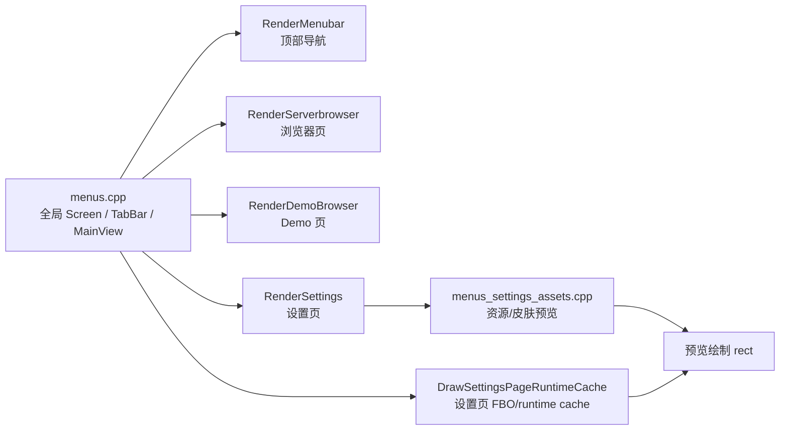

> **部分内容已过时** — 部分描述不再反映当前代码状态，请以较新的相关文档为准。

## 速答

当前仓库的菜单 UI 主路径已经分成了“全局导航骨架”“页面级布局”“设置页 runtime cache”“资源/皮肤预览”四条链，但它们没有共享一套明确的设计规则，这就是近期反复出现“改一处，别处没跟上”的根因。顶部导航当前的问题在 `RenderMenubar()`：按钮形态、真实间隙、空闲态背景和 active 表达都混在一起；浏览器/设置/Demo 的问题在于页面卡片体系没有统一；皮肤页问题则是预览绘制和设置页 FBO/runtime cache 链路可能同时参与了错位。

当前仓库里最适合沉淀成规范的就是这条菜单主路径，而不是整个 DDNet 所有 UI。后续实现应该按“顶部导航规则 -> 页面卡片系统 -> Demo 页 -> 皮肤预览与缓存链”这个顺序收口。

## 关键证据

| # | 结论 | 证据 | 位置 |
|---|------|------|------|
| 1 | 顶部导航的中央项当前仍靠 `VSplitLeft` 连续切分，背景之间没有被强制切出真实空隙 | `RenderMenubar()` 中央导航项仍按连续 `VSplitLeft(BrowserButtonWidth, &Button, &Box)` 铺开，只在左边插入过一次固定 split，缺少统一的项间 gap 规则 | `src/game/client/components/menus.cpp:1135-1155` |
| 2 | 右上纯图标按钮当前空闲态仍有默认底色来源，因此不能满足“空闲态透明” | `RenderMenubar()` 给右上按钮传入 `IconButtonDefault(0,0,0,0.10)` 作为默认态背景色 | `src/game/client/components/menus.cpp:1018-1021`, `src/game/client/components/menus.cpp:1044-1073` |
| 3 | 全局菜单骨架已经固定了外层 `10px` 和导航到底下主内容 `10px` 的节奏 | `Screen.Margin(10.0f, &Screen)` 后再 `MainView.HSplitTop(10.0f, nullptr, &MainView)` | `src/game/client/components/menus.cpp:1969-1973`, `src/game/client/components/menus.cpp:2014-2017`, `src/game/client/components/menus.cpp:2097-2100` |
| 4 | 浏览器页已经拆成列表/右栏/底栏卡片，但其规则仍是页面内局部拼装，不是全局统一 token | `RenderServerbrowser()` 里分别为 `ServerListBase`、`StatusBox`、`ToolBoxBase` 画卡片并独立 `Margin(10.0f)` | `src/game/client/components/menus_browser.cpp:3510-3523` |
| 5 | 设置页主内容和右栏已经是独立卡片，但它们和浏览器页还没有共享明确的可调面板参数 | `RenderSettings()` 直接用 `SURFACE_ELEVATED` / `SURFACE_GLASS` 绘制右栏和主内容，没有暴露面向这套菜单 UI 的独立用户可调语义 | `src/game/client/components/menus_settings.cpp:3508-3514` |
| 6 | 设置页 runtime cache 仍然会在 runtime key 匹配且资源 ready 时直接复用旧渲染结果，因此尺寸/模式变化若没进 key，可能造成错误复用 | `DrawSettingsPageRuntimeCache()` 在 `SettingsPageRuntimeCacheMatches(...)` 为真且资源可用时直接 `DrawRenderTarget(...)` | `src/game/client/components/menus.cpp:3627-3665` |
| 7 | 资源/皮肤预览现在统一走 `ComputePreviewDrawRect()` 规范化尺寸，但这只是绘制层的一半，不能单独证明不会错位 | `menus_settings_assets.cpp` 已经把多处预览改成 `ComputePreviewDrawRect(HeaderLayout.m_TextureRect, TextureWidth, TextureHeight)` | `src/game/client/components/menus_settings_assets.cpp:3626-3643`, `src/game/client/components/menus_settings_assets.cpp:4100-4111`, `src/game/client/components/menus_settings_assets.cpp:5028-5038`, `src/game/client/components/menus_settings_assets.cpp:5137-5145` |
| 8 | Demo 页仍然需要独立核对，因为它不在浏览器/设置页这条新卡片路径上，容易残留旧大底板和旧内边距 | 当前菜单主分发中 Demo 页通过 `RenderDemoBrowser(MainView)` 走独立路径，不会自动继承浏览器页的卡片重排逻辑 | `src/game/client/components/menus.cpp:2054-2057` |

## 探索范围

- 聚焦目录：`src/game/client/components/`
- 涉及文件：
  - `menus.cpp`
  - `menus_browser.cpp`
  - `menus_settings.cpp`
  - `menus_demo.cpp`
  - `menus_settings_assets.cpp`
  - `menus_settings7.cpp`
  - `ui.cpp`
- 跳过：
  - 游戏内 HUD、控制台、非菜单主路径页面
  - 完整运行时录屏验证，本次聚焦规范与代码入口

## 置信度说明

**confidence: high**

- 已覆盖这轮用户反馈直接涉及的顶部导航、浏览器、设置页、Demo、皮肤预览和设置页 runtime cache 主路径。
- 关键结论都能回溯到当前工作树代码入口。
- 未做的是运行时视觉验收，因此这份文档回答的是“规范应该落在哪些代码入口”，不是“视觉已经完全满意”。

## 后续建议

可以直接基于这份探索和同日设计文档推进菜单 UI 统一实现，并在实现后用实际截图做最终验收。
