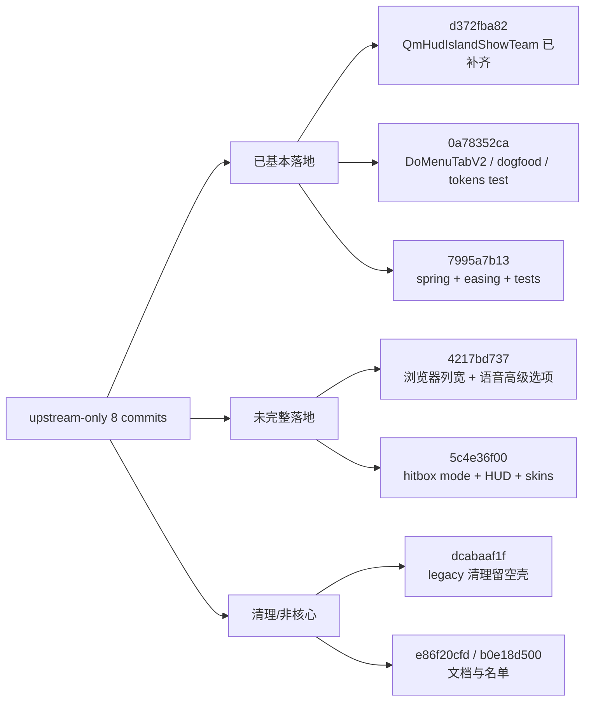

> **文档已过时** — 本文档内容不再反映当前代码状态，仅供参考。

## 速答

当前这轮上游审计不能按整仓 diff 做，因为本地相对 `upstream/master` 已经超前很多；正确做法是只看 `main..upstream/master` 这 8 个 upstream-only 提交，再判断哪些已经被 cherry-pick/手工挪过来、哪些只是半套混入。

当前结论可以先分成三类：

- 已基本落地：
  - `d372fba82`：之前确实有半套混入，`QmHudIslandShowTeam` 已在当前工作树补齐到配置、设置页和 HUD 文本链路。
  - `0a78352ca`：现代菜单标签页、dogfood 页、`QmUiTokensTest` 等核心内容已经在当前仓库。
  - `7995a7b13`：`SPRING` 动画驱动、新 easing、`QmAnimCurves.h` 和 `QmAnimTest` 已在当前仓库。
- 明显未完整落地：
  - `4217bd737`：服务器浏览器列宽持久化/拖拽/重置，以及语音设置里的“高级选项”折叠，目前都还没进当前仓库。
  - `5c4e36f00`：新的碰撞箱模式、Media Island/HUD editor 对齐修正、皮肤队列 0.5s 单位与 sixup 同步，这批目前都还没进当前仓库。
- 清理/非核心：
  - `dcabaaf1f`：聊天气泡 legacy 配置主体已经被清掉，但 `MigrateChatBubbleConfig()` 空壳和调用还留着，属于半清理状态。
  - `e86f20cfd`、`b0e18d500`：主要是文档/模板/贡献者名单，不是当前功能漏接主风险。

## 关键证据

| # | 结论 | 证据 | 位置 |
|---|------|------|------|
| 1 | `d372fba82` 里先前漏掉的 `QmHudIslandShowTeam` 已在当前工作树补齐 | 当前配置头、设置页 UI 和 HUD 文本链路都能直接找到该项 | [src/engine/shared/config_variables_qmclient.h](E:/Coding/DDNet/QmClient/src\engine\shared\config_variables_qmclient.h:286), [src/game/client/components/qmclient/menus_qmclient.cpp](E:/Coding/DDNet/QmClient/src\game\client\components\qmclient\menus_qmclient.cpp:6253), [src/game/client/components/hud.cpp](E:/Coding/DDNet/QmClient/src\game\client\components\hud.cpp:370) |
| 2 | `0a78352ca` 的现代菜单标签页/狗粮页主链已在当前仓库 | `DbgQmUiDogfood`、`DoMenuTabV2(...)`、`QmUiTokensTest` 都已存在 | [src/engine/shared/config_variables_qmclient.h](E:/Coding/DDNet/QmClient/src\engine\shared\config_variables_qmclient.h:17), [src/game/client/components/menus.cpp](E:/Coding/DDNet/QmClient/src\game\client\components\menus.cpp:968), [src/game/client/components/qmclient/menus_qmclient.cpp](E:/Coding/DDNet/QmClient/src\game\client\components\qmclient\menus_qmclient.cpp:600), [src/test/QmUiTokensTest.cpp](E:/Coding/DDNet/QmClient/src\test\QmUiTokensTest.cpp:35) |
| 3 | `7995a7b13` 的 spring 动画驱动已经落地，不是漏项 | 当前 `QmAnim.cpp`、`UiForms.cpp`、`QmAnimTest.cpp` 均直接使用 `EUiAnimDriver::SPRING` | [src/game/client/QmUi/QmAnim.cpp](E:/Coding/DDNet/QmClient/src\game\client\QmUi\QmAnim.cpp:114), [src/game/client/QmUi/QmAnim.cpp](E:/Coding/DDNet/QmClient/src\game\client\QmUi\QmAnim.cpp:240), [src/game/client/QmUi/UiForms.cpp](E:/Coding/DDNet/QmClient/src\game\client\QmUi\UiForms.cpp:102), [src/test/QmAnimTest.cpp](E:/Coding/DDNet/QmClient/src\test\QmAnimTest.cpp:182) |
| 4 | `4217bd737` 的浏览器列宽系统没有进当前仓库 | 上游有 `BrColWidthName` 和重置列宽按钮；当前仓库的浏览器列表仍是固定宽度常量 | `upstream/master:src/engine/shared/config_variables.h:401`, `upstream/master:src/game/client/components/menus_browser.cpp:396`, [src/game/client/components/menus_browser.cpp](E:/Coding/DDNet/QmClient/src\game\client\components\menus_browser.cpp:461), [src/game/client/components/menus_browser.cpp](E:/Coding/DDNet/QmClient/src\game\client\components\menus_browser.cpp:463) |
| 5 | `4217bd737` 的语音“高级选项”折叠也没有进当前仓库 | 上游有 `QmVoiceShowAdvanced` 和对应设置项；当前仓库仍直接暴露 `QmVoiceShowConnectionStatus`，仓库里没有 `QmVoiceShowAdvanced` 命中 | `upstream/master:src/engine/shared/config_variables_qmclient.h:163`, `upstream/master:src/game/client/components/qmclient/menus_qmclient.cpp:5908`, [src/game/client/components/qmclient/menus_qmclient.cpp](E:/Coding/DDNet/QmClient/src\game\client\components\qmclient\menus_qmclient.cpp:5838), [src/game/client/components/qmclient/menus_qmclient.cpp](E:/Coding/DDNet/QmClient/src\game\client\components\qmclient\menus_qmclient.cpp:5841) |
| 6 | `5c4e36f00` 的新碰撞箱模式没有进当前仓库，当前仍是旧版 `QmShowCollisionHitbox` | 上游新增 `QmHitboxMode` 与新 UI；当前配置头和设置页仍只有旧 `QmShowCollisionHitbox`/`QmCollisionHitboxAlpha` | `upstream/master:src/engine/shared/config_variables_qmclient.h:63`, `upstream/master:src/game/client/components/qmclient/menus_qmclient.cpp:5138`, [src/engine/shared/config_variables_qmclient.h](E:/Coding/DDNet/QmClient/src\engine\shared\config_variables_qmclient.h:61), [src/engine/shared/config_variables_qmclient.h](E:/Coding/DDNet/QmClient/src\engine\shared\config_variables_qmclient.h:63), [src/game/client/components/qmclient/menus_qmclient.cpp](E:/Coding/DDNet/QmClient/src\game\client\components\qmclient\menus_qmclient.cpp:5014) |
| 7 | `5c4e36f00` 的 HUD/Media Island 对齐修正和编辑器 transform 扩展也未落地 | 当前 `hud.cpp` 仍直接用 `TimerCapsule.m_BoxX` 计算，`MediaIsland` 仍是单个 `BeginTransform(...)` 入口 | `upstream/master:src/game/client/components/hud.cpp:3359`, `upstream/master:src/game/client/components/hud.cpp:3471`, [src/game/client/components/hud.cpp](E:/Coding/DDNet/QmClient/src\game\client\components\hud.cpp:3219), [src/game/client/components/hud.cpp](E:/Coding/DDNet/QmClient/src\game\client\components\hud.cpp:3534), [src/game/client/components/hud.cpp](E:/Coding/DDNet/QmClient/src\game\client\components\hud.cpp:3564) |
| 8 | `5c4e36f00` 的皮肤队列节拍与 sixup 同步未落地 | 上游已经改成 0.1s 单位并引入 `SKIN_QUEUE_INTERVAL_UNITS_PER_SECOND`；当前仓库仍是秒级配置和 `std::chrono::seconds(QueueInterval)` | `upstream/master:src/game/client/components/skins.cpp:28`, `upstream/master:src/game/client/components/skins.cpp:785`, [src/engine/shared/config_variables_qmclient.h](E:/Coding/DDNet/QmClient/src\engine\shared\config_variables_qmclient.h:309), [src/engine/shared/config_variables_qmclient.h](E:/Coding/DDNet/QmClient/src\engine\shared\config_variables_qmclient.h:313), [src/game/client/components/skins.cpp](E:/Coding/DDNet/QmClient/src\game\client\components\skins.cpp:819) |
| 9 | `dcabaaf1f` 不是完全没进，而是停在“主体已清、空壳还留着” | `config_variables_tclient.h` 里的 legacy chat bubble 变量已经不在了，`menus_tclient.cpp` 也不再过滤这些旧项，但 `gameclient.cpp` 还保留空的 `MigrateChatBubbleConfig()` 并在 `OnInit()` 调用 | [src/engine/shared/config_variables_tclient.h](E:/Coding/DDNet/QmClient/src\engine\shared\config_variables_tclient.h:276), [src/game/client/components/tclient/menus_tclient.cpp](E:/Coding/DDNet/QmClient/src\game\client\components\tclient\menus_tclient.cpp:5462), [src/game/client/gameclient.cpp](E:/Coding/DDNet/QmClient/src\game\client\gameclient.cpp:472), [src/game/client/gameclient.cpp](E:/Coding/DDNet/QmClient/src\game\client\gameclient.cpp:533) |

## 探索范围

- 比较面：
  - `upstream/master`
  - `ddnet/master`
- 本轮实际聚焦：
  - `main..upstream/master` 的 8 个 upstream-only 提交
- 重点目录：
  - `src/engine/shared/`
  - `src/game/client/QmUi/`
  - `src/game/client/components/`
  - `src/test/`
- 跳过：
  - 本地相对 `origin/main` 的分叉整理
  - 整仓 `main...upstream/master` 粗 diff
  - 文档/模板类提交的全面汉化与治理收口

## 置信度说明

**confidence: high**

- 这份审计不是只看 commit message，而是对每个高风险提交至少核到了“上游新增入口”和“当前仓库对应现状”两边。
- 已能明确区分“已经在当前仓库”“完全没进”“只剩清理尾巴”三种状态。
- 还没做的是把 `4217bd737`、`5c4e36f00` 真正补进来；这份文档回答的是“漏了什么”，不是“已经修完什么”。

## 后续建议

下一步应按风险顺序继续补：

1. 先补 `4217bd737`，因为它是局部 UI/配置改动，和当前分支冲突面最小。
2. 再补 `5c4e36f00`，但必须拆成 `hitbox mode`、`HUD/media island`、`skins queue` 三块分别验证，避免再出现半套混入。
3. 最后收尾 `dcabaaf1f` 的空壳迁移函数，并顺手确认 `e86f20cfd` / `b0e18d500` 是否需要按当前文档体系择优吸收。
