## 速答

皮肤和资源页面可以统一的是 Jobs 调度语义和帧预算，不应该强行统一成同一种缓存格式或同一条加载流水线。官方 DDNet 的 Tee 设置页更简单：只处理可见项，延迟触发 `RequestLoad()`，加载完成后直接 `RenderTee6()`，没有皮肤预览 render target/readback/WebP 派生缓存。QmClient 在此基础上加了可见 / 预取 / 后台三档请求、空闲 warmup、皮肤预览缓存和资源页缩略图预算，因此后续架构讨论要把这些额外阶段显式建模。

当前仍有三个明确风险点：第一，preview cache 为空说明生成链路没有跑通或被 gate 长期挡住，不能当作“正常空缓存”；第二，皮肤后台 warmup 如果只在列表空闲且按很小游标推进，实际体验仍会接近“必须滚到屏幕前才加载”；第三，资源页虽然加载快，但 GPU upload / decode finalize 如果发生在滚动输入同帧，就会造成滚动卡顿感。外部资料对照也支持这个判断：大列表应只提交可见窗口，重活放到独立队列；GPU readback 和 texture upload 都需要异步化或严格帧预算。

```mermaid
flowchart TB
    subgraph Official["官方 DDNet Tee 列表"]
        O1["DoNextRow / DoNextItem"] --> O2{"Item visible?"}
        O2 -->|no| O3["continue"]
        O2 -->|yes| O4["RequestLoad() 延迟约 250ms"]
        O4 --> O5["后台 PNG decode job"]
        O5 --> O6["主线程 GPU upload / finalize"]
        O6 --> O7["RenderTee6() live draw"]
    end

    subgraph Tee["QmClient Tee 皮肤"]
        T1["visible rows"] --> T2["RequestLoad(VISIBLE)"]
        T3["nearby rows"] --> T4["RequestLoad(PREFETCH)"]
        T5["idle cursor"] --> T6["RequestLoad(BACKGROUND)"]
        T2 --> T7["priority usage queue"]
        T4 --> T7
        T6 --> T8["background queue"]
        T7 --> T9["UpdateStartLoading / UpdateFinishLoading"]
        T8 --> T9
        T9 --> T10["live RenderTee first frame"]
        T9 --> T11{"idle + render target supported?"}
        T11 -->|yes| T12["DerivedPreview: render target + readback + WebP layers"]
        T12 --> T13["disk preview_cache"]
        T13 --> T14["later frames may load cached layers"]
        T11 -->|no| T10
    end

    subgraph Assets["QmClient 资源 / Workshop 缩略图"]
        A1["Plan / scan / remote source"] --> A2["decode/download/cache"]
        A2 --> A3["ready queue"]
        A3 --> A4["main-thread GPU upload"]
        A4 --> A5["publish preview texture"]
        A4 -. "count / byte / high priority budget" .-> A6["SettingsResourceJobs helpers"]
    end
```

## 关键证据

| # | 结论 | 证据 | 位置 |
|---|------|------|------|
| 1 | 官方 DDNet Tee 设置页是 visible-only live render 模型，没有派生 preview cache。 | 官方 `RenderSettingsTee` 中列表项先经过可见性判断，随后才请求皮肤加载并渲染 Tee；`RenderTee6()` 直接绘制皮肤 sprite。 | [menus_settings.cpp#L367](https://github.com/ddnet/ddnet/blob/95f3293c2b4f005276deff77ff53be4681edd8e6/src/game/client/components/menus_settings.cpp#L367), [menus_settings.cpp#L722-L739](https://github.com/ddnet/ddnet/blob/95f3293c2b4f005276deff77ff53be4681edd8e6/src/game/client/components/menus_settings.cpp#L722-L739), [render.cpp#L486-L583](https://github.com/ddnet/ddnet/blob/95f3293c2b4f005276deff77ff53be4681edd8e6/src/game/client/render.cpp#L486-L583) |
| 2 | QmClient Tee 列表已经区分 visible、prefetch、background 三类请求。 | 可见行请求 `RequestLoad(ESettingsResourcePriority::VISIBLE)`；预取和后台路径分别请求 `PREFETCH` 与 `BACKGROUND`。 | `src/game/client/components/menus_settings.cpp:2070`, `src/game/client/components/menus_settings.cpp:2186`, `src/game/client/components/menus_settings.cpp:2215` |
| 3 | 后台皮肤请求不是普通 MRU 保活请求，而是独立 background queue。 | `RequestLoad(ESettingsResourcePriority)`、`ReclaimBackgroundSkinForPriorityRequest()`、`UpdateStartLoading()`、`UpdateFinishLoading()` 和 `m_SkinsBackgroundList` 共同表达优先级队列与后台队列的边界。 | `src/game/client/components/skins.cpp:325`, `src/game/client/components/skins.cpp:1182`, `src/game/client/components/skins.cpp:1232`, `src/game/client/components/skins.cpp:1382`, `src/game/client/components/skins.h:680` |
| 4 | Tee preview cache 是皮肤加载后的派生阶段，依赖 render target 能力和空闲窗口。 | 运行时 gate 使用 `Graphics()->IsRenderTargetSupported()`；维护 gate 要求稳定可见范围、无输入、滚动条不动画且稳定帧数达标。 | `src/game/client/components/menus_settings.cpp:1988`, `src/game/client/components/menus_settings.cpp:2181`, `src/game/client/components/settings_skin_preview_cache.cpp:94`, `src/game/client/ui_listbox.h:67` |
| 5 | Preview cache 的磁盘读取也被放到维护路径，不应该阻塞 visible 首帧。 | 可见渲染附近没有同步 `LoadTexturesFromDisk()`；只有维护允许时才加载磁盘 cache 或生成候选 cache。 | `src/game/client/components/menus_settings.cpp:2030`, `src/game/client/components/menus_settings.cpp:2238`, `src/game/client/components/menus_settings.cpp:2243`, `src/test/settings_skin_preview_cache_test.cpp:237` |
| 6 | 皮肤 preview cache 的 key 和内容不是资源页缩略图同类对象。 | key 包含 skin、版本、size、hash、emote、fat-skins；cache 类负责多 layer WebP 读写，测试明确颜色不进 key、fat-skins 进 key。 | `src/game/client/components/settings_skin_preview_cache.h:35`, `src/game/client/components/settings_skin_preview_cache.h:74`, `src/game/client/components/settings_skin_preview_cache.cpp:291`, `src/test/settings_skin_preview_cache_test.cpp:15`, `src/test/settings_skin_preview_cache_test.cpp:82` |
| 7 | 资源页已有 decode/download -> ready queue -> GPU upload 的预算模型。 | 资源页合并、预览 finalize、ready preview upload、Workshop thumb upload 都受 count / byte / limiter 控制。 | `src/game/client/components/menus_settings_assets.cpp:2863`, `src/game/client/components/menus_settings_assets.cpp:3458`, `src/game/client/components/menus_settings_assets.cpp:3869`, `src/game/client/components/menus_settings_assets.cpp:3940`, `src/game/client/components/menus_settings_assets.cpp:4651`, `src/game/client/components/menus_settings_assets.cpp:4671` |
| 8 | 已有共享 helper 适合作为“统一 Jobs 语义”的落点，但还不是完整 scheduler。 | `ESettingsResourcePriority`、merge/GPU upload 消耗、asset finalize defer、high priority budget 都集中在 `settings_resource_jobs`。 | `src/game/client/components/settings_resource_jobs.h:27`, `src/game/client/components/settings_resource_jobs.h:35`, `src/game/client/components/settings_resource_jobs.cpp:41`, `src/game/client/components/settings_resource_jobs.cpp:81`, `src/game/client/components/settings_resource_jobs.cpp:224` |

## 外部资料对照

| # | 结论 | 外部依据 | 对本仓库的含义 |
|---|------|----------|----------------|
| 1 | 大列表 UI 的首要优化是窗口化/裁剪，只处理可见索引；过滤或排序结果应预先维护成可随机访问列表。 | Dear ImGui 的 `ImGuiListClipper` 讨论中明确建议大表按可见 row range 渲染，过滤后列表应维护 after-filter count，否则每帧扫大量元素会有成本。 | Tee/资源页的 UI 绘制不应因后台 warmup 扫全量；后台加载要独立于可见行提交。参考：[Large Tables](https://github.com/ocornut/imgui/issues/3572)、[filter with ImGuiListClipper](https://github.com/ocornut/imgui/issues/5962) |
| 2 | OpenGL framebuffer readback 是典型同步点；不用异步 PBO 时，`glReadPixels` 可能迫使 GPU 工作 flush。 | Khronos OpenGL Wiki 说明 PBO 用于异步 pixel transfer；直接 download 若源 render target 仍在使用会导致 partial/full flush。 | Tee preview cache 的 render target + readback 不能在滚动帧跑；更稳的方向是空闲帧、分阶段 readback，或后续实现 PBO/异步 readback。参考：[Pixel Buffer Object](https://wikis.khronos.org/opengl/Pixel_Buffer_Object)、[Memory Model](https://wikis.khronos.org/opengl/Memory_Model) |
| 3 | Vulkan 资源上传的常见模型是 IO/transcode -> staging buffer -> device image，并可用 transfer queue/command buffer 批处理。 | Vulkan 文档的 streaming 章节把 texture jobs 拆成 transcode/IO、staging buffer、device image，并将 pending copies 批入 transfer command buffer。 | 资源页和皮肤缓存都应进入统一 scheduler 的 Upload/Readback 阶段；Vulkan 后端不应靠“支持/不支持”二分，而要有同等语义的后台 transfer/readback 管线。参考：[Synchronization and Streaming](https://docs.vulkan.org/tutorial/latest/Building_a_Simple_Engine/Advanced_Topics/Synchronization_and_Streaming.html)、[Staging buffer](https://docs.vulkan.org/tutorial/latest/04_Vertex_buffers/02_Staging_buffer.html) |
| 4 | WebP 透明图可以很小，但 alpha、透明区域 RGB、lossless/lossy 和 method 会影响质量与耗时。 | Google WebP API 文档说明 RGBA encode、`WebPConfig` 的 `lossless`/`quality`/`method`；`cwebp` 文档说明 `alpha_q`、`alpha_method`、`-exact` 会影响透明区域与压缩行为。 | 40B 这种极小文件不一定单独证明错误，但如果对应层全透明或黑图，就说明输入 layer 或 alpha 检测有问题；缓存生成应记录每层可见像素、尺寸、编码大小、耗时和失败原因。参考：[WebP API](https://developers.google.com/speed/webp/docs/api)、[cwebp](https://developers.google.com/speed/webp/docs/cwebp) |

## 问题归因假设

- **缓存仍为空**：最可能不是 WebP 格式本身，而是 `PreviewCacheMaintenanceAllowed`、`Graphics()->IsRenderTargetSupported()`、readback 失败、全透明 layer 组校验失败、或 `SaveWebP()` 失败中的某一段长期不通过。当前日志需要从“skipped/not allowed”升级为 pipeline stage 级别，否则只能看到结果，看不到断点。
- **皮肤加载永远像只加载可见项**：官方 DDNet 的 visible-only 是流畅优先，但 QmClient 的目标是“打开 Tee 页后空闲时全量 warmup”。因此 background request 不能只依赖用户滚动附近，也不能被 preview cache 空闲 gate 绑死；它需要一个独立、持续、低优先级的 skin load cursor。
- **资源页加载快但滚动卡**：资源页已有 ready queue 和 upload byte/count budget，但现在 upload/finalize 仍可能在滚动输入同帧执行。体验上应把“滚动帧”视为高优先级交互帧，降低或暂停非可见资源 upload/finalize，把预算让给输入、布局和可见绘制。

## 探索范围

- 聚焦文件：`src/game/client/components/menus_settings.cpp`、`src/game/client/components/skins.cpp`、`src/game/client/components/skins.h`。
- 皮肤 preview cache：`src/game/client/components/settings_skin_preview_cache.cpp`、`src/game/client/components/settings_skin_preview_cache.h`、`src/test/settings_skin_preview_cache_test.cpp`。
- 资源页 Jobs / 预算：`src/game/client/components/settings_resource_jobs.cpp`、`src/game/client/components/settings_resource_jobs.h`、`src/game/client/components/menus_settings_assets.cpp`。
- 渲染后端边界：`src/engine/client/graphics_threaded.cpp`、`src/engine/graphics.h`、`src/engine/client/backend/opengl/backend_opengl.cpp`、`src/engine/client/backend/vulkan/backend_vulkan.cpp`、`src/test/render_target_test.cpp`。
- 官方 DDNet 对照：commit `95f3293c2b4f005276deff77ff53be4681edd8e6` 的 Tee 设置页、skin loading 和 `RenderTee6()` 路径。
- 外部资料：Dear ImGui 大列表裁剪、Khronos OpenGL pixel transfer/PBO/readback、Vulkan texture streaming/staging、Google WebP API/cwebp 透明图编码选项。
- 跳过：未做运行时手动验证；Android GPU 后端未深入读实现，当前证据只覆盖共享 graphics 接口与桌面 OpenGL/Vulkan 后端。

## 置信度说明

**confidence: high**

核心结论来自当前仓库源码、CodeGraph 结构查询、相关单测、官方 DDNet 固定 commit 对照，以及外部图形/API 文档。证据覆盖 Tee 列表入口、皮肤加载优先级、preview cache gate、资源页 ready/upload 队列、render target 能力边界、大列表裁剪、GPU readback/upload 同步风险和 WebP 透明编码边界。仍需单独做运行时验证来确认 Vulkan/OpenGL 实机表现、滚动掉帧、磁盘 cache 增长速度和 WebP readback/encode 的真实耗时。

## 后续建议

后续详细讨论 Jobs 架构时，可以以这份探索为边界：统一 `Visible / Prefetch / Background`、每帧 merge/upload/finalize/readback 预算、日志 stop reason 和公平调度；但保留皮肤 preview cache 的 GPU 派生流水线，以及资源 / Workshop 缩略图的 decode/download/ready-upload 流水线。
