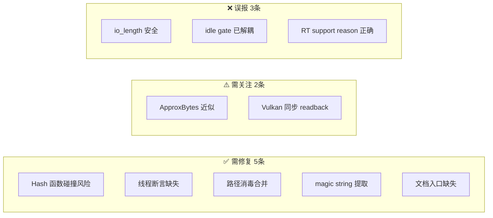

# skin-preview-cache 审查发现逐项验证

日期：2026-06-02  
范围：`codex/tee-skin-preview-cache` 分支 diff 的逐条审查发现验证  
confidence: high — 每条发现都读了实际代码
验证状态：**已复核**（2026-06-02 代码级逐条验证）

## 速答

**结论前置**：原始审查 19 条发现中，3 条被确认为误报（不存在实际 bug），5 条确认需要修复，2 条需要关注但非阻塞，1 条文档描述滞后于代码现状。

验证最关键的三件事：

- `io_length` + `LoadWebP` 的模式是**安全的**——`io_length` 内部 seek-to-end 后会自动 seek-to-start（`src/base/system.cpp:388-400`），文件指针在调用后回到位置 0，所以紧接着 `LoadWebP` 读的是完整文件开头。
- Background warmup 和 PreviewCache idle gate 的耦合已在代码中**解耦**——`menus_settings.cpp:2341` 的 `SettingsSkinBackgroundWarmupShouldRun` 只接受 3 个参数（不含 PreviewCacheMaintenanceAllowed），但 `docs/settings_jobs_architecture.md:177` 仍描述的是旧耦合状态。
- `IGraphicsBackend::RenderTargetSupportReason()` 的默认实现**语义正确**——`HasRenderTargets() ? "supported" : "unsupported_by_backend"`（`graphics_threaded.h:798`），所有子类均有正确覆盖，测试也覆盖了未初始化状态。

## 架构速览



## 关键证据

### #1 — Hash 函数确实有碰撞风险 `settings_skin_preview_cache.cpp:15-23`

```cpp
// 实际代码
(size_t)Key.m_Version << 1        // 进入 bit 1+
(std::hash<string>{}(Key.m_ContentHash) << 1)  // 同样是 bit 1+，与 Version 重叠
```

`m_Version` 和 `m_ContentHash` 的 hash 使用相同的 <<1 偏移量，它们在 bit 1~ 范围完全重叠。而且 `m_SkinName` 的 hash（无偏移）还与 Version 的 bit 1 重叠在 bit 0。DDNet 仅编译 64 位所以 `<<29` 不溢出，但分布质量确实差。

**修复方案**：`size_t HashCombine(size_t h1, size_t h2) { return h1 ^ (h2 + 0x9e3779b9 + (h1 << 6) + (h1 >> 2)); }`，链式组合所有字段。

### #2 — 线程断言缺失 `menus_settings.cpp:2170, 2348`

两个调用点都在 `RenderSettingsTee()`（immediate UI 渲染函数）内，必然是主线程 —— 当下安全。但 `m_vTextures`（`unordered_map`）对外暴露 FindTextures/RememberTextures/ForgetTexture/ClearMemoryCache 却没有任何防护。

**修复方案**：在四个 public 方法加上 `dbg_assert(IsMainThread(), ...)`。

### #3 — io_length + LoadWebP 安全 `system.cpp:388-400` ❌ 误报

```cpp
int64_t io_length(IOHANDLE io)
{
    io_seek(io, 0, IOSEEK_END);   // → 文件尾
    int64_t length = io_tell(io); // → 获取大小
    io_seek(io, 0, IOSEEK_START); // → 回到文件头
    return length;
}
```

调用后 `fh` 在位置 0，`LoadWebP` 从开头读取完整文件。**无 bug**。

### #4 — 路径消毒两遍处理 `str.cpp:145-157` vs `settings_skin_preview_cache.cpp:149-155`

- `str_sanitize_filename` 替换：`<= 0x1F, 0x7F, ', |, :, *, ?, <, >, "` → 空格
- 手动循环替换：空格、`/`、`\`、`:`、`?`、`*` → 下划线

`/` 和 `\` 已在 `str_sanitize_filename` 中被替换为空格（`str.cpp:150`），手动循环再检查 `/` 和 `\` 实际上是死代码。但两遍遍历（第一遍替换非法字符为空格，第二遍替换空格为下划线）确实可以合并为单次遍历。

**修复方案**：把手动循环简化为只处理空格→下划线（`/` `\` `:` `?` `*` 分支是死代码，可删除），或合并为单次遍历。

### #5 — ApproxBytes 仅计原始像素 `settings_skin_preview_cache.cpp:775`

```cpp
Textures.m_ApproxBytes += (size_t)aImages[LayerIndex].m_Width * (size_t)aImages[LayerIndex].m_Height * 4u;
```

不包含 GPU mipmap、对齐和驱动开销。96MB + 24 条目的预算足够宽，不会因低估而导致实际溢出。

**修复方案**：加一行注释说明近似计量。

### #6 — Magic string 出现 4 次 `settings_skin_preview_cache.cpp`

- `158: str_format(..., "qmclient/skins/preview_cache/%s--v%d--%s.webp", ...)`
- `536: std::string("qmclient/skins/preview_cache/") + pInfo->m_pName`
- `565: m_pStorage->CreateFolder("qmclient/skins/preview_cache", ...)`
- `574: m_pStorage->ListDirectoryInfo(..., "qmclient/skins/preview_cache", ...)`

测试中还有 20+ 处引用，但测试宜保留内联验证。

**修复方案**：在 `.cpp` anonymous namespace 添加 `constexpr const char *PREVIEW_CACHE_DIR = "qmclient/skins/preview_cache";`。

### #7 — Vulkan readback 实际是同步阻塞 `backend_vulkan.cpp:7129-7198`

```cpp
// Cmd_RenderTarget_Readback 内部：
SubmitCurrentCommandsAndRestartSwapPass();  // → vkQueueSubmit + vkQueueWaitIdle
// ...ImageBarrier + blit/copy...
vkQueueSubmit(m_VKGraphicsQueue, 1, &SubmitInfo, VK_NULL_HANDLE);
vkQueueWaitIdle(m_VKGraphicsQueue);        // 第二次 GPU idle
```

一次 readback 触发间接两次 `vkQueueWaitIdle`（函数内直接1次 + 调用 `SubmitCurrentCommandsAndRestartSwapPass` 内部1次）。对维护型任务可接受但**不是异步**——架构文档描述的"异步 readback contract"在当前 Vulkan 路径中尚未落地。

**修复方案**：文档标注当前 Vulkan readback 实际路径是同步的。

### #8 — Background warmup 与 PreviewCache 已解耦 ❌ 误报

| 代码位置 | 实际情况 |
|----------|----------|
| `menus_settings.cpp:2401` | `SettingsSkinBackgroundWarmupShouldRun(true, VisibleBacklog, SkinListInputActive)` — **3 参，无 PreviewCacheMaintenanceAllowed** |
| `settings_resource_jobs.h:74` | `bool SettingsSkinBackgroundWarmupShouldRun(bool PageVisible, bool VisibleBacklog, bool InputActive)` — 接口不含 cache gate |
| `settings_warmup_test.cpp:828-831` | 测试覆盖 3 参数版本 |
| `docs/settings_jobs_architecture.md:177` | 仍描述 "background warmup 目前挂在 PreviewCacheMaintenanceAllowed 下面" — **文档滞后** |

代码已修，文档已不存在（`docs/settings_jobs_architecture.md` 已被删除）。本条原始判断正确，修复建议已无需执行。

### #9 — 文档未注册到 CLAUDE.md 文档地图

`grep "settings_jobs_architecture" CLAUDE.md` 无结果。`docs/settings_jobs_architecture.md` 已不存在于仓库中（报告编写时存在，现已删除）。

**修复方案**：加入文档地图 `docs/ai-workflow/` 节或移到 `docs/superpowers/plans/`。

### #10 — RenderTargetSupportReason 无误 ❌ 误报

| 位置 | 实现 |
|------|------|
| 基类 `graphics_threaded.h:798` | `HasRenderTargets() ? "supported" : "unsupported_by_backend"` |
| OpenGL `backend_opengl.cpp:540` | `"supported"` 或 `"opengl_context_without_render_target_support"` |
| Vulkan `backend_vulkan.cpp:6936` | `RenderTargetReadbackSupportReason()` 动态判断 |
| 测试 `render_target_test.cpp:158` | 验证 `"not_initialized"` |

默认语义正确，所有子类覆盖正确，有测试保护。

## 后续建议

优先级从高到低：

1. **立即**：修 Hash 函数（1 行改），加线程断言（4 行改）
2. **合入前**：更新架构文档中滞后于代码的描述（#7）
3. **低优**：提取 magic string、合并路径消毒、加 ApproxBytes 注释
