## 速答

合理路径不能直接等同于“单张完整图缓存”。官方 DDNet 的 Tee 设置页基线是 visible-only source load + live `RenderTee`：只对可见行请求皮肤，加载完成后用源纹理按官方几何绘制。QmClient 当前在这个基线上叠加了 visible / prefetch / background 请求、deferred disk restore、派生 preview cache 和 stable pin，因此应该先把 source loading、live render、derived preview cache 三层职责拆开，再决定是否需要单图、layer 或 source/live-only 优化。

当前更确定的工程约束是：`cl_skins_loaded_max` 应限制 pending / loading 源图队列，不应让 already loaded source、stable memory preview 或 stable disk preview 因数量 fuse 被重置成 loading。cache artifact 形态仍需用视觉正确性、首次加载速度、回看稳定性和自定义颜色成本比较后再拍板。

```mermaid
flowchart TB
    subgraph Official["官方 DDNet 基线"]
        O1["visible list item"] --> O2["RequestLoad()"]
        O2 --> O3["background PNG decode"]
        O3 --> O4["main-thread texture upload / finalize"]
        O4 --> O5["live RenderTee()"]
    end

    subgraph Qm["当前 QmClient"]
        Q1["visible row"] --> Q2["try memory preview cache"]
        Q2 -->|miss| Q3["queue disk lookup / restore"]
        Q3 -->|miss or not ready| Q4["RequestLoad(VISIBLE)"]
        Q4 --> Q5["source decode / upload / finalize"]
        Q5 --> Q6["live RenderTee fallback"]
        Q5 --> Q7["derived preview publish"]
        Q7 --> Q8["disk preview_cache"]
        Q8 --> Q2
        Q9["nearby / idle rows"] --> Q10["PREFETCH / BACKGROUND"]
        Q10 --> Q5
    end

    subgraph Decision["待决策 cache artifact"]
        D1["single final preview"] 
        D2["reusable layer / parts"]
        D3["no derived cache; optimize source/live path"]
    end
```

## 关键证据

| # | 结论 | 证据 | 位置 |
|---|------|------|------|
| 1 | 官方 DDNet 基线是可见行才请求加载，加载后 live render。 | 官方 master `RenderSettingsTee` 的列表循环跳过不可见项，可见项执行 `SkinListEntry.RequestLoad()`，随后 `RenderTools()->RenderTee(...)`。 | `ddnet/ddnet@5d39cf8d5f4f6c113ace283e803612784c98794c src/game/client/components/menus_settings.cpp:722-739` |
| 2 | 当前 QmClient 可见行先查 preview cache，再决定是否请求 source。 | 可见行先 `FindTextures(CacheKey)`，disk artifact 有效时排入 restore；未命中且未排 restore 才 `RequestLoad(VISIBLE)`。 | `src/game/client/components/menus_settings.cpp:2101-2160` |
| 3 | 当前 QmClient 的 cache 消费路径是混合状态：优先 final preview texture，仍保留旧 layer 绘制 fallback。 | `RenderSettingsSkinPreviewCacheLayers(...)` 先绘制 `m_FinalPreviewTexture`；无 final texture 时继续按 layer 绘制。 | `src/game/client/components/menus_settings.cpp:228-260` |
| 4 | 当前 cache 头文件也是混合状态，既有 final preview layer count，也保留 12 个旧 layer enum 和 texture 数组。 | `SETTINGS_SKIN_PREVIEW_CACHE_FINAL_PREVIEW_LAYER_COUNT = 1`，同时仍定义 `NUM_SETTINGS_SKIN_PREVIEW_CACHE_LAYERS` 和 `m_aTextures`。 | `src/game/client/components/settings_skin_preview_cache.h:59-76`, `src/game/client/components/settings_skin_preview_cache.h:157-160` |
| 5 | 当前 source publish 已尝试从源图构建 final preview，但 key 仍只写了 skin/version/size/hash/emote/fat，未覆盖 tiny/custom color。 | `TryPublishSettingsSkinPreviewCacheFromSourceData(...)` 构建 `SSettingsSkinPreviewCacheKey` 后调用 `SettingsSkinPreviewBuildFinalPreview(...)` 和 `PublishSourceSkinFinalPreviewImage(...)`。 | `src/game/client/components/skins.cpp:1165-1215` |
| 6 | 当前 visible 加载启动已经区分队列 fuse：`VISIBLE` 不受 count fuse，非 visible 才用 pending + loading 限制。 | `UpdateStartLoading(...)` 里 `CountFuseApplies = Priority != VISIBLE`，且判断使用 `Stats.m_NumPending + Stats.m_NumLoading`。 | `src/game/client/components/skins.cpp:1835-1853` |
| 7 | 当前回收路径仍有混合语义风险：有地方仍把 pending + loading + loaded 一起作为 count fuse 超限判断，虽然 loaded source 只在 bytes 超限时实际回收。 | `CountFuseExceeded = Stats.m_NumPending + Stats.m_NumLoaded + Stats.m_NumLoading > cl_skins_loaded_max`，但 `ReclaimLoadedSources = BytesBudgetExceeded`。 | `src/game/client/components/skins.cpp:1626-1650` |
| 8 | 官方 `RenderTee6` 几何包含 tiny tee、body/feet scale、outline/filling、eyes 和 feet 分层，派生 cache 若不复用官方逻辑很容易位置错。 | 当前 QmClient `RenderTee6` 根据 tiny tee 配置调整 `BaseSize/AnimScale`，按 outline/filling、body、eyes、feet 分步绘制。 | `src/game/client/render.cpp:530-620` |

## 探索范围

- 聚焦文件：`src/game/client/components/menus_settings.cpp`、`src/game/client/components/skins.cpp`、`src/game/client/components/settings_skin_preview_cache.h`、`src/game/client/components/settings_skin_preview_cache.cpp`、`src/game/client/render.cpp`。
- 官方对照：GitHub `ddnet/ddnet` master 当前提交 `5d39cf8d5f4f6c113ace283e803612784c98794c` 的 `menus_settings.cpp` 和 `render.cpp` 片段。
- 复用旧探索：`docs/superpowers/explore/2026-05-31-Tee皮肤与资源加载Jobs模型探索.md`。
- 跳过：未运行客户端实测；未做 CPU/GPU profiling；未验证当前工作区中未收口代码是否可编译。

## 置信度说明

**confidence: medium**

证据覆盖了官方入口、当前可见行路径、当前 source publish、当前 cache 数据结构和加载队列语义，因此足以修正文档口径：不能预设单图或 12 layer 一定正确。但没有运行 profiling 和视觉截图，不能直接判断最终应选择哪种 artifact。

## 后续建议

下一步先补一轮运行证据：首次可见耗时、source decode/upload 耗时、live render 成本、disk restore 成本、cache generation 成本，再决定 Task 4R 选择单图、layer 还是 source/live-only 优化。
