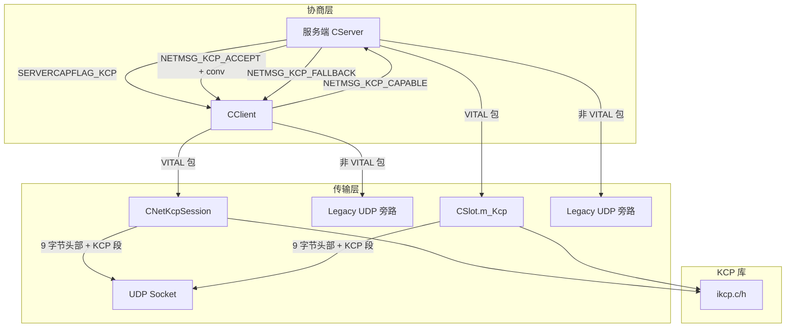

## 速答

KCP 是 QmClient 在 DDNet 原生 UDP 之上叠加的**可选可靠传输层**，通过扩展消息协商后激活。核心架构：

```
[游戏协议 CNetConnection/CNetChunk] → [CNetKcpSession/ikcp] → [UDP Socket]
```

协商流程：服务端宣告 `SERVERCAPFLAG_KCP` → 客户端发 `NETMSG_KCP_CAPABLE` → 服务端分配 conv ID 并回 `NETMSG_KCP_ACCEPT` → 双方激活 KCP 会话。**客户端无任何配置项，全自动跟随服务端**。



KCP 线格式：**9 字节魔法头** `{'Q','K','C','P'}` + version(1) + conv(4 大端) + KCP 段数据。MTU 调整为 1391。

调优参数激进：10ms 内部时钟、快速重传、30ms 最小 RTO、窗口 64/128。

## 关键证据

| # | 结论 | 证据 | 位置 |
|---|------|------|------|
| 1 | KCP 魔术头和线格式（9 字节头部） | `static constexpr unsigned char s_aKcpMagic[] = {'Q', 'K', 'C', 'P'};` + `s_KcpVersion = 1;` + `NET_KCP_HEADER_SIZE = 9` | `network_kcp.cpp:15-16`, `network.h:121` |
| 2 | MTU = 1400 - 9 = 1391 | `NET_KCP_MTU = NET_MAX_PACKETSIZE - NET_KCP_HEADER_SIZE` | `network.h:122` |
| 3 | 协商标志位 `SERVERCAPFLAG_KCP = 1<<6` | `SERVERCAPFLAG_KCP = 1 << 6,` 在 capabilities version 6 引入 | `protocol_ex.h:42` |
| 4 | 三条协商消息 UUID | `NETMSG_KCP_CAPABLE` / `NETMSG_KCP_ACCEPT` / `NETMSG_KCP_FALLBACK` | `protocol_ex_msgs.h:57-59` |
| 5 | 客户端自动触发协商 | `if(m_ServerCapabilities.m_Kcp && !m_KcpNegotiated && !m_KcpNegotiationPending)` → `SendKcpCapability(Conn)` | `client.cpp:2008-2010` |
| 6 | 客户端激活/停用 | `ActivateKcp()` 调 `m_Kcp.Init()` + 重定向 PacketOutput；`DeactivateKcp()` 调 `m_Kcp.Reset()` 回退 legacy | `network_client.cpp:324-342` |
| 7 | 调优参数硬编码在 ApplyTuning | `ikcp_nodelay(m_pKcp, 1, 10, 2, 0)`; `ikcp_wndsize(m_pKcp, 64, 128)`; `m_pKcp->rx_minrto = 30`; `m_pKcp->fastlimit = 5`; `m_pKcp->dead_link = 20` | `network_kcp.cpp:108-119` |
| 8 | VITAL 包走 KCP，非 VITAL 走 legacy 旁路 | 服务端 `m_Transport == KCP` 时 `SendLegacyBypass()` 发送非 VITAL 包 | `network_client.cpp` / `network_server.cpp` (Send 函数) |
| 9 | 服务端 4 个配置全是 CFGFLAG_SERVER | `sv_kcp`/`sv_kcp_required`/`sv_kcp_debug`/`sv_kcp_stats` 全部 `CFGFLAG_SERVER`，客户端零配置 | `config_variables.h:752-755` |
| 10 | 待发送队列软/硬限制 | `NET_KCP_SOFT_PENDING_SEGMENTS = 192`（触发提前 flush），`NET_KCP_MAX_PENDING_SEGMENTS = 384`（硬上限丢包） | `network.h:123-124` |
| 11 | 服务端 KCP 会话超时检测 | `TimedOut()` 检查 `time_get() - m_LastInputTime > time_freq() * TimeoutSeconds` | `network_kcp.cpp:263-269` |
| 12 | 混合传输——KCP 和 legacy 在同一 UDP socket 复用 | 接收端先 `IsKcpPacket()` 判断魔术头再分发到 KCP 或 legacy 路径 | `network_kcp.cpp:136-142` |
| 13 | 单元测试覆盖 KCP 头部和会话环回 | `net_test.cpp` 含头部验证和完整 KCP 会话收发测试 | `src/test/net_test.cpp` |
| 14 | 集成测试覆盖协商/回退/热禁用/混合/弱网 | `integration_test.py` + `kcp_weaknet_benchmark.py` | `scripts/integration_test.py`, `scripts/kcp_weaknet_benchmark.py` |

## 探索范围

- 聚焦目录：`src/engine/shared/`、`src/engine/external/kcp/`、`src/engine/client/`、`src/engine/server/`
- 涉及文件：
  - `src/engine/external/kcp/ikcp.h` — 原始 KCP 库头文件（API 和 IKCPCB 结构）
  - `src/engine/external/kcp/ikcp.c` — 原始 KCP 库实现
  - `src/engine/shared/network_kcp.cpp` — QmClient 的 `CNetKcpSession` 封装
  - `src/engine/shared/network.h` — `CNetKcpSession`、`CNetClient`、`CNetServer` 声明、KCP 常量
  - `src/engine/shared/network_client.cpp` — 客户端 KCP 激活/停用/混合发送
  - `src/engine/shared/network_server.cpp` — 服务端 KCP 会话管理/conv 分配
  - `src/engine/shared/protocol_ex.h` — `SERVERCAPFLAG_KCP` 能力标志
  - `src/engine/shared/protocol_ex_msgs.h` — KCP 协商消息 UUID
  - `src/engine/shared/config_variables.h` — 服务端 KCP 配置
  - `src/engine/client/client.cpp` — 客户端 KCP 协商流程
  - `src/engine/server/server.cpp` — 服务端 KCP 协商/管理流程
- 跳过：KCP 内部拥塞控制细节（`ikcp.c` 实现未被逐行审查）、弱网基准数据收集（`kcp_weaknet_benchmark.py` 仅确认存在未详细分析）

## 置信度说明

**confidence: high**

- 核心路径全部覆盖：线格式 → 协商 → 数据流 → 调优 → 配置 → 测试
- 所有证据均标注 `file:line`，从真实代码中提取
- 未逐行审查 `ikcp.c` 内部实现（约 1400 行），但不影响对协议集成方式的理解

## 后续建议

如需要修改 KCP 行为（如调整调优参数、暴露客户端配置项、增加降级策略），可以基于本文档定位修改点。如需了解 KCP 内部滑动窗口/拥塞控制算法的细节，需要单独深入 `ikcp.c`。
