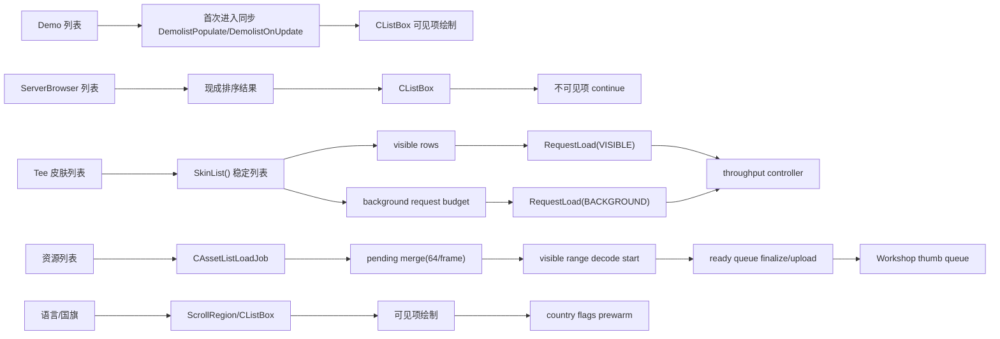

## 速答

当前仓库里的“列表”并没有统一进入一个 scheduler。现状更接近三层：`Demo / ServerBrowser` 仍以同步列表结构和可见项绘制为主，`Tee 皮肤列表` 已经拥有最完整的 visible/prefetch/background 调度与吞吐控制，`资源列表` 则有异步扫描、分帧 merge、preview decode/finalize/upload 和 Workshop thumb 队列，但仍是当前最复杂、最容易在交互帧出问题的一类。`语言列表` 和 `国旗列表` 已经较轻，主要靠可见区域绘制、scroll region 和预热，不是当前统一 scheduler 的主要矛盾点。

`docs/superpowers` 里和这件事最相关的旧文档，仍然有效的是“列表结构要先稳定、item 资源再填充”这个方向；已经过时的是把现状描述成“列表已经统一进入 plan/scheduler”的部分。真实代码里，`Tee` 和 `资源` 确实已经有不少统一 helper，但 `PlanSnapshot/ListPlanJob/统一 scheduler facade` 仍停留在计划和设计文档，没有在所有列表上落地。

## 关键证据

| # | 结论 | 证据 | 位置 |
|---|------|------|------|
| 1 | Demo 列表首次进入仍会先同步做列表填充和更新，因此它天然存在“目录太大时 UI 先卡一下”的风险。 | `RenderDemoBrowserList` 在 `m_DemoBrowserListInitialized` 为假时直接调用 `DemolistPopulate()` 和 `DemolistOnUpdate(true)`，之后才进入 `CListBox::DoStart(...)`。 | `src/game/client/components/menus_demo.cpp:1796`, `src/game/client/components/menus_demo.cpp:1798`, `src/game/client/components/menus_demo.cpp:1799`, `src/game/client/components/menus_demo.cpp:1956` |
| 2 | ServerBrowser 列表没有统一 jobs 调度，主要依赖已有排序结果和 `CListBox` 的可见项门控。 | `RenderServerbrowserServerList` 直接对 `NumServers` 调 `DoStart(...)`，逐项 `DoNextItem(...)` 后对不可见项 `continue`。 | `src/game/client/components/menus_browser.cpp:407`, `src/game/client/components/menus_browser.cpp:789`, `src/game/client/components/menus_browser.cpp:815`, `src/game/client/components/menus_browser.cpp:826`, `src/game/client/components/menus_browser.cpp:830` |
| 3 | Country flag 浏览/选择列表也属于轻量列表，核心是 `CListBox` 或 `CScrollRegion`，没有资源 jobs 重链路。 | 浏览器里的国家筛选 popup 用 `DoStart(50.0f, NumFlags, 8, ...)`，不可见项直接跳过；设置页里的 flag 选择器也是 `DoStart(...)` 后只画可见项。 | `src/game/client/components/menus_browser.cpp:1711`, `src/game/client/components/menus_browser.cpp:1723`, `src/game/client/components/menus_browser.cpp:1724`, `src/game/client/components/menus_settings.cpp:1006`, `src/game/client/components/menus_settings.cpp:1015`, `src/game/client/components/menus_settings.cpp:1016` |
| 4 | 语言列表当前实现已经是 ScrollRegion + 可见项绘制 + 文本缓存，不是当前阻塞主因。 | `RenderLanguageSelection` 使用 `gs_LanguageScrollRegion.Begin(...)`，每个条目用 `AddRect(...)` 判断可见性，不可见项直接跳过；文本还能走 `SettingsTextElement` 流式缓存。 | `src/game/client/components/menus_settings.cpp:3981`, `src/game/client/components/menus_settings.cpp:4010`, `src/game/client/components/menus_settings.cpp:4022`, `src/game/client/components/menus_settings.cpp:4023`, `src/game/client/components/menus_settings.cpp:4044`, `src/game/client/components/menus_settings.cpp:4046` |
| 5 | Tee 皮肤列表是当前最成熟的“列表 + 调度”实现：列表结构稳定，资源推进按可见项和背景预算分离。 | 皮肤页直接对 `vSkinList.size()` 建立完整滚动范围；可见项统计后倒序发 `RequestLoad(VISIBLE)`；滚动/恢复上下文进入 `SettingsBuildFrameContext(...)`；背景请求预算经 `SettingsSkinBackgroundRequestBudgetDecision(...)` 计算。 | `src/game/client/components/menus_settings.cpp:1883`, `src/game/client/components/menus_settings.cpp:1892`, `src/game/client/components/menus_settings.cpp:1930`, `src/game/client/components/menus_settings.cpp:2040`, `src/game/client/components/menus_settings.cpp:2052`, `src/game/client/components/menus_settings.cpp:2059`, `src/game/client/components/menus_settings.cpp:2070`, `src/game/client/components/menus_settings.cpp:2085` |
| 6 | 设置页预热也在把 Tee、语言、资源分开处理，而不是统一列表 scheduler。 | `PrewarmSettingsPageResources` 对 `SETTINGS_GENERAL` 只预热 country flags，对 `SETTINGS_TEE` 组合 country flags + `PrewarmPlayerPreviewReady(...)`，对 `SETTINGS_ASSETS` 走 `PrewarmSettingsAssetResources()`。 | `src/game/client/components/menus.cpp:4029`, `src/game/client/components/menus.cpp:4048`, `src/game/client/components/menus.cpp:4052`, `src/game/client/components/menus.cpp:4057`, `src/game/client/components/menus.cpp:4058`, `src/game/client/components/menus.cpp:4061`, `src/game/client/components/menus.cpp:4063` |
| 7 | 资源列表已经有异步扫描 + 分帧 merge，但它发布的仍然是“逐步 merge 到真实列表”，不是设计文档里那种统一 `PlanSnapshot`。 | `PrewarmSettingsAssetResources()` 启动 `CAssetListLoadJob`，完成后把结果放入 `m_aAssetPendingMerges[Tab]`，再以 `MergeBudget.m_MaxListEntries = 64` 分帧 `PublishSettingsAssetMergeEntries(...)`。当前 tab 的运行时刷新也复用了同样的 pending-merge 逻辑。 | `src/game/client/components/menus_settings_assets.cpp:2900`, `src/game/client/components/menus_settings_assets.cpp:2965`, `src/game/client/components/menus_settings_assets.cpp:2991`, `src/game/client/components/menus_settings_assets.cpp:3011`, `src/game/client/components/menus_settings_assets.cpp:3018`, `src/game/client/components/menus_settings_assets.cpp:3315`, `src/game/client/components/menus_settings_assets.cpp:3336`, `src/game/client/components/menus_settings_assets.cpp:3344` |
| 8 | 资源列表之所以比其他列表更容易卡，是因为它除了列表结构，还有 preview decode/finalize/upload/Workshop thumb 这些主线程敏感阶段。 | 本地资源页维护 `m_aaCustomPreviewDecodeQueue` / `ReadyQueue`，可见区先 `SchedulePreviewRange(...)`，列表结束后再做 `FinalizeReadyPreviewDecodes(...)` 和 `DrainReadyPreviewUploadsAfterList(...)`；Workshop 侧还有 thumb 本地 cache / 远端 WebP 请求和独立 finalize/upload 阶段。 | `src/game/client/components/menus_settings_assets.cpp:3627`, `src/game/client/components/menus_settings_assets.cpp:4368`, `src/game/client/components/menus_settings_assets.cpp:4493`, `src/game/client/components/menus_settings_assets.cpp:4515`, `src/game/client/components/menus_settings_assets.cpp:4519`, `src/game/client/components/menus_settings_assets.cpp:4520`, `src/game/client/components/menus_settings_assets.cpp:5316`, `src/game/client/components/menus_settings_assets.cpp:5355`, `src/game/client/components/menus_settings_assets.cpp:5395`, `src/game/client/components/menus_settings_assets.cpp:5727`, `src/game/client/components/menus_settings_assets.cpp:5731`, `src/game/client/components/menus_settings_assets.cpp:5734` |
| 9 | 当前资源页已经继续沿“交互态预算”方向演进，但依然是资源页局部策略，不是全列表统一调度。 | 资源页当前有 scroll cooldown、post-scroll recovery、focus logging、resident bytes 统计，以及这轮新增的 `jump scroll` 识别；这些都只在 `menus_settings_assets.cpp` 本地生效。 | `src/game/client/components/menus_settings_assets.cpp:3631`, `src/game/client/components/menus_settings_assets.cpp:3643`, `src/game/client/components/menus_settings_assets.cpp:4503`, `src/game/client/components/menus_settings_assets.cpp:4507`, `src/game/client/components/menus_settings_assets.cpp:4515`, `src/game/client/components/menus_settings_assets.cpp:5715`, `src/game/client/components/menus_settings_assets.cpp:5719`, `src/game/client/components/menus_settings_assets.cpp:5727` |
| 10 | 旧文档里“稳定列表 plan / PlanSnapshot / 统一 scheduler facade 仍未实现”的判断，到现在仍然基本成立。 | 2026-05-31 的架构报告明确把 `稳定列表 plan` 和 `统一 scheduler facade` 标为“规划中”；2026-06-02 的 Tee spec 继续把 `PlanSnapshot` 作为目标语义，而当前资源页代码仍是 pending merge + 实际列表直接增长。 | `docs/superpowers/plans/2026-05-31-settings-jobs-architecture.md:13`, `docs/superpowers/plans/2026-05-31-settings-jobs-architecture.md:37`, `docs/superpowers/plans/2026-05-31-settings-jobs-architecture.md:157`, `docs/superpowers/plans/2026-05-31-settings-jobs-architecture.md:346`, `docs/superpowers/specs/2026-06-02-tee皮肤统一资源jobs框架设计.md:109`, `docs/superpowers/specs/2026-06-02-tee皮肤统一资源jobs框架设计.md:396` |
| 11 | 一部分旧探索对“当前现状”的描述已经过期，不能直接当事实引用。 | 2026-05-26 的探索文档已明确标注 `status: outdated` 和“文档已过时”；它更适合作为历史背景，不适合作为当前实现依据。 | `docs/superpowers/explore/2026-05-26-上游合并与设置页性能现状探索.md:1`, `docs/superpowers/explore/2026-05-26-上游合并与设置页性能现状探索.md:8` |
| 12 | 2026-05-31 的 Jobs 模型探索仍然是当前最接近真实代码边界的讨论基础。 | 那份探索已经把结论收口为“皮肤和资源可统一的是 jobs 语义和帧预算，而不是强行同一种流水线”，这和当前代码现状仍一致。 | `docs/superpowers/explore/2026-05-31-Tee皮肤与资源加载Jobs模型探索.md:11`, `docs/superpowers/explore/2026-05-31-Tee皮肤与资源加载Jobs模型探索.md:27`, `docs/superpowers/explore/2026-05-31-Tee皮肤与资源加载Jobs模型探索.md:34` |

## 探索范围

- 聚焦目录：`src/game/client/components/`、`docs/superpowers/plans/`、`docs/superpowers/specs/`、`docs/superpowers/explore/`
- 涉及文件：
  - `src/game/client/components/menus_demo.cpp`
  - `src/game/client/components/menus_browser.cpp`
  - `src/game/client/components/menus_settings.cpp`
  - `src/game/client/components/menus_settings_assets.cpp`
  - `src/game/client/components/menus.cpp`
  - `docs/superpowers/explore/2026-05-31-Tee皮肤与资源加载Jobs模型探索.md`
  - `docs/superpowers/explore/2026-05-26-上游合并与设置页性能现状探索.md`
  - `docs/superpowers/plans/2026-05-31-settings-jobs-architecture.md`
  - `docs/superpowers/specs/2026-06-02-tee皮肤统一资源jobs框架设计.md`
- 跳过：
  - 未做运行时 perf log 复测，本次只回答“代码现在怎么组织”
  - 未深挖 server browser 数据获取线程，因为当前用户关注点是列表 UI 阻塞与资源页调度
  - 未单独展开 demo 文件扫描实现细节，本次只确认它的 UI 首次进入路径仍是同步触发

## 置信度说明

**confidence: high**

- 核心结论都能回溯到当前代码入口和 `docs/superpowers` 的明确文本。
- 已覆盖你点名的几类列表：demo、server、tee skin、assets、country flags、language。
- 不确定的部分主要是“运行时哪一类列表在具体机器上更卡”，那需要结合 perf log 和手工复现，不属于这份代码现状探索本身。

## 后续建议

这份探索已经把“哪些列表已经局部优化、哪些列表仍未统一调度”收清楚了；如果要继续推进，下一步应只围绕 `资源列表` 和 `demo 列表` 分别做针对性调研，而不是先抽象出一个覆盖所有列表的大统一 scheduler。
